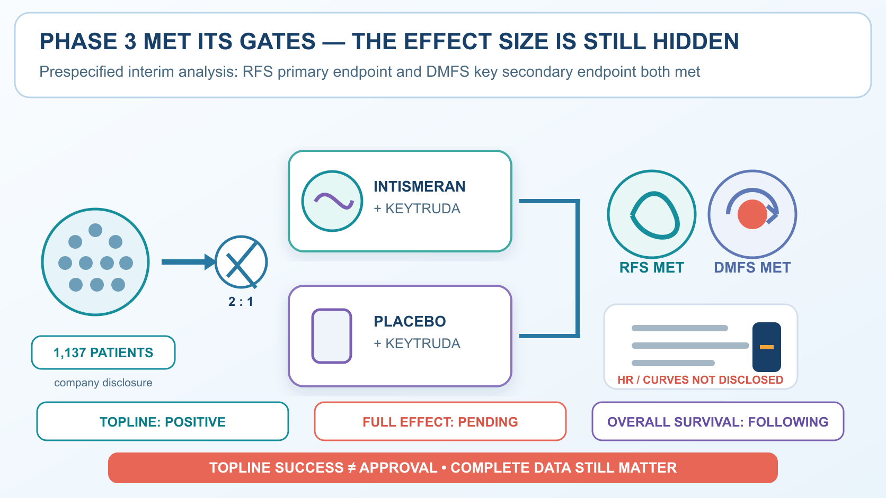
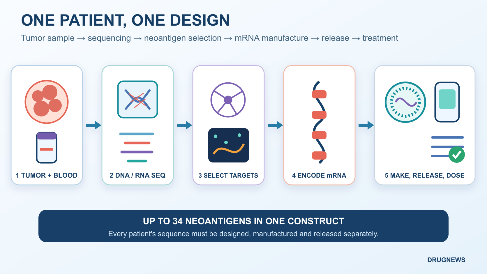
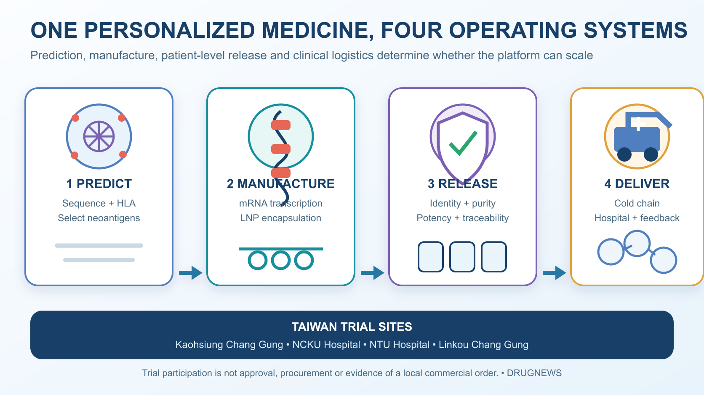

# Moderna Surges 176.97% After Its Personalized Cancer Vaccine Clears a Phase 3 Test

Start with the boundary: this is not a cure for cancer, it is not evidence across every tumor type, and intismeran is not approved. What Moderna and Merck have reported is a positive Phase 3 topline result in patients with high-risk cutaneous melanoma whose tumors had already been completely removed. It is not a product that can be ordered for a patient tomorrow.

On August 19, Moderna shares closed at $174.38, up $111.42, or 176.97%, in a single session.

The arithmetic matters. Subtracting the $111.42 gain from the closing price gives a prior close of $62.96. Dividing $174.38 by $62.96 yields roughly 2.77. A 176.97% increase means the stock added 1.7697 times its starting value; it does not mean the stock merely reached 176.97% of that value.

Those figures establish the violence of the market reaction. They do not by themselves establish an exact increase in market capitalization, which would require a consistent share-count and corporate-action basis. Drugnews therefore does not repeat the unverified claim that Moderna added $44.5 billion overnight, nor do we use an unverified volume figure to dramatize the move.

The catalyst was a Phase 3 announcement from Moderna and Merck. Intismeran autogene, a personalized neoantigen mRNA therapy, met two endpoints in INTerpath-001 when combined with Keytruda, or pembrolizumab.

The result applies to a specific setting: patients with completely resected, high-risk melanoma. In that setting, adding a patient-specific therapy to Keytruda delayed recurrence and distant metastasis versus Keytruda alone. A headline may ask whether this means goodbye to cancer. The evidence permits only one answer: far too soon.

Why, then, did the market reprice Moderna by nearly threefold in one day?

Because investors were buying more than one melanoma trial. The result raised expectations across four layers at once: the probability of success for the product, the possibility of extension to other tumors, Moderna's post-pandemic second growth engine, and the value of an operating system that can design and manufacture a different medicine for every patient.

## 01 | What did Phase 3 actually establish?

INTerpath-001 enrolled 1,137 patients with completely resected stage IIB, IIC, III or IV cutaneous melanoma. Participants were randomized 2:1 to:

- intismeran plus Keytruda; or
- placebo plus Keytruda.

The control arm was not untreated. The trial asked whether adding a personalized therapy could further reduce recurrence risk on top of established Keytruda adjuvant treatment.

According to the prespecified interim topline announcement:

- the primary endpoint of recurrence-free survival, or RFS, was met;
- the key secondary endpoint of distant metastasis-free survival, or DMFS, was met; and
- the safety profile was consistent with prior experience, with no new safety signal observed.

That is enough to change the probability assigned to the asset. It is not enough to complete a valuation model.

The companies have not disclosed the Phase 3 hazard ratios, confidence intervals, event counts, absolute differences or survival curves. Overall survival will continue to be followed. Regulatory discussions come next.

In other words, we know that the study crossed its statistical gates. We do not yet know the size of the win. Intismeran also remains investigational and has not been approved by the US Food and Drug Administration.

The market has already purchased part of the future. The full dataset will determine how much of that optimism survives.

## 02 | This is not an off-the-shelf vaccine

A conventional vaccine identifies an antigen shared across a population and then produces one standardized product. Intismeran follows a different operating model.

After surgery, tumor and blood samples are collected. DNA and RNA sequencing identifies mutations present in the cancer. An algorithm considers the patient's human leukocyte antigen, or HLA, type and selects neoantigens that are more likely to be recognized by T cells.

Instructions for as many as 34 neoantigens are encoded in one mRNA construct, packaged in a lipid nanoparticle and returned to that individual patient.

When the patient changes, the mutation set changes, and the drug sequence changes with it.

That is the hard meaning of personalized. A hospital is not simply drawing a vial from inventory. It is initiating a new design, manufacturing and quality-release order for each patient.

The vaccine component teaches the immune system what to recognize. Keytruda blocks the PD-1 checkpoint, giving activated T cells a better chance to continue attacking residual cancer cells.

One numerical boundary is important. The 1,137 figure is total trial enrollment. It does not mean that 1,137 intismeran products were manufactured. Only the treatment arm received the patient-specific therapy in the 2:1 randomized study.

## 03 | Why might this cancer-vaccine approach be different?

Cancer vaccines are not new. Earlier approaches often targeted tumor-associated antigens shared by many patients, and they repeatedly encountered three barriers.

The first was immune tolerance. Some tumor-associated antigens are also present in normal tissue, so the immune system may be reluctant to attack them strongly. The second was tumor heterogeneity: cancer cells lacking a single target can escape. The third was the tumor microenvironment, which can suppress T cells even after they have been activated.

Intismeran attempts to address all three pieces. It selects tumor-specific neoantigens, can encode up to 34 candidate targets and is combined with PD-1 blockade. The trial also places the intervention in the adjuvant setting after surgery, where the vaccine is confronting potential microscopic residual disease rather than a large, established tumor with a deeply suppressive microenvironment.

These features make the result biologically understandable. They do not create a passport into every cancer type. Melanoma has a relatively high mutational burden and is often responsive to immune therapy, making it a comparatively favorable first proving ground. Colder and more complex tumors must still produce their own evidence.

## 04 | Why mRNA? Industrial control over designed variation

Personalized therapy is not simply a traditional factory reduced to one miniature plant per patient. It changes the manufacturing problem.

For most medicines, quality systems try to prevent one batch from differing from the next. With intismeran, the encoded content is supposed to differ. The operating question becomes whether many distinct designs can still be governed by common rules for purity, potency, safety, traceability and on-time release.

mRNA provides an engineering handle for that controlled variation. The neoantigen combination can change while in-vitro transcription, purification, lipid-nanoparticle encapsulation and release testing remain modular and verifiable. The difficulty has not disappeared. It has shifted from rebuilding a process to reliably scheduling different orders through one validated system.

The algorithm selects candidate neoantigens, manufacturing turns the design into a usable product, and the clinical trial determines whether it helps patients. No one layer can compensate for failure in another.

The platform value therefore does not lie in how many sequences a company can write. It lies in how much variation the company can manage. Personalized therapy can move beyond a small number of research centers only if every design may differ while delivery time and quality promises remain stable.

## 05 | The market bought four distinct sources of value

**First, the probability of success for the melanoma asset.**

A large randomized Phase 3 study met both its primary and key secondary endpoints. That moves intismeran materially closer to a regulatory filing. The eventual effect size will still influence the eligible population, label, pricing and pace of adoption.

**Second, the possibility that the platform can be repeated.**

As of June 2026, the companies described nine Phase 2 or Phase 3 studies across melanoma, non-small-cell lung cancer, bladder cancer and renal-cell carcinoma. The first Phase 3 success raises the credibility of the broader program.

But melanoma is also the most favorable first station. It tends to carry a high mutational burden and respond to immunotherapy, and this study treats lower disease burden after surgery. Lung, kidney and bladder cancer still need to submit their own scorecards.

**Third, a post-pandemic second engine for Moderna.**

Since the COVID-19 peak, investors have asked whether Moderna is mainly a respiratory-vaccine company or a platform capable of repeatedly producing programmable medicines. This Phase 3 outcome gives the second description its strongest clinical support so far. For Merck, it adds another potential growth engine to the Keytruda combination strategy and product life cycle.

The companies have disclosed that they generally share relevant global development costs and profits equally. That does not mean every dollar of revenue will be divided mechanically in half. Manufacturing costs, expense allocation and commercial execution still shape the economics.

**Fourth, the personalized manufacturing system itself.**

Sampling, shipment, sequencing, algorithmic design, mRNA manufacturing, patient-level batch release, cold-chain logistics and return to the clinic form one time-sensitive chain. A delay at any point can cause a patient to miss the intended treatment window.

The future moat will therefore be measured in days from sample receipt to administration, successful batch-release rates, cost per patient and the number of distinct sequences a facility can process in parallel.

The molecule is the product. The system that gets a personalized medicine back to the patient on time may become the platform.

## 06 | Personalized economics require a different operating report

Unit economics cannot be reduced to patient count multiplied by price. Every patient launches a workflow. Was the sample usable? Did the design succeed on the first attempt? Was the batch released on time? Did the cold chain reach the hospital? A failure can add cost without producing a treatable patient or recognized revenue.

The most important commercial questions remain undisclosed. How long does sample-to-dose take? What proportion of batches pass release testing? How many patients can one facility process simultaneously? How far can automation reduce manual work? How much margin will failed batches and urgent logistics consume? Will payers reimburse the entire personalized service?

Future financial reporting may therefore resemble a pharmaceutical company, a data company and a precision-manufacturing operation at the same time. The sequence matters. Speed, reliability, traceability and the cost curve may prove to be the harder moat.

## 07 | A 176.97% surge raises the risk as well as the expectations

The August 19 close of $174.38 and the 176.97% increase come from Nasdaq's official market data. They demonstrate market enthusiasm; they do not guarantee that long-term value has already been secured.

Three common misreadings should be removed. Asking whether cancer is over does not establish efficacy across tumor types. The 1,137-patient trial is not the same as 1,137 individualized treatment batches. And a successful Phase 3 topline announcement does not permit investors to import a Phase 2 hazard ratio into a still-empty Phase 3 field.

At least five gates remain:

1. Are the complete Phase 3 hazard ratios and absolute effects large enough?
2. Will overall survival provide a harder clinical benefit signal?
3. What filing path and label will the FDA accept?
4. Can patient-specific manufacturing control cost and delivery time at commercial scale?
5. Can other cancer types reproduce the melanoma result?

The Phase 2 five-year follow-up reported a hazard ratio of 0.51 for recurrence or death and 0.411 for distant metastasis or death. Those figures came from a 157-patient Phase 2 study. They cannot be substituted for the undisclosed Phase 3 results.

The share price has already crossed its finish line. Clinical development and commercialization have not.

## 08 | Taiwan participated, but local beneficiaries should not be invented

ClinicalTrials.gov lists four Taiwanese study locations: Kaohsiung Chang Gung Memorial Hospital, National Cheng Kung University Hospital, National Taiwan University Hospital and Linkou Chang Gung Memorial Hospital.

Taiwan's clinical system therefore participated in a large multinational Phase 3 study of personalized cancer therapy. That experience can build capabilities in sample handling, patient care and cross-border logistics.

A trial site is not a Taiwanese approval, and it is not evidence that a local sequencing, materials or manufacturing company has received an order. A Taiwanese company belongs in an investment map only after a public collaboration, procurement agreement, regulatory filing, clinical responsibility or revenue signal appears.

## Conclusion | Cancer has not said goodbye; the market priced the ability to manage difference

The August 19 surge brought a rarely confronted pharmaceutical question into view: when the medicine must change with the patient, can a company still deliver an industrial-grade schedule and quality promise?

INTerpath-001 answered one clinical portion of that question. A highly personalized workflow operated inside a large randomized study and crossed two prespecified endpoints. It has not yet answered the questions of approval, overall survival, commercial capacity, cost or reproducibility across tumor types.

Cancer has not said goodbye. What has been revalued is the ability to control variation: the design may change from person to person, but delivery cannot become unpredictable; every batch may be different, but the release standard cannot loosen.

The move from fixed formulations to controlled variation creates a new industrial threshold. Intismeran currently holds a positive Phase 3 topline ticket to approach that threshold. It is not yet a guarantee of approval, revenue or success across cancer types.

## References

1. [Nasdaq: MRNA market data](https://api.nasdaq.com/api/quote/MRNA/info?assetclass=stocks)
2. [Moderna: prespecified interim topline results from Phase 3 INTerpath-001](https://news.modernatx.com/merck-and-moderna-announce-phase-3-interpath-001-trial-of-intismeran-plus-keytruda-met-endpoints-of-rfs-and-dmfs-in-melanoma)
3. [Merck: INTerpath-001 met RFS and DMFS endpoints](https://www.merck.com/news/merck-and-moderna-announce-phase-3-interpath-001-trial-of-intismeran-autogene-plus-keytruda-met-endpoints-of-recurrence-free-survival-rfs-and-distant-metastasis-free-survival-dmfs-in-patient/)
4. [ClinicalTrials.gov: INTerpath-001, NCT05933577](https://clinicaltrials.gov/study/NCT05933577)
5. [Merck and Moderna: five-year Phase 2 KEYNOTE-942 follow-up](https://www.merck.com/news/moderna-and-merck-present-5-year-data-for-intismeran-autogene-in-combination-with-keytruda-pembrolizumab-in-patients-with-high-risk-stage-iii-iv-melanoma-following-complete-resection-at-the-20/)
6. [Moderna 2025 Form 10-K](https://www.sec.gov/Archives/edgar/data/1682852/000168285226000033/mrna-20251231.htm)
7. [Merck 2025 Form 10-K](https://www.sec.gov/Archives/edgar/data/310158/000031015826000063/mrk-20251231.htm)

Verification cutoff: August 20, 2026.

## Disclaimer

This article provides biotech-industry analysis based on public information. It is not investment advice, medical advice or treatment guidance. Market data are stated as of the US close on August 19, 2026; a one-day share-price move does not indicate future returns. Intismeran remains investigational and is not FDA approved. Phase 3 disclosure is currently limited to topline results; the full effect size, overall-survival evidence, regulatory timing and commercialization conditions remain pending.
