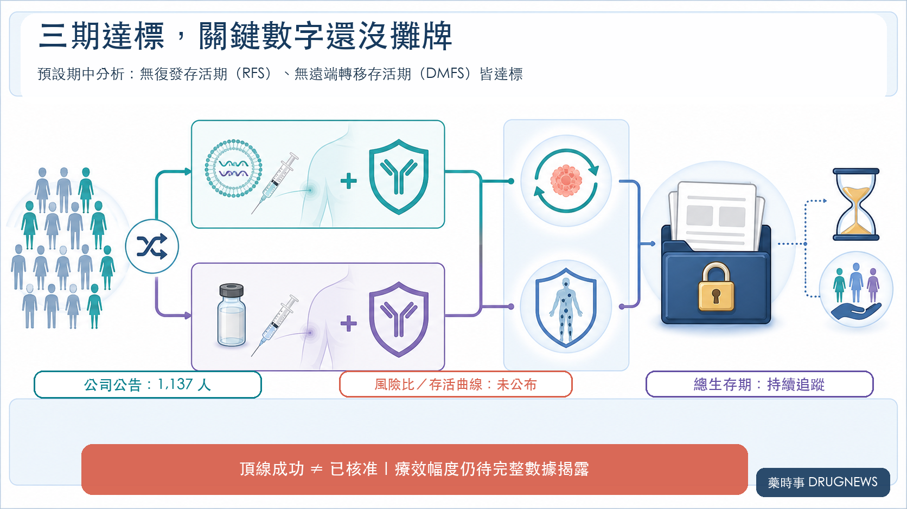
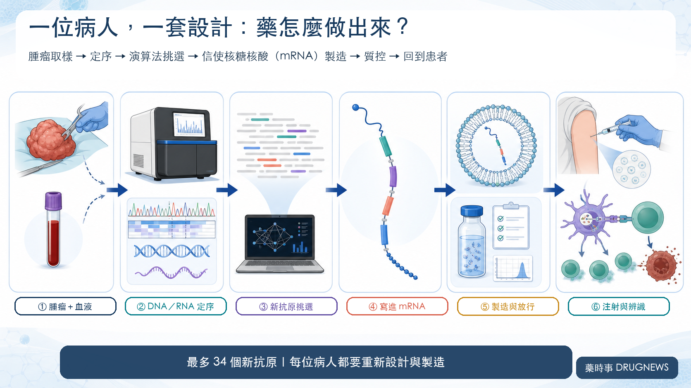
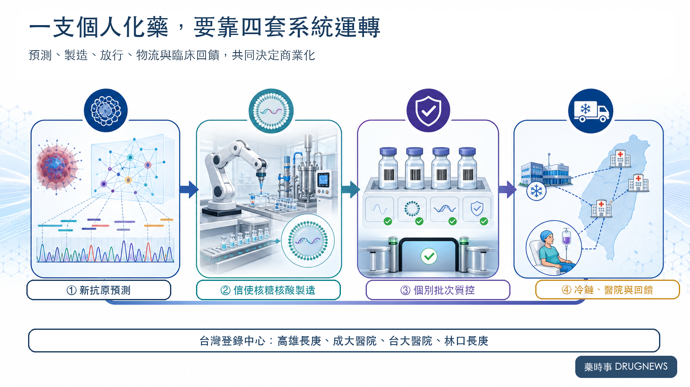

# 再見癌症？癌症疫苗來了！莫德納單日暴漲176.97%

先說答案：這不是「癌症治癒」，不是所有癌種通用，intismeran 也尚未獲核准。現在看到的，是已切除高風險皮膚黑色素瘤的第三期頂線陽性，而非明天能在醫院施打的成品。

8 月 19 日，莫德納（Moderna，股票代號 MRNA）收在 174.38 美元，一天上漲 111.42 美元，漲幅高達 176.97%。

一家公司，股價在一個交易日被重新定到前一天的近 2.77 倍。

這筆帳可以直接驗算：174.38 美元減去當日上漲的 111.42 美元，前一日收盤是 62.96 美元；174.38 除以 62.96，約為 2.77。所謂上漲 176.97%，是原價之外又增加 1.7697 倍，不是漲到原價的 176.97%。

這組數字證明市場反應有多劇烈，不能直接代替精確市值增量。市值還需要同一時點的流通股數與公司行動口徑；本文不採用未另行核實的「一夜增加 445 億美元」，也不以未驗證交易量替行情加戲。

引爆行情的，是莫德納與默沙東公布的一則三期消息：個人化新抗原信使核糖核酸（mRNA）療法 intismeran autogene，聯用 Keytruda（帕博利珠單抗），在 INTerpath-001 試驗達到兩項終點。

它目前驗證的是：在已完成手術切除、仍有高復發風險的皮膚黑色素瘤患者中，個人化療法加上 Keytruda，比 Keytruda 單藥更能延後復發與遠端轉移。標題可以追問「再見癌症」，證據只允許我們回答：還太早。

市場為什麼仍願意一天重估近三倍？

因為投資人買進的範圍，早已超出一個黑色素瘤試驗。這次結果同時推高了四層想像：產品成功率、平台外推、莫德納的後疫情第二曲線，以及一套「為每位患者重新設計、製造一批個人化藥物」的系統。

## 01｜176.97% 背後，三期到底證明了什麼？

INTerpath-001 納入 1,137 名已完成手術切除的 IIB、IIC、III 或 IV 期皮膚黑色素瘤患者，按 2:1 隨機分成兩組：

- intismeran＋Keytruda
- 安慰劑＋Keytruda

對照組並非沒有治療。這場試驗要回答的，是在既有的 Keytruda 輔助治療上，再加一套患者專屬療法，能不能繼續降低復發風險。

公司公布的預設期中頂線結果顯示：

- 無復發存活期（RFS）主要終點達標。
- 無遠端轉移存活期（DMFS）關鍵次要終點達標。
- 安全性與既往資料一致，未觀察到新的安全訊號。

這三點足以改變資產的成功機率，卻還不夠填完估值模型。

第三期的風險比、信賴區間、事件數、絕對差異與存活曲線都還沒有公布；總生存期（OS）也會繼續追蹤。兩家公司接下來才要與監管機構討論申請路徑。

換句話說，我們知道試驗「過關了」，還不知道它贏了多少。Intismeran 也尚未獲美國食品藥物管理局（FDA）核准。

市場先把未來買進去了，完整數據將決定這份樂觀能留下多少。

## 02｜這不是貨架上的疫苗，而是一張患者專屬通緝令

一般疫苗先找到大家共有的抗原，再生產同一種成品。Intismeran 走的是另一條路。

患者手術後，研究團隊取得腫瘤與血液樣本，讀取腫瘤的去氧核糖核酸（DNA）與核糖核酸（RNA），找出只存在癌細胞的突變。演算法再依患者的人類白血球抗原（HLA）型別，挑選較可能被 T 細胞看見的新抗原。

最多 34 個新抗原的指令，會被寫進同一條 mRNA，包進脂質奈米顆粒，再送回這位患者體內。

病人換了，腫瘤突變不同，藥物序列也跟著改變。

這就是「個人化」最硬的一層意思：醫院面對的不是庫存，而是一筆筆重新設計、重新製造、重新質控的訂單。

疫苗負責教免疫系統認人；Keytruda 則阻斷程式性死亡蛋白 1（PD-1）這道免疫煞車，讓被喚醒的 T 細胞有機會繼續追殺殘存癌細胞。

要特別提醒：1,137 是全試驗人數，不代表製造了 1,137 支 intismeran。試驗採 2:1 分組，只有治療組接受患者專屬療法。

## 03｜癌症疫苗跌倒多年，這次為何不一樣？

癌症疫苗不是今天才出現。過去許多療法鎖定多數患者共有的腫瘤相關抗原，卻常撞上三堵牆。

第一堵，是免疫耐受。某些腫瘤相關抗原也存在於正常組織，免疫系統未必願意猛烈攻擊。第二堵，是腫瘤異質性；若只追一個標記，沒有該標記的癌細胞可能逃走。第三堵，是腫瘤微環境會重新關閉已被喚醒的 T 細胞。

Intismeran 嘗試把三塊拼圖同時放回來：選擇患者腫瘤特有的新抗原，一次最多編碼 34 個候選目標，再由 Keytruda 解除 PD-1 免疫煞車。這次又放在手術後的輔助治療，疫苗面對的是可能殘留的微小病灶，而非一個已長成、內部充滿抑制訊號的大型腫瘤。

這些差異解釋了成功的合理性，沒有替其他癌種簽發通行證。黑色素瘤突變負荷較高、對免疫治療較敏感，本來就是相對友善的試驗場；更冷、更複雜的癌種仍要自己證明。

## 04｜為什麼偏偏是 mRNA？差異也要被工業管理

個人化療法不是把一條傳統產線縮小成「一人一座工廠」，而是把製造難題換了方向。

多數藥物的品管，最怕不同批次做出不同結果。Intismeran 的內容本來就會隨患者改變，真正的考題因此變成：不同設計能否被一組共同規則接住，仍準時跨過純度、效價、安全性與可追溯性的門檻。

mRNA 讓這種「可控的不同」有了工程抓手。每位患者要編碼的新抗原組合可以替換，製造端則把體外轉錄、純化、脂質奈米顆粒包封與放行拆成可驗證的模組。難度沒有消失，只是從反覆另建製程，轉成如何精準編排不同訂單。

演算法負責從大量突變中挑選候選新抗原，製造系統負責把設計落成可用產品，臨床試驗再回答它是否真的有效。三者少一環，都不能靠另一環補分。

所以平台價值不在「能寫出多少序列」，而在「能管理多少差異」。當每張設計單都不同，卻仍能給出穩定的交期與品質承諾，個人化才可能從少數研究中心走向真正的醫療服務。

## 05｜市場一天買進的，其實是四筆價值

**第一筆，是黑色素瘤資產的成功率。**

大型隨機三期同時達到主要終點與關鍵次要終點，讓 intismeran 從「有希望」向監管申請跨了一大步。完整療效幅度，仍會影響適用族群、標籤強度、定價與滲透速度。

**第二筆，是平台能不能複製。**

截至 2026 年 6 月，兩家公司已布局九項第二／三期研究，涵蓋黑色素瘤、非小細胞肺癌、膀胱癌與腎細胞癌。第一個三期成功，會讓後續管線的可信度上升。

黑色素瘤同時也是相對友善的第一站：突變負荷較高、對免疫治療較敏感，這次又用在手術後腫瘤量較低的輔助治療。肺癌、腎癌與膀胱癌仍要一張張交出自己的成績單。

**第三筆，是莫德納終於摸到後疫情第二曲線。**

新冠疫情後，市場一直追問：莫德納究竟是一家呼吸道疫苗公司，還是一家能反覆產出「可編程藥物」的平台公司？

這次三期達標，第一次讓後者不再只停留在簡報。對默沙東（Merck，股票代號 MRK）而言，則是替 Keytruda 的組合治療與後續產品週期增加一具新引擎。

依兩家公司揭露，雙方原則上均分相關全球開發成本與損益。這不等於每一美元營收都直接對半；製造成本、費用分攤與商業執行仍會改變最後留下的價值。

**第四筆，是個人化製造系統本身。**

從取樣、運送、定序、演算法設計，到 mRNA 製造、個別批次質控、放行、冷鏈與回院給藥，任何一環延誤，都可能錯過患者的治療時程。

真正的護城河，未來要看的是：從取樣到給藥需要幾天、每批成功放行的比例、單位患者成本，以及一座工廠能同時處理多少條不同序列。

分子是產品；讓個人化療法準時抵達患者的整套系統，才可能變成平台。

## 06｜個人化療法能不能賺錢，要看一張新報表

個人化療法的單位經濟，不能只用患者人數乘上藥價。每位患者都會啟動一條工作流：樣本是否合格、設計能否一次完成、批次能否準時放行、冷鏈能否送達，任何失敗都可能增加成本，卻無法形成有效收入。

商業化後真正該盯的，是幾個目前尚未公開的答案：從收樣到給藥要多久？批次放行成功率多高？一座工廠能同時承接多少患者？自動化能把人工作業壓到什麼程度？失敗批次與急件物流會吃掉多少毛利？支付方是否願意為這套個人化服務買單？

因此，未來的財務報表可能同時帶著藥廠、資料公司與精密製造業的影子。序列本身很重要；速度、穩定度、可追溯性與成本曲線，才是那道更難看見的護城河。

## 07｜暴漲 176.97%，也把風險一起拉高了

8 月 19 日的 174.38 美元與 176.97% 漲幅，來自那斯達克（Nasdaq）官方收盤資料。它證明市場情緒有多強，不能保證長期價值已經落袋。

先拆掉三個最容易出現的誤讀：標題問「再見癌症」，不代表療法已跨癌種成立；1,137 是全試驗人數，不等於 1,137 批個人化藥；第三期達標，也不能拿第二期風險比補進尚未公布的欄位。

接下來至少有五道關卡：

1. 完整第三期風險比與絕對差異夠不夠大？
2. 總生存期能否提供更硬的臨床證據？
3. FDA 最後接受什麼申請與標籤？
4. 個人化製造能否在商業規模下控制成本與交期？
5. 其他癌種能不能複製黑色素瘤的成功？

還有一個常見陷阱：2026 年公布的第二期五年追蹤顯示，復發或死亡風險比為 0.51，遠端轉移或死亡風險比為 0.411。那是 157 人的第二期資料，不能拿來補上這次第三期尚未公開的數字。

股價已經先衝過終點線，臨床與商業化還在跑。

## 08｜台灣不是旁觀者，但概念股別先搶跑

美國臨床試驗登錄網站 ClinicalTrials.gov 列出四個台灣試驗中心：高雄長庚、成大醫院、台大醫院與林口長庚。

這代表台灣醫療體系確實參與了個人化癌症療法的大型跨國三期，也有機會累積樣本處理、臨床照護與跨境物流經驗。

試驗中心不等於台灣已核准，更不等於本地定序、原料或製造公司已經拿到訂單。若要把台灣企業放進投資地圖，至少要等到公開合作、採購、申請、臨床分工或收入證據出現。

## 結語｜癌症還沒說再見，市場先替「管理差異」開價

8 月 19 日的暴漲，把一個製藥業過去很少正面回答的問題推上檯面：當藥物必須隨患者改變，藥廠還能不能給出工業級的時間表與品質承諾？

INTerpath-001 先回答了臨床的一部分。它告訴市場，這套高度個人化的流程可以在大型隨機試驗中運作，並讓兩項預設終點達標。它還沒有回答的，則是核准、總生存期、商業產能、成本，以及其他癌種能否重現成果。

癌症仍未說再見。這次真正被重新估價的，是藥廠駕馭差異的能力：設計可以因人而變，交期不能失控；成品各自不同，放行標準不能鬆動。

從固定配方走向可控差異，新的產業門檻已經出現。但 intismeran 手上目前只有第三期頂線陽性的入場券，還不是核准、營收或跨癌種成功的保證。

## 參考資料

1. [Nasdaq：MRNA 行情資料](https://api.nasdaq.com/api/quote/MRNA/info?assetclass=stocks)
2. [Moderna：INTerpath-001 第三期預設期中頂線結果](https://news.modernatx.com/merck-and-moderna-announce-phase-3-interpath-001-trial-of-intismeran-plus-keytruda-met-endpoints-of-rfs-and-dmfs-in-melanoma)
3. [Merck：INTerpath-001 第三期 RFS 與 DMFS 結果公告](https://www.merck.com/news/merck-and-moderna-announce-phase-3-interpath-001-trial-of-intismeran-autogene-plus-keytruda-met-endpoints-of-recurrence-free-survival-rfs-and-distant-metastasis-free-survival-dmfs-in-patient/)
4. [ClinicalTrials.gov：INTerpath-001，NCT05933577](https://clinicaltrials.gov/study/NCT05933577)
5. [Merck／Moderna：KEYNOTE-942 第二期五年追蹤](https://www.merck.com/news/moderna-and-merck-present-5-year-data-for-intismeran-autogene-in-combination-with-keytruda-pembrolizumab-in-patients-with-high-risk-stage-iii-iv-melanoma-following-complete-resection-at-the-20/)
6. [Moderna 2025 Form 10-K](https://www.sec.gov/Archives/edgar/data/1682852/000168285226000033/mrna-20251231.htm)
7. [Merck 2025 Form 10-K](https://www.sec.gov/Archives/edgar/data/310158/000031015826000063/mrk-20251231.htm)

查證截止日：2026 年 8 月 20 日。

## 免責聲明

本文為生技醫藥產業與公開資料整理，不構成投資、醫療或用藥建議。行情資料截至美東時間 2026 年 8 月 19 日收盤；單日漲幅不代表未來報酬。Intismeran 仍屬試驗性療法，尚未獲 FDA 核准；第三期目前僅公布頂線結果，完整療效幅度、總生存期、監管時程與商業化條件仍待後續資料。
