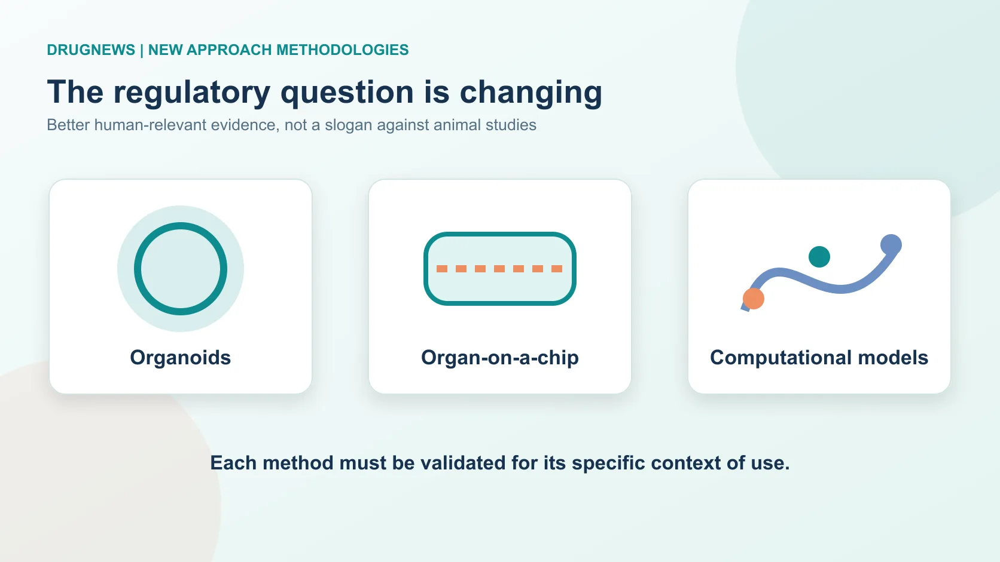
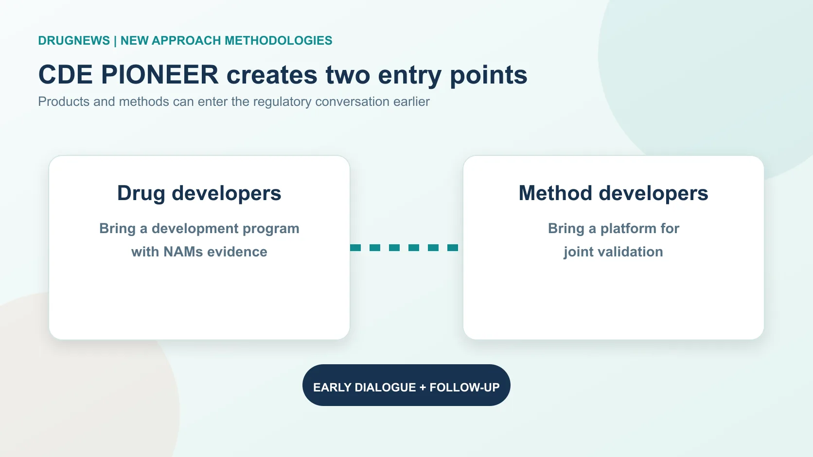
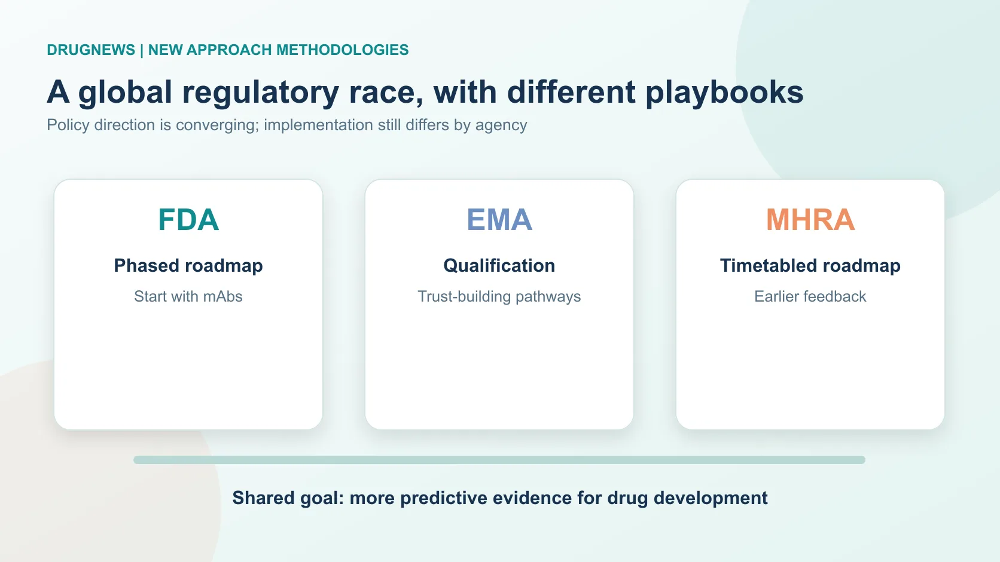
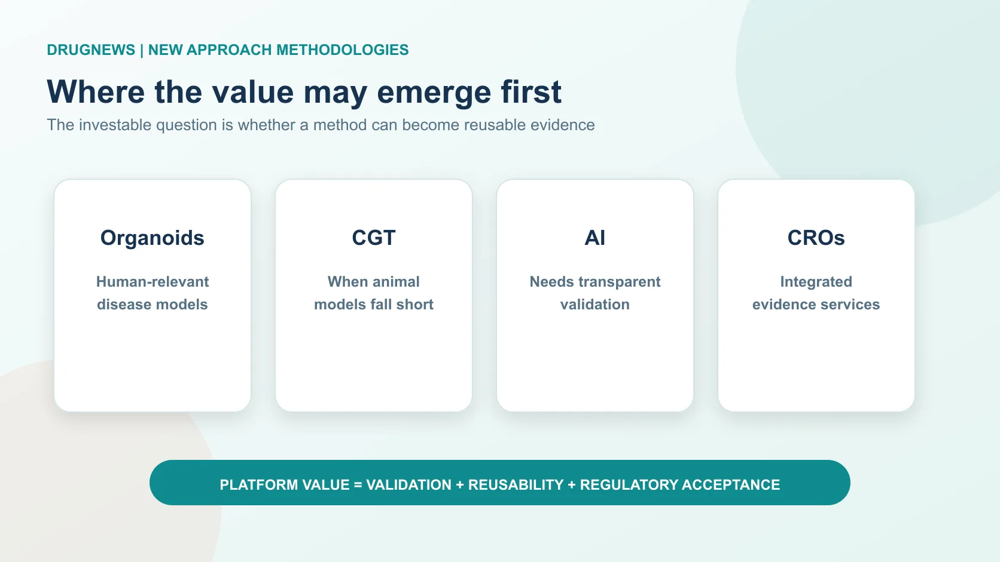

# Animal Studies Are Not Disappearing. Drug Development Rules Are Changing.

On July 7, 2026, China's Center for Drug Evaluation (CDE) opened a consultation on its program to propel the research and application of New Approach Methodologies, or NAMs. The English title, *Propel Innovation and Operation of NAMs to Enhance Efficiency in R&D*, gives the program its PIONEER acronym.

The point is not that drug developers can suddenly abandon animal studies. It is that nonclinical evidence is beginning to be judged more explicitly by its fitness for purpose. Organoids, organ-on-a-chip systems, human-cell assays, in vitro tests, computational models, AI prediction and real-world data may all have a role when they produce evidence that is verifiable, reproducible and interpretable in a defined context of use.

That distinction matters. Drugs can look safe or effective in animals and fail in people; some cell, gene, RNA and antibody therapies have no animal model that faithfully captures the human biology. NAMs are not about doing less science. They are about building evidence that is closer to the patient.

## 01 | CDE PIONEER has two doors and concrete use cases

The first door is for drug developers that have used, or plan to use, NAMs data to support a registration package. The second is for method developers whose organoid, chip, AI toxicology or in-vitro platform needs to be evaluated jointly with regulators. The doors are not mutually exclusive: a sponsor can bring a product program and later add a method-validation application.

CDE has also named the kinds of questions at stake. They include supplementing conventional nonclinical work, mechanism studies, toxicity prediction, proof of concept and efficacy assessment where an appropriate animal model does not exist. The program also contemplates selected antibody toxicology questions, local eye and skin tolerance, pro-arrhythmia risk, pharmacokinetic endpoints, and products such as cell and gene therapies or rare-disease medicines where conventional animal evidence has clear limits.

The operating design is consequential. The pilot will recruit for five years without a fixed quota, offers early engagement and follow-up, and can convene expert consultation. For joint validation, CDE and the applicant will agree the validation plan. A method that is validated for a particular context should, in principle, not need to be revalidated from zero every time it is used in that same context.

That is the start of a platform business model for NAMs. A useful method is not merely an impressive experiment: it becomes reusable regulatory infrastructure.

## 02 | Regulators are moving, but they are not moving in the same way

NAMs have become a competition in regulatory science. The U.S. FDA has taken the most visible policy stance, announcing in 2025 that it would work toward reducing, refining or replacing certain animal-testing expectations for monoclonal antibodies and other drug-development programs. Its roadmap starts with settings in which animal models have limited predictive value and expands from there.

The European Medicines Agency has generally emphasized qualification, safe-harbor discussions, voluntary submissions and incremental recognition. That route can look slower, but it is designed to accumulate regulatory trust around specific methods and use cases.

The UK's MHRA has added a more operational timetable. The UK roadmap describes targets for moving away from certain animal regulatory tests, while its early-review mechanism gives companies a way to seek non-binding feedback on non-animal evidence before a marketing application. That matters because the largest risk for a NAMs developer is often not whether its technology is elegant, but whether a regulator will accept the evidence when a product decision is on the line.

## 03 | CDE's program is meaningful, but it is a starting point

PIONEER gets three important things right. First, it creates a collaboration framework across industry, academia, research institutions and regulators. Organoid and chip validation needs clinical samples, engineering platforms, high-quality data and repeated testing across sites and conditions; no single company can build that evidence base alone.

Second, its dual-track structure lets product sponsors and technology developers enter together. That reduces the risk that NAMs remain an academic publication rather than a usable development tool.

Third, the principle that a method validated for a defined use case should not require repeated validation is essential. Without it, every program has to reopen the same regulatory argument, and a method can never become a scalable platform.

There are still material gaps. The program is an administrative pilot, not yet a legal reform. It does not provide the kind of detailed timetable used in some other jurisdictions. It also leaves the technical threshold to be worked out: sponsors need clarity on context of use, human relevance, model characterization, reproducibility, applicability domain, positive and negative controls, and cross-laboratory consistency.

Funding and shared validation capacity are equally important. Who supplies samples? Who pays for multi-center validation? How are data rights and intellectual property handled after validation? A strong technology can still stall at the stage of “promising, but too expensive to validate.”

The meaningful milestone will not be the publication of another policy document. It will be the first product whose NAMs evidence demonstrably helps move through CDE review or supports a filing.

## 04 | The value chain will be repriced around validated, reusable evidence

Organoid and organ-on-a-chip companies are the most direct beneficiaries because their historic bottleneck has been an unclear regulatory adoption path. China has large clinical-sample resources, a substantial hospital system and strong translational demand. If disease models, liver toxicity, cardiac toxicity or immune-toxicity use cases can be validated, adoption could accelerate.

Cell and gene therapy programs may benefit especially where species specificity makes conventional models poor proxies. AI drug-discovery companies also gain an opening, but not a shortcut: regulators will still ask about data provenance, reproducibility, interpretability, external validation, limits of use and failures. A black-box prediction will not become filing-grade evidence by itself.

Conventional CROs face pressure, but CROs that can combine GLP animal work with organoids, chips, AI toxicology and regulatory strategy may become more valuable. The industry is not simply replacing one test with another. It is changing the capabilities required to assemble a credible nonclinical package.

## Conclusion | NAMs are about bringing drug development closer to people

CDE's PIONEER program is an important move, but it does not mean animal studies will vanish tomorrow. In the near term, NAMs will often be supporting evidence alongside conventional nonclinical work, and some programs may initially carry the cost of both systems.

The opportunity is greatest where human biology is difficult to model in animals: cell and gene therapies, rare diseases and human-specific targets. The lasting change will come only when NAMs data can travel a full path from a validated method, to a defined regulatory use case, to a product decision. That is when the field moves from “animal-to-human extrapolation” toward evidence designed around people from the start.

## References

- CDE public consultation and PIONEER materials: https://www.cde.org.cn/
- U.S. FDA, New Approach Methodologies: https://www.fda.gov/science-research/about-science-research-fda/new-approach-methodologies-nams
- European Medicines Agency, regulatory science and qualification: https://www.ema.europa.eu/
- UK Government, replacing animal testing roadmap: https://www.gov.uk/government/publications/replacing-animals-in-science-a-strategy-to-support-the-development-use-and-uptake-of-alternatives-to-animal-testing

*This article is a synthesis of public regulatory and industry information. It does not constitute medical, investment, fundraising or stock advice. 本文不構成醫療、投資、募資或股票建議。*
