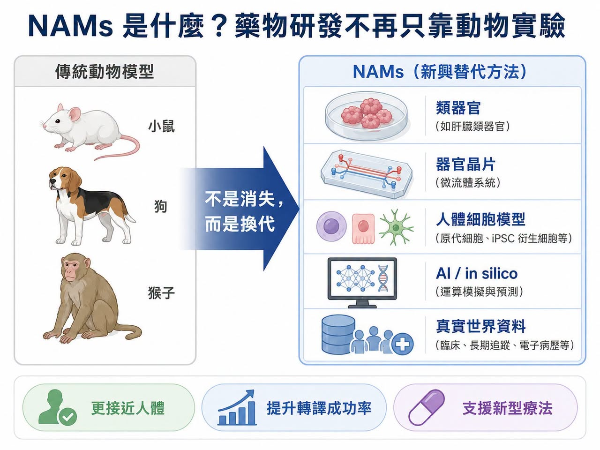
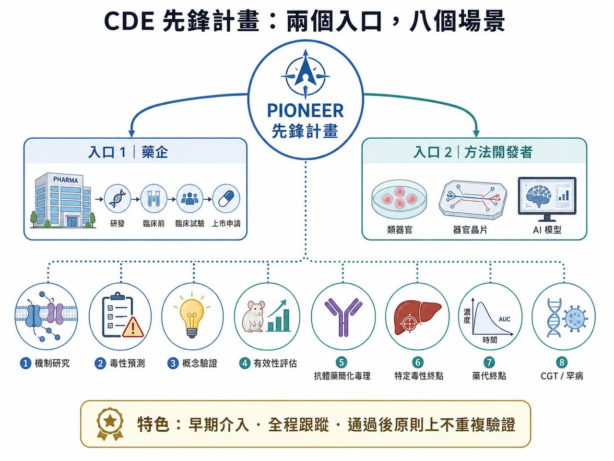
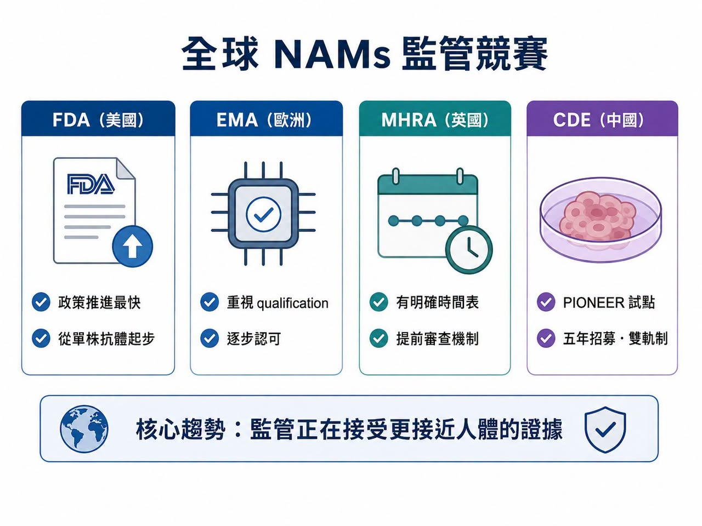
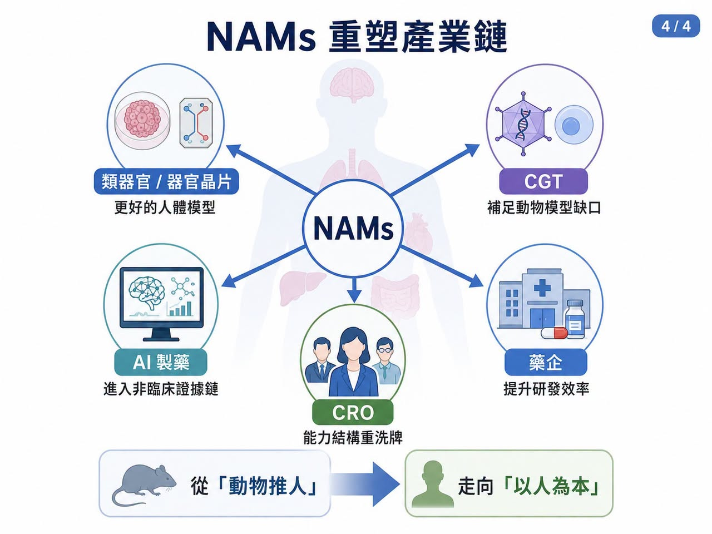

# 動物實驗不是消失，而是藥物研發規則開始換代

2026 年 7 月 7 日，中國國家藥品監督管理局藥品審評中心，也就是 CDE，一次公開徵求「推進新方法（NAMs）研究和應用試點計畫」相關文件意見。

這項計畫英文全名是 Propel Innovation and Operation of NAMs to Enhance Efficiency in R&D，簡稱 PIONEER，中文則被稱為「先鋒計畫」。

CDE 同步釋出介紹、申報指南、申請表與實施框架，徵求意見期為一個月。

官方文件也明確指出，計畫目標是促進 organoids（類器官）、organ-on-a-chip（器官晶片）等 New Approach Methodologies（NAMs，新方法學）在藥物研發中的研究與應用。

這件事的意義，不只是多了一個試點計畫，它代表中國藥品監管正式進入全球 NAMs 競賽。NAMs 說白了，就是藥物安全性與有效性評估不再只能依賴動物模型。類器官、器官晶片、人體細胞模型、體外檢測、in silico 模型、AI 預測、真實世界資料，只要能在明確使用情境下提供可驗證、可重複、可解釋的證據，都可能成為非臨床評估的一部分。這不是「反動物實驗」的口號。而是藥物研發正在面對一個老問題：動物不是人。

很多藥在動物身上看起來安全有效，進入人體卻失敗；也有些創新療法本來就找不到合適動物模型。當細胞治療、基因治療、RNA 藥物、抗體藥物與 AI 藥物越來越多，傳統動物實驗已經無法完全支撐新一代藥物開發。NAMs 的核心，不是少做實驗，而是做更接近人體的實驗。

【01｜CDE 先鋒計畫怎麼玩？兩個入口，八個場景】

這次 CDE 的設計有兩個入口。

第一個入口，是藥企。如果藥物開發中已經使用，或計畫使用 NAMs 資料支持註冊申報，可以申請納入試點。

第二個入口，是 NAMs 方法開發者。如果類器官、器官晶片、AI 毒性模型、體外檢測平台等方法需要和監管端共同驗證，也可以申請進入試點。

這兩個入口不互斥。換句話說，藥企在開發過程中如果發現某個 NAMs 方法需要聯合驗證，也可以再補充申請。更重要的是，CDE 不是泛泛說「鼓勵創新」，而是列出具體使用方向。包括傳統非臨床評價的補充、機制研究、毒性預測、概念驗證、缺乏合適動物模型時的有效性評估；也包括支援部分抗體類藥物簡化長週期重複給藥毒性試驗，特定毒性終點如眼部與皮膚局部耐受性、致心律不整風險，特定藥代終點，以及細胞與基因治療、罕見病藥物等傳統動物模型不適用的品種。

這些方向很有針對性。因為傳統動物模型最弱的地方，剛好就是 NAMs 最有價值的地方。

例如抗體藥物長期猴子毒性試驗成本高、倫理壓力大，而且動物模型對人類免疫反應的可預測性有限。再例如細胞與基因治療，很多產品只在人類細胞或特定人類靶點上有作用，硬做動物模型反而可能得到不具轉譯價值的資料。CDE 這次也給出幾個重要制度設計。

試點招募期五年，不設名額限制。

納入後強調早期介入、及時溝通、全程跟蹤。

必要時可啟動專家諮詢。

對於方法學聯合驗證項目，CDE 將與申請方共同確定驗證方案；若某一 NAMs 方法通過驗證，後續用於特定場景時，原則上不再重複驗證。

這句話很關鍵，因為它等於給 NAMs 方法一張監管通行證。一旦某個器官晶片模型、類器官毒性模型或 AI 預測模型，在特定場景被驗證，未來其他藥物開發就可能重複使用，而不必每次從零證明。

這才是 NAMs 真正產業化的起點。

【02｜全球監管都在動：FDA 最激進，EMA 最細緻，MHRA 最有時間表】

NAMs 已經是全球監管科學競賽。

美國 FDA 動作最大。

2025 年 4 月，FDA 宣布將逐步減少、精簡或替代單株抗體與其他藥物開發中的動物實驗要求，並鼓勵在 IND 申請中納入 AI 毒性模型、細胞模型、類器官與器官晶片等 NAMs 資料。FDA 也明確說，這套做法將從單株抗體開始，逐步擴展到其他藥物類型。FDA 的打法很清楚：先用政策宣示開路，再用 roadmap 鋪方向，接著用具體指引告訴產業如何做。

FDA 在 NAMs 專頁也提到，2025 年發布的 roadmap 採取分階段策略，先從動物模型預測性特別有限的單株抗體開始，再擴展到其他生物分子與新化學實體；2026 年也發布「General Considerations for the Use of New Approach Methodologies in Drug Development」草案，提供 NAMs 在藥物開發中替代或減少動物毒理試驗的驗證框架與監管期待。

歐洲 EMA 則走另一條路。

它沒有像 FDA 那樣用強烈政策語言大幅宣示，但在具體方法上更重視 qualification、safe harbor、自願提交與逐步認可。這種做法比較慢，但更適合累積監管信任。

英國 MHRA 則很有執行感。

英國政府 2025 年公布替代動物實驗 roadmap，投入約 7,500 萬英鎊推動替代方法發展，並提出明確時間表：

2026 年底前停止皮膚與眼部刺激、皮膚致敏等領域的動物監管測試。

2027 年前推動肉毒桿菌毒素小鼠 potency test 的替代。

2030 年前減少狗與非人靈長類動物藥代研究。

更重要的是，MHRA 2026 年提出提前審查機制。企業若使用非動物資料開發藥物，可在上市申請前先提交 Module 4、試驗主持人手冊與至少一項臨床試驗最終報告，取得 MHRA 的非約束性書面意見。這對企業非常重要。因為使用 NAMs 最大風險，不是技術不美，而是不知道監管最後收不收。如果監管能提前審查、提前給意見，企業就敢投入。

【03｜CDE 這一步很重要，但還不是終點】

CDE 先鋒計畫值得肯定，它至少做對三件事。

第一，搭起產、學、研、監的合作框架。

NAMs 不是單一家企業能完成的事。類器官需要臨床樣本，器官晶片需要工程平台，AI 模型需要高品質資料，驗證又需要多中心、多批次、多條件重複。這必須靠產業、學研與監管共同搭建。

第二，採取雙軌制。

藥企可以帶著產品進來，方法開發方也可以帶著技術進來。這能避免 NAMs 只停留在學術發表，也避免藥企缺乏可用工具。

第三，給出「驗證通過後不再重複驗證」的承諾。

這對 NAMs 方法開發者非常重要。否則每個項目都要重新說服監管，方法學就無法形成平台價值。

但 CDE 這套框架也有幾個尚待補齊的地方。

首先，它仍是行政試點，不是法律層級改革。這和 FDA Modernization Act 2.0 後美國在制度層面放寬動物試驗強制要求，穩定性不同。

其次，它還缺少明確時間表。FDA 說先從單株抗體開始，英國說 2026 年底前在哪些毒性評價取消動物試驗。CDE 目前說五年內招募、不設名額，態度是「歡迎你來」，但還不是「我推著你走」。

第三，技術驗證標準還不夠細。企業最想知道的不是表格怎麼填，而是什麼樣的 NAMs 資料算合格。使用場景、人體相關性、模型表徵、可重複性、適用邊界、陽性陰性對照、跨實驗室一致性，這些都需要更細的技術指引。

第四，缺少資金與公共驗證平台。NAMs 驗證很燒錢。誰提供樣本？誰付多中心驗證成本？驗證成功後智慧財產權與資料使用權怎麼分配？如果沒有公共資助或國家級驗證網路，很多方法會卡在「好技術，但沒錢驗證」的階段。

所以，先鋒計畫是起點，不是答案，真正的里程碑，不是文件發布。而是第一個靠 NAMs 資料真正推進 CDE 審評、甚至支持申報的藥物案例出現。

【04｜誰會受益？類器官、器官晶片、CGT、AI 製藥、CRO 都會被重新定價】

NAMs 最直接受益者，是類器官與器官晶片公司。

過去這些公司最大痛點，是技術看起來前沿，但監管接受路徑不清楚。沒有監管採納，再漂亮的類器官模型也很難成為藥物申報資料的一部分。現在 CDE 把類器官、器官晶片寫進試點計畫，等於給產業一個入口。中國在類器官與器官晶片上有獨特優勢：臨床樣本量大、醫院體系龐大、轉化醫學需求強。如果能先在腫瘤藥敏、肝毒性、心臟毒性、免疫毒性等具體場景跑通，未來可能在某些 NAMs 應用上走得很快。

第二類受益者，是 CGT，也就是細胞與基因治療公司。

CGT 最大問題之一，就是非臨床評價經常找不到合適動物模型。很多基因療法只對人類序列有效，很多細胞治療的免疫互動也難以在動物中重現。NAMs 若能被接受，會讓 CGT 的機制驗證、安全性評估與有效性推論更接近人體。

第三類，是 AI 製藥公司。

CDE 把 computer simulation、AI prediction 這類方法納入 NAMs 範圍，等於承認 AI 可以進入非臨床證據鏈。但 AI 公司不能只說模型很準。監管要看的會是資料來源、模型可重複性、可解釋性、外部驗證、適用邊界與失敗案例。AI 製藥若想真正走進申報資料，未來必須搭配體外實驗、類器官或臨床樣本資料，而不是只做黑箱預測。

第四類，是 CRO，也就是委託研究機構。

傳統動物實驗 CRO 會有壓力，但能同時提供 GLP 動物實驗、類器官模型、器官晶片驗證、AI 毒性模型與法規策略的 CRO，反而會變得更有價值。NAMs 不會讓 CRO 消失，只會讓 CRO 能力結構重新洗牌。

【結語｜NAMs 不是少做動物，而是讓藥物研發更接近人】

CDE 啟動 NAMs 先鋒計畫，是重要一步。但不能把它理解成動物實驗明天就要被全面取代。短期內，NAMs 多半仍是支持性資料，企業仍要同時準備傳統非臨床資料。甚至在過渡期，成本可能上升，因為企業要兩套系統一起做。

但長期看，方向已經很明確。

藥物研發會越來越依賴人體相關模型。

類器官會成為疾病建模與藥效評估的重要工具。

器官晶片會進入毒性、藥代與器官交互作用研究。

AI 模型會協助預測風險，但必須接受嚴格驗證。

CGT、罕見病與人類專一性靶點藥物，會最先感受到 NAMs 的價值。

這不是科學倫理的口號，而是研發效率、轉譯成功率與監管科學的升級。真正值得期待的，不是更多文件。而是第一批用 NAMs 資料跑通審評路徑的藥物。當那一天出現，NAMs 才不只是新名詞。它會成為新藥研發從「動物推人」走向「以人為本」的真正轉折點。

-----------

參考資料：

各公司官網＆公開資料

*本文為公開監管與產業資料整理，不構成醫療、投資、募資或股票建議。*
