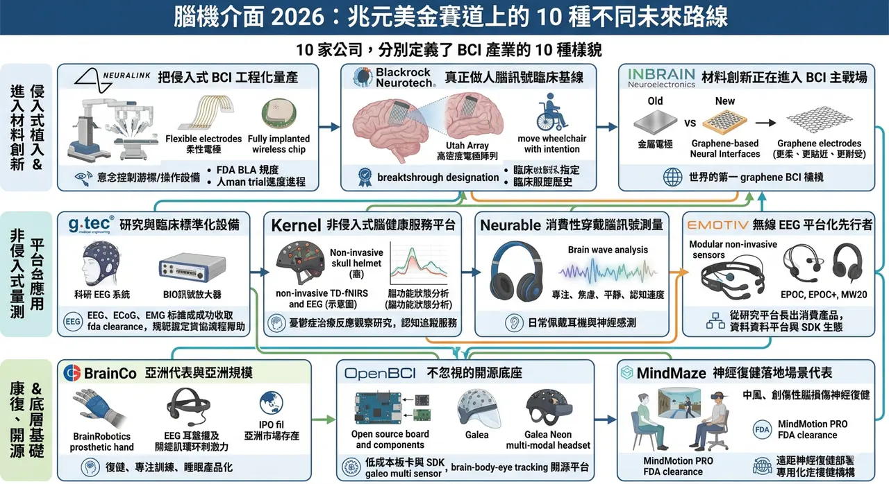
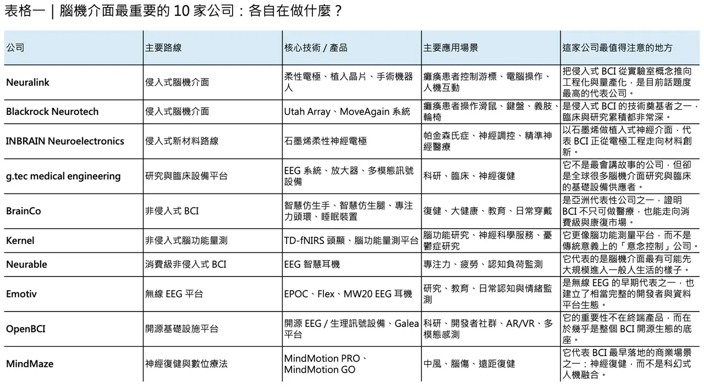
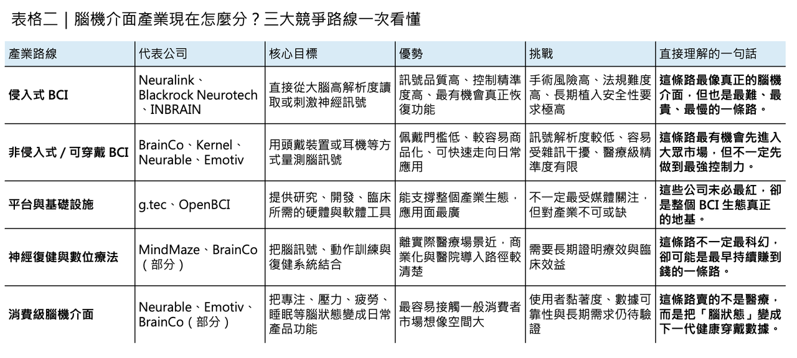

# 馬斯克的下一個兆元美金賽道 Neuralink，你必須知道的腦機介面 10 家！

## 腦機介面，真正值得追的 10 家公司：不是只有 Neuralink，而是 10 條不同的未來路線
到了 2026 年，腦機介面（brain-computer interface, BCI）已經不再只是科幻敘事或實驗室展示，而是逐漸分化成幾條很清楚的產業路線：一條走侵入式植入，目標是讓癱瘓患者重新溝通、操作設備甚至恢復部分功能；一條走非侵入式穿戴，強調腦訊號量測、認知監測與日常應用；還有一條則更像底層基礎建設，提供研究設備、資料平台、演算法環境與神經復健系統。

BioPharmaTrend 在 2025 年底整理的 10 家代表公司之所以值得看，不是因為它們都會變成同一種公司，而是因為它們分別定義了 BCI 產業未來可能長成的 10 種樣子。

真正理解這份名單的方式，不是把它當成單純排名，而是把它視為一張產業地圖。因為今天的腦機介面，早已不是單一技術賽道，而是材料、晶片、植入手術、無線訊號、AI 解碼、神經復健、消費性裝置與數位健康服務同時交錯的集合體。以下這 10 家公司之所以重要，正是因為它們各自抓住了這個產業最關鍵的一塊拼圖。

✦【1. Neuralink：把侵入式 BCI 從概念推向工程化量產的人】

如果說哪一家公司把腦機介面真正推上全球主流媒體與資本市場的舞台，答案幾乎就是 Neuralink。這家公司成立於 2016 年，核心價值不只在於做出腦植入物，而在於它試圖把侵入式 BCI 這件事從高度客製化的研究計畫，推向可標準化、可量產、可複製的醫療工程系統。柔性電極、植入晶片、全植入式無線架構，以及用來完成手術的機器人，都是它要打通的關鍵環節。

截至 2025 年 9 月，全球已有約 12 名重度癱瘓患者接受 Neuralink 植入，受試者已能以意念控制游標、操作數位工具，甚至玩遊戲、上網與發文。2025 年公司又完成 6.5 億美元融資，估值升至約 90 億美元。這些數字不只是資本故事，它們代表的是：Neuralink 已從「最會說未來」的公司，逐漸轉向「開始拿出人體資料與製造節奏」的公司。

✦【2. Blackrock Neurotech：真正把侵入式 BCI 做出臨床基線的人】

如果 Neuralink 代表的是工程化與大眾關注，那麼 Blackrock Neurotech 更像是侵入式腦機介面的技術基礎建設。它背後最重要的歷史資產，就是 Utah Array。這種高密度微電極陣列早已在神經科學研究與人體試驗中累積大量經驗，也讓 Blackrock 在「真正長期做人腦訊號讀取」這件事上，擁有許多後進公司難以取代的深度。

它目前推進的 MoveAgain 系統，目標是讓四肢癱瘓或 locked-in syndrome 患者透過思考控制游標、鍵盤、平板、輪椅或義肢設備，並且在 2021 年已取得 FDA 的 Breakthrough Device Designation。很多人談 BCI 時只看新創熱度，但從臨床累積、植入經驗與神經訊號品質來看，Blackrock 其實一直是這個產業真正的老兵。它不是聲量最大的公司，卻很可能是最深刻影響侵入式 BCI 技術基線的公司之一。

✦【3. INBRAIN Neuroelectronics：用石墨烯重寫植入材料競爭的人】

侵入式 BCI 的下一場競爭，不只在解碼演算法，也在材料。INBRAIN Neuroelectronics 值得關注，正是因為它不是沿用傳統金屬電極路線，而是押注 graphene-based neural interfaces。石墨烯的吸引力，在於它更薄、更柔、更貼近腦組織，也更有機會在訊號品質、生物相容性與長期植入耐受性之間取得新平衡。

INBRAIN 已取得 FDA Breakthrough Device Designation，適應症指向帕金森氏症；2024 年更完成全球首例石墨烯腦機介面人體植入。這個里程碑的重要性，不只在於「世界第一」，而是它把一種過去停留在先進材料論文中的技術，真正推進到手術與臨床可行性的層次。若 Neuralink 與 Blackrock 代表的是電極密度與工程化，那麼 INBRAIN 代表的就是材料創新正在進入 BCI 主戰場。

✦【4. g.tec medical engineering：把 BCI 從研究玩具變成標準設備的人】

很多人談 BCI 只看最前沿的新創，卻忽略了真正讓整個領域可持續運作的公司，往往是那些提供設備、訊號品質、軟體流程與臨床系統的人。g.tec medical engineering 就是這樣的存在。這家來自奧地利的公司長年深耕 invasive 與 non-invasive BCI，產品不只用於學術研究，也已進入臨床場景。

像 g.Nautilus PRO Flexible 明確標示為 CE-certified and FDA-cleared 的可穿戴 EEG 系統，g.HIamp 則是高通道、高精度的生物訊號放大器。g.tec 的重要性，在於它不像 Neuralink 那樣講「未來人機融合」，而是讓全球研究機構與醫療單位今天就能穩定做 EEG、ECoG、EMG、EOG 與即時神經回饋。說得更直接一點，若沒有這類公司，很多 BCI 論文、臨床研究與標準化流程根本不會這麼快成形。

✦【5. BrainCo：把腦機介面從實驗室推向康復、教育與消費場景的亞洲代表】

若要找一家具備亞洲規模感與產品化速度的 BCI 公司，BrainCo 幾乎一定會被提到。它最有代表性的地方，不是跟 Neuralink 一樣做侵入式植入，而是把非侵入式腦訊號技術推進到復健、專注訓練、睡眠與穿戴式應用。這使它成為全球 BCI 產業中少數同時踩到醫療復健與消費級市場的公司之一。

它的 BrainRobotics prosthetic hand 已取得 FDA 相關認證文件，FocusZen 與 Easleep 則把 EEG、閉環刺激與神經回饋帶進日常健康場景。Bloomberg 今年也報導，BrainCo 在 2026 年初完成約 20 億元人民幣融資，並已祕密遞交香港 IPO 申請。這家公司最值得看的，不是單點技術是否最前沿，而是它證明了一件事：腦機介面未來不一定只活在手術室，它也可能先在康復中心、睡眠設備與日常穿戴市場長大。

✦【6. Kernel：把非侵入式腦功能量測做成服務平台的人】

Kernel 在整個 BCI 版圖裡比較特別，因為它並不主打「用意念控制外部裝置」，而是主打更準、更可擴展的非侵入式腦功能測量。這家公司最核心的產品是 Flow 與後續的 Flow2，以 time-domain functional near-infrared spectroscopy（TD-fNIRS） 為主，並整合 EEG，想做的不是單一腦波裝置，而是一個可反覆量測、追蹤、分析腦功能狀態的平台。

Kernel 的價值，在於它讓「腦功能量測」往更標準化、更接近臨床與健康服務的方向走。例如它已用 Flow2 做憂鬱症治療反應的觀察性研究，也推出結合 TD-fNIRS 與 EEG 的認知追蹤服務。這代表一種完全不同於植入式 BCI 的未來：不是讓人用思想控制游標，而是讓腦訊號本身成為一種新的生理量測指標。若說侵入式 BCI 在競逐「輸出控制」，那麼 Kernel 瞄準的更像是「腦健康測量」。

✦【7. Neurable：把腦機介面真正做成消費性穿戴的人】

在所有非侵入式公司裡，Neurable 是最有代表性的「消費化路線」玩家之一。它沒有把產品做成科研帽或臨床頭盔，而是直接走向每天可以配戴的耳機。和 Master & Dynamic 合作推出的 MW75 Neuro，本質上就是一個把 EEG 感測、訊號分析與日常聆聽設備融合的產品。

這家公司重要的地方在於，它不是單純把 EEG 感測器塞進耳機，而是試圖把「專注、焦慮、平靜、認知速度」這些抽象狀態，轉成一般使用者可理解、可持續追蹤的指標。這種方向未必最像傳統醫療器材，卻很可能是未來 BCI 真正大規模進入生活的方式之一。因為對大多數人來說，最先接受的腦機介面，不會是開顱植入，而是戴起來像普通裝置、但能悄悄讀懂你腦狀態的產品。

✦【8. Emotiv：無線 EEG 平台化最完整的先行者之一】

若要從產業史角度看非侵入式 BCI，Emotiv 幾乎一定會被列入最重要的一群公司。它早期用 EPOC、EPOC+ 這類產品把無線 EEG 帶進更廣泛的研究與開發者社群，後來又持續延伸到模組化系統與 SDK 生態，讓它不只是一家硬體公司，更像一個腦波資料與應用平台。

近年的 MW20 則進一步把這條路推向消費場景。Emotiv 官方直接把它定位成全球首款整合 EEG 的主動降噪真無線耳機，主打即時追蹤專注、壓力、flow 與認知表現。和 Neurable 相比，Emotiv 更像是從研究平台長出消費產品；而不是從消費設計反過來嵌入腦訊號。這家公司重要之處，在於它證明了無線 EEG 不只可以做研究，也可以長成一整套從硬體、App 到 SDK 的商業系統。

✦【9. OpenBCI：整個 BCI 生態系最不能忽視的開源底座】

不是每一家重要公司都要靠高估值與大額融資來證明自己。OpenBCI 之所以重要，是因為它幾乎是全球最具影響力的開源腦訊號硬體與社群平台之一。它把 EEG、EMG、ECG 等生理訊號板卡做成低門檻、可程式化、可二次開發的工具，讓大量研究者、學生、創作者與新創團隊能夠更低成本地進入 BCI 世界。

近年的 Galea 與 Galea Neon 更顯示出它不再只是「便宜的開源板」，而是在朝向多模態感測整合前進。和 Pupil Labs 合作推出的 Galea Neon，將 EEG、EOG、EMG、EDA、PPG 與眼動追蹤整合成一套全無線的 brain-body-eye tracking 頭顯。這代表 OpenBCI 的角色，其實很像腦機介面世界的基礎設施供應商：它不一定直接做出最終醫療產品，卻讓下一代研究與應用更快長出來。

✦【10. MindMaze：讓神經復健成為 BCI 最早落地場景之一的人】

很多人談 BCI，第一個想到的是意念打字、控制義肢，或未來人機融合；但從商業落地與臨床使用來看，神經復健 其實是最早跑出實際價值的場景之一，而 MindMaze 正是這條路線的代表公司。它把神經科學、動作捕捉、VR／MR 與數位治療結合起來，主打中風、創傷性腦損傷等患者的神經復健。

其中 MindMotion PRO 已取得 FDA 510(k) clearance，MindMotion GO 也獲 FDA 清除，可用於臨床與居家復健，且官方指出其遠距神經復健計畫已部署於 Mount Sinai、Johns Hopkins 等機構。MindMaze 之所以重要，在於它提醒整個產業：BCI 不一定都要等到「讀心」完全成熟才有價值，很多時候，只要把腦與動作、回饋與訓練之間的迴路做得更有效，就足以改變病人的恢復曲線。

✦【真正該看的，不只是 10 家公司，而是 10 種產業分工】

把這 10 家公司放在一起看，會發現一件很重要的事：腦機介面真正的競爭，早就不是單一技術比賽，而是不同路線的產業分工正在快速成形。

Neuralink、Blackrock、INBRAIN 代表侵入式高解析度接口；

g.tec、Kernel、Emotiv、Neurable、OpenBCI 代表非侵入式量測、平台與消費應用；

BrainCo、MindMaze 則更靠近復健、健康管理與產品化場景。

重要的不是誰最紅，而是誰在自己那一條路線上，真的把未來往前推了一步。

所以，若要問 2026 年最值得追的腦機介面公司是哪些，答案未必是「哪一家最像科幻電影」，而是「哪一家最有機會把某一段關鍵價值鏈真正做成」。有的公司在解決植入與手術，有的在解決材料與生物相容性，有的在解決資料取得與標準化，有的在解決日常佩戴與大眾市場接受度，還有的在解決復健與神經功能回復。

BCI 的未來，大概不會由單一王者全部吃下，而會由這些不同角色共同拼出來。
-----------
參考資料：

[0]: 各公司官網＆公開資料

[1]:

10 Companies Shaping the Brain-Computer Interface Landscape: Invasive vs Non-Invasive BCI Technology

https://www.biopharmatrend.com/neurotech/top-10-companies-shaping-the-brain-computer-interface-landscape-invasive-vs-non-invasive-bci-technology-650/

www.biopharmatrend.com

[2]:

reuters.com

https://www.reuters.com/business/healthcare-pharmaceuticals/musks-neuralink-raises-650-million-latest-funding-round-2025-06-02/

www.reuters.com

[3]:

Header logo homepage link

Blackrock Neurotech's MoveAgain Brain-Computer Interface System Receives Breakthrough Device Designation from the FDA   SALT LAKE CITY, Nov. 16,

blackrockneurotech.com

" Press Release | Blackrock Neurotech's MoveAgain Brain-Computer Interface System Receives Breakthrough Device Designation from the FDA | Press Release | Blackrock Neurotech "

[4]:

Header logo homepage link

Blackrock Neurotech's MoveAgain Brain-Computer Interface System Receives Breakthrough Device Designation from the FDA   SALT LAKE CITY, Nov. 16,

blackrockneurotech.com

[5]:

Mission - inbrain-neuroelectronics

https://inbrain-neuroelectronics.com/

inbrain-neuroelectronics.com

"Mission - inbrain-neuroelectronics"

[6]:

g.tec medical engineering | Brain-Computer Interfaces & Neurotechnology

g.tec medical engineering creates advanced brain-computer interfaces and neurotech solutions for invasive and non-invasive brain signal recording.

www.gtec.at

---

本文僅供產業研究與知識分享，不構成投資、醫療、募資或個股建議。
