# 減重藥物不只看體重了：下一代療法正在瞄準這些方向

下一代減重療法的競爭，會從體重下降延伸到肌肉保留、脂肪肝、心血管與代謝共病。

## 體重下降只是第一場戰爭

GLP-1 已經證明肥胖可以被藥物大幅改變，但當市場出現多個有效產品後，競爭標準會被拉高。下一代療法不能只回答能瘦多少，還要回答瘦下來的品質如何。

這也是為什麼肌肉保留、脂肪肝改善、心血管保護與代謝發炎，會變成新一輪產品定位的核心。

- 體重下降會逐漸商品化。
- 身體組成與代謝共病會成為差異化。
- 臨床終點越多，商業故事越完整。

## 下一代產品要補 GLP-1 的空缺

GLP-1 強在食慾與體重控制，但它也留下未解問題：停藥後維持、肌肉流失、個體差異與副作用。新的機制或組合療法，會試圖補上這些空缺。

市場會特別關注 amylin、glucagon、GIP、肌肉保留相關路徑，以及脂肪肝與心血管結局資料。

- 多重腸泌素機制會繼續競爭。
- 肌肉保留可能變成高價值賽道。
- 脂肪肝與心血管資料會支撐更大給付。

## Drugnews 的判斷

肥胖治療會從單純減重，走向代謝疾病管理。下一代勝出的產品，不一定是單次體重下降最誇張，而是能在療效、安全、長期維持與共病改善之間取得最佳平衡。

- 投資人要看完整治療框架。
- 體重數字之外的臨床價值，會決定長期估值。

## 小結

這篇文章的重點不是把單一新聞看成短線題材，而是回到 Drugnews 一直強調的分析方法：從臨床證據、商業定位、競爭格局與監管風險四個面向，判斷一個生技醫藥事件是否真的會改變公司價值。

本文僅供產業研究與知識分享，不構成投資、醫療、募資或個股建議。
