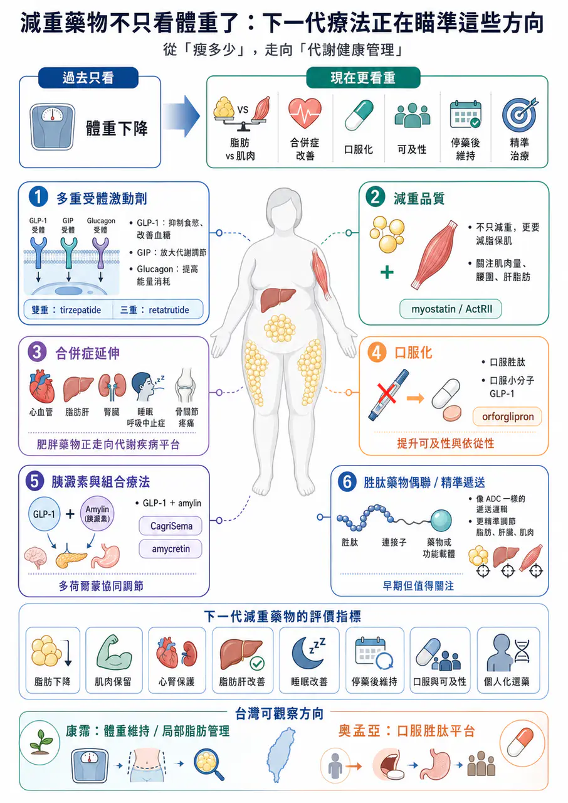
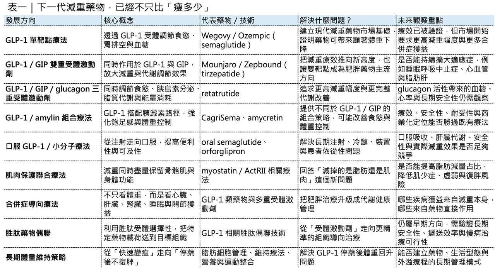
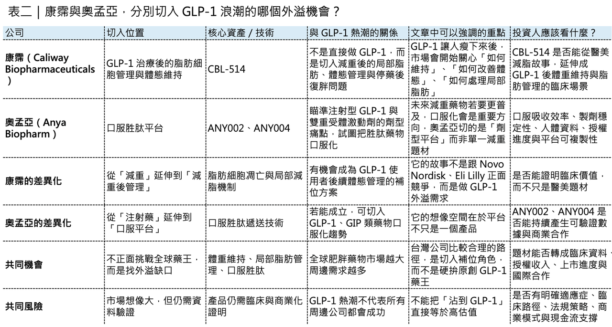

# 減重藥物不只看體重了：下一代療法正在瞄準這些方向

## 減重藥物不只看體重了：下一代療法正在瞄準這些方向

肥胖治療正在成為全球創新藥研發中最重要的戰場之一。

過去，市場討論減重藥物，焦點多半放在一件事：能瘦多少？

但現在，這個問題已經不夠用了。隨著 Wegovy（semaglutide）、Ozempic（semaglutide）、Mounjaro（tirzepatide）、Zepbound（tirzepatide） 把減重療效推到過去難以想像的高度，肥胖藥物研發正在進入下一個階段。未來真正重要的問題，會從「體重下降多少」變成：

- 減掉的是脂肪，還是肌肉？
- 能不能保護肌肉量？
- 能不能改善脂肪肝、心血管、腎臟、睡眠呼吸中止症與骨關節疼痛？
- 能不能做成口服？
- 能不能更便宜、更容易取得？
- 能不能停藥後不復胖？
- 能不能依照不同病人特徵，選擇最適合的療法？
這代表減重藥物已經不只是「體重管理」的問題，而是走向 長期代謝健康管理。近期 Nature Reviews Drug Discovery 相關綜述也指出，肥胖藥物開發正在從單一 GLP-1 受體激動劑，往多重受體激動劑、口服療法、胜肽藥物偶聯、精準治療與體重維持策略演進。這不是單一產品的迭代，而是整個肥胖治療產業鏈的升級。

## 藥時事 與 CMoney 全曜財經共同打造減肥藥賽道投資課程

藥時事團隊深度分析全球 減肥藥市場現況、新藥開發進程、臨床使用情況，並且完整講解了減肥藥物的投資邏輯，以及市場正在著重關注的標的。藥時事團隊的深度課程將能夠讓您成為專業的生技減肥藥專業達人、投資人：

線上課程 - 理財寶｜提供全方位投資線上課程

https://www.cmoney.tw/course-media/17141/intro

www.cmoney.tw

## 01｜GLP-1 成功之後，下一步是多重受體激動劑

GLP-1 類藥物的成功，並不是偶然。

天然 GLP-1 很容易被體內的 DPP-4 酵素快速分解，也會很快經由腎臟清除，所以半衰期很短，並不適合直接作為長期慢性病治療藥物。後來藥物開發真正的突破，是透過一系列分子工程設計，把 GLP-1 變成可以長期使用的藥：包括氨基酸替換、脂肪酸修飾、白蛋白結合、抗 DPP-4 分解、長效化設計，以及劑量遞增策略。

這讓 GLP-1 類藥物從早期每日注射，逐步走向每週一次，甚至更長效的治療方式。所以，GLP-1 的故事不只是靶點故事。它也是 胜肽分子工程成熟化 的故事。但現在，GLP-1 已經不是終點。下一代肥胖藥物正在往多重受體激動劑前進。

簡單說，就是一個藥物不只刺激 GLP-1 受體，而是同時調節多條代謝路徑。tirzepatide 就是代表性產品，它同時作用於 GLP-1 與 GIP 路徑。GLP-1 能抑制食慾、延緩胃排空、改善血糖；GIP 則可能透過中樞食慾調節、脂肪組織代謝與和 GLP-1 的協同作用，進一步放大療效。

再往後，市場正在看三重受體激動劑。例如 retatrutide，同時作用於 GLP-1、GIP 與 glucagon receptor，也就是「腸泌素、葡萄糖依賴性促胰島素多肽、升糖素」三條路徑。Eli Lilly 在 Phase 3 糖尿病研究中公布，retatrutide 能顯著降低糖化血色素與體重；在最高劑量組，40 週平均減重達 36.6 磅，約 16.8%。

這類分子的邏輯很清楚：

- GLP-1 負責抑制食慾與改善血糖。
- GIP 可能加強減重與代謝調節。
- glucagon receptor 則可能提高能量消耗與脂質代謝。
理論上，三者結合有機會把減重療效推到更高。但多靶點不是簡單相加。真正困難的是：三條路徑的活性比例怎麼設計？

- 如果 glucagon 活性太強，可能影響血糖、心率與耐受性。
- 如果 GLP-1 活性太強，腸胃道副作用可能變明顯。
- 如果 GIP 與 GLP-1 比例不理想，療效可能無法放大。
所以，下一代減重藥物的競爭，不只是誰作用的受體更多，而是誰能把 受體活性比例、半衰期、劑量遞增、組織暴露與安全窗口 平衡得更好。這就是肥胖藥物進入複雜分子設計時代的真正意義。

## 02｜減重藥物不只要瘦，還要看「減重品質」

GLP-1 類藥物把體重降得很漂亮，但也帶來另一個問題：減掉的體重裡，有多少是脂肪？又有多少是肌肉？

這件事非常重要。因為骨骼肌不只是外觀問題，它和基礎代謝率、活動能力、胰島素敏感性、老年衰弱風險、跌倒風險與長期健康都有關。如果一個人靠藥物快速減重，但同時流失太多肌肉，短期體重數字看起來很好，長期卻可能出現代謝率下降、停藥後復胖、體力變差，甚至老年衰弱風險上升。所以，下一代減重療法開始重視一個新概念：不是只看減重幅度，而是看減重品質。

所謂減重品質，就是希望體重下降主要來自脂肪減少，而不是肌肉大量流失。這也是為什麼 myostatin 與 activin type II receptor 這類肌肉調節路徑開始受到關注。Myostatin 可以理解為肌肉生長的「煞車」。阻斷這條路徑，有機會促進或保留肌肉量。Activin type II receptor 也是與肌肉量、脂肪代謝有關的重要訊號軸。Regeneron 就在布局這類方向，強調要提高脂肪減少比例，同時促進或保留肌肉。公司在 COURAGE Phase 2 試驗中也提到，正在探索多種促進與保留肌肉的策略。

未來肥胖治療不會只比「體重下降百分比」。

還會比：

- 脂肪量下降多少？
- 肌肉量保留多少？
- 腰圍改善多少？
- 肝臟脂肪下降多少？
- 運動功能是否改善？
- 體重停藥後能否維持？
這會讓肥胖藥物從單純的減重藥，變成更接近身體組成管理與代謝健康管理的療法。

## 03｜減重藥物的價值，正在往合併症延伸

肥胖不是單一疾病，它更像是一個全身性風險平台。

肥胖會提高第二型糖尿病、心血管疾病、慢性腎臟病、代謝功能障礙相關脂肪肝炎、阻塞性睡眠呼吸中止症、骨關節炎、高血壓、慢性發炎與癌症風險。所以，減重藥物真正的商業價值，不只在體重下降。而在於它能不能改善肥胖相關疾病。這也是為什麼現在大型藥廠都在往合併症延伸。GLP-1 類藥物已經在心血管保護、腎臟保護、脂肪肝、睡眠呼吸中止症與骨關節疼痛等方向不斷拓展資料。未來，肥胖藥物的標籤會越來越不像「減肥藥」。

它會更像一組代謝疾病治療平台。例如對某些患者來說，最重要的不是瘦 20%，而是心血管事件下降。對另一群患者來說，最重要的是脂肪肝改善，對睡眠呼吸中止症患者來說，可能是呼吸中止指數下降，對膝關節炎患者來說，則可能是疼痛改善、活動能力提升。這代表未來臨床開發會變得更複雜。研發者需要回答：

- 哪些獲益是單純來自體重下降？
- 哪些獲益是藥物直接調節發炎、脂肪組織、肝臟、腎臟或中樞神經造成？
- 不同合併症需要多大程度的減重，才能轉化成真正臨床獲益？
- 哪一類患者最適合哪一種藥？
這也是肥胖治療走向精準醫療的開始，未來的患者不會只用 BMI 分類，BMI 仍然有用，但遠遠不夠，更重要的是脂肪分布、內臟脂肪、肌肉量、肝臟脂肪、心腎風險、發炎狀態、血糖代謝、基因特徵、生活型態與患者偏好。換句話說，下一代減重治療最重要的問題，不一定是「哪個藥最強」。而是：哪一種患者，最適合哪一種治療。

## 04｜口服藥物，是減重藥物走向大眾化的關鍵

如果多重受體激動劑代表療效天花板，那口服藥物代表的是可及性。

注射型藥物療效很強，但不適合所有人。

- 有些患者怕針。
- 有些市場冷鏈物流困難。
- 有些醫療系統不容易普及注射裝置。
- 有些患者不想長期打針。
因此，口服減重藥物會是未來肥胖治療非常重要的方向，但口服化並不容易，尤其對胜肽藥物來說更難。胜肽容易被胃腸道酵素分解，吸收效率低。要做成口服，需要吸收促進技術、劑量設計、穩定性設計與暴露控制。oral semaglutide 已經證明口服 GLP-1 胜肽療法可行，但它也展示出口服胜肽的複雜性：生物利用率較低、需要更高劑量、服藥時間與進食限制較嚴格，個體吸收差異也可能影響長期依從性。

另一條路，是口服小分子 GLP-1 receptor agonist。最具代表性的是 Eli Lilly 的 orforglipron。Orforglipron 是口服小分子 GLP-1 受體激動劑，不是胜肽。這代表它可能在製造、儲存、配送、服用便利性上具備優勢。Lilly 已公布 orforglipron 在多項 Phase 3 試驗中達標，其中 ACHIEVE-3 研究顯示，orforglipron 在第二型糖尿病患者中，相較口服 semaglutide 14 mg，有更大的糖化血色素下降與體重下降。

這類藥物的戰略意義非常大，因為如果口服小分子 GLP-1 能在療效、安全性、成本與可及性之間取得平衡，減重市場可能會從高端注射藥，進一步擴展到更大人群，但也不能把口服小分子想得太簡單。小分子藥物仍然需要嚴格評估：

⚠️ 肝臟代謝風險。

⚠️ 長期安全性。

⚠️ 脫靶作用。

⚠️ 心血管安全性。

⚠️ 與其他慢性病用藥的交互作用。

所以口服化不是降低標準，而是開啟另一種開發難題。

## 05｜胰澱素與組合療法，讓減重藥物更像代謝管理平台

除了 GLP-1、GIP、glucagon 之外，amylin 也正在成為熱門方向。

Amylin 可以翻成 胰澱素，是一種和胰島素共同分泌的荷爾蒙，參與食慾、胃排空與血糖調節。

Novo Nordisk 的 CagriSema 就是 semaglutide 加上 amylin analogue cagrilintide 的組合療法。Novo 在 2026 年公布 REIMAGINE 2 試驗資料，CagriSema 在第二型糖尿病成人中帶來 1.91 個百分點的糖化血色素下降與 14.2% 體重下降。

Novo 的下一代候選藥 amycretin 則同時作用於 GLP-1 與 amylin 路徑。Reuters 報導指出，amycretin 在第二型糖尿病患者的中期試驗中，36 週最高可達 14.5% 減重，Novo 計畫於 2026 年啟動後期試驗。

這些發展代表一件事：肥胖藥物正在從單一腸泌素療法，走向多荷爾蒙組合。

這不是為了把機制做得很炫，而是因為人體體重調節本來就不是單一路徑控制。食慾、飽足感、胃排空、脂肪代謝、胰島素敏感性、獎賞系統、能量消耗、肝臟脂肪、肌肉量，全都互相連動。

所以未來肥胖療法很可能會像腫瘤治療一樣，進入組合與分層時代。

不同病人用不同策略。

⚠️ 需要強力減重者，可能用多重受體激動劑。

⚠️ 需要肌肉保留者，可能搭配肌肉保護療法。

⚠️ 需要脂肪肝改善者，可能選擇對肝臟代謝更有利的分子。

⚠️ 需要高可及性者，可能選擇口服小分子。

這才是下一代肥胖藥物真正的產業想像。

## 06｜胜肽藥物偶聯：減重藥物可能不只是激動劑，而是遞送系統

除了多重受體激動與口服藥物，還有一個更早期但值得注意的方向：胜肽藥物偶聯。

它的概念可以簡單理解為：利用胜肽對特定受體的辨識能力，把另一個有效成分送到特定組織或細胞。這有點像 ADC，也就是抗體藥物偶聯的邏輯，但把抗體換成胜肽。以 GLP-1 為例，它不只可以作為刺激 GLP-1 受體的藥物，也可能作為一種導向工具，把其他分子送到表現 GLP-1 受體的組織，進而提高局部作用、降低全身暴露與潛在副作用。研究上已經有人探索用 GLP-1 相關胜肽遞送雌激素、糖皮質激素調節分子、PPAR 相關載荷、神經受體調節分子、反義寡核苷酸，甚至蛋白降解相關工具。

這個方向還很早，距離成為主流慢性肥胖療法，仍需要大量安全性與長期資料。

但它釋放的訊號很重要：未來減重藥物不一定只是「刺激某個受體」，它可能變成更精細的 組織導向代謝治療系統，如果這件事成立，肥胖藥物的邊界會被再次擴大，因為藥物不只調節食慾，也可能更精準地調節脂肪、肝臟、肌肉、腸道、腦部或免疫發炎路徑。

## 08｜台灣可以怎麼看？不是只有「誰有 GLP-1 藥」才有機會

把視角拉回台灣，這一波減重藥物浪潮，最值得觀察的不是「誰能直接做出下一個 Wegovy 或 Zepbound」，而是誰能在全球 GLP-1 產業鏈外溢中找到自己的位置。

這裡可以先看兩家公司：康霈（Caliway Biopharmaceuticals） 與 奧孟亞（Anya Biopharm）。

- 康霈的核心資產 CBL-514，定位更接近局部減脂與脂肪細胞凋亡機制。公司在 BIO 2025 公布的臨床前資料指出，在 GLP-1 治療期間合併使用 CBL-514，可減少脂肪細胞數量，並在停藥後延緩體重回升。這個故事的重點，不是取代 GLP-1，而是有機會成為 GLP-1 之後的「體重維持」與「局部脂肪管理」搭配方案。
這個方向很符合下一代肥胖治療的趨勢。當 GLP-1 類藥物把體重降下來之後，市場接下來會問：如何降低復胖？如何改善體態？如何處理局部脂肪？如何把一次減重變成長期體重管理？康霈若能證明 CBL-514 不只是醫美減脂產品，而能在 GLP-1 治療後的體重維持場景中建立臨床價值，這就會是一個比較有想像空間的差異化切入點。

- 奧孟亞則走另一條路：口服胜肽平台。現在 GLP-1 市場最大瓶頸之一，就是注射劑型。注射藥雖然療效強，但對患者依從性、供應鏈、冷鏈、裝置與全球普及都有限制。奧孟亞主打的是把胜肽藥物做成口服劑型，並以 GLP-1 類藥物作為第一個商業化驗證場景。公開資料顯示，奧孟亞的 ANY002 已完成動物與早期人體前驅試驗，並已完成多國授權；另一項 ANY004 則瞄準 Mounjaro 類產品的口服劑型，規劃以 505(b)(2) 路徑推進。
奧孟亞的價值不在於單純「也做減重藥」，而在於它是否能證明自己的口服胜肽平台具備可複製性。如果 ANY002、ANY004 能在吸收效率、穩定性、製劑一致性與授權合作上持續推進，奧孟亞就不只是 GLP-1 題材公司，而可能成為口服胜肽技術平台公司。

## 結語｜下一代減重藥物，不只是讓人變瘦，而是重新定義代謝健康

減重藥物的競爭，正在從單一指標走向多維度。過去市場問的是：體重降多少？

現在市場會問：

- 脂肪降多少？
- 肌肉保留多少？
- 心血管風險有沒有下降？
- 脂肪肝有沒有改善？
- 睡眠呼吸中止症有沒有改善？
- 停藥後能不能維持？
- 患者能不能長期負擔？
- 能不能口服？
- 能不能更精準？
這就是下一代肥胖藥物真正的產業方向。

GLP-1 打開了大門，但門後面不是只有更強的 GLP-1。而是多重受體激動劑、胰澱素組合、肌肉保護療法、口服小分子、胜肽藥物偶聯、精準分層、長期維持與完整供應鏈能力。未來的肥胖治療，不會只是把體重計上的數字往下壓。

它會變成一整套代謝健康管理系統。真正的贏家，也不一定只是「最會讓人變瘦」的公司。而是能讓患者 瘦得健康、瘦得持久、瘦得可負擔，並且把肥胖相關疾病一起管理好 的公司。這才是下一代減重藥物真正的戰場。

---

參考資料：

[0]: 各公司官網＆公開資料

[1]:

The evolving landscape of obesity pharmacotherapy - Nature Reviews Drug Discovery | Christoffer Clemmensen

Our Review on the evolving landscape of obesity pharmacotherapy is now online in Nature Reviews Drug Discovery: https://lnkd.in/evwpfiV9 Together with Jonas Odgaard Petersen, Valdemar Brimnes Ingemann Johansen, Brian Finan and Timo Müller, we discuss h

www.linkedin.com

[2]:

[3]:

[4]:

Lilly's oral GLP-1, orforglipron, delivered superior blood sugar control and weight loss compared to oral semaglutide in head-to-head type 2 diabetes trial published in The Lancet

/PRNewswire/ -- Eli Lilly and Company (NYSE: LLY) today announced detailed results from ACHIEVE-3, the first head-to-head Phase 3 trial evaluating the safety...

www.prnewswire.com

[5]:

News Details

https://www.novonordisk.com/content/nncorp/global/en/news-and-media/news-and-ir-materials/news-details.html

www.novonordisk.com

[6]:

reuters.com

https://www.reuters.com/business/healthcare-pharmaceuticals/novo-nordisks-obesity-drug-shows-weight-loss-up-145-mid-stage-study-2025-11-25/

www.reuters.com

本文僅供產業研究與知識分享，不構成投資、醫療、募資或個股建議。
