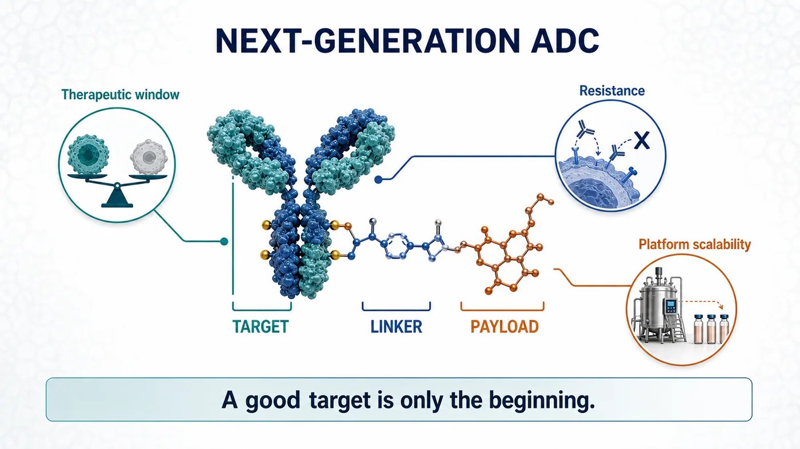
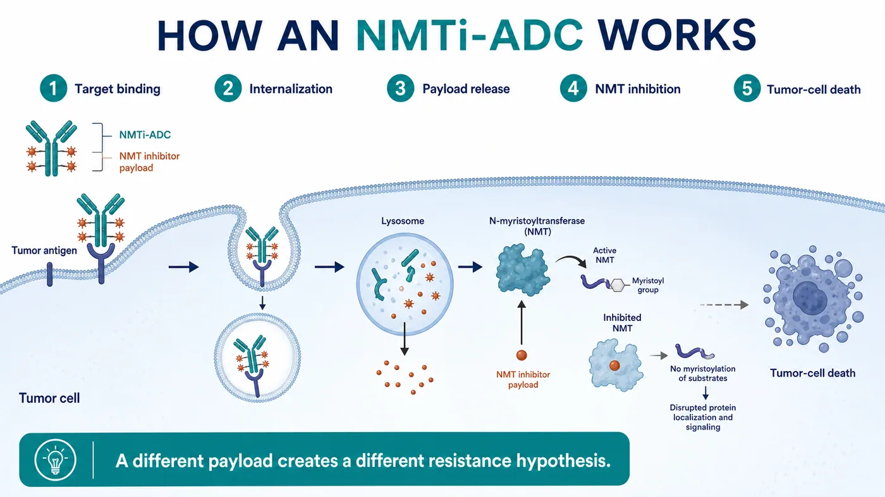
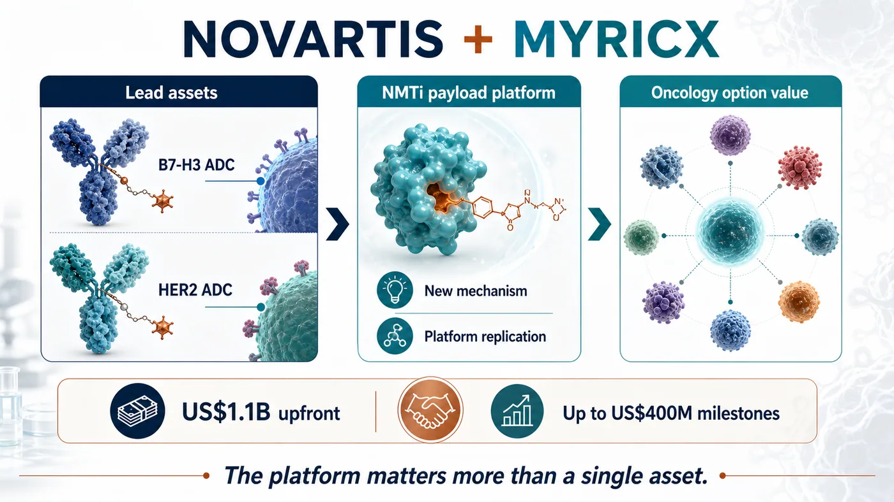
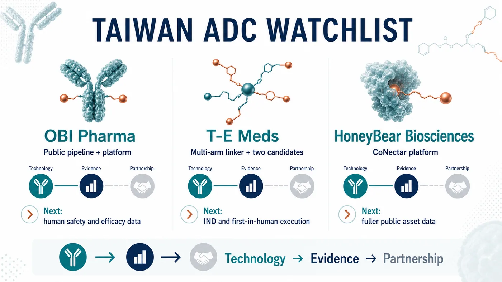

# The Next ADC War: Novartis Is Paying Up to $1.5 Billion for Myricx, but the Real Prize Is a New Payload Class

The antibody-drug conjugate market has become crowded enough to feel overheated.

HER2, TROP2, B7-H3 and Nectin-4 have been pursued by wave after wave of companies. Topoisomerase I inhibitors, microtubule inhibitors, bispecific ADCs and dual-payload ADCs now appear in almost every oncology R&D presentation. Over the past several years, ADCs have been one of the brightest tables in innovative drug development, drawing capital, business-development budgets, clinical programs and large-pharma attention.

Yet the hotter the table becomes, the clearer the genuinely scarce resource is.

The market does not need another ADC merely because it is an ADC. It needs enabling technology capable of reopening three stubborn questions: efficacy, therapeutic window and resistance.

On July 6, Novartis announced an agreement to acquire the UK biotech Myricx Bio. The transaction could be worth up to $1.5 billion, including $1.1 billion upfront and as much as $400 million in potential milestones. Closing is expected in the second half of 2026, subject to regulatory approval and customary conditions.

Novartis did not rush to follow the crowd. It appears to have waited until ADC competition entered a new phase, then bought a ticket to a different set of rules.

Our view is that the visible assets are Myricx's B7-H3 and HER2 lead programs, but the strategic position lies in the novel payload. The next ADC war will move from the question of which target is hottest to whether a payload can speak a different clinical language. The platforms most likely to be repriced in the next round of business development will be those that can address resistance, widen the therapeutic window and demonstrate repeatability across assets.

## 01｜The Old ADC Problem: A Good Target Does Not Automatically Make a Good Drug

ADCs are often described as biological missiles. The antibody finds the cancer cell, the linker controls release and the payload delivers the damage.

The analogy is intuitive, but it can obscure a crucial point: accuracy does not guarantee that the warhead is good enough.

Most of the persistent problems with current ADCs eventually return to three issues.

First, the therapeutic window can be too narrow. If a payload is too toxic, the dose cannot be pushed. If the dose cannot be pushed, effective tumor exposure is constrained. Dose reductions, treatment delays and discontinuations are recurring reminders that target precision alone is insufficient. If the payload cannot be tolerated, the program remains dose-limited.

Second, resistance emerges. Topoisomerase I inhibitors and microtubule inhibitors have clearly demonstrated value, but cancer cells do not remain passive. Lower target expression, drug efflux, altered DNA-repair pathways and TOP1-related resistance can all erode activity over time.

Third, mechanisms are increasingly concentrated. When many companies combine similar targets, payloads and linkers in similar patient populations, the market eventually asks a harder question: which clinical problem did this program actually solve?

That is why Myricx attracted Novartis.

The company did not simply produce a more polished version of the familiar ADC presentation. It moved the contest one layer deeper, into payload biology.

## 02｜NMTi-ADCs: Novartis Is Buying a Different Logic of Tumor Killing

Myricx's core technology uses an N-myristoyltransferase inhibitor, or NMTi, as an ADC payload.

NMT is an intracellular enzyme involved in protein myristoylation. These modifications affect the localization, activity and signaling of selected proteins, and cancer-cell growth and survival can depend on those intracellular processes. Myricx's approach is to make an NMT inhibitor the payload of an ADC, use an antibody to deliver it to tumor cells and then disrupt critical cellular programs.

The important distinction is that this mechanism differs from those of mainstream ADC payload classes.

If a Topo I payload applies pressure to DNA replication and repair, and a microtubule inhibitor jams the machinery of cell division, an NMTi payload is designed to attack a different and potentially more upstream set of cellular dependencies. That mechanistic distance is central to why Novartis was willing to commit $1.1 billion upfront.

The official announcement is explicit about the thesis. Myricx's NMTi payload is intended to address limitations of existing payload classes, and preclinical data suggest broad activity across multiple solid tumors, including Topo I-resistant models.

This is also where restraint matters.

What can currently be verified is preclinical potential. Whether NMTi-ADCs can translate resistance biology, tolerability and extended efficacy into a genuine clinical advantage still requires human data. ADC history contains no shortage of compelling preclinical stories. The hard part is entering patients and preserving both activity and tolerability.

The significance of the transaction is therefore not that Myricx has already proved everything.

It is that Novartis is willing to use a large upfront payment to secure a platform that could become a new payload class before its clinical profile is fully established.

## 03｜Novartis Waited for Differentiation Before Making Its Move

This deal is particularly revealing in the context of Novartis.

The company has not been among the most aggressive participants in the ADC deal frenzy. While transactions multiplied across the sector, Novartis did not rush to accumulate a collection of look-alike assets. Its choice of Myricx makes its standard clearer: the ADC label alone is not valuable enough. A differentiated mechanism is.

Myricx gives Novartis three layers of value.

The first is a pair of lead ADC assets. According to the announcement, the programs target B7-H3 and HER2, both intensely competitive ADC targets that still encompass substantial unmet clinical need.

The second is the NMTi payload platform. This matters more than a single product. If the payload class works, it could potentially be coupled to additional antibodies, targets and solid-tumor settings.

The third is an extension of Novartis's oncology-platform option set. In recent years, Novartis has emphasized repeatable capabilities in radioligand therapy, targeted oncology and platform assets. If successful, Myricx could become a new foundational module in the company's ADC portfolio.

The transaction also makes the valuation logic for ADCs more demanding.

The earlier market tended to begin with familiar questions: Is the target popular enough? Is the patient population large enough? Do early data show a response?

The next round will add more difficult questions:

- Is the payload truly differentiated from the dominant mechanisms?
- Can the linker-payload combination support an adequate dose and therapeutic window?
- Is there a credible clinical position in patients who failed or became resistant to existing ADCs?
- Can the platform be replicated from one asset to several targets?
- After acquisition, can a large pharmaceutical company integrate it into an established oncology-development and commercial system?

Those questions matter far more than the ADC theme itself.

## 04｜Risk: A Novel Payload Does Not Guarantee a Clinical Win

Novel payloads are attractive precisely because they are risky.

The opportunity is that they may open patient populations current ADCs cannot adequately serve. As Enhertu, Trodelvy and Padcev increasingly establish ADCs as part of standard treatment, a next-generation asset that produces credible data in resistant disease, low-expression tumors, multiple cancer types or rational combinations could become extremely valuable.

The danger comes from the same source.

The payload is the killing core of an ADC, and a new mechanism also introduces new uncertainty. It may improve tumor killing, but it may create unexpected toxicity. It may bypass known resistance, yet encounter new problems in human exposure, tissue distribution, bystander effects, metabolism or safety.

Myricx faces at least three major tests.

First, the NMTi payload must demonstrate a real therapeutic window in humans. Preclinical models can indicate direction, but human safety will set the dose ceiling.

Second, the B7-H3 and HER2 lead assets must produce persuasive early clinical signals. A target alone cannot carry an ADC. Antibody properties, linker, payload, drug-to-antibody ratio, tumor expression and patient selection all shape the outcome.

Third, the platform must prove repeatable. Success in one asset would matter, but the $1.5 billion transaction is ultimately paying for a platform. If NMTi works only in a narrow set of programs, the value will be discounted. If it works across targets, the valuation logic changes substantially.

The transaction is a useful reminder for the entire ADC industry: making the name of the modality more complicated is not enough. A next-generation ADC must solve a clinical problem more clearly.

## 05｜The Taiwan Read-Through: OBI Pharma, T-E Meds and HoneyBear Require Different Questions

The Taiwan comparison begins by separating two common mistakes. OBI Pharma is not the only company worth watching, and not every antibody company belongs on an ADC list.

Our current Taiwan map narrows the discussion to three names: OBI Pharma, T-E Meds and HoneyBear Biosciences.

OBI Pharma is the most straightforward direct ADC company to verify through public information. Its official pipeline includes several ADC programs: the TROP2-targeted OBI-992, next-generation TROP2 ADC OBI-902, Nectin-4 ADC OBI-904 and the TROP2 x HER2 bispecific ADC OBI-201. The company also describes its Obrion ADC technology platform, including GlycOBI, HYPrOBI, ThiOBI and GlycOBI DUO capabilities related to site-specific conjugation, linkers and dual-payload design.

The OBI Pharma thesis cannot stop at the phrase "has ADCs." The next evidence points are whether assets such as OBI-992 and OBI-902 can generate human safety, preliminary efficacy, dose and patient-selection data, and whether GlycOBI and Obrion can demonstrate platform repeatability through external partnerships, follow-on pipelines and accumulating evidence.

The second name is T-E Meds.

It is the company most clearly missing from many quick Taiwan ADC lists. A November 7, 2025 disclosure on Immunwork's website describes T-E Meds as focused on ADCs and antibody-radionuclide conjugates. Its proprietary multi-arm linker platform combines mono- or dual-drug bundles with modular conjugation, with the goal of producing high-DAR, high-yield, high-purity conjugates and greater payload flexibility.

The same official page identifies two core candidates.

TE-1146 is described as an anti-CD38 daratumumab conjugated with lenalidomide, with multiple myeloma and related diseases among its intended indications. The page said an IND filing was expected in the first half of 2026. It also stated that commercialization rights in Taiwan, Southeast Asia, Australia and New Zealand had been licensed to Orient EuroPharma for NT$270 million.

TE-1182 is a dual-payload ADC for HER2-positive tumors, designed for HER2-low or later-line resistant settings. According to the official page, an IND filing was expected in the fourth quarter of 2026.

T-E Meds matters because it shows an early Taiwan example combining linker technology, dual payloads, named candidates and regional licensing. Its biggest tests remain ahead: whether IND timing holds, whether CMC and toxicology support entry into the clinic, and whether first-in-human data can advance the story from "platform" to a clinically interpretable signal.

The third name is HoneyBear Biosciences.

It belongs on a reader watchlist, but we are not presenting it as a verified ADC pipeline at this stage. After a renewed review, we still could not identify a sufficiently citable official pipeline page, specified target, payload-linker design, IND milestone or licensing announcement. A company can be placed on an early watchlist without filling gaps with market impressions.

The real question for HoneyBear is data completion. Has the company publicly disclosed an ADC product, target and payload architecture? Are there preclinical data, patents, presentations, partnerships or trial registrations? Once that information is available, it can enter a formal comparison. Until then, an early-watch classification is more responsible than a manufactured conclusion.

These companies illustrate three distinct evidence states.

For OBI Pharma, watch whether an established public pipeline and technology platform generate clinical data.

For T-E Meds, watch whether an early ADC technology and its candidates reach human trials.

For HoneyBear, watch whether public information becomes sufficient for the market to begin formal valuation.

That is also the message from Novartis's acquisition of Myricx. A list of company names does not reveal value differences. ADCs must be separated into technology, evidence and partnership tracks before investors can see which companies may connect differentiated engineering, clinical data, platform repeatability and external validation.

## Conclusion｜ADCs Do Not Need Another Follower. They Need Another Answer

Novartis's acquisition of Myricx Bio for up to $1.5 billion may look like one more ADC transaction.

What it actually illuminates is the next dividing line in the sector.

The first ADC wave was valued through targets, response rates, indications and large-pharma business development. The next wave will be judged more severely: Does the payload introduce a genuinely different mechanism? Is the therapeutic window wide enough? Can resistance be addressed? Can the platform be repeated across targets?

The next ADC war will not be won by the company that merely connects the antibody more elegantly.

It will be won by the company that turns the payload into a new clinical language.

Myricx has not completed its clinical examination, so the transaction cannot be read as proof that NMTi-ADCs have already won. A more accurate interpretation is that Novartis has purchased an early option on a platform that could alter the ADC payload landscape.

For global biotech, the message is that ADC competition is moving from participation in a fashionable modality to proof of foundational innovation.

For Taiwan investors, the questions can now be sharper. Can OBI Pharma advance its platform and pipeline evidence? Can T-E Meds move early technology into human trials? Can HoneyBear provide enough public evidence to support real analysis? The companies whose data can be understood by the international market are the ones most likely to address the next set of ADC problems.

As a field becomes crowded, ordinary assets are discounted.

What remains scarce is a new answer compelling enough for large pharma to pay early.

## References

1. [Novartis｜Novartis agrees to acquire Myricx Bio, advancing next-generation antibody-drug conjugate innovation with a novel NMTi payload](https://www.novartis.com/news/media-releases/novartis-agrees-acquire-myricx-bio-advancing-next-generation-antibody-drug-conjugate-innovation-novel-nmti-payload-expanding-options-cancer-patients)
2. [OBI Pharma｜Pipeline Overview](https://www.obipharma.com/what-we-do/pipeline-overview/)
3. [OBI Pharma｜Obrion ADC Technology Platform](https://www.obipharma.com/what-we-do/technology-platform/)
4. [Immunwork｜T-E Meds shortlisted for the World ADC Awards](https://immunwork.com/article_d.php?lang=tw&tb=4&id=1524)

## Disclaimer

This article is industry research and market commentary. It does not constitute investment advice, a recommendation to buy or sell securities, medical advice or an endorsement of any individual company. Biotech investing involves risks related to clinical trials, regulatory review, licensing negotiations, commercialization, capital-market volatility and company execution. Readers should conduct their own due diligence and bear responsibility for their investment decisions.
