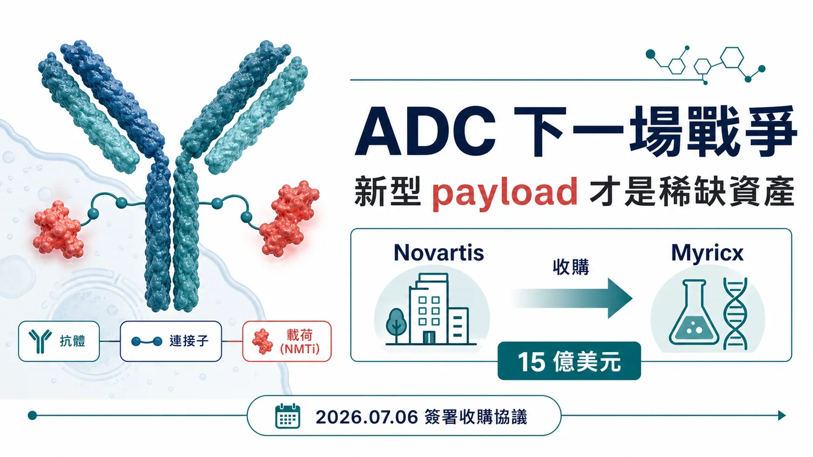
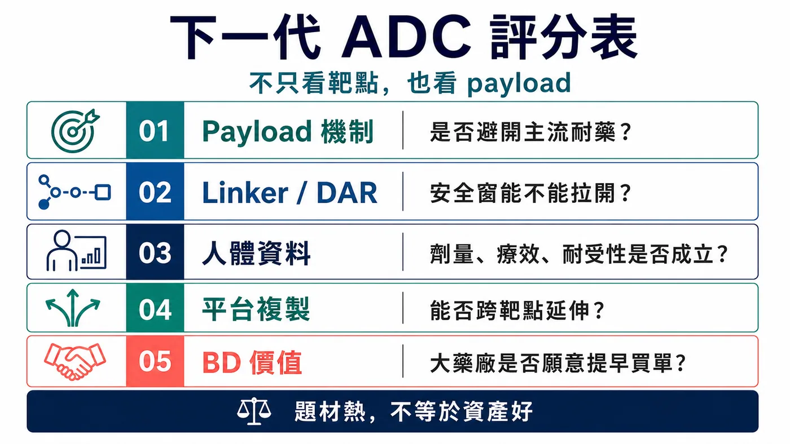
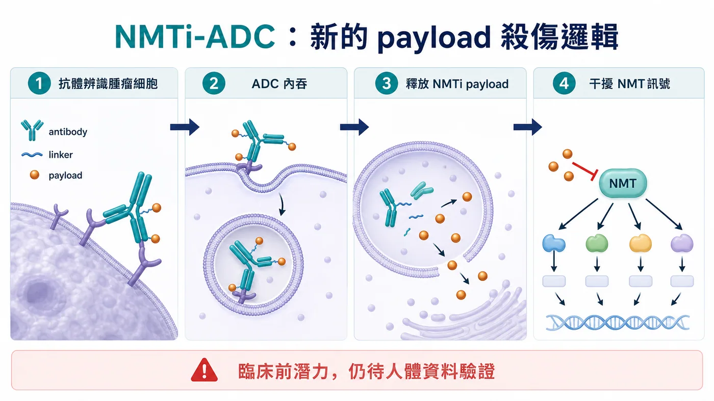
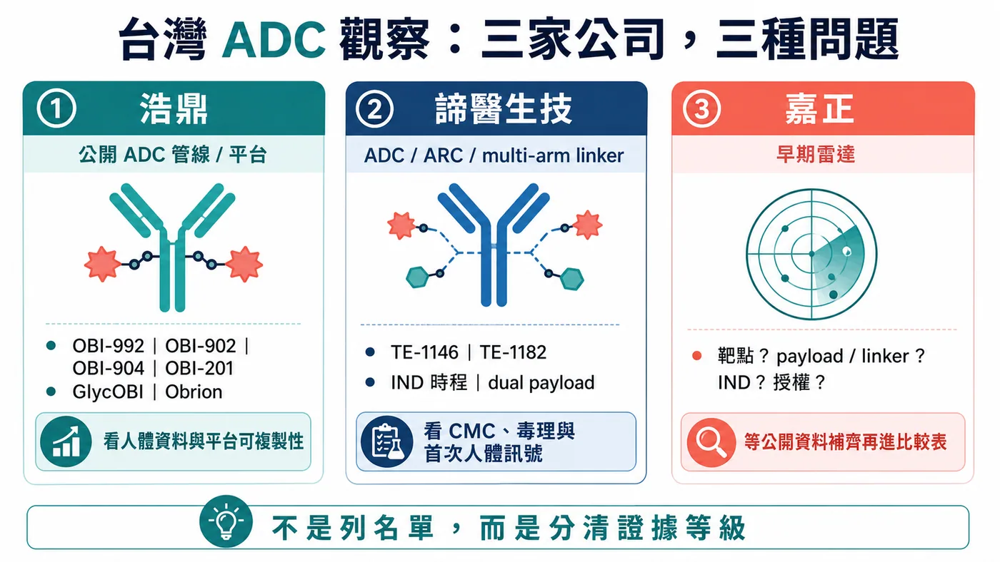

# ADC 下一場戰爭：諾華 15 億美元買 Myricx，真正搶的是新型 payload

ADC 賽道已經熱到有點擁擠。

HER2、TROP2、B7-H3、Nectin-4，熱門靶點被一輪又一輪公司追著做；Topo I payload、微管抑制劑、雙抗 ADC、雙 payload ADC，也被放進幾乎每一場腫瘤研發簡報。過去幾年，ADC 像是創新藥產業裡最亮的牌桌，資本、BD、臨床與大藥廠預算都往這裡聚。

可是牌桌越熱，真正稀缺的東西反而越清楚。

現在不缺「又一個 ADC」。市場缺的是能把療效、安全窗、耐藥問題重新打開的底層技術。

7 月 6 日，諾華宣布簽署協議收購英國生技公司 Myricx Bio。這筆交易最高可達 15 億美元，其中 11 億美元是 upfront，另外最高 4 億美元為潛在里程碑付款。交易預計在 2026 年下半年完成，仍需監管核准與慣例成交條件。

諾華這次沒有急著追熱鬧。它像是等到 ADC 競爭進入下一階段，才出手買一張新規則的門票。

藥時事團隊的判斷是：諾華買 Myricx，表面上拿到 B7-H3 與 HER2 兩條 lead assets，真正的戰略位置在新型 payload。ADC 的下一場戰爭，會從「靶點誰更熱門」推進到「載荷能不能換一種臨床語言」。誰能把耐藥、安全窗與可複製平台一起講清楚，誰才可能在下一輪 BD 裡被重新定價。

## 01｜ADC 的老問題：好靶點不等於好藥

ADC 常被形容成生物導彈：抗體負責找癌細胞，連接子負責控制釋放，payload 負責殺傷。

這個比喻很好懂，但也容易讓人忽略一件事：導彈打得準，不代表彈頭一定夠好。

現有 ADC 的痛點，大多最後都會繞回三個問題。

⚠️ 第一，安全窗不夠寬。Payload 太毒，劑量上不去；劑量上不去，腫瘤裡的有效殺傷濃度就受限。臨床上常見的減量、延遲給藥、停藥，都在提醒投資人：靶點打得準還不夠，彈頭撐不住，臨床仍會被劑量卡住。

🧬 第二，耐藥會慢慢出現。Topo I inhibitor、微管抑制劑這些主流 payload 已經證明有價值，但癌細胞不會站著挨打。靶點表現下降、藥物外排、DNA repair 改變、TOP1 相關耐藥，都可能讓療效變薄。

📌 第三，機制太集中。當大量公司用相似靶點、相似 payload、相似 linker 去打相似病人，市場最後會追問：你到底多解了哪一個臨床問題？

這也是 Myricx 會被諾華看上的原因。

它沒有拿一套更漂亮的簡報去說自己也是 ADC。它把戰場往 payload 底層移了一格。

## 02｜NMTi-ADC：諾華買的是一種新的殺傷邏輯

Myricx 的核心，是以 N-myristoyltransferase inhibitor, NMTi 作為 payload 的 ADC 平台。

NMT 是細胞內蛋白功能運作的重要酶，參與蛋白肉豆蔻醯化修飾。這些修飾會影響部分蛋白的定位、活性與訊號傳遞，而癌細胞的生長與存活，往往依賴這些細胞內機制。Myricx 的想法，是把 NMTi 做成 ADC payload，透過抗體把它送到腫瘤細胞，再干擾癌細胞賴以運作的關鍵程序。

真正值得注意的地方，在於它和主流 ADC payload 的作用邏輯不同。

如果 Topo I payload 像是在 DNA 複製與修復上施壓，微管抑制劑像是在細胞分裂機器上卡住齒輪，NMTi payload 想切的是另一組更上游、更不一樣的細胞功能依賴。這種機制差異，才是諾華願意花 11 億美元 upfront 的核心。

官方公告也把話說得很清楚：Myricx 的 NMTi payload 是為了處理現有 payload 類別的限制，臨床前資料顯示它可能對多種實體瘤有廣泛活性，包含 Topo I resistant models。

但這裡要踩住煞車。

目前最能確認的是臨床前潛力。NMTi-ADC 能不能真正把耐藥、安全窗、療效延伸變成臨床優勢，還要等人體數據回答。ADC 產業史上不缺漂亮的臨床前故事，真正難的是進到病人身上，還能同時保住療效和耐受性。

所以這筆交易的精彩之處，不在於 Myricx 已經證明一切。

精彩的是：諾華願意在人體資料尚未完全展開前，用大額 upfront 先卡住一個可能成為新 payload 類別的平台。

## 03｜諾華的 ADC 態度：等到差異化才下手

這筆交易放在諾華身上很有意思。

過去諾華追 ADC 的速度不算激進。當 ADC 交易滿天飛時，諾華沒有急著買一堆長相接近的資產。這一次它出手，反而更能看出選擇標準：ADC 三個字本身不夠值錢，差異化機制才值錢。

Myricx 讓諾華一次拿到三層東西。

📌 第一，是兩條 lead ADC assets。官方公告提到，Myricx 的兩個 lead assets 指向 B7-H3 與 HER2，兩個靶點都落在腫瘤 ADC 競爭密集、但臨床需求仍大的區域。

📌 第二，是 NMTi payload platform。這比單一產品更重要，因為 payload 若能成立，未來就可能接到更多抗體、更多靶點、更多實體瘤場景。

📌 第三，是 oncology platform 的延伸選擇權。諾華這幾年在放射配體療法、腫瘤標靶與平台型資產上都很重視可複製能力。Myricx 若成功，會變成諾華 ADC 版圖裡一個新的底層模組。

這也讓 ADC 的估值邏輯變得更尖銳。

以前市場看到 ADC，會先問靶點夠不夠熱門、腫瘤族群夠不夠大、早期數據有沒有 response。

下一輪會多問幾個問題：

📌 payload 是否真的和主流機制錯開？

📌 linker 和 payload 的安全窗能不能支撐足夠劑量？

📌 面對既有 ADC 失敗或耐藥病人，是否有合理的臨床位置？

📌 平台能不能從一條管線複製到多個靶點？

📌 大藥廠買下來之後，能不能放進既有腫瘤開發與商業化系統？

這些問題，比 ADC 題材本身重要太多。

## 04｜風險：payload 新，不代表臨床一定贏

新型 payload 很迷人，也很危險。

迷人的地方在於，它可能打開現有 ADC 解不了的病人族群。尤其當 Enhertu、Trodelvy、Padcev 這類產品逐漸把 ADC 推成標準治療的一部分，下一代資產如果能在耐藥、低表達、多癌種或聯用場景裡跑出數據，價值會非常大。

危險的地方也在這裡。

Payload 是 ADC 的殺傷核心，新的機制往往意味著新的不確定性。它可能帶來更好的腫瘤殺傷，也可能帶來未預期毒性；可能避開既有耐藥，也可能在人體暴露、組織分布、旁觀者效應、代謝與安全性上遇到新問題。

對 Myricx 來說，真正的考試至少有三道。

⚠️ 第一，NMTi payload 在人體裡是否真的能拉開治療窗。臨床前模型能看方向，但人體安全性才會決定劑量天花板。

⚠️ 第二，B7-H3 與 HER2 lead assets 是否能跑出足夠有說服力的早期臨床訊號。單靠靶點很難撐起一條 ADC，抗體、linker、payload、DAR、腫瘤表現與病人選擇都會一起決定結果。

⚠️ 第三，平台能不能被複製。單一 asset 成功很重要，但 15 億美元交易真正想買的是平台。如果 NMTi 只適用少數管線，價值會被打折；如果能跨靶點成立，估值邏輯就完全不同。

這也是這筆交易對整個 ADC 產業的提醒：下一代 ADC 光把名稱變複雜不夠，臨床問題要解得更清楚。

## 05｜台灣怎麼看：浩鼎、諦醫、嘉正，要問三種問題

放回台灣，這題先把兩件事分開：別把浩鼎當成唯一答案，也別把所有抗體公司塞進 ADC 名單。

這篇台灣段落，藥時事團隊收斂到三個名字：浩鼎、諦醫生技、嘉正。

浩鼎是最容易用公開資料核對的直接 ADC 公司。官方管線頁列出多條 ADC 相關管線，包括 TROP2-targeted ADC OBI-992、下一代 TROP2 ADC OBI-902、Nectin-4 ADC OBI-904，以及 TROP2 x HER2 bispecific ADC OBI-201。公司技術平台頁也說明 Obrion ADC technology platform，涵蓋 GlycOBI、HYPrOBI、ThiOBI、GlycOBI DUO 等 site-specific conjugation、linker 與 dual-payload 相關技術。

浩鼎這一格，不能停在「有 ADC」四個字。接下來要看 OBI-992、OBI-902 這類資產能不能交出人體安全性、初步療效、劑量與病人選擇資料；GlycOBI / Obrion 也要靠外部合作、後續管線與資料累積，證明平台可複製。

第二個名字，是諦醫生技。

這是這一輪台灣 ADC 名單裡最該補上的公司。免疫功坊官網 2025 年 11 月 7 日資訊提到，諦醫生技專注抗體藥物複合物 ADC 與抗體放射性核種複合物 ARC，核心是自主研發的 multi-arm linker 技術平台，搭配 mono- or dual-drug bundle 與模組化偶聯反應，目標是做出高 DAR、高產率、高純度、載藥彈性更大的新一代抗體偶聯藥物。

官方頁也列出兩條核心候選藥。

TE-1146 是抗 CD38 抗體 daratumumab 偶聯 Lenalidomide 的 ADC，適應症方向包括多發性骨髓瘤與相關疾病。該頁提到，TE-1146 在 2026 年上半年預計提交 IND，且未來在台灣、東南亞及紐澳地區商業化權利已以新台幣 2.7 億元授權予友華生技。

TE-1182 則是 HER2 腫瘤方向的 dual-payload ADC，設計目標放在 HER2 低表現或後線抗藥性場景，官方頁提到預計 2026 年第四季提交 IND。

諦醫放進這張地圖，意義很清楚：熟面孔之外，台灣 ADC 也開始出現 linker、dual payload、候選藥與區域授權組合在一起的早期創新案例。它現在最大的考題還在前面：IND 能否如期、CMC 與毒理能否支撐進臨床、第一個人體資料能不能把「平台故事」推進成「臨床可讀訊號」。

第三個名字，是嘉正。

嘉正先放進讀者雷達，但目前不把它寫成已確認 ADC 管線。這次重新查核後，藥時事團隊還沒有找到足以在正式公開稿引用的官方 ADC 管線頁、明確靶點、payload / linker、IND 節點或授權公告。這種公司可以提醒讀者追，但不能靠市場印象把它寫滿。

所以嘉正這一格，真正要追的是資料補齊：公司是否公開 ADC 產品、靶點與 payload 設計？是否有臨床前資料、專利、簡報、授權合作或臨床登錄？只要這些資料補上，它就能進入正式比較表；在那之前，放在早期雷達，比硬寫成結論更負責。

這三家公司剛好把台灣 ADC 的看法拉回正軌。

浩鼎，看公開管線與平台能不能交出資料。

諦醫，看早期 ADC 技術與候選藥能不能推進人體臨床。

嘉正，看公開資料能不能補到足以讓市場正式定價。

諾華買 Myricx 給台灣的提醒也在這裡：光列公司名稱，讀者看不到價值差異。ADC 要拆成技術、資料與合作三條線，才看得出哪家公司有機會把差異化技術、臨床資料、平台可複製性與外部合作接起來。

## 結語｜ADC 不缺下一個跟隨者，缺下一種答案

諾華 15 億美元收購 Myricx Bio，表面看是又一筆 ADC 交易。

但這筆交易真正照亮的，是 ADC 產業的下一個分水嶺。

第一波 ADC 熱潮，市場看的是靶點、response rate、適應症與大藥廠 BD。下一波競爭會更挑剔：payload 是否有新機制，安全窗是否夠寬，耐藥問題是否能被打開，平台是否能跨靶點複製。

ADC 的下一場戰爭，不會只比誰把抗體接得更漂亮。

它會比誰能把 payload 換成新的臨床語言。

Myricx 還沒有走完人體臨床考試，所以這筆交易不能被解讀成 NMTi-ADC 已經勝利。比較準確的說法是：諾華提前買下了一個可能改變 ADC payload 版圖的選擇權。

對全球生技產業來說，這代表 ADC 競爭正在從「跟上熱門賽道」進入「證明底層創新」。

對台灣投資人來說，問題可以問得更準：浩鼎能不能把平台和管線資料往前推，諦醫能不能把早期技術送進人體臨床，嘉正能不能補出足夠公開資料。誰的資料能被國際市場讀懂，誰才有機會解決 ADC 下一階段的痛點。

當賽道開始擁擠，平庸資產會被折價。

真正稀缺的，是能讓大藥廠願意提早買單的新答案。

## 參考資料

1. [Novartis｜Novartis agrees to acquire Myricx Bio, advancing next-generation antibody-drug conjugate innovation with a novel NMTi payload](https://www.novartis.com/news/media-releases/novartis-agrees-acquire-myricx-bio-advancing-next-generation-antibody-drug-conjugate-innovation-novel-nmti-payload-expanding-options-cancer-patients)
2. [OBI Pharma｜Pipeline Overview](https://www.obipharma.com/what-we-do/pipeline-overview/)
3. [OBI Pharma｜Obrion ADC Technology Platform](https://www.obipharma.com/what-we-do/technology-platform/)
4. [免疫功坊｜賀！諦醫生技入圍世界ADC獎，技術平台與產品獲國際肯定](https://immunwork.com/article_d.php?lang=tw&tb=4&id=1524)

## 免責聲明

本文為產業研究與市場觀察，不構成任何投資建議、買賣建議、醫療建議或個股推薦。生技醫藥投資涉及臨床試驗、法規審查、授權談判、商業化競爭、資本市場波動與公司營運風險，投資人應自行判斷並自負盈虧。

藥時事官網：https://drugnews.com.tw/
