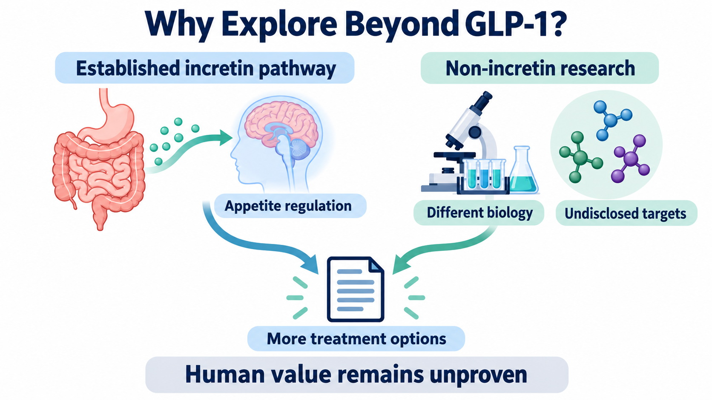

# Novo Nordisk Already Has Weight-Loss Injections. Why Pursue Another Path?
──────────

In September 2026, Novo Nordisk executive Jacob Petersen publicly stated that the company had signed an asset purchase agreement to acquire three non-incretin obesity development programs originating at Kallyope. The lead peptide candidate, K-554, was described as IND-ready, while the other two are earlier-stage small-molecule programs. The public post disclosed neither financial terms nor confirmation that the transaction had closed. [1]

Novo Nordisk already has weight-management medicines such as Wegovy, or semaglutide. Why look beyond GLP-1? The question behind this move is more specific than whether patients can lose a few additional kilograms: could a different entry point into appetite regulation produce a treatment that balances efficacy with tolerability, potentially alongside existing medicines? The company identified both monotherapy and combination use as development possibilities. [1][6]

For investors, the three programs expand the range of potential future products. Their value depends on whether the new biology can provide patients with something useful beyond existing therapy—not on treating an undisclosed new target as the next blockbuster before it has been tested.

*Figure 1 | Established incretin biology is shown alongside new non-incretin research options. Some targets remain undisclosed, and the clinical value of the new programs in humans remains to be established. [1][2]*

## 【01｜Eating Less and Eating Less Because of Discomfort Are Different Research Questions】

Appetite is not controlled by a single switch. The gut, brain and other organs exchange neural and circulating signals that influence when eating starts, how much is consumed and when it stops. A neural circuit can be understood as a network of cells that receives information, relays it and changes behavior. [3]

GLP-1, or glucagon-like peptide-1, is one of the incretin signals. Wegovy activates the GLP-1 receptor to influence appetite and caloric intake; these receptors are also present in brain regions involved in appetite regulation. Its effect cannot be reduced to “making people too nauseated to eat.” [6]

In its January 7 update, Kallyope said K-554 targets an undisclosed non-incretin peptide receptor involved in a feeding-regulation neural circuit, with biology distinct from GLP-1 and amylin pathways. The company’s non-aversive satiety hypothesis aims to produce satiety signals while reducing their coupling with aversion and discomfort. [2]

🧠 That distinction matters scientifically. Reduced food intake may reflect greater satiety, but it can also include avoidance driven by discomfort. A mouse study published in *Nature* in 2024 separately examined hindbrain GLP-1-receptor circuits involved in satiety and aversion, showing that the two are not identical. [7]

That was a separate animal study, however, and it did not identify K-554’s receptor. It supports testing the two responses separately, not a conclusion that K-554 already reduces nausea in humans. The product opportunity is whether appetite control can eventually be maintained at an effective dose while the burden of discomfort remains sufficiently low.

## 【02｜Three Programs Preserve Different Product-Format Options】

K-554 is designed as a once-weekly injection. Of the other two programs, one is a follow-on small molecule directed at a novel target; the other is a small-molecule receptor agonist in lead optimization, meaning that the properties of candidate compounds are still being refined. This remains some distance from a commercially usable product. [1][2]

From a product-planning perspective, the package preserves peptide and small-molecule options. Peptide potency, duration of action and injectable formulation need to be developed together. Small molecules must also address absorption, exposure and selectivity. Different routes of administration or use settings could serve different needs if subsequent data support them. Molecular class alone cannot determine which option will be cheaper or necessarily suitable for oral administration.

Three programs also do not represent three independent chances of success. Shared biological risks could affect several programs together. Whether different targets and modalities genuinely diversify that risk depends on their individual data. The public disclosures do not fully establish the relationships among the targets, so the two small molecules cannot be assumed to act at the same receptor as K-554. [1][2]

*Figure 2 | K-554 is a peptide designed for weekly injection. The other two programs are early-stage small molecules, one of which is in lead optimization. The three cannot collectively be described as products that have entered human development. [1][2]*

## 【03｜January’s Timeline Needs to Be Checked Against Later Evidence】

On January 7, Kallyope originally planned to initiate a first-in-human Phase 1 study around midyear and obtain early safety, pharmacokinetic and pharmacodynamic data from a single-ascending-dose study in the second half of 2026. Single-ascending-dose studies assess different single doses across successive cohorts. Pharmacokinetics, or PK, concerns concentrations and persistence in the body; pharmacodynamics, or PD, concerns the associated biological effects. [2]

The September post still described K-554 as IND-ready. This is a company description of submission preparedness, not a standardized regulatory approval category, and it does not independently establish that trial dosing has occurred. As of September 27, verifiable public information remains insufficient to confirm whether January’s plan was realized. Equally, failure to obtain an identifiable registry record does not establish that no filing, enrollment or dosing has occurred, or that the program has been delayed. [1][2][5]

The commercial significance of the next update is not simply moving a development-stage label one box forward. Initial human data need to place drug exposure, adverse reactions and exploratory efficacy together. If participants eat less, at what concentration does that happen? Does discomfort increase at the same time? These questions begin to establish whether a usable dose range exists.

Once-weekly administration is also a design objective. Supporting that interval requires evidence about duration of action, repeated dosing and variability between patients. Short-term reductions in food intake are insufficient to establish long-term weight maintenance, much less what happens after treatment stops.

*Figure 3 | IND-ready itself does not answer questions about regulatory progress, human development, safety and PK/PD, efficacy or longer follow-up. These evidence domains may develop in parallel; unconfirmed does not mean an event has not occurred. [1][2][5]*

## 【04｜Eight Years of Collaboration Do Not Automatically Create One Asset History】

The companies signed a gut–brain-axis research collaboration on June 19, 2018. Novo Nordisk could exercise licensing options on up to six products discovered through the collaboration. That was a ceiling on the rights available, not evidence that six medicines had succeeded. [3]

On September 10, 2024, Kallyope announced that Novo Nordisk had exercised an option on a ligand identified through the collaboration. A ligand is a molecule that binds to a biological target. Under that arrangement, Novo Nordisk assumed responsibility for further development, manufacturing and commercialization. [4]

The history matters because the platform collaboration did produce something selected for further development. But the announcement did not identify the 2024 ligand as K-554. Its progress or contractual terms cannot be transferred to the three programs in the latest agreement. The 2026 arrangement needs to establish value through its own asset data and subsequent development decisions.

## 【05｜Better Tolerability Could First Change Who Can Stay on Treatment】

The Drugnews team’s interpretation is that Novo Nordisk’s search for non-incretin pathways should be assessed through the number of patients who can obtain and remain on effective treatment. The existing Wegovy label includes gastrointestinal adverse reactions such as nausea and vomiting, as well as discontinuations because of adverse reactions. Treatment burden is therefore a practical product issue alongside efficacy. [6]

If K-554 eventually delivers meaningful efficacy while allowing some patients to remain on treatment more easily, it could have a monotherapy position of its own. A better-tolerability claim must nevertheless be established through an appropriate comparison. A low dose that feels more comfortable but provides insufficient efficacy does not automatically make a useful medicine.

Combination with an incretin is another scenario. If the pathways are complementary, a study could test additional efficacy or whether different dose combinations produce a better overall treatment profile. Different mechanisms do not guarantee additive benefit. Biological signals may overlap, while additional adverse reactions, administration burden and cost could offset the gain.

For Novo Nordisk, monotherapy could reach patients whose needs are not met by existing treatment, while combination use could extend the position of its GLP-1 products. Both would consume clinical and manufacturing resources. If the improvement is small, additional costs could materialize sooner than an additional useful treatment setting.

💼 Payers would need to compare the outcomes a new therapy adds with the additional expense. Physicians would need to know which patients are suitable, how to track benefit and how to manage discomfort. If an advantage appears only in a narrowly selected group of participants, the potential market would differ from a broad replacement for existing weight-management drugs.

Even if a later trial reports satisfactory average weight loss, it matters whether people who leave the study are handled appropriately in the analysis and how long improvement lasts. Looking only at the curves of treatment completers can overstate what people who start therapy actually gain. This affects both clinical adoption and the durability of revenue, making it worth addressing at the study-design stage.

Manufacturing and delivery must also keep pace. If the eventual product is a weekly injection, formulation stability, batch quality and continuous supply will contribute to cost. If the small-molecule programs create other administration options, their individual product data must support those uses. Undisclosed financial terms and payment structures also prevent investors from assessing how much Novo Nordisk is paying for these options.

*Figure 4 | Long-term efficacy, tolerability, persistence and positioning as monotherapy or combination treatment require corresponding human evidence. A hypothesis of less discomfort does not, by itself, establish a commercial advantage.*

The most discriminating next evidence will be K-554’s first readable human dose dataset: over the same observation period, which exposures produce appetite or efficacy signals, and where do nausea and other adverse effects occur? A sufficiently usable space between those responses would provide a reason to invest in longer-term studies.

This article provides industry information and business analysis and does not constitute individualized medical or investment advice.

## References

[1] [Jacob Petersen's public announcement](https://www.linkedin.com/posts/jacob-petersen-820529_im-excited-to-share-that-novo-nordisk-has-activity-7506720635704963073-rE3z/)

[2] [Kallyope 2026 strategic priorities, January 7, 2026](https://kallyope.com/kallyope-announces-2026-strategic-priorities-for-migraine-and-metabolism-portfolio-based-on-novel-neural-circuits-platform/)

[3] [Novo Nordisk–Kallyope research collaboration, June 19, 2018](https://www.globenewswire.com/news-release/2018/06/19/1600406/0/en/kallyope-and-novo-nordisk-announce-collaboration-to-discover-novel-therapeutics-for-obesity-and-diabetes.html)

[4] [Kallyope licensing announcement, Business Wire republication, September 10, 2024](https://markets.financialcontent.com/wral/article/bizwire-2024-9-10-kallyope-announces-license-agreement-with-novo-nordisk)

[5] [ClinicalTrials.gov K-554 search (no readable results obtained in this check)](https://clinicaltrials.gov/search?term=K-554&viewType=Card)

[6] [Wegovy U.S. prescribing information, revised June 2026](https://www.novo-pi.com/wegovy.pdf)

[7] [Nature: Dissociable hindbrain GLP1R circuits for satiety and aversion, July 10, 2024](https://www.nature.com/articles/s41586-024-07685-6)
