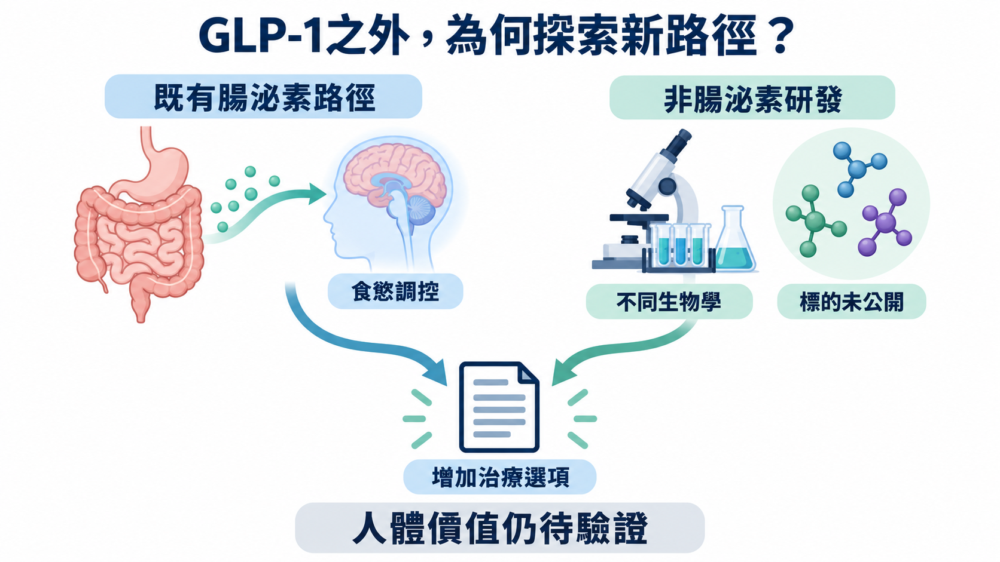
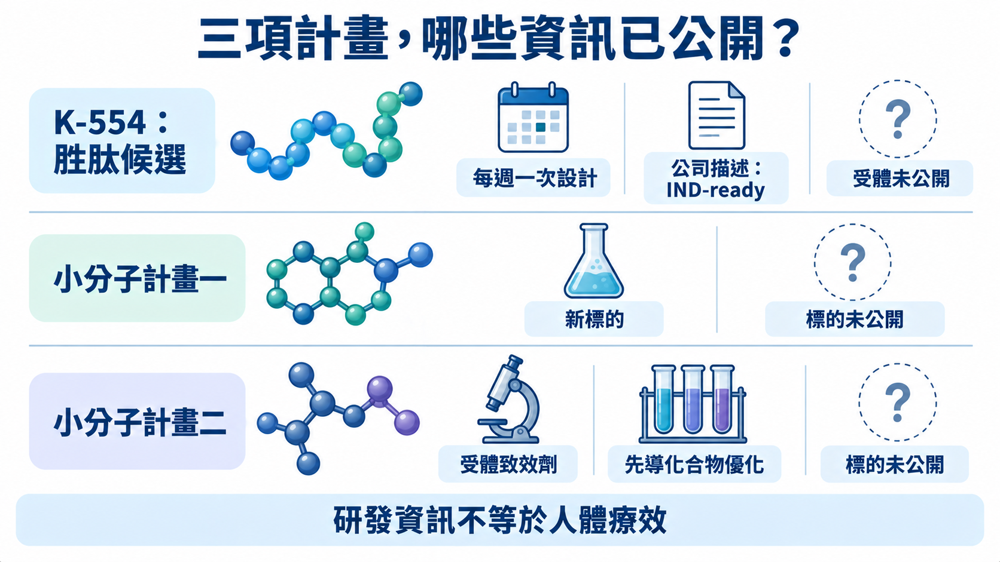
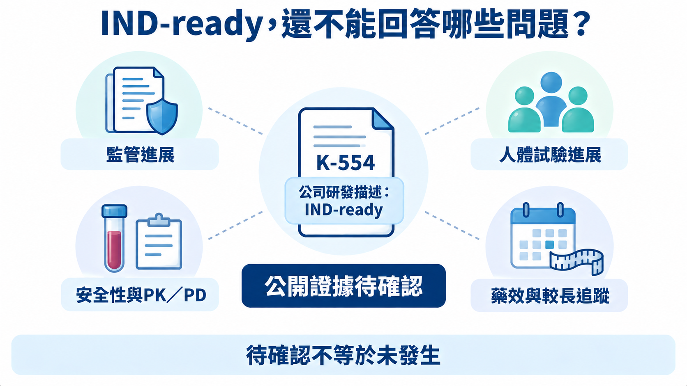
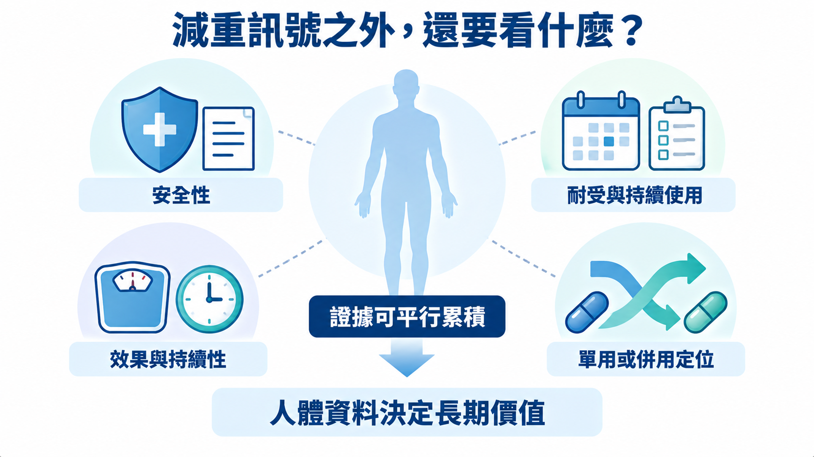

# 已有瘦瘦針，諾和諾德為何還要布局另一條減重路？
──────────

2026年9月，諾和諾德（Novo Nordisk）高管Jacob Petersen公開表示，公司已簽署資產購買協議，擬取得Kallyope發起的三項非腸泌素肥胖症研發計畫。領先胜肽候選K-554被描述為IND-ready，另兩項是更早期的小分子；公開貼文未披露金額，也沒有確認交割完成。[1]

諾和諾德已擁有Wegovy（semaglutide）這類減重藥，為何仍要走出GLP-1？這筆布局對準的問題，比「能不能再少幾公斤」更細：能否從不同的食慾調節入口，找到兼顧效果與耐受性的治療，甚至與既有藥物搭配？公司把單用與併用都列為研發方向。[1][6]

對投資人來說，三項計畫增加的是未來產品的選擇空間。其價值要看新的生物學能否讓患者得到既有療法以外的實際好處，而非靠「新標的」三個字，就把尚待驗證的計畫算成下一款重磅藥。

*圖1｜既有腸泌素生物學與新增非腸泌素研究選項並列；新計畫的部分標的未披露，人體價值仍待驗證。[1][2]*

【01｜少吃，與不舒服得吃不下，是兩個研究問題】

食慾並非由單一開關控制。腸道、腦部與其他器官透過神經和循環中的訊號交換資訊，影響何時開始進食、吃多少與何時停止。所謂神經迴路，可以理解成一組接收訊號、傳遞訊息，再改變行為的細胞網路。[3]

GLP-1是類升糖素胜肽-1，屬腸泌素訊號之一。Wegovy透過活化GLP-1受體影響食慾與熱量攝取；相關受體也存在於調節食慾的腦部區域。它的作用不能簡化成「讓人噁心，所以吃不下」。[6]

Kallyope在1月7日說明，K-554瞄準一個未公開的非腸泌素胜肽受體，涉及攝食調節神經迴路，生物學有別於GLP-1與胰澱素（amylin）路徑。公司所說的non-aversive satiety，是希望產生飽足訊號，同時減少與厭惡、不適感綁在一起的作用。[2]

🧠 這個區別有研究意義：同樣觀察到少吃，可能是飽足增加，也可能夾雜不舒服而避開食物。2024年《Nature》一項小鼠研究，已把後腦GLP-1受體相關的飽足與厭惡迴路分開研究，顯示兩者並非完全相同。[7]

但那是另一套動物研究，沒有識別K-554的受體。它支持的是「兩種反應值得分開測」，不是K-554已能在人類減少噁心。真正的產品機會，在於未來能否在有效劑量下保留食慾控制，同時讓不舒服的負擔足夠低。

【02｜三個計畫，保留不同產品形式的空間】

K-554採每週一次注射設計。其餘兩項，一項是針對新標的的後續小分子計畫；另一項是小分子受體致效劑，仍在先導化合物優化，也就是持續調整候選分子的性質。這個階段離可商業使用的產品還有相當距離。[1][2]

從產品規劃看，這份組合留下胜肽與小分子的選項。胜肽的效力、作用時間和注射製劑需要一起設計；小分子也得處理吸收、暴露與選擇性等問題。若後續資料支持不同的給藥方式或使用情境，才有機會服務不同需求，不能只按分子類型決定誰較便宜、誰一定適合口服。

三個計畫也不等於三次互不相關的成功機會。共同的生物學風險可能讓多個項目一起受影響；不同標的與形式是否真正分散風險，要看各自資料。公開內容沒有把所有標的關係交代完整，因此不能認定兩項小分子與K-554作用於同一受體。[1][2]

*圖2｜K-554為每週注射胜肽設計，另兩項為早期小分子，其中一項處於先導化合物優化；三項不能統稱已進入人體的產品。[1][2]*

【03｜1月的時程承諾，要用後來的文件核對】

Kallyope在1月7日原本規劃年中啟動首次人體第一期研究，並於下半年取得單次遞增劑量研究的早期安全性、PK與PD資料。單次遞增劑量是分批評估不同單次劑量；PK看體內濃度與停留時間，PD看伴隨的生物作用。[2]

9月公開貼文仍以IND-ready描述K-554。這是公司對申請準備程度的說法，並非統一的法規核准級別，也不能獨立證明試驗已給藥。截至9月27日，可核對的公開資料仍不足以確認1月的計畫是否實現；登錄查詢若未取得可辨識紀錄，同樣不能據此認定未申請、未收案或已延遲。[1][2][5]

對商業判斷而言，等待的重點不是把階段名稱往後挪一格。首次人體資料要把藥物暴露、不良反應與探索性藥效放在一起看：若吃得少了，究竟是在什麼濃度下發生？不舒服是否同時加重？這才開始回答可用劑量範圍是否存在。

每週一次也只是設計目標。要支持這個間隔，需要看到作用能維持多久、重複給藥後的表現，以及不同患者間的變異。短期吃得少，還不足以說明長期能維持體重，更不能回答停藥後的結果。

*圖3｜IND-ready本身未回答監管、人體進度、安全性與PK／PD、藥效及較長追蹤的問題；這些證據可並行累積，待確認不代表未發生。[1][2][5]*

【04｜八年的合作，不能直接變成同一個資產故事】

兩家公司在2018年6月19日就簽過腸腦軸研究合作。諾和諾德可對合作發現的最多六項產品行使授權選擇權；這是權利範圍上限，並非六款藥已被證明成功。[3]

2024年9月10日，Kallyope公告諾和諾德已對合作找到的一個配體行權。配體是能與生物標的結合的分子，該次安排把後續開發、製造與商業化責任交給諾和諾德。[4]

這段歷史的價值，在於平台合作確實曾產生被選中繼續開發的成果。但公告沒有把2024年配體指認為K-554，不能把前案的進度或條件接到這次三項計畫上。2026年的新協議，要靠自己的資產資料與後續安排建立價值。

【05｜耐受性若改善，先改變的可能是誰能留下來】

藥時事團隊的判讀是，諾和諾德尋找非腸泌素路徑，值得用「有多少患者能取得並持續接受有效治療」來評估。既有Wegovy標籤列有噁心、嘔吐等腸胃不良反應，也記錄因不良反應停藥；這說明療效之外，使用負擔是實際的產品問題。[6]

若K-554未來能提供有意義的效果，又讓部分患者更容易持續治療，單藥就可能有自己的位置。但耐受性較佳的主張，必須在適當比較下成立。低劑量比較舒服、卻無法產生足夠藥效，不會自動形成一款好產品。

另一個情境是與腸泌素併用。假設兩條路徑能互補，研究便可以測試是否增加效果，或以不同劑量組合達到較好的整體治療表現。兩個機制不同，並不保證效益相加；身體訊號可能重疊，額外不良反應、給藥負擔與成本也可能抵銷好處。

對諾和諾德，單藥可能接觸原本療法未能滿足的患者，併用則可能延伸既有GLP-1的產品位置。兩者都會占用臨床與製造資源；若改善幅度太小，新增成本就可能比新增用途更快出現。

💼 支付方真正會比較的，是新療法多帶來什麼結果，值不值得增加費用。醫師則需要知道適合哪一群患者、如何追蹤效果與處理不適。如果優勢只存在於挑選過的少數受試者，市場範圍就與廣泛替代現有減重藥的想像不同。

即使後續試驗的平均減重令人滿意，也還要看退出研究的人是否被妥善納入分析，以及改善能維持多久。只盯完成治療者的曲線，可能高估真正開始用藥的人能得到多少效益。這會同時影響臨床採用與收入持續性，值得在方案設計時就問清楚。

製造和交付同樣要跟上。若最後走每週注射，製劑穩定性、批次品質與持續供應會進入成本；若小分子形成其他給藥選項，則要由各自的產品驗證支持。公開金額與付款結構未明，也讓投資人暫時無法判斷諾和諾德為這些選項支付了多高代價。

*圖4｜長期效果、耐受性、持續使用與單用／併用定位，需由相應人體資料共同支持；較少不舒服的假說本身，還不能換算成商業優勢。*

接下來最有辨識力的，是K-554第一份可讀的人體劑量資料：在同樣追蹤期間，什麼暴露能帶出食慾或藥效訊號，噁心與其他不適又落在哪裡？若兩者能拉出足夠的可用空間，才值得繼續投入更長期研究。

本文提供產業資訊與商業分析，不構成個別化醫療或投資建議。

## 參考來源

[1] [Jacob Petersen原公開貼文](https://www.linkedin.com/posts/jacob-petersen-820529_im-excited-to-share-that-novo-nordisk-has-activity-7506720635704963073-rE3z/)

[2] [Kallyope 2026策略更新（2026-01-07）](https://kallyope.com/kallyope-announces-2026-strategic-priorities-for-migraine-and-metabolism-portfolio-based-on-novel-neural-circuits-platform/)

[3] [Novo／Kallyope研究合作公告（2018-06-19）](https://www.globenewswire.com/news-release/2018/06/19/1600406/0/en/kallyope-and-novo-nordisk-announce-collaboration-to-discover-novel-therapeutics-for-obesity-and-diabetes.html)

[4] [Kallyope授權公告，Business Wire轉載（2024-09-10）](https://markets.financialcontent.com/wral/article/bizwire-2024-9-10-kallyope-announces-license-agreement-with-novo-nordisk)

[5] [ClinicalTrials.gov：K-554查詢（本次未取得可讀結果）](https://clinicaltrials.gov/search?term=K-554&viewType=Card)

[6] [Wegovy美國處方資訊（Revised 06/2026）](https://www.novo-pi.com/wegovy.pdf)

[7] [Nature：Dissociable hindbrain GLP1R circuits for satiety and aversion（2024-07-10）](https://www.nature.com/articles/s41586-024-07685-6)
