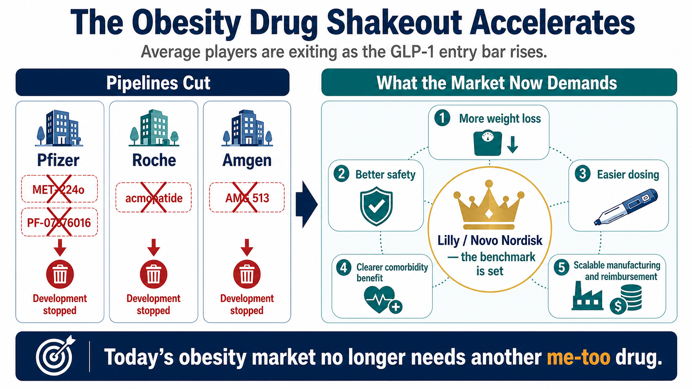
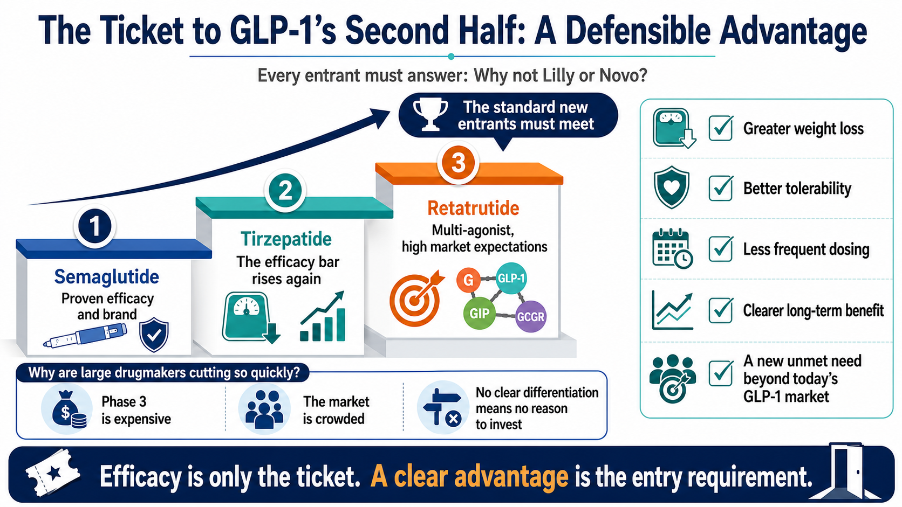
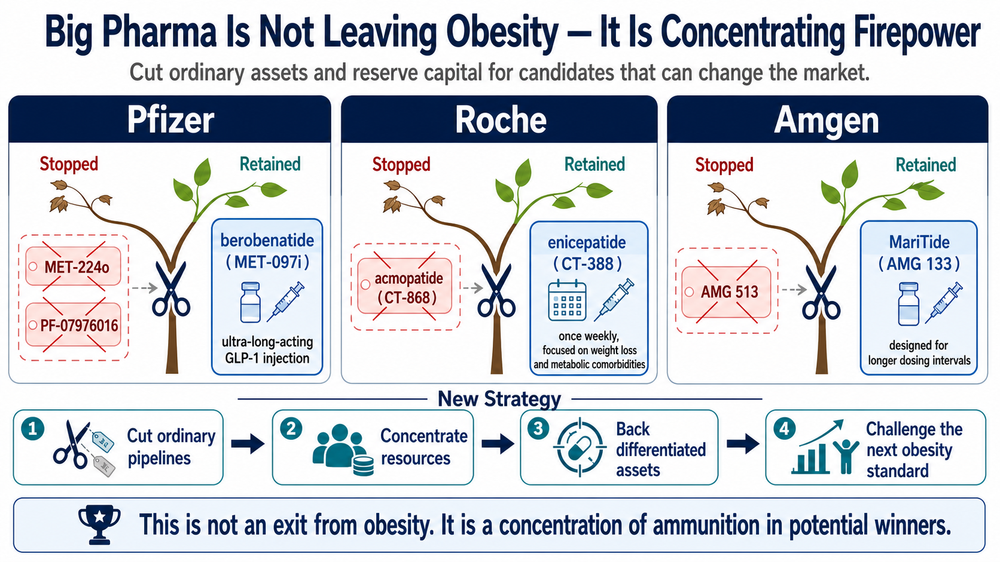
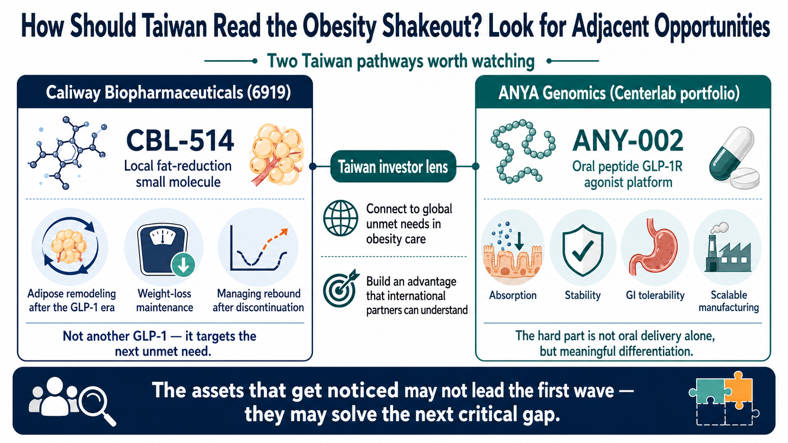

# Pfizer Paid Billions for Obesity Assets. Is It Already Cutting Its Losses?

------------------------------------------------

## Another Wave of Obesity Drugs Falls: Ordinary Players No Longer Have a Ticket to the GLP-1 Market

The obesity-drug shakeout is accelerating.

During the second-quarter 2026 earnings season, several obesity programs that had once carried substantial expectations were removed from Big Pharma pipelines.

The most visible example came from Pfizer. Multiple oral GLP-1 assets obtained through its expensive acquisition of Metsera were rapidly cleared out. Roche has also begun to prune parts of the obesity portfolio it acquired with Carmot Therapeutics. Amgen, meanwhile, has closed an early obesity program and concentrated its resources on the few core assets it believes can still break through.

On the surface, the explanations are familiar: the data were not good enough, tolerability was not clean enough, or internal priorities changed.

The deeper reason is that the competitive bar in obesity has been reset.

Tirzepatide and semaglutide have already established efficacy, reimbursement experience, physician familiarity and brand trust. The market no longer needs another weight-loss drug that is merely comparable.

Any late entrant now has to answer a brutal question: exactly where is it better than Eli Lilly and Novo Nordisk?

- Does it produce greater weight loss?
- Is it safer or easier to tolerate?
- Is dosing more convenient?
- Does it improve more obesity-related complications?
- Can it serve needs that current incretin therapies do not adequately cover?

If the answer is unclear, even a clinical-stage asset can be abandoned quickly. This round of pipeline cuts does not mean that large drugmakers have collectively lost confidence in obesity. It means they now accept that the market has moved beyond the era in which simply owning a GLP-1 program was enough to create a compelling story.

-----------------

## 01 | Pfizer: An Expensive Oral GLP-1 Portfolio, Cut Without Hesitation

Pfizer provides the most dramatic case.

It was among the earliest large pharmaceutical companies to pursue oral GLP-1 drugs. From lotiglipron to danuglipron, and later its acquisition of Metsera, Pfizer did not lack effort or ambition. Instead, it encountered several of the hardest problems in the field: liver toxicity, gastrointestinal tolerability, insufficient efficacy, dose design and an increasingly unforgiving comparison with powerful marketed products.

Pfizer announced its acquisition of Metsera in 2025 as a way to re-enter the obesity race through external business development. One of Metsera's most closely watched assets was MET-224o, an oral, ultra-long-acting GLP-1 receptor agonist. It was once regarded as a key component of Pfizer's effort to challenge Lilly and Novo Nordisk in oral obesity therapy.

By the second quarter of 2026, however, Pfizer had removed MET-224o from its pipeline update. The company also discontinued its internally developed PF-07976016.

Fierce Biotech reported that Pfizer terminated four programs in the quarterly clearout, including the Metsera-derived MET-224o and the GIP receptor candidate PF-07976016. The decision left much of the oral GLP-1 combination that had justified Pfizer's renewed obesity push effectively cleared away.

The irony is that Pfizer did not lack strategic imagination.

It had envisioned an obesity matrix spanning oral agents, monthly and quarterly dosing, and multiple mechanisms. It had also planned to combine a GIP receptor antagonist with a GLP-1 receptor agonist in an attempt to reproduce or surpass the synergistic logic behind tirzepatide. But a coherent portfolio narrative does not guarantee a clinical or commercial pass.

The removal of MET-224o shows that the threshold for oral GLP-1 development is higher than many investors assumed. An oral product must deliver more than convenience; it also has to solve exposure, dose, tolerability, manufacturability and competitive efficacy.

The discontinuation of PF-07976016 makes a related point. A GIP receptor antagonist combination without a clearly demonstrated efficacy increment can lose value if administration becomes more complicated and clinical acceptance remains uncertain.

Pfizer still wants to compete. The difference is that today's obesity market no longer allows a merely plausible asset to consume large amounts of capital indefinitely.

-----------------

## 02 | Roche and Amgen Are Pruning Too: No Advantage Is a Disadvantage

The same logic is visible at Roche and Amgen.

Roche's acquisition of Carmot Therapeutics was a major step into obesity. The transaction brought in several incretin-related assets, including enicepatide, formerly CT-388, and acmopatide, formerly CT-868.

Roche nevertheless moved quickly to prioritize. Acmopatide is a once-daily dual GLP-1/GIP receptor agonist. Although an earlier study in people with type 1 diabetes showed a signal of HbA1c improvement, Roche chose not to advance the program and redirected resources toward enicepatide. BioSpace reported that the company was prioritizing enicepatide across obesity, type 2 diabetes and cardiovascular outcomes.

Amgen has made a similar choice. Its second-quarter 2026 pipeline update confirmed that the company stopped developing the early obesity candidate AMG 513 while continuing to advance its lead obesity program, MariTide, or maridebart cafraglutide, also known as AMG 133.

These discontinued programs were not necessarily devoid of biological activity. The problem is that activity alone is no longer an entry ticket. New drugs must compete against products that are already marketed, scaling and familiar to prescribers.

Lilly's tirzepatide has pushed injectable weight loss to roughly 20% or more in major studies. Its next-generation candidate retatrutide, a triple GIP, GLP-1 and glucagon receptor agonist, produced an average 24.2% weight reduction at the 12 mg dose after 48 weeks in a Phase 2 trial.

Against that standard, an early candidate showing only 10% to 15% weight loss, without a decisive tolerability or convenience advantage, may not justify a Phase 3 program enrolling thousands of participants and requiring development spending at the billion-dollar scale.

The rule for the second half of the obesity race is straightforward: lacking an advantage is itself a disadvantage.

-----------------

## 03 | Why Are Large Drugmakers Cutting So Aggressively? Phase 3 Is Expensive and the Market Is Crowded

Obesity is not a small indication.

Once a program reaches Phase 3, the sponsor faces large sample sizes, long follow-up and development across multiple adjacent indications. Cardiovascular outcomes, obstructive sleep apnea, knee osteoarthritis, metabolic dysfunction-associated steatohepatitis and diabetes can all become part of the evidence and commercial battlefield.

This is not a game that can be completed with tens of millions of dollars. It is a billion-dollar competition.

The market is also moving from unconstrained expansion toward direct competition for patients, prescribers, reimbursement and supply. The practical questions are now harder:

- Which product will patients choose?
- Which one will physicians prescribe?
- Which therapy will insurers reimburse?
- Can the manufacturer's supply chain keep pace?
- Will long-term adherence hold?
- What happens to body weight after treatment stops?

Novo Nordisk and Lilly have already built moats in brand, manufacturing capacity, payer experience and clinical evidence. A later entrant therefore needs a clear point of differentiation on at least one important dimension.

That is why pipeline cuts at Pfizer, Roche and Amgen should not automatically be read as failure. Pruning can be evidence of strategic maturity.

In innovative drug development, failing quickly can be more valuable than keeping an uncompetitive program alive. A company that acknowledges insufficient differentiation early can redirect capital and talent toward assets with a genuine chance of changing the market.

-----------------

## 04 | Cutting Ordinary Assets Does Not Mean Abandoning Obesity

This cleanup does not signal a Big Pharma exit from obesity. It shows that companies are concentrating their resources on flagship assets.

Pfizer's leading obesity asset is now berobenatide, or MET-097i, an injectable ultra-long-acting GLP-1 receptor agonist. In June 2026, Pfizer reported Phase 2b VESPER-1 extension data showing an unadjusted mean weight reduction of 15.9% at the 2.4 mg dose after 32 weeks, with no apparent plateau. The company has also described plans for more than 20 studies across obesity and related comorbidities, including multiple Phase 3 trials.

Roche is placing its emphasis on enicepatide. In Phase 2 data released in 2026, the once-weekly subcutaneous drug produced a placebo-adjusted 22.5% weight reduction at 48 weeks in the highest 24 mg dose group. The effect had not reached a plateau, and the safety profile was reported as consistent with the drug class.

Amgen's lead bet is MariTide. Its differentiation is not simply another GLP-1 mechanism, but the possibility of substantially less frequent dosing. If monthly or even less frequent administration can preserve efficacy and tolerability in Phase 3, MariTide could appeal to patients who do not want weekly injections or who need a more convenient option after prior incretin treatment. Amgen continues to advance the program, with Phase 3 readouts expected in 2027.

The multinational companies are therefore concentrating, not retreating.

- An oral asset that is not good enough gets cut.
- An early mechanism without clear differentiation gets cut.
- A program whose adverse effects erode its efficacy proposition gets cut.

Capital is being reserved for products that could genuinely alter the competitive landscape.

-----------------

## 05 | The Taiwan Read-Through: Caliway and ANYA Approach the Market from Different Angles

The Taiwan comparison requires a clear boundary. No listed Taiwanese biotech company currently offers a direct equivalent to global-scale incretin assets such as tirzepatide, semaglutide or retatrutide. But several adjacent strategies are worth tracking.

The first is Caliway Biopharmaceuticals, listed under ticker 6919.

Caliway's CBL-514 is neither a GLP-1 therapy nor a systemic weight-loss drug. It is a small-molecule treatment being developed for large-area local fat reduction.

That makes its route distinct from the global GLP-1 battlefield, but potentially relevant to the next stage of obesity medicine. As patients lose weight on incretin therapies, body composition, regional fat, weight maintenance and post-treatment rebound can become additional treatment needs. In 2026, Caliway presented animal data at ECO and ADA involving CBL-514 in combination with GLP-1 receptor-based therapies. The company has framed the work around adipose-tissue remodeling and durability of weight reduction.

The second is ANYA Biopharm, ticker 7776, an investment within the Center Laboratories group.

ANYA is developing an oral peptide platform. Its ANY-002 is a GLP-1 receptor agonist, and public information from Center Laboratories says the product has been licensed to two international listed companies.

This approach matters because Pfizer's experience demonstrates why oral GLP-1 development is not simply a matter of converting an injectable product into a tablet. The hard problems include absorption, stability, dosing, gastrointestinal tolerability, cost and large-scale manufacturing.

An oral peptide platform will attract serious international interest only if it can demonstrate a meaningful advantage across those dimensions.

The clearest Taiwan read-through is therefore:

- Caliway represents the potential need for adipose-tissue remodeling and weight maintenance in the GLP-1 era.
- ANYA tests whether an oral peptide platform can overcome the technical barriers that have defeated multiple oral GLP-1 candidates.

Neither company sits in the front row of the global incretin contest, but both connect to changes now unfolding across obesity medicine.

-----------------

## Conclusion | Obesity Drugs Are Not Cooling Down. The Bar Is Rising

Another group of obesity candidates has fallen, but that does not mean the market is ending.

The opposite is true. Obesity drug development is entering a more demanding and more mature phase.

Early in the cycle, an association with GLP-1 was often enough for capital markets to assign strategic value. Now investors and drugmakers demand tangible differentiation.

An oral drug must prove that it is not merely convenient, but also effective, tolerable and manufacturable.

A long-acting injectable must show that lower dosing frequency can preserve both efficacy and tolerability.

A multi-target drug must demonstrate that adding mechanisms produces better clinical outcomes, rather than assuming that more targets are inherently better.

A non-incretin therapy must prove that it can address needs current GLP-1 drugs leave unresolved.

This pipeline cleanup is Big Pharma delivering an expensive message to the market: the obesity opportunity remains enormous, but there is no longer room for ordinary players.

The survivors will not be the companies with the most elaborate GLP-1 narrative. They will be the ones that can establish a clear advantage in efficacy, safety, convenience, tolerability, manufacturing cost or an unmet clinical need.

Every late entrant should answer one question before committing to pivotal development:

Why would physicians and patients choose this drug instead of a product from Lilly or Novo Nordisk?

-----------------

### References

1. [Fierce Biotech | Pfizer axes ex-Metsera obesity asset and GIPR prospect in quarterly clearout](https://www.fiercebiotech.com/biotech/pfizer-axes-ex-metsera-obesity-asset-and-gipr-prospect-quarterly-clearout)
2. [Pfizer | Robust Phase 2b efficacy and favorable tolerability support monthly dosing for berobenatide](https://www.pfizer.com/news/press-release/press-release-detail/robust-phase-2b-efficacy-and-favorable-tolerability-support)
3. [Reuters | Metsera shareholders vote for an acquisition by Pfizer valued at up to US$10 billion](https://www.investing.com/news/stock-market-news/metsera-shareholders-vote-for-10-billion-acquisition-by-pfizer-4355617)
4. [Reuters | What is Metsera, the target in Pfizer's and Novo Nordisk's bidding war?](https://finance.yahoo.com/news/factbox-metsera-target-pfizers-novo-170136393.html)
5. [Roche | Positive Phase 2 results for dual GLP-1/GIP receptor agonist CT-388](https://www.roche.com/media/releases/med-cor-2026-01-27)
6. [BioSpace | Roche cans one Carmot obesity asset as another shows best-in-class potential](https://www.biospace.com/business/roche-cans-one-carmot-obesity-asset-as-another-shows-best-in-class-potential)
7. [Amgen | Second-quarter 2026 financial results and pipeline update](https://www.amgen.com/newsroom/press-releases/2026/08/amgen-reports-second-quarter-2026-financial-results)
8. [Terns Pharmaceuticals | Topline Phase 2 data from TERN-601 in obesity](https://ir.ternspharma.com/news-releases/news-release-details/terns-pharmaceuticals-reports-topline-12-week-data-its-phase-2/)
9. [The New England Journal of Medicine | Retatrutide for Obesity](https://www.nejm.org/doi/full/10.1056/NEJMoa2301972)
10. [Caliway Biopharmaceuticals | CBL-514 in combination with GLP-1R-based therapies at ADA 2026](https://www.caliwaybiopharma.com/en/news-detail/U-S-OI25-IND-CBL-514-ADA/)
11. [Center Laboratories / ANYA Biopharm | ANY-002 oral GLP-1 receptor agonist](https://www.centerlab.com.tw/en/industrial/company/21)

Verification cut-off: 16 August 2026.

### Disclaimer

This article is provided solely for industry research and educational purposes. It does not constitute investment, medical, fundraising or securities advice.
