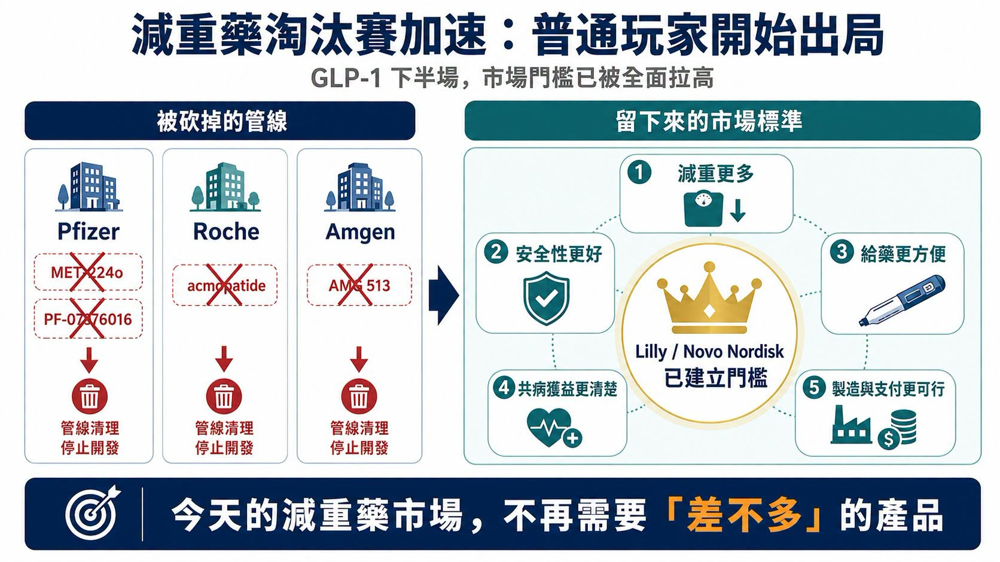
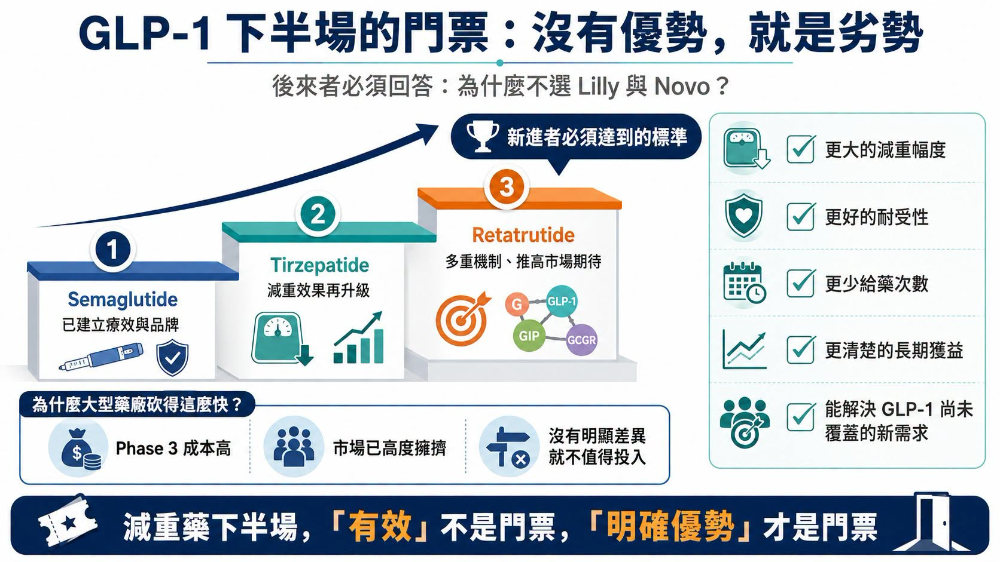
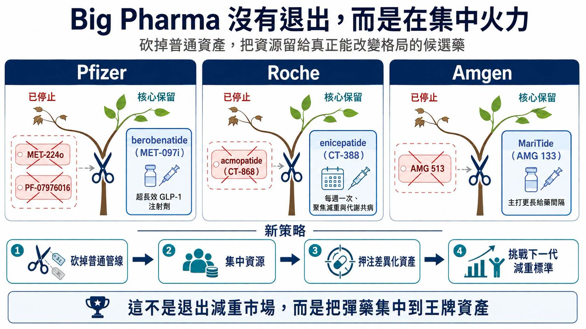
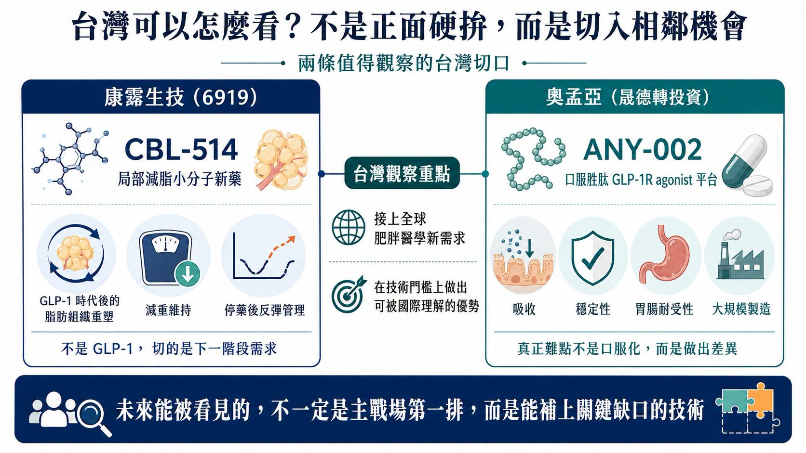

# 百億美元搶來的減肥藥，輝瑞冤大頭又丟掉了？

------------------------------------------------

【又一批減重藥倒下：GLP-1 的下半場，普通玩家已經沒有門票】

減重藥的淘汰賽，還在加速。

2026 年第二季財報季，一批原本被寄予厚望的 obesity 管線被大型藥廠直接砍掉。

最受矚目的，是 Pfizer 以高價收購 Metsera 後取得的多款口服 GLP-1 資產，快速被清理；Roche 從 Carmot Therapeutics 收進來的部分減重管線，也開始陸續退出；Amgen 則關閉早期減重候選藥，把火力集中到真正有機會突圍的核心資產。

表面上，這些項目被砍，是因為數據不夠好、安全性不夠漂亮、或內部優先順序改變。

但更深層的原因，是減重市場的門檻已經被徹底拉高。

當 tirzepatide 和 semaglutide 已經建立療效、支付、醫師使用經驗與品牌信任之後，市場不再需要一款「差不多」的減重藥。

後來者若想進場，必須回答一個非常殘酷的問題：你到底比 Lilly 和 Novo Nordisk 好在哪裡？

📌 是減重更多？

📌 安全性更好？

📌 給藥更方便？

📌 能改善更多併發症？

📌 還是能吃下 GLP-1 沒有覆蓋的新需求？

如果答案不清楚，就算已經進入臨床，也可能被快速放棄。這一輪管線調整，不是大型藥廠集體退縮，而是它們開始承認：減重藥市場已經不再是「誰有 GLP-1，誰就有故事」的時代。

-----------------

【01｜Pfizer：百億美元買來的口服 GLP-1，說砍就砍】

最戲劇化的，是 Pfizer。

Pfizer 曾是最早布局口服 GLP-1 的大型藥廠之一。從 lotiglipron 到 danuglipron，再到後來透過併購 Metsera 補強管線，它不是沒有努力過，而是一路踩到這個市場最難的幾個坑：肝毒性、胃腸耐受性、療效不足、劑量設計，以及和已上市強勢產品的差距。

2025 年，Pfizer 宣布收購 Metsera，希望透過外部 BD 重回肥胖症賽道。當時 Metsera 最受關注的資產之一，是口服、超長效 GLP-1 receptor agonist MET-224o。這款藥曾被視為 Pfizer 重新挑戰 Lilly 與 Novo Nordisk 口服減重市場的關鍵拼圖。但到了 2026 年第二季，Pfizer 在管線更新中移除 MET-224o，同時也砍掉自研的 PF-07976016。

Fierce Biotech 報導指出，Pfizer 這次一口氣終止四款管線，其中就包含來自 Metsera 的 MET-224o，以及 GIPR 相關候選藥 PF-07976016。這代表 Pfizer 重金押注的口服 GLP-1 組合幾乎被清空。

更諷刺的是，Pfizer 不是沒有想像力。

它曾試圖建立一套涵蓋口服、月度、季度、多機制的肥胖症矩陣；也曾規劃把 GIPR 拮抗劑與 GLP-1 receptor agonist 聯用，希望複製甚至超越 tirzepatide 的協同邏輯。但臨床市場不會因為故事完整就給通行證。

📌MET-224o 被砍，說明口服 GLP-1 的門檻比想像中更高。

📌PF-07976016 被停，也說明 GIPR 拮抗聯用若沒有明確療效增益，反而可能因給藥方式複雜、臨床接受度不明而失去價值。

Pfizer 不是不想贏，而是現在減重市場已經不允許「看起來有機會」的藥繼續大量燒錢。

-----------------

【02｜Roche、Amgen 也在清倉：無優勢，就是劣勢】

同樣的故事，也發生在 Roche 與 Amgen 身上。

📌 Roche 進入減重賽道的重要一步，是收購 Carmot Therapeutics。

這筆交易讓 Roche 拿到多款 incretin 相關資產，包括 enicepatide（CT-388）與 acmopatide（CT-868）。但 Roche 很快做出取捨。Acmopatide 是每日一次 GLP-1/GIP dual receptor agonist。即使先前在第 1 型糖尿病患者中看到 HbA1c 改善訊號，Roche 仍選擇停止後續開發，把資源轉向 enicepatide。BioSpace 報導指出，Roche 放棄 acmopatide，是為了優先推進 enicepatide 在減重、第二型糖尿病與心血管結局方向的開發。

📌Amgen 也在做同樣的事。

Reuters 報導，Amgen 在 2026 年第二季停止開發早期肥胖症候選藥 AMG 513，但仍持續推進其核心減重藥 MariTide（maridebart cafraglutide，AMG 133）。

這些管線不是完全無效。問題是，在今天的減重市場，「有效」已經不是門票。後來者要面對的是已上市、已放量、已被醫師熟悉的巨頭產品。

Lilly 的 tirzepatide 已經把注射型減重效果推到 20% 左右以上；下一代 retatrutide 作為 GIP／GLP-1／glucagon receptor triple agonist，在 Phase 2 研究中，12 mg 劑量 48 週平均減重達 24.2%。

在這種標準下，後來者若只有 10% 到 15% 的早期減重、或副作用與給藥便利性沒有明顯優勢，就很難說服公司投入數千人三期試驗與十億美元級開發成本。

✅ 減重藥下半場的規則很簡單：沒有優勢，就是劣勢。

-----------------

【03｜為什麼大型藥廠砍得這麼狠？因為 Phase 3 太貴，市場太擠】

減重藥不是小適應症。

一旦進入 Phase 3，就要面對巨大樣本數、長時間追蹤、多適應症布局、心血管結局、睡眠呼吸中止、膝骨關節炎、MASH、糖尿病等延伸戰場。

這不是幾千萬美元能玩完的遊戲，而是十億美元級競爭。更重要的是，減重市場已經進入存量競爭。早期大家想像的是一個無限擴張的藍海，但現在真正的問題變成：

✅患者會選誰？

✅醫師會開誰？

✅保險會給付誰？

✅藥廠供應鏈能不能撐住？

✅長期依從性好不好？

✅停藥後體重反彈怎麼辦？

當 Novo Nordisk 和 Lilly 已經建立品牌、產能、支付與臨床資料護城河，後進者要突圍，必須在某個維度形成清楚差異。

所以，Pfizer、Roche、Amgen 砍管線不是壞事。這反而是一種成熟。

📌 在創新藥開發裡，「快速失敗」有時比「拖著不死」更重要。

早點承認一款藥沒有足夠競爭力，把資金與團隊集中到真正有機會的資產上，才是大型藥廠能在高競爭市場活下來的方式。

-----------------

【04｜砍掉普通管線，不代表放棄減重市場】

這一輪管線清理，並不代表 Big Pharma 放棄減重，相反，它們正在把資源集中到王牌資產。

📌 Pfizer 現在最核心的減重資產，是 berobenatide（MET-097i），一款超長效 GLP-1 receptor agonist 注射劑。Pfizer 2026 年 6 月公布 Phase 2b VESPER-1 資料，表示 berobenatide 在 32 週延長研究中，2.4 mg 劑量未經安慰劑校正平均體重下降 15.9%，且仍未看到減重平台期；公司也規劃推進超過 20 項肥胖與相關共病試驗，包括多項 Phase 3。

📌 Roche 則押注 enicepatide（CT-388）。Roche 2026 年公布 Phase 2 資料顯示，enicepatide 每週一次皮下注射，在最高 24 mg 劑量組 48 週達到 22.5% 安慰劑校正體重下降，且未達減重平台期，安全性也與同類藥物一致。

📌Amgen 的核心，是 MariTide。MariTide 的差異化不在於「又一個 GLP-1」，而在於更長給藥間隔。若每月甚至更低頻給藥能在 Phase 3 證明療效與耐受性，它有機會切入那些不想每週打針、或已使用 GLP-1 但需要更便利方案的患者。Reuters 也指出，Amgen 仍在持續推進 MariTide，Phase 3 資料預計 2027 年讀出。

也就是說，MNC 不是退出，而是集中。

📌 口服藥不夠好，就砍。

📌 早期機制沒有差異，就砍。

📌 副作用拖累療效，就砍。

資源要留給真正能改變競爭格局的產品。

-----------------

【05｜台灣可以怎麼看？康霈、奧孟亞，各站在不同切口】

這個題目放回台灣，要先講清楚：台灣目前沒有直接對標 tirzepatide、semaglutide、retatrutide 這類全球級 incretin 藥物的上市櫃公司，但有幾個相鄰方向值得觀察。

📌 第一個是康霈生技（6919）。

康霈的 CBL-514 不是 GLP-1，也不是全身性減重藥，而是大範圍局部減脂小分子新藥。

這條路線和全球 GLP-1 戰場不同，但反而很貼近下一階段肥胖醫學的需求：當患者用 GLP-1 類藥物體重下降後，身體組成、局部脂肪、減重維持與停藥後反彈，會成為新的治療需求。康霈 2026 年曾在 ECO 與 ADA 發表 CBL-514 併用 GLP-1R 類藥物的動物數據，公司也表示該方向聚焦於脂肪組織重塑與減重持久性。

📌第二個是晟德集團轉投資的奧孟亞（7776)。

奧孟亞主打口服胜肽平台，其 ANY-002 為 GLP-1 receptor agonist，晟德公開資料也提到該產品已授權兩家國際上市公司。這條路線對台灣很重要，因為 Pfizer 的教訓剛好說明：口服 GLP-1 不是只要把注射劑變成口服就成功。

真正難的是吸收、穩定性、劑量、胃腸耐受性、成本與大規模製造。如果奧孟亞這類平台未來能證明在口服胜肽上有真正差異，才有機會被國際買方看見。

所以台灣段落最自然的連結是：

📌 康霈看 GLP-1 時代後的脂肪組織重塑與減重維持。

📌 奧孟亞看口服胜肽平台能否突破口服 GLP-1 的技術門檻。

這兩條都不是主戰場第一排，但都能接上全球肥胖醫學正在發生的變化。

-----------------

【結語｜減重藥沒有退燒，是門檻變高了】

又一批減重藥倒下，不代表減重市場結束。

恰好相反，這代表市場進入更殘酷、也更成熟的階段。

早期，只要碰到 GLP-1，資本就願意給想像。

現在，市場要的是實打實的差異化。

📌 口服藥要證明不只方便，還要有效、安全、可製造。

📌 長效注射要證明不只打得少，還要維持療效與耐受性。

📌 多靶點藥物要證明不是機制越多越好，而是臨床結果真的更好。

📌 非 incretin 類藥物則要證明自己能補上 GLP-1 沒有處理好的問題。

這輪管線清理，是大型藥廠用最昂貴的方式告訴市場：減重藥賽道還很大，但普通玩家已經沒位置。

未來能活下來的，不是 GLP-1 故事講得最完整的公司，而是能在療效、安全性、便利性、耐受性、製造成本或新需求上，真正拿出明確優勢的公司。

對後來者來說，開發前最好先問自己一句：

✅ 這款藥，究竟有哪一點能讓醫師和患者不選 Lilly、不選 Novo Nordisk，而選我？

-----------------

### 參考資料

1. [Fierce Biotech｜Pfizer axes ex-Metsera obesity asset and GIPR prospect in quarterly clearout](https://www.fiercebiotech.com/biotech/pfizer-axes-ex-metsera-obesity-asset-and-gipr-prospect-quarterly-clearout)
2. [Pfizer｜Robust Phase 2b Efficacy and Favorable Tolerability Support Monthly Dosing for Pfizer’s GLP-1 RA Berobenatide](https://www.pfizer.com/news/press-release/press-release-detail/robust-phase-2b-efficacy-and-favorable-tolerability-support)
3. [Reuters｜Metsera shareholders vote for up to $10 billion acquisition by Pfizer](https://www.investing.com/news/stock-market-news/metsera-shareholders-vote-for-10-billion-acquisition-by-pfizer-4355617)
4. [Reuters｜What is Metsera, the target in Pfizer’s and Novo Nordisk’s bidding war?](https://finance.yahoo.com/news/factbox-metsera-target-pfizers-novo-170136393.html)
5. [Roche｜Positive Phase II results for dual GLP-1/GIP receptor agonist CT-388](https://www.roche.com/media/releases/med-cor-2026-01-27)
6. [BioSpace｜Roche cans one Carmot obesity asset as another shows best-in-class potential](https://www.biospace.com/business/roche-cans-one-carmot-obesity-asset-as-another-shows-best-in-class-potential)
7. [Amgen｜Second-quarter 2026 financial results and pipeline update](https://www.amgen.com/newsroom/press-releases/2026/08/amgen-reports-second-quarter-2026-financial-results)
8. [Terns Pharmaceuticals｜Topline Phase 2 data from TERN-601 in obesity](https://ir.ternspharma.com/news-releases/news-release-details/terns-pharmaceuticals-reports-topline-12-week-data-its-phase-2/)
9. [The New England Journal of Medicine｜Retatrutide for Obesity](https://www.nejm.org/doi/full/10.1056/NEJMoa2301972)
10. [Caliway Biopharmaceuticals｜CBL-514 in combination with GLP-1R-based therapies at ADA 2026](https://www.caliwaybiopharma.com/en/news-detail/U-S-OI25-IND-CBL-514-ADA/)
11. [Centerlab / ANYA Biopharm｜ANY-002 oral GLP-1 receptor agonist](https://www.centerlab.com.tw/en/industrial/company/21)

查證截止：2026-08-16。

### 免責聲明

本文僅供產業研究與知識分享，不構成投資、醫療、募資或個股建議。
