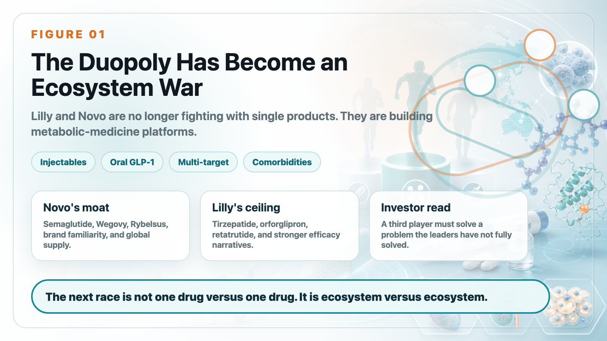
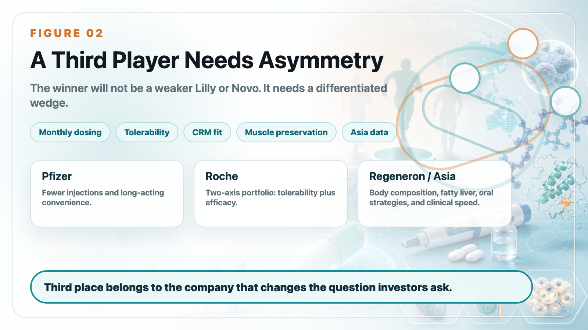
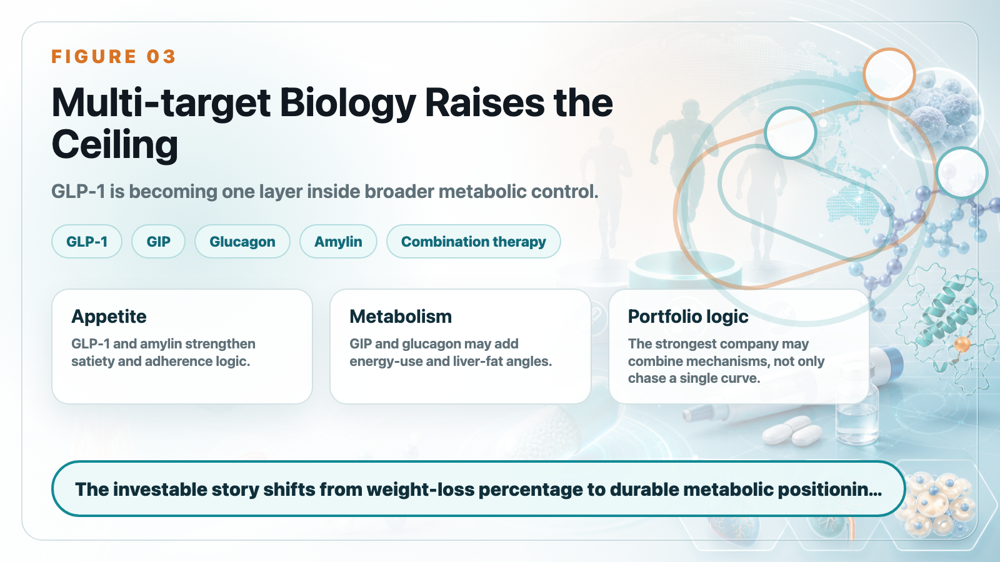
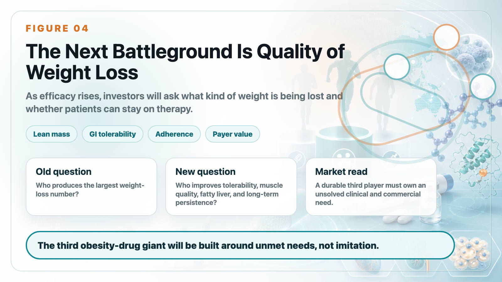

# The Race for the Third Obesity-Drug Giant: Who Comes After Lilly and Novo Nordisk?

This year's ADA, the American Diabetes Association's annual meeting, reignited the obesity-drug battlefield.

Five years ago, Novo Nordisk used the STEP program for semaglutide to move GLP-1 drugs from diabetes control into obesity treatment. Four years ago, Eli Lilly counterattacked with tirzepatide's SURMOUNT-1 data and forced the market to accept a new reality: weight-loss drugs were no longer limited to modest body-weight reduction. They could approach levels that previously belonged only to bariatric surgery.

The first round now has a clear answer: Lilly and Novo Nordisk have built a duopoly.

Mounjaro and Zepbound, both built around tirzepatide, have become Lilly's most powerful growth engine. In the first quarter of 2026, Mounjaro generated US$8.7 billion in sales, while Zepbound generated US$4.1 billion in U.S. sales. Together, they approached US$12.8 billion, which is almost the core reason Lilly has been re-rated by the market. Novo, meanwhile, continues to defend a vast incretin empire with Ozempic, Wegovy, Rybelsus, and Wegovy pill.

In late 2025, the U.S. FDA approved Wegovy pill, an oral semaglutide product for weight management. After its U.S. launch in January 2026, Novo reported roughly 1.3 million first-quarter prescriptions, with cumulative prescriptions exceeding 2 million since mid-April. That made it one of the strongest oral GLP-1 launches in U.S. history.

But the most interesting story is no longer only the battle between number one and number two. The better question is who can become number three.

In obesity medicine, third place is not a consolation prize. It could represent tens of billions of dollars in market-cap imagination and decide whether a pharmaceutical company can occupy a strategic position in cardio-renal-metabolic medicine for the next decade. Lilly and Novo are already too strong to copy directly. So the key question is not who can beat tirzepatide or semaglutide head-on.

The real question is: who can solve the problems the duopoly has not fully solved?

## 1. The Duopoly Is Moving Beyond Injections: Oral Drugs and Multi-Target Biology Are the Next Battlefield

The Lilly versus Novo battle is no longer a single-product contest. It has become a product-portfolio contest.

Novo's strength is the semaglutide franchise: brand recognition, physician familiarity, global supply infrastructure, and a complete extension from injection to oral formulation. Wegovy injection has already proven long-term weight loss, while Wegovy pill turns "no injection" into a new growth engine.

Lilly's strength is stronger efficacy and a deeper next-generation pipeline. Tirzepatide has already given Lilly a clear advantage in injectable obesity medicine. Orforglipron, Lilly's oral small-molecule GLP-1 receptor agonist, is designed to challenge Novo in oral therapy.

At this year's ADA, Lilly released Phase 3 ACHIEVE-3 head-to-head data comparing orforglipron with oral semaglutide. At 52 weeks, orforglipron 9 mg and 17.2 mg reduced HbA1c by 1.9% and 2.2%, compared with 1.1% and 1.4% for oral semaglutide 7 mg and 14 mg. At the highest-dose comparison, orforglipron delivered a 57.1% greater glucose-lowering effect and stronger weight reduction than oral semaglutide.

That is impressive data. It shows that Lilly is not absent from the oral GLP-1 race.

But oral therapy is not judged by efficacy alone. It also depends on tolerability, dosing restrictions, cost, manufacturing capacity, physician education, patient adherence, and brand inertia. Novo's ability to put Wegovy pill into the market first and quickly build prescription volume shows that the semaglutide franchise still carries enormous commercial momentum.

The asset that raises Lilly's ceiling again is retatrutide.

Retatrutide is a triple agonist targeting GIP, GLP-1, and glucagon receptors. That means it works through three metabolic pathways at once:

GLP-1 suppresses appetite and improves glucose control.

GIP may amplify incretin synergy.

Glucagon may increase energy expenditure and fat metabolism.

This is not simply adding another target. It is pushing obesity treatment toward more complete metabolic regulation. In the TRIUMPH-1 trial, retatrutide 9 mg and 12 mg produced average weight loss of 25.9% and 28.3% at 80 weeks. In severe obesity, the 12 mg group reached average weight loss of 30.3% at 104 weeks.

Those numbers approach the territory of bariatric surgery and keep Lilly at the front edge of obesity-treatment efficacy.

Novo is not only defending semaglutide. CagriSema, a fixed-dose combination of semaglutide and the long-acting amylin analog cagrilintide, represents another path. It does not try to mimic retatrutide's exact triple-agonist logic. Instead, it combines GLP-1 with the amylin pathway to strengthen satiety, appetite control, and body-weight reduction.

The duopoly has therefore moved beyond first-generation GLP-1 monotherapy into a second phase:

oralization,

multi-target biology,

fixed-dose combinations,

comorbidity expansion,

and broader cardio-renal-metabolic management.

This war is no longer about who can make one good drug. It is about who can build an entire metabolic-disease ecosystem.

## 2. The Third Player Cannot Be a Weaker Lilly or Novo

For challengers, the least realistic strategy is to build something that merely looks like semaglutide or tirzepatide. The duopoly's moat is too deep.

Lilly has Zepbound, Mounjaro, retatrutide, orforglipron, and more early-stage metabolic assets. Novo has Ozempic, Wegovy, Rybelsus, Wegovy pill, CagriSema, and the most complete global GLP-1 commercialization experience.

To become a real third player, a company must find an asymmetric advantage.

At ADA 2026, the strategies of major pharmaceutical companies started to diverge clearly:

Pfizer is betting on long-acting and potentially monthly injections.

Roche is betting on tolerability and a two-asset obesity portfolio.

AstraZeneca is betting on cardio-renal-metabolic integration.

Regeneron is betting on muscle preservation.

Asian and Chinese companies are using local clinical efficiency, oral strategies, and multi-target data to push themselves onto the international stage.

In other words, the third player will not be a weaker version of Lilly. It has to be a company that answers a different question.

## 3. Pfizer: Berobenatide and the Monthly-Injection Window

Pfizer's most important obesity card is berobenatide.

The asset came from Metsera, which Pfizer acquired through a high-value deal. The strategic purpose is clear: Pfizer wants to return to the main obesity-drug battlefield.

After setbacks in oral small-molecule GLP-1 development, Pfizer has shifted toward long-acting injections. Berobenatide's differentiation is not necessarily that it will beat tirzepatide or retatrutide on pure weight-loss magnitude. Its potential is that it could become a monthly product.

Weekly injections are already convenient. But if a drug can be administered once a month, some patients may see lower treatment burden and better long-term adherence. That is a clear commercial opening.

During ADA, Pfizer reported interim berobenatide data. In the VESPER-1 extension study, patients reached unadjusted average weight loss of 15.9% at 32 weeks, with no obvious plateau. VESPER-3 interim data also showed around 12.3% weight loss in non-diabetic obese patients, with tolerability similar to Wegovy.

That is good news for Pfizer, but it is not enough to crown Pfizer as the third player. The value of a monthly product depends on three things:

First, can weight loss approach mainstream high-efficacy GLP-1 and GIP-based therapies?

Second, can long-acting design truly improve tolerability or persistence?

Third, will patients accept a potentially slower but more convenient route for long-term treatment?

Pfizer's strategy is pragmatic. It may not need the highest weight-loss number. It needs to own the "fewer injections, easier long-term use" position. If Phase 3 data can prove that, Pfizer becomes an important candidate for the third pole.

## 4. Roche: Petrelintide for Tolerability, Enicepatide for Efficacy

Roche's strategy looks more like a two-line campaign.

One line is petrelintide, a long-acting amylin analog.

The other is enicepatide, a GLP-1/GIP dual agonist.

Petrelintide's story is not maximum weight loss. It is tolerability. Roche's Phase 2 ZUPREME-1 study showed that petrelintide produced up to 10.7% average weight loss at 42 weeks, compared with 1.7% for placebo. More importantly, at the maximum effective dose, there were no vomiting cases and no discontinuations due to gastrointestinal adverse events.

That matters because gastrointestinal side effects remain one of the biggest pain points in GLP-1 therapy. Many patients do not stop because the drug does not work. They stop because nausea, vomiting, constipation, diarrhea, appetite suppression, or general discomfort make long-term use difficult.

If petrelintide can offer a gentler, more tolerable, combination-friendly weight-management option, it does not need to become the strongest obesity drug. It may become an important component in future combination therapy.

Enicepatide is the other side of Roche's strategy. It is designed to push the efficacy ceiling. In Phase 2 data, enicepatide produced 22.7% average weight loss at 48 weeks, and more than one-quarter of high-dose patients achieved at least 30% weight loss, with no obvious plateau.

This gives Roche a more layered obesity portfolio:

Petrelintide emphasizes tolerability and combination potential.

Enicepatide emphasizes strong weight-loss efficacy.

If both lines advance, Roche will not be relying on one product to chase third place. It will be building its own obesity-product system.

## 5. AstraZeneca: Elecoglipron Is About the Cardio-Renal-Metabolic Matrix

AstraZeneca's path is different.

Its oral small-molecule GLP-1 drug, elecoglipron, does not have the most aggressive weight-loss profile. Publicly reported data suggest roughly 10% to 12% weight reduction. But the strategic point is not simply to maximize weight-loss percentage.

AstraZeneca's existing strength is in cardiovascular, renal, and metabolic disease. It already has drugs such as Farxiga, an SGLT2 inhibitor, and deep experience in chronic cardio-renal-metabolic management.

That means elecoglipron does not necessarily need to challenge Zepbound or Wegovy as a standalone obesity drug. Its value may come from being embedded inside AstraZeneca's broader cardio-renal-metabolic portfolio.

This is a smart strategy. If the next stage of obesity treatment shifts from "how much weight did the patient lose?" to "how much cardio-renal-metabolic risk was reduced?", AstraZeneca may be able to use combination therapy, chronic-disease management, and payer-facing outcomes data to build a differentiated position.

It may not be the company with the brightest weight-loss number. But it may become one of the companies that best understands obesity as part of cardio-renal-metabolic disease.

## 6. Regeneron: Solving What GLP-1 Does Not Solve - Muscle Loss

The stronger GLP-1 therapy becomes, the more another question matters: when patients lose weight, how much is fat and how much is muscle?

Part of total weight loss can come from lean-mass loss. That matters especially for older adults, people at risk of sarcopenia, and chronic-disease patients.

Regeneron's strategy is clear: do not compete directly with GLP-1 on weight-loss magnitude. Instead, improve the quality of weight loss by preserving muscle.

Its Phase 2 COURAGE study showed that with semaglutide alone, about 35% of weight loss came from lean-mass loss. Adding trevogrumab, an anti-myostatin/GDF8 antibody, with or without garetosmab, helped preserve lean mass while increasing fat loss. Later 26-week data suggested that trevogrumab could prevent roughly half of semaglutide-associated lean-mass loss.

This could become an important direction. As obesity drugs become more powerful, physicians and patients will ask more sophisticated questions:

Does the patient become weaker after weight loss?

Is muscle being lost?

Does metabolic rate decline?

Does weight regain become more likely after stopping therapy?

Can older patients use these drugs safely?

Regeneron's value is that it moves the conversation from body-weight number to body composition. It may not become the third-largest obesity-drug company in the traditional sense, but it could become a key supplier for next-generation obesity combination therapy.

## 7. China and Asia Are No Longer Just Followers

Another clear signal from ADA 2026 is that Chinese and Asian companies can no longer be ignored.

Mazdutide, developed by Innovent Biologics with early Lilly collaboration history, is a GLP-1/glucagon dual agonist. GLP-1 supports weight loss and glucose control, while glucagon activity may affect energy expenditure and liver-fat metabolism. In the GLORY-2 study, mazdutide 9 mg produced 18.55% average weight loss at week 60 in Chinese adults with moderate-to-severe obesity, compared with 3.02% for placebo. Forty-four percent of patients achieved at least 20% weight loss, and weight loss had not plateaued by week 60.

One important part of the mazdutide story is liver-fat improvement. Because glucagon-receptor activity may influence lipid metabolism and liver metabolism, mazdutide could form a differentiated position in obesity patients with fatty-liver comorbidity.

Ribupatide, also known as HRS9531 or KAI-9531, represents Hengrui and Kailera Therapeutics' GLP-1/GIP dual-agonist strategy. Public data show that oral ribupatide produced up to roughly 12.1% average weight loss at 26 weeks in a Phase 2 obesity study, with no plateau. Its injectable version is also moving into global Phase 3 development.

That combination is ambitious: not only injection, but also oral dual-agonist development. If oral GLP-1/GIP becomes viable, it could reshape the whole metabolic market.

Ecnoglutide is also worth watching. This cAMP-biased GLP-1 receptor agonist from Sciwind Biosciences has Pfizer commercialization rights in mainland China, with a deal value of up to US$495 million. Ecnoglutide has been approved in China for adult type 2 diabetes and long-term weight management.

More notably, interim Phase 2 head-to-head data comparing ecnoglutide with semaglutide showed 12.8% average weight loss at 20 weeks for ecnoglutide versus 9.5% for semaglutide. This is still a small, open-label, short-term interim dataset, so it cannot rewrite the global market on its own. But it is enough to make Novo Nordisk and global investors pay attention.

The message is clear: Chinese innovative drugs are no longer just local substitutes. They are starting to compete with global benchmarks using clinical data.

## Conclusion: The Next Obesity-Drug War Is Not About Finding Another Tirzepatide

For the past few years, the most important question in obesity medicine was: who can make patients lose the most weight?

That question is no longer enough. Lilly and Novo have pushed weight-loss efficacy extremely high, close to bariatric-surgery territory. A challenger that only tries to copy the same route will face a difficult fight.

The next competition will revolve around different questions:

Who can reduce injection burden?

Who can build a truly competitive oral product?

Who can improve tolerability?

Who can preserve muscle?

Who can improve fatty liver?

Who can integrate with cardio-renal-metabolic therapy?

Who can reduce rebound weight gain?

Who can help patients stay on therapy for years?

That is the real meaning of the third-place race. The third player is not the company most similar to Lilly or Novo. It is the company that finds a large unmet need outside the duopoly and turns it into a durable moat.

ADA 2026 shows that the obesity-drug story is far from over. It is simply moving from the first act, defined by weight-loss magnitude, into the second act: weight-loss quality, metabolic health, and long-term chronic-disease management.

The real competition is just beginning.

---

This article is for industry research and knowledge sharing only. It does not constitute investment, medical, fundraising, or individual stock advice.
