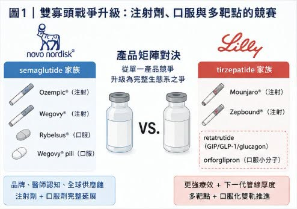
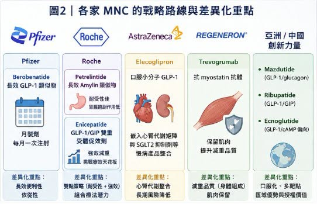
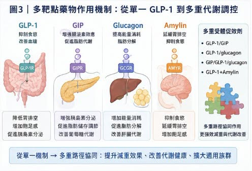
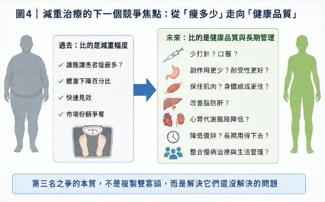

# 減重藥「第三名」爭奪戰：禮來 與 諾和諾德 之外，誰能成為下一個代謝巨頭？

今年 ADA，也就是美國糖尿病學會年會，減重藥戰場又一次被點燃。

五年前，Novo Nordisk 在這個舞台上公布 semaglutide（司美格魯肽）的 STEP 系列資料，正式把 GLP-1 類藥物從降血糖推向肥胖治療。四年前，Eli Lilly 用 tirzepatide（GLP-1／GIP 雙重受體促效劑）的 SURMOUNT-1 資料反攻，讓市場第一次意識到，減重藥不只可以做到 10% 以上，甚至可以逼近過去只有減重手術才做得到的區間。如今局面已經完全不同。

第一輪戰爭，答案很清楚：Lilly 與 Novo Nordisk 形成雙寡頭。

Mounjaro／Zepbound（tirzepatide）已經成為 Lilly 最強成長引擎。2026 年第一季，Mounjaro 銷售額達 87 億美元，Zepbound 美國銷售額達 41 億美元，兩者合計接近 128 億美元，幾乎就是 Lilly 這幾年市值重新定價的核心。Novo Nordisk 則靠 Ozempic／Wegovy／Rybelsus／Wegovy pill（semaglutide）守住龐大的腸泌素藥物帝國。

2025 年底，美國 FDA 核准 Wegovy pill（oral semaglutide，口服 semaglutide），這是第一個用於體重管理的口服 GLP-1 類藥物。2026 年 1 月正式在美國推出後，Novo 公布 Wegovy pill 第一季處方量約 130 萬張，4 月中旬以來累計已超過 200 萬張，成為美國 GLP-1 類藥物史上最強的口服上市啟動之一。

但真正精彩的，不只是第一名、第二名的王座之爭，更值得看的是「第三名」的戰爭。

因為在減重藥市場，第三名不是安慰獎。它可能代表數百億美元市值想像，也代表一家藥廠是否能在未來十年的心腎代謝市場擁有戰略卡位。Lilly 與 Novo 已經太強，後來者若想正面複製，很難。所以真正的問題不是：誰能打敗 tirzepatide 或 semaglutide？而是：

誰能找到雙寡頭沒有完全解決的缺口？

## 01｜雙寡頭戰爭升級：注射劑之外，口服與多靶點才是下一輪主戰場

Lilly 與 Novo 的競爭，早已不是一個產品打一個產品。

這場戰爭已經升級成產品矩陣對產品矩陣。

Novo 的優勢，是 semaglutide 家族的品牌、醫師認知、全球供應鏈，以及從注射劑到口服劑的完整延展。Wegovy injection 已經證明能長期減重，Wegovy pill 則把「不用打針」變成新的增長引擎。Lilly 的優勢，則是更強的療效與更厚的下一代管線。Tirzepatide 已經讓 Lilly 在注射型減重藥上取得明顯商業優勢；口服小分子 orforglipron（Foundayo，口服小分子 GLP-1 受體促效劑）則試圖在口服市場追上 Novo。

今年 ADA 上，Lilly 公布了 orforglipron 與口服 semaglutide 的頭對頭 Phase 3 ACHIEVE-3 研究資料。52 週時，orforglipron 9 mg 與 17.2 mg 分別讓糖化血色素下降 1.9% 與 2.2%，對照口服 semaglutide 7 mg 與 14 mg 的 1.1% 與 1.4%。在最高劑量比較中，orforglipron 的降糖幅度相對高出 57.1%，體重下降也比口服 semaglutide 更強。這組資料很漂亮，說明 Lilly 在口服 GLP-1 小分子上也不是沒有戰鬥力。

但口服戰爭不是只看療效。

它還看耐受性、服藥限制、成本、產能、醫師教育、患者依從性與品牌認知。Novo 先把 Wegovy pill 推上美國市場，並迅速形成處方量優勢，代表 semaglutide 這個老牌分子仍然有非常厚的商業慣性。

真正讓 Lilly 再次拉高天花板的，是 retatrutide。Retatrutide 是 GIP／GLP-1／glucagon 三重受體促效劑，也就是同時作用於三條代謝路徑：

GLP-1 負責抑制食慾與改善血糖。

GIP 可能放大腸泌素協同效果。

Glucagon 則可能提高能量消耗與脂肪代謝。

這不是單純多打一個靶點，而是把減重治療推向更完整的代謝調控。在 TRIUMPH-1 試驗中，retatrutide 9 mg 與 12 mg 劑量組在 80 週時平均減重分別達 25.9% 與 28.3%。重度肥胖族群延長至 104 週時，12 mg 組平均減重可達 30.3%。這個數字已經逼近減重手術級別，也讓 Lilly 繼續站在減重療效天花板的最前面。面對 Lilly 的多靶點壓力，Novo 也沒有只守 semaglutide。Novo 的 CagriSema，也就是 semaglutide 加上長效胰澱素類似物 cagrilintide 的複方製劑，正在走另一條路線。

它不追求和 retatrutide 完全同樣的三重受體邏輯，而是把 GLP-1 與 amylin，也就是胰澱素路徑結合，強化飽足感、食慾控制與體重下降。這意味著，雙寡頭已經從第一代 GLP-1 單藥戰，進入第二階段：

口服化。

多靶點。

複方製劑。

合併症延伸。

心腎代謝整體管理。

這場戰爭已經不是誰做出一款好藥，而是誰能建立一整個代謝疾病生態系。

## 02｜第三名之爭的本質：不是複製 Lilly 或 Novo，而是找到自己的戰略窗口

對追趕者來說，最不現實的策略，就是做一個「比較像 semaglutide」或「比較像 tirzepatide」的產品。因為雙寡頭的護城河太深。

Lilly 有 Zepbound、Mounjaro、retatrutide、orforglipron，還有更多早期代謝資產。

Novo 有 Ozempic、Wegovy、Rybelsus、Wegovy pill、CagriSema，以及全球最完整的 GLP-1 商業化經驗。

第三名若要成立，必須找到自己的非對稱優勢。

今年 ADA 上，各家 MNC，也就是跨國藥廠的路線開始分化，非常清楚。

Pfizer 押注長效與月製劑。

Roche 押注耐受性與雙資產矩陣。

AstraZeneca 押注心腎代謝整合。

Regeneron 押注肌肉保留。

亞洲與中國公司則用在地臨床效率、口服化與多靶點資料，快速把自己推上國際舞台。

換句話說，第三名不會是一個「比較弱的 Lilly」，第三名必須是一個能回答新問題的玩家。

## 03｜Pfizer：用 Berobenatide 搶月製劑窗口

Pfizer 這次最重要的牌，是 berobenatide。

它來自 Metsera，Pfizer 以高額交易買下 Metsera，背後目的很明確：重新回到肥胖藥物主戰場。

過去 Pfizer 在口服小分子 GLP-1 上遭遇挫折，現在轉向長效注射方向，用 berobenatide 來切入。Berobenatide 的差異化，不是說它一定比 tirzepatide 或 retatrutide 更能減重，而是它有機會做成月製劑。每週一次已經很方便，但如果能做到每月一次，對某些患者來說，依從性與生活干擾會更低，這是很清楚的商業切口。ADA 期間，Pfizer 公布了 berobenatide 的中期資料。VESPER-1 延伸研究中，受試者在 32 週時達到未經安慰劑校正的 15.9% 平均體重下降，且尚未看到平台期。另有 VESPER-3 中期資料顯示，berobenatide 在非糖尿病肥胖患者中可達約 12.3% 體重下降，耐受性與 Wegovy 類似。

這對 Pfizer 是好消息，但還不夠讓它穩坐第三名，因為月製劑的價值，要看三件事：

第一，減重幅度能不能接近主流強效 GLP-1／GIP 藥物。

第二，耐受性是否真的能因長效設計而改善。

第三，患者是否願意用「可能較慢、但較方便」的方式換取長期依從性。

Pfizer 的路線很務實。

它不一定要打出最高減重數字，而是要在「少打針、長期用得下去」這件事上搶位置。如果 Phase 3 能證明這點，Pfizer 就有機會成為第三極的重要候選人。

## 04｜Roche：一手 Petrelintide，一手 Enicepatide，走的是雙軸策略

Roche 的打法更像雙線作戰。

一條線是 petrelintide，長效 amylin 類似物。

另一條線是 enicepatide，GLP-1／GIP 雙重受體促效劑。

Petrelintide 的故事，不是追求最高減重，而是強調耐受性。Roche 公布的 Phase 2 ZUPREME-1 研究顯示，petrelintide 在 42 週時最高可達 10.7% 平均體重下降，安慰劑組為 1.7%。更重要的是，在最大有效劑量下，沒有出現嘔吐案例，也沒有因胃腸道不良事件而停藥。

這是非常值得注意的差異化。

GLP-1 類藥物最大痛點之一，就是胃腸道副作用。很多患者不是因為藥物沒效，而是因為噁心、嘔吐、便秘、腹瀉、食慾過低而停藥。如果 petrelintide 能提供溫和、耐受性好、可與其他藥物聯用的體重管理方案，它未必需要成為最強減重藥，也可能成為組合療法裡的重要拼圖。

Enicepatide 則負責打療效天花板。Roche 的 enicepatide 在 Phase 2 試驗中，48 週平均減重達 22.7%，超過四分之一高劑量受試者達到至少 30% 體重下降，且體重下降尚未見平台期。

讓 Roche 的代謝藥物布局變得很有層次。

Petrelintide 主打耐受性與組合潛力。

Enicepatide 主打強效減重。

如果兩條線都能推進，Roche 不是只靠單一產品搶第三名，而是建立自己的肥胖產品組合。

## 05｜AstraZeneca：Elecoglipron 不追最高減重，而是嵌入心腎代謝矩陣
AstraZeneca 的路徑比較特別。

它的口服小分子 GLP-1 藥物 elecoglipron，減重資料不是最激進。公開報導顯示，elecoglipron 在臨床資料中達到約 10% 到 12% 左右的體重下降幅度，但真正的戰略重點不是純粹拚減重天花板。AstraZeneca 的優勢本來就在心血管、腎臟與代謝疾病。它手上有 Farxiga（dapagliflozin，達格列淨）這類 SGLT2 抑制劑，也在心腎代謝慢病管理上布局很深。所以 elecoglipron 的價值，不一定是單藥挑戰 Zepbound 或 Wegovy，而是嵌入 AstraZeneca 既有心腎代謝產品矩陣。

這條路很聰明。

如果未來肥胖治療的主軸從「瘦多少」走向「心腎代謝風險降低多少」，AstraZeneca 反而有機會用組合療法、慢病管理與支付端資料建立自己的位置。它未必是減重數字最亮眼的第三名。但可能是最懂心腎代謝整合的競爭者。

## 06｜Regeneron：解決 GLP-1 做不到的事——肌肉流失
GLP-1 類藥物越強，另一個問題就越被放大：減掉的是脂肪，還是肌肉？

體重下降裡有一部分來自瘦體重流失，這在老年人、肌少症風險族群、慢病患者中尤其重要。

Regeneron 的策略非常清楚：不直接和 GLP-1 拚減重，而是用肌肉保留藥物改善減重品質。

其 Phase 2 COURAGE 研究顯示，semaglutide 單用時，大約 35% 的體重下降來自瘦體重流失。加入 trevogrumab，也就是抗 myostatin／GDF8 抗體，並搭配或不搭配 garetosmab，則能幫助保留瘦體重，同時增加脂肪減少。後續完整 26 週資料也顯示，trevogrumab 約可防止一半由 semaglutide 引起的瘦體重流失。這可能是未來非常重要的方向。因為當減重藥物變得越來越強，醫師與患者會開始問：

瘦下來後，體力是否變差？

肌肉是否流失？

代謝率是否下降？

停藥後是否更容易復胖？

高齡患者能否安全使用？

Regeneron 的價值，是把減重藥物從「體重數字」帶向「身體組成」。

這個方向不一定讓它成為傳統意義上的第三大減重藥公司，但很可能讓它成為下一代肥胖組合療法的關鍵供應者。

## 07｜中國創新力量上桌：不再只是跟隨者
今年 ADA 另一個明顯訊號，是中國藥企的資料越來越不能被忽略。

Mazdutide 是 Innovent Biologics 與 Eli Lilly 早期合作背景下推進的 GLP-1／glucagon 雙重受體促效劑。GLP-1 負責減重與控糖，glucagon 方向則可能帶來能量消耗與肝臟脂肪改善。GLORY-2 研究顯示，mazdutide 9 mg 在中國中重度肥胖成人中，第 60 週平均體重下降 18.55%，安慰劑組為 3.02%。44% 受試者達到至少 20% 體重下降，且體重下降到第 60 週仍未見平台期。

Mazdutide 的一個重要看點，是肝臟脂肪改善。由於 glucagon receptor 活性可能影響脂質代謝與肝臟代謝，它有機會在肥胖合併脂肪肝族群中形成差異化。

Ribupatide（HRS9531／KAI-9531）則代表 Hengrui 與 Kailera Therapeutics 的 GLP-1／GIP 雙重受體促效劑布局。公開資料顯示，口服 ribupatide 在 Phase 2 肥胖研究中，26 週平均體重下降最高約 12.1%，且沒有看到平台期。另有資料顯示其注射版本也在推進全球 Phase 3 開發。

這個組合很有企圖心。因為它不是只有注射版，也在往口服雙重受體促效劑推進。

如果口服 GLP-1／GIP 能成立，對整個代謝市場都會有很大意義。

Ecnoglutide 也值得注意。

這款 cAMP 偏向型 GLP-1 受體促效劑來自 Sciwind Biosciences，Pfizer 取得其在中國大陸的商業化權益，交易總額最高可達 4.95 億美元。Ecnoglutide 已於 2026 年在中國獲准用於成人第二型糖尿病，並已獲准用於長期體重管理。

更引人注目的是，ecnoglutide 與 semaglutide 的頭對頭二期中期分析顯示，20 週時 ecnoglutide 平均體重下降 12.8%，高於 semaglutide 的 9.5%。雖然這仍是小樣本、開放標籤、短期中期資料，還不能改寫全球格局，但它已經足以讓 Novo Nordisk 與國際市場認真看待這些來自亞洲的新分子。

這就是今年 ADA 最明顯的變化之一：

中國創新藥不再只是「本土替代」。它們開始在國際會議上拿資料說話，甚至直接挑戰全球標竿。

## 結語｜下一場減重藥戰爭，不是找下一個 Tirzepatide，而是解決它還沒解決的問題
過去幾年，減重藥市場最重要的問題是：誰能讓患者瘦最多？

現在，這個問題已經不夠了，Lilly 與 Novo 把減重幅度推到很高，甚至逼近減重手術級別。後來者若只想複製同樣路線，會非常辛苦。下一場競爭，會圍繞新的問題展開：

誰能少打針？

誰能口服？

誰能副作用更少？

誰能保住肌肉？

誰能改善脂肪肝？

誰能搭配心腎代謝用藥？

誰能降低復胖？

誰能讓患者長期用得下去？

這就是第三名之爭的真正本質，第三名不是誰比較像 Lilly 或 Novo。第三名是誰能在雙寡頭之外，找到一個足夠大的未滿足需求，並把它挖成自己的護城河。ADA 2026 告訴市場：減重藥的故事還沒有結束。

它只是從「減重幅度」的第一幕，走向「減重品質、代謝健康與長期管理」的第二幕。真正的勝負，才剛開始。

參考資料：

[1] Eli Lilly and Company｜Zepbound (tirzepatide) U.S. prescribing information: https://uspl.lilly.com/zepbound/zepbound.html#pi

[2] Novo Nordisk｜Wegovy U.S. prescribing information: https://www.novo-pi.com/wegovy.pdf

[3] Eli Lilly and Company｜Orforglipron phase 3 / oral GLP-1 investor information: https://investor.lilly.com/

[4] Pfizer｜Danuglipron and obesity pipeline investor information: https://www.pfizer.com/science/drug-product-pipeline

[5] Roche｜CT-388 / Carmot Therapeutics obesity pipeline investor information: https://www.roche.com/media/releases/med-cor-2026-03-05

---

本文僅供產業研究與知識分享，不構成投資、醫療、募資或個股建議。
