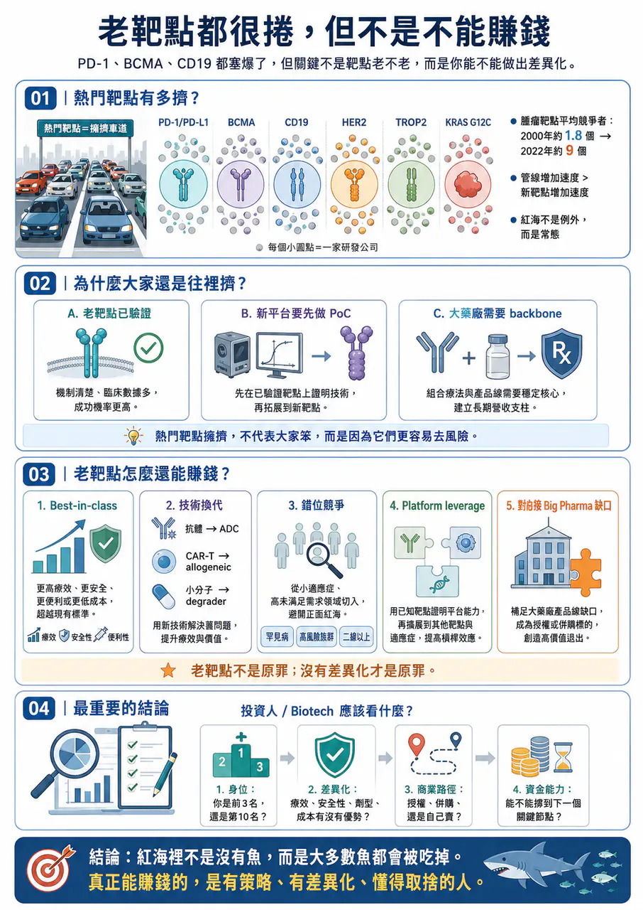
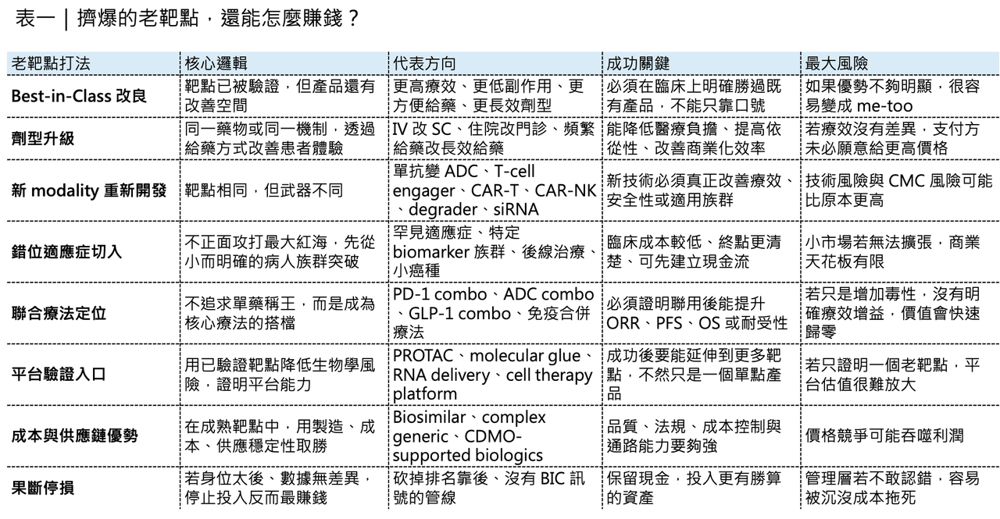

# 老靶點都很捲，但不是不能賺錢

## PD-1、BCMA、CD19 都塞爆了，但不是不能賺錢
創新藥產業有一個很殘酷的現象：大家都說要創新，但真正願意離開熱門靶點的人，其實沒有想像中多。

隨便翻一份全球管線報告，PD-1／PD-L1、BCMA、CD19、HER2、TROP2、EGFR、KRAS G12C 這些靶點後面，往往都排著一長串公司。

🎯大藥廠在做。

🎯Biotech 在做。

🎯新創公司也在做。

🎯平台公司更要拿它們當技術驗證入口。

所以問題來了：靶點已經這麼擠，後面進去的人，還有機會賺錢嗎？

答案不是簡單的有或沒有。更精準地說：靶點內捲不等於沒有價值，但如果沒有差異化、沒有定位、沒有商業策略，那就只是排隊送死。

## 01｜靶點到底有多捲？腫瘤是最典型的重災區
腫瘤領域，幾乎是靶點內捲最嚴重的地方。

2000 年左右，一個 腫瘤靶點 平均只有約 1.8 個項目在推進。到了 2022 年，這個數字已經飆到約 9 個。也就是說，二十多年來，一個腫瘤靶點背後的研發競爭者，增加了 5 倍以上。

更關鍵的是，腫瘤管線數量每年以約 7.6% 的速度成長，但真正的新機制、新靶點，每年只增加約 3.4%。

車子越來越多，路卻沒有變多，結果自然就是塞車。

🚦 PD-1／PD-L1 是最典型的例子。

Keytruda（pembrolizumab）、Opdivo（nivolumab）、Tecentriq（atezolizumab）、Imfinzi（durvalumab）、Libtayo（cemiplimab） 已經把主要市場吃下來，後面還有大量同類產品試圖靠價格、適應症、聯合療法或區域市場找生存空間。

🚦 BCMA 也是一樣。

Multiple myeloma 領域已經有 Abecma（idecabtagene vicleucel）、Carvykti（ciltacabtagene autoleucel）、Tecvayli（teclistamab）、Elrexfio（elranatamab） 等不同技術路線產品，後面還有更多 CAR-T、bispecific antibody、ADC、下一代細胞療法持續往裡擠。

🚦 CD19 更不用說。

Kymriah（tisagenlecleucel）、Yescarta（axicabtagene ciloleucel）、Breyanzi（lisocabtagene maraleucel）、Blincyto（blinatumomab） 已經讓 CD19 成為血液腫瘤最成熟、也最擁擠的靶點之一。

這些靶點不是不好，正因為它們太好，所以大家都來了。

## 02｜Big Pharma 其實比 Biotech 更愛擠熱門靶點
很多人以為靶點內捲是中小型 Biotech 的問題，其實不是，大型藥廠才是靶點擁擠的重要推手。

2000 年時，全球前十大藥廠管線裡，只有約 16% 集中在高度擁擠的靶點。到了 2020 年，這個比例已經上升到約 68%。也就是說，大藥廠不是不知道紅海很擠。它們是明知道很擠，還是要進去。原因很簡單：

🏢 對 Big Pharma 來說，熱門靶點不是只有「創新」問題，更是「戰略必要性」問題。

🏢 如果你是大型腫瘤藥廠，管線裡沒有 PD-1／PD-L1 backbone，很難做自己的聯合療法策略。

🏢 如果你是血液腫瘤公司，完全沒有 BCMA、CD19、CD20、CD3 bispecific 或細胞治療平台，很難在多發性骨髓瘤與 B-cell malignancy 裡維持話語權。

🏢 如果你是免疫疾病公司，看到 TL1A、OX40、CD40L、BTK、JAK、IL-17、IL-23、FcRn 等靶點升溫，也很難完全不布局。

大藥廠有時候不是為了做出最驚艷的單一產品。而是為了保留組合療法、生命週期管理、商業化談判與 franchise 防守能力。對它們來說，管線裡不能沒有這張牌。這也是為什麼紅海越來越紅。

🎯不是因為大家不知道風險，而是因為在某些戰場裡，缺席本身就是風險。

## 03｜罕見疾病也開始捲：有時候病人真的不夠用了
靶點內捲不只發生在腫瘤。

隨著 cell therapy、gene therapy、RNA medicine 與 gene editing 快速發展，很多單基因疾病也開始變得擁擠。這原本是一件好事，過去很多罕見疾病沒有治療選擇，現在終於看到 gene therapy、RNA therapy、ASO、siRNA、CRISPR-based therapy 帶來機會。但當太多公司同時衝進同一個罕見疾病，問題就出現了。有些單基因疾病，本來患者數量就有限。若每個疾病後面同時有 10 個以上臨床資產，臨床試驗收案就會變成瓶頸。例如 Duchenne muscular dystrophy（DMD）、β-thalassemia、sickle cell disease、hemophilia、retinal dystrophy 等疾病，都曾吸引大量 gene therapy 或 gene editing 公司布局。

但罕見病患者不是無限供應，符合入組條件的患者更少，有些患者已經接受過其他治療，有些不符合年齡或疾病階段，有些不願意承擔試驗風險，有些已經被競爭試驗收走，到最後，研發競爭不只是科學競爭，而是患者資源競爭，這在罕見病裡特別殘酷。

因為你可以募到錢，可以做出動物數據，可以找到 KOL，可以設計漂亮試驗，但如果收不到病人，所有規劃都會卡住，所以罕見病不是不捲，有時候比腫瘤更捲，差別只是捲的方式不同。

## 04｜為什麼大家還是要擠同一棵樹？因為新靶點太難，老靶點比較能去風險
既然靶點這麼擠，為什麼公司還是要往裡面跳？

🧩 第一，老靶點已經被驗證。

對藥物開發來說，最怕的不是競爭，而是靶點不成立。如果 target biology 不成立，後面所有努力都可能歸零。所以很多公司寧可選一個已經被驗證的靶點，再用新技術、新 modality、新適應症、新給藥方式去做差異化。

這就是為什麼 BCMA 會這麼擠。靶點很清楚，多發性骨髓瘤病人需求明確，臨床終點相對可評估，市場也已經被教育。於是大家開始用不同武器競爭：

🧬 CAR-T。

🧬 Bispecific antibody。

🧬 ADC。

🧬 下一代 CAR-T。

🧬 Allogeneic cell therapy。

🧬 T-cell engager。

🧬 Combination therapy。

靶點還是 BCMA，但武器一直換代。

🧩 第二，新技術需要老靶點當驗證場。

對 cell therapy、gene therapy、RNA delivery、protein degradation、bispecific platform 這些新技術來說，如果一開始就選一個全新靶點，失敗後很難判斷問題在哪裡。

🧬是平台不行？

🧬是靶點不行？

🧬是疾病選錯？

🧬是劑量不對？

🧬是 delivery 不足？

為了降低不確定性，很多平台公司會先選已驗證靶點做 proof-of-concept。這不一定是缺乏創新，而是開發策略。

🧩 第三，聯合療法需要自己的 backbone 骨幹療法。

在 immuno-oncology 裡，大藥廠常常不想依賴別人的 PD-1 或 PD-L1。如果自己的管線要做組合療法，最好自己手上也有 checkpoint inhibitor。即使它不是最強，也能作為內部聯合策略的基礎。這就是為什麼熱門靶點會被反覆開發。有時候不是因為市場缺一個新產品，而是公司需要一個戰略支點。

## 05｜真正的問題不是靶點太老，而是你有沒有差異化
老靶點不是原罪，沒有差異化才是原罪，同一個靶點可以有很多種命運。

🔍 第一種，是 pure me-too。

同樣機制、同樣劑型、同樣適應症、同樣病人族群、同樣療效，進度還排在很後面。

這種產品最危險。因為它沒有理由讓醫師換藥，也沒有理由讓支付方給好價格，更沒有理由讓 Big Pharma 高價買單。

🔍 第二種，是 best-in-class。

靶點雖然老，但產品在療效、安全性、便利性、給藥頻率、耐受性、特定族群、聯合療法或製造成本上有明顯優勢。這類產品仍然有機會。例如同樣是抗體，可以從 IV 改成 SC。同樣是細胞療法，可以縮短製造時間、降低 CRS／ICANS 風險、提高持久性，或做成 同種異體 （allogeneic）。同樣是 GLP-1，可以從注射走向口服，從單靶點走向 GLP-1／GIP、GLP-1／glucagon、amylin combination，或在肌肉保留、胃腸道耐受性上做差異化。

🔍第三種，是 indication expansion。

同樣靶點，不一定要去打最擁擠的一線大適應症。可以切入更精準、更未滿足、更容易建立臨床價值的小族群。有些公司不是靠搶最大市場起家，而是先拿下冷門、高價值、可快速驗證的適應症，再往外擴。這不是逃避競爭，這是錯位競爭。

🔍第四種，是 platform leverage。

公司做老靶點，不是為了這個靶點本身，而是為了證明平台能力，如果平台能在老靶點上做出更好的藥物屬性，再往新靶點延伸，市場會重新給它估值。所以真正要問的不是：「這個靶點是不是太老？」而是：你為什麼能在這個老靶點上贏？

## 06｜ 靶點很捲，但賺錢機會仍然存在
擁擠靶點不是不能賺錢，但賺錢方式變了。

過去，只要靶點新、機制漂亮、數據能看，就有機會拿到高估值。現在，在老靶點裡想賺錢，必須更精細。

💰第一種方式，是微創新。

微創新不是貶義詞。在醫藥產業裡，很多真正賺錢的產品，不是顛覆一切，而是把患者體驗、醫師使用、給藥便利性、安全性或製造效率改善到足以改變市場選擇。

🎯例如從靜脈注射變成皮下注射。

🎯從每週給藥變成每月給藥。

🎯從住院治療變成門診治療。

🎯從中心化製造變成更快交付。

🎯從嚴重副作用變成可管理副作用。

🎯從廣泛族群變成 biomarker-defined population。

這些不一定是最浪漫的創新，但非常商業化。

💰第二種方式，是技術換代。

同樣靶點，可以用不同 modality 重新做。

🎯抗體可以變 ADC。

🎯單抗可以變 bispecific antibody。

🎯CAR-T 可以變 CAR-NK。

🎯自體細胞療法可以變 allogeneic。

🎯小分子 inhibitor 可以變 degrader。

🎯siRNA 可以挑戰傳統抗體或口服藥做不到的組織與疾病。

靶點不變，但武器變了。

💰第三種方式，是錯位競爭。

不去一開始就攻打大藥廠重兵防守的主戰場，而是先切入更小、更清楚、更有未滿足需求的適應症。

🎯拿 orphan drug designation。

🎯拿 breakthrough therapy designation。

🎯做快速 proof-of-concept。

🎯先建立現金流與臨床信心，再逐步往大市場擴。

這是很多成功 biotech 走過的路。

💰第四種方式，是和大藥廠的 portfolio gap 對接。

有時候你的產品本身不是全球第一，但剛好補上某家 Big Pharma 的管線缺口。

🎯例如某家公司有 PD-1 backbone，但缺 ADC。

🎯有血液腫瘤 franchise，但缺下一代 BCMA。

🎯有肥胖藥，但缺肌肉保留方案。

🎯有自體免疫管線，但缺口服小分子。

BD 的價值不只來自科學，也來自買方需要。

## 07｜最反直覺的賺錢方式：果斷停損
在擁擠靶點裡，最成熟的策略之一，其實是砍管線。這聽起來很殘酷，但非常現實。如果一個產品在同靶點裡已經排在第五名、第十名之後，臨床進度慢，數據沒有明顯差異化，劑型也沒有優勢，商業化資源不足，那繼續投入不一定是堅持，可能只是沉沒成本。很多 biotech 不是死於沒有項目。而是死於不肯砍項目。每一條管線都想留，每一個靶點都覺得還有機會，每一次資料不好都說再補一組試驗。最後現金被耗光，公司被迫低價融資或賣身，真正成熟的公司，會定期問自己幾個問題：

🎯我們的身位在哪裡？

🎯同靶點競品有幾個？

🎯我們的療效是否有明顯優勢？

🎯安全性是否更好？

🎯給藥是否更方便？

🎯臨床路徑是否更快？

🎯Big Pharma 是否真的需要這個資產？

如果答案都不清楚，最好的策略可能不是繼續，而是停止，把現金流留給更有機會的地方，這不是放棄創新，這是尊重資本成本。

## 08｜🇹🇼 對台灣 biotech 來說，選靶點更要避免「看起來安全，其實最危險」
這件事對台灣生技公司很重要。

台灣公司資源有限，臨床資金有限，國際 BD 能見度有限，更不能隨便跳進最擁擠的靶點戰場。

如果一家公司選擇 PD-1、TROP2、HER2、BCMA、CD19、GLP-1、STAT6、TL1A 這類熱門方向，就必須說清楚：

✂️ 為什麼現在還值得做？

✂️ 你的差異化在哪裡？

✂️ 你是更有效、更安全、更方便，還是更便宜？

✂️ 你有沒有更好的適應症切入？

✂️ 有沒有特殊病人族群？

✂️ 有沒有國際合作方會需要？

✂️ 有沒有能力做完臨床？

如果沒有，熱門靶點不會降低風險，反而會放大商業風險，這也是為什麼台灣公司在國際市場裡，不一定要追最熱門靶點。有時候更好的方向，是找相對冷門但臨床需求清楚、競爭較少、資料可驗證、BD 可理解的適應症。

## 09｜投資人看靶點，不要只看熱度，要看身位與差異化
對投資人來說，熱門靶點很容易讓人興奮，因為市場大，競品成功案例多，大藥廠也願意買，但投資時，不能只看靶點熱不熱，更要看四件事。

📊 第一，身位。

這家公司是前三名，還是第十名？臨床進度差一年和差三年，在熱門靶點裡完全不是同一件事。

📊 第二，差異化。它是不是只是 me-too？

還是有劑型、療效、安全性、族群、適應症、成本或聯合療法優勢？

📊 第三，商業路徑。

這個產品如果成功，是自己賣、授權給 Big Pharma，還是被併購？買方為什麼需要它？

📊 第四，資金能力。

公司有沒有錢做完下一個關鍵節點？在擁擠靶點裡，最怕做到一半沒錢，最後連證明自己的機會都沒有。

所以，熱門靶點不是不能投，但要用更嚴格的標準投，因為紅海裡不是沒有魚，只是大多數魚都會被吃掉。

## 結語｜靶點內捲不是問題，沒有策略才是問題
創新藥產業從來不缺熱門靶點。

PD-1／PD-L1、BCMA、CD19、HER2、TROP2、KRAS、GLP-1、TL1A、STAT6、FcRn，每一輪都有自己的明星靶點，也都有自己的內捲時刻。但靶點擁擠本身不是原罪，真正的問題是，公司有沒有能力在擁擠裡找到自己的位置。

🧭 你可以做老靶點，但要有新武器。

🧭 你可以進紅海，但要有錯位戰場。

🧭 你可以跟隨，但要有明確 BIC 邏輯。

🧭 你可以做平台驗證，但要知道成功後怎麼延伸。

🧭 你也可以選擇不做，果斷把錢留給更值得的地方。

對 biotech 來說，靶點選擇不是科學問題而已，它也是商業問題、資本問題、BD 問題，甚至是生存問題。真正成熟的公司，不會只問：「這個靶點有多熱？」它會問：我們憑什麼在這裡贏？如果回答不出來，再熱門的靶點，也只是通往現金流枯竭的擁擠地鐵。
---------------
參考資料：各公司官網與公開資料。

本文僅供產業研究與知識分享，不構成投資、醫療、募資或個股建議。
