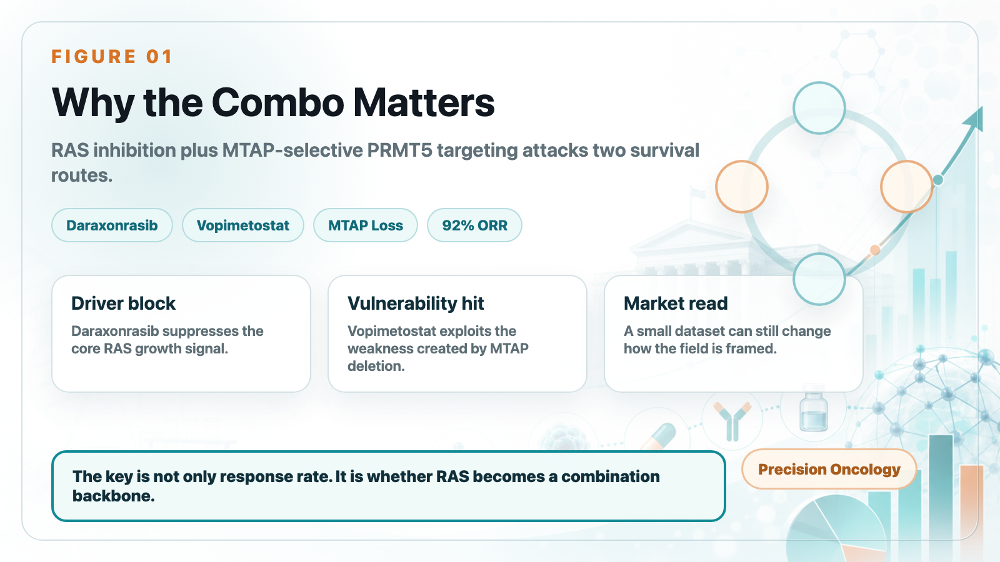
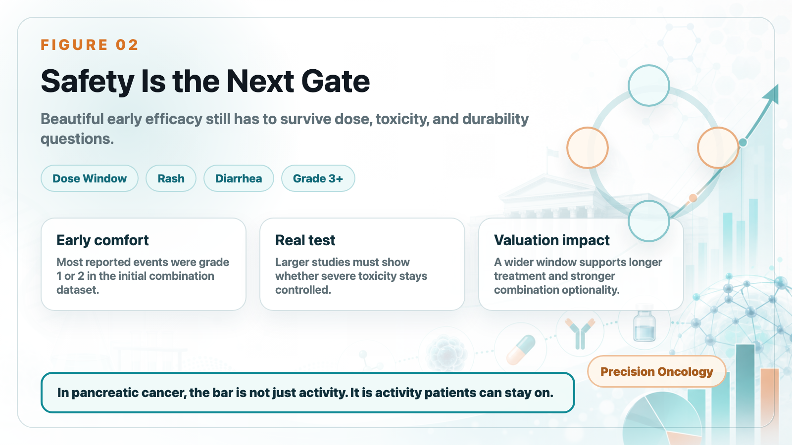
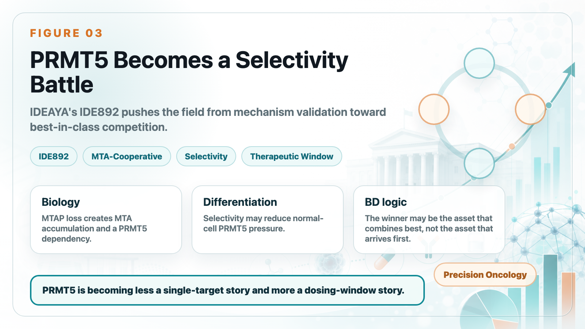
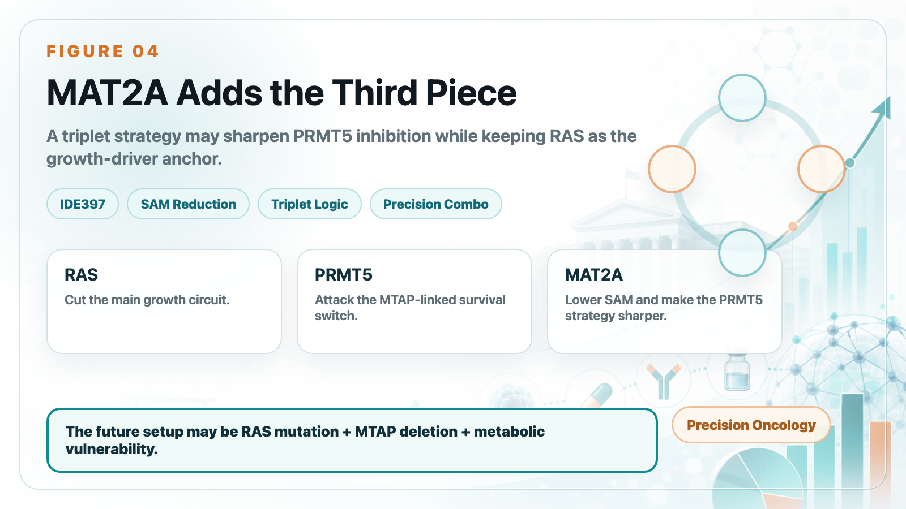

# Pancreatic Cancer Breakthrough: After RAS Inhibitors, PRMT5/MAT2A Combinations Open the Next Layer of Upside

Pancreatic cancer, often treated as one of oncology's hardest tumors, is entering an unusually dense period of therapeutic progress.

The first signal came from Revolution Medicines' daraxonrasib. In the RASolute-302 study, the RAS inhibitor nearly doubled overall survival in previously treated metastatic pancreatic ductal adenocarcinoma.

Median overall survival reached 13.2 months with daraxonrasib, compared with 6.6 to 6.7 months for chemotherapy.

For a tumor type that has lacked truly effective options for years, that is already enough to change how clinicians and investors think about the treatment path.

But the larger surprise came from the combination of Tango Therapeutics' vopimetostat and Revolution Medicines' daraxonrasib.

In early Phase 1/2 data for MTAP-deleted, RAS-mutant metastatic pancreatic cancer, the combination produced a striking signal:

12 evaluable patients.

92% objective response rate.

100% disease control rate.

90% six-month progression-free survival.

Median progression-free survival had not yet been reached.

This is still a small dataset, so it should not be overread as a definitive answer.

But it is strong enough to force a new question: the real value of RAS inhibitors may not be as standalone drugs, but as the backbone of pancreatic cancer combination therapy.

## 01｜Why Vopimetostat + Daraxonrasib Matters

Pancreatic cancer is difficult not only because it is often diagnosed late and progresses quickly, but also because KRAS mutations are extremely common and the tumor microenvironment is highly complex. Daraxonrasib has shown that RAS can be attacked. Yet cancer cells rarely depend on only one survival route.

Tango's angle is MTAP deletion.

MTAP deletion appears in roughly 10% to 15% of cancers and is especially relevant in pancreatic cancer. When MTAP is lost, tumor cells accumulate MTA, creating a metabolic vulnerability that makes them more sensitive to PRMT5 inhibition. Vopimetostat is designed to exploit that vulnerability through a synthetic-lethality strategy.

The logic is simple:

Daraxonrasib blocks the core RAS growth signal.

Vopimetostat attacks the metabolic weakness created by MTAP deletion.

One drug suppresses the main growth driver. The other cuts off a compensatory vulnerability. That is why the combination may deliver more than either mechanism alone.

The data show the difference clearly. Daraxonrasib alone already looked meaningful in RASolute-302, but its objective response rate was around 33%, and its six-month progression-free survival rate was about 58.7%. Vopimetostat also has single-agent activity in MTAP-deleted pancreatic cancer, but not at the level seen in combination.

When vopimetostat was combined with daraxonrasib, the early response rate jumped to 92%. That is the reason the market paid attention.

Another important point: these were not ideal, easy-to-treat patients. The dataset included second-line and third-line patients, and many had liver metastases. In other words, the signal did not appear only in a highly favorable population. It appeared in a clinically difficult setting.

## 02｜Safety Is the Next Gate

The second encouraging point is tolerability. Tango reported that most adverse events in the combination were grade 1 or 2, with common events including rash, stomatitis or mucositis, and diarrhea. The early safety profile appears supportive of further development.

That matters because daraxonrasib is not toxicity-free. Higher-dose RAS inhibition can bring rash, diarrhea, stomatitis, and fatigue. Adding another targeted agent can easily narrow the therapeutic window.

The current combination uses a daraxonrasib dose below some monotherapy or chemotherapy-combination settings. That may reflect a deliberate attempt to balance efficacy and tolerability.

That is not a negative. But it raises several questions that the next datasets must answer:

Is lower-dose daraxonrasib enough to maintain long-term RAS suppression in the combination setting?

Can vopimetostat reduce, shift, or better distribute the toxicity burden of RAS inhibition?

Will grade 3 or higher adverse events rise as the sample size grows?

Small early datasets can look beautiful. In pancreatic cancer, the real test is still a larger, cleaner, controlled study.

## 03｜IDEAYA Enters the Race: PRMT5 Becomes a Selectivity Battle

Tango's data put the PRMT5-MTA field into the spotlight, but competitors are moving quickly too.

IDEAYA's IDE892 is also an MTA-cooperative PRMT5 inhibitor for MTAP-deleted tumors. The company positions it as a potential best-in-class asset and has begun Phase 1/2 combination studies, including combinations with MAT2A inhibition and pan-RAS inhibition.

IDEAYA's logic is interesting.

In MTAP-deleted tumor cells, MTA accumulates. In normal cells, SAM is more abundant. Vopimetostat is designed to exploit the special PRMT5 state created by MTA, but the market still worries that at higher concentrations, a PRMT5 inhibitor could affect normal-cell PRMT5 and limit the dosing window through hematologic toxicity.

IDE892 is positioned around greater selectivity. It is designed not only to prefer the MTA-bound PRMT5 state, but also to bind more slowly in SAM-rich normal-cell environments. In effect, the aim is to avoid normal-cell PRMT5 more actively.

That is the biological basis for IDEAYA's potential best-in-class argument.

If that selectivity translates clinically, IDE892 could have a wider therapeutic window and may be better suited for doublet or triplet combinations.

## 04｜MAT2A Is the Third Piece of the Puzzle

IDEAYA's larger difference is not just IDE892. It is that IDEAYA has already prepared a partner: IDE397.

IDE397 is a MAT2A inhibitor. MAT2A is involved in SAM production. By inhibiting MAT2A, a drug can reduce SAM inside tumor cells.

That creates two effects.

First, it increases the relative advantage of MTA.

Second, it pushes PRMT5 toward a state that IDE892 is designed to exploit.

In plain English, MAT2A inhibition prepares the ground for PRMT5 inhibition.

That is the triplet logic:

Daraxonrasib suppresses the RAS driver.

IDE892 attacks the PRMT5 vulnerability created by MTAP deletion.

IDE397 lowers SAM, potentially deepening and sharpening PRMT5 inhibition.

RAS inhibition is like cutting the main growth circuit. PRMT5 inhibition cuts a compensatory survival switch. MAT2A inhibition makes the PRMT5 blade sharper and more selective.

IDEAYA has also shown preclinical signals for IDE892 plus IDE397 in MTAP-deleted models, including tumor regressions and complete responses across several models. This means RAS + PRMT5 + MAT2A is not just a fashionable triplet slogan. It has a coherent biological rationale.

Of course, triplet therapy also increases development risk. Dose optimization, toxicity management, patient selection, drug-drug interaction, and clinical endpoint design all become more complicated than in a single-agent or doublet trial.

But if the strategy works, it could push MTAP-deleted, RAS-mutant pancreatic cancer toward a true precision-combination era.

## 05｜Why Large Pharma Will Watch This Field Closely

Tango's data are a catalyst for the whole PRMT5/MAT2A field.

They show that this synthetic-lethality approach is not only attractive in theory or in animal models. It has already produced an early clinical signal in one of oncology's most difficult tumor types.

That should accelerate two things.

First, more pharma companies are likely to look for PRMT5, MAT2A, or MTAP-deletion-related assets. Gilead, BeiGene, CSPC, and others already have exposure to the field. Business development, licensing, and acquisition activity could continue to heat up.

Second, RAS inhibitors may evolve from single-product assets into combination-platform backbones.

Daraxonrasib is no longer just a second-line pancreatic cancer drug. It can potentially pair with PRMT5 inhibitors, EGFR strategies, immunotherapy, MAT2A inhibitors, chemotherapy, or other RAS-pathway assets.

That is the larger opportunity for RAS inhibition. Once a RAS inhibitor becomes a backbone, the rest of the oncology-combination ecosystem can be rebuilt around it.

## Conclusion｜Pancreatic Cancer Is Moving Toward Precision Combination Therapy

Daraxonrasib has pushed RAS inhibition into the center of pancreatic cancer.

Vopimetostat suggests that MTAP deletion could become an important opening for RAS-based combination therapy.

IDEAYA's IDE892 plus IDE397, potentially layered with RAS inhibition, adds another level to the story: the future may not be a single-target approach, but a multi-mechanism design based on RAS mutation, MTAP deletion, metabolic vulnerability, and resistance biology.

This is still an early story.

The sample is small.

Follow-up is short.

Safety, durability, and survival benefit still need to be proven in larger trials.

But the direction is becoming clearer. For pancreatic cancer, even one meaningful step forward in survival can carry major clinical significance.

Daraxonrasib opened the door. Vopimetostat showed that there may be more behind it. PRMT5/MAT2A/RAS combinations may be the next answer worth watching.

References:

[0] Company websites and public disclosures: Revolution Medicines, Tango Therapeutics, and IDEAYA Biosciences.

[1] PubMed｜Daraxonrasib / RASolute-302-related research: https://pubmed.ncbi.nlm.nih.gov/42223072/

[2] Tango Therapeutics｜PRMT5 program overview: https://www.tangotx.com/programs/prmt5/

[3] Investor's Business Daily｜Tango Therapeutics / Revolution Medicines combination data coverage: https://www.investors.com/news/technology/tango-therapeutics-tngx-stock-revolution-medicines-rvmd-stock-pancreatic-cancer/

[4] IDEAYA Biosciences｜IDE892 initiates a Phase 1/2 clinical combination study in MTAP-deleted pancreatic and lung cancers: https://ir.ideayabio.com/2026-06-15-IDEAYA-Biosciences-Announces-IDE892,-a-Potential-Best-in-Class-MTA-Cooperative-PRMT5-Inhibitor,-Initiates-a-Phase-1-2-Clinical-Combination-Study-in-MTAP-Deleted-Pancreatic-and-Lung-Cancers

[5] IDEAYA Biosciences｜First patient in for Phase 1 trial of IDE892 and MTAP/CDKN2A pipeline update: https://ir.ideayabio.com/2026-03-09-IDEAYA-Biosciences-Announces-First-Patient-In-for-Phase-1-Trial-of-IDE892,-a-Potential-Best-In-Class-PRMT5-Inhibitor-for-MTAP-Deleted-Solid-Tumors,-and-Provides-MTAP-and-CDKN2A-Pipeline-Update

---

This article is intended for industry research and knowledge sharing only. It does not constitute investment, medical, fundraising, or individual stock advice.
