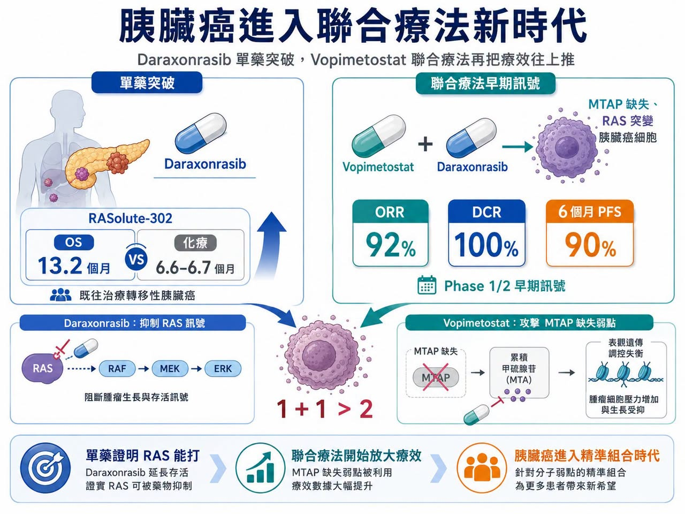
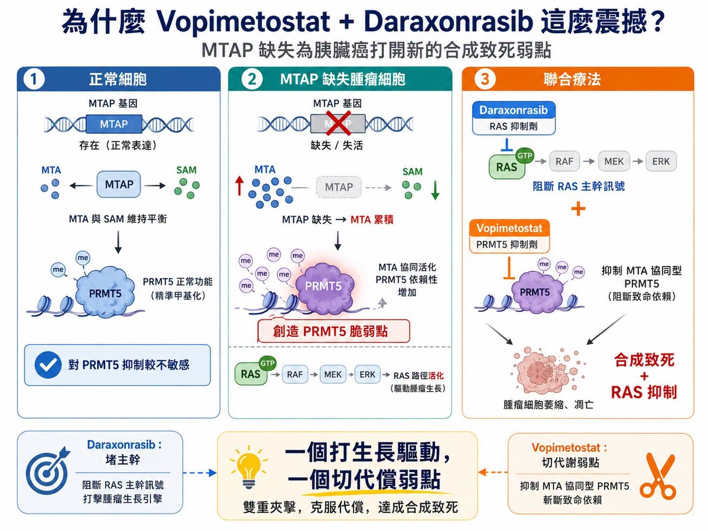
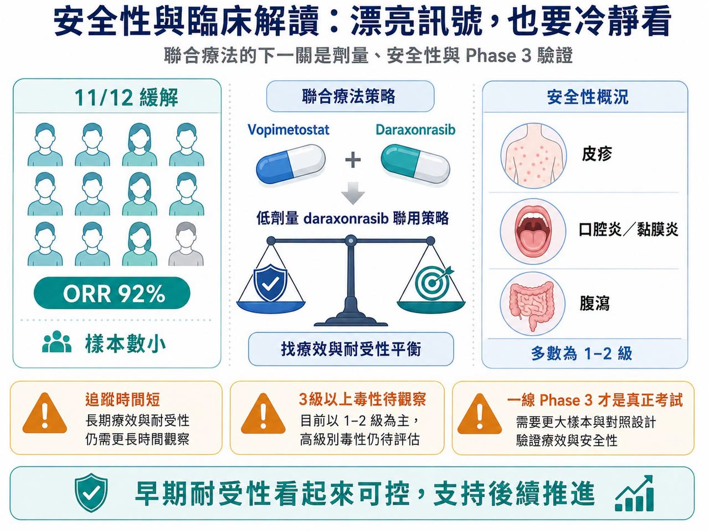
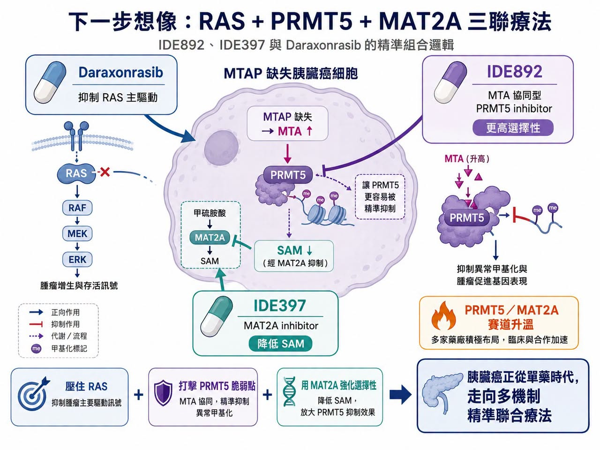

# 胰臟癌再爆：RAS 抑制劑之後，PRMT5／MAT2A 聯合療法把想像空間再打開

「癌王」胰臟癌，正在進入少見的突破密集期。

先是 Revolution Medicines 的 daraxonrasib 在 RASolute-302 研究中，讓既往治療過的轉移性胰臟導管腺癌患者整體存活期幾乎翻倍。

研究顯示，daraxonrasib 組中位整體存活期達 13.2 個月，化療組為 6.6 至 6.7 個月。

這對長期缺乏有效治療的胰臟癌而言，已經是足以改寫臨床路徑的資料。

但更大的驚喜，來自 Tango Therapeutics 和 Revolution Medicines 的聯合療法。

Tango 的 vopimetostat 聯合 daraxonrasib，用於 MTAP 缺失、RAS 突變的轉移性胰臟癌患者，在早期 Phase 1/2 研究中交出驚人訊號：

12 名可評估患者中，客觀緩解率達 92%。

疾病控制率達 100%。

6 個月無惡化存活率達 90%。

中位無惡化存活期尚未達到。

這組資料樣本很小，還不能直接下結論。

但它已經足以讓市場重新思考：

RAS 抑制劑真正的價值，可能不只是單藥，而是成為胰臟癌聯合療法的核心骨架。

## 01｜為什麼 Vopimetostat + Daraxonrasib 這麼震撼？

胰臟癌的治療難，不只在於發現晚、進展快，也在於 KRAS 突變比例極高，且腫瘤微環境非常複雜。Daraxonrasib 已經證明 RAS 可以被有效打擊，但癌細胞通常不會只靠一條路活下去。Tango 選擇的切入口，是 MTAP 缺失。

MTAP 缺失存在於約 10% 至 15% 的癌症中，在胰臟癌比例更高。MTAP 缺失會讓腫瘤細胞內累積 MTA，進而創造出對 PRMT5 抑制特別敏感的代謝弱點。Vopimetostat 正是利用這個弱點，針對 MTAP 缺失腫瘤進行合成致死攻擊。

簡單說：

Daraxonrasib 負責堵住 RAS 主幹訊號。

Vopimetostat 則攻擊 MTAP 缺失帶來的代謝脆弱點。

一個打生長驅動，一個切代償弱點。這就是為什麼兩者聯用可能產生 1+1 大於 2 的效果。從資料上看，差距也很清楚。

Daraxonrasib 單藥在 RASolute-302 中已經很強，但客觀緩解率約 33%，6 個月無惡化存活率約 58.7%。Vopimetostat 單藥在 MTAP 缺失胰臟癌中也有活性，但緩解率仍無法與聯合療法相比。當 vopimetostat 與 daraxonrasib 合併後，早期緩解率直接衝到 92%，這就是市場真正興奮的原因。

更重要的是，這批患者並不是最理想的早線患者。資料中包含二線與三線病人，不少患者已有肝轉移。也就是說，這不是在最容易治療的人群中做出漂亮數字，而是在相對困難的患者裡看見強訊號。

## 02｜安全性是關鍵：療效漂亮，但劑量訊號要看仔細

Vopimetostat + daraxonrasib 的另一個亮點，是早期安全性看起來可控。

Tango 公告指出，聯合治療多數不良事件為 1 至 2 級，常見包括皮疹、口腔炎／黏膜炎與腹瀉；整體耐受性支持後續推進。

這點很重要，因為 daraxonrasib 單藥本身並不是完全沒有毒性。高劑量 RAS 抑制劑常見皮疹、腹瀉、口腔炎與疲乏，若再加上其他靶向藥，安全性很容易成為限制。目前聯合療法使用的 daraxonrasib 劑量低於部分單藥或化療聯合試驗劑量，這可能反映開發團隊正在尋找療效與耐受性的最佳平衡。

這不是壞事，但後續必須釐清幾個問題：

低劑量 daraxonrasib 在聯合方案中是否足以長期維持 RAS 抑制？

Vopimetostat 是否真的能降低或改變 RAS 抑制相關毒性？

更大樣本中，3 級以上不良事件會不會上升？

早期小樣本資料再漂亮，胰臟癌一線 Phase 3 才是真正考試。

## 03｜IDEAYA 也出手：PRMT5 賽道開始拚「誰更精準」

Tango 的資料讓 PRMT5-MTA 抑制劑瞬間升溫，但競爭者也開始加速表態。

IDEAYA 推出的 IDE892，同樣是針對 MTAP 缺失腫瘤的 MTA 協同型 PRMT5 抑制劑。IDEAYA 將其定位為潛在同類最佳，並已啟動 Phase 1/2 臨床組合研究，探索 IDE892 與 MAT2A 抑制劑、pan-RAS 抑制劑的聯合應用。

IDEAYA 的思路很有意思。

MTAP 缺失腫瘤細胞裡 MTA 會累積，而正常細胞中 SAM 相對充足。Vopimetostat 的設計是利用 MTA 存在時 PRMT5 的特殊狀態，但市場擔心，若藥物濃度較高，仍可能影響正常細胞中的 PRMT5，導致血液學毒性或劑量窗口受限。

IDE892 則主打更高選擇性。它不只是偏好 MTA 存在的 PRMT5 狀態，也被設計成在 SAM 濃度高的正常細胞環境中結合較慢，嘗試主動避開正常細胞裡的 PRMT5。

這就是 IDEAYA 所謂潛在 best-in-class，也就是潛在同類最佳的邏輯。

如果這種選擇性在臨床中成立，IDE892 可能有更寬的治療窗口，也更適合進行雙聯或三聯療法。

## 04｜MAT2A 是第三塊拼圖：RAS + PRMT5 + MAT2A 的三聯想像

IDEAYA 更大的差異，不只是 IDE892，而是它早就替 IDE892 找好了搭檔：IDE397。

IDE397 是 MAT2A inhibitor，也就是 MAT2A 抑制劑。MAT2A 的作用與 SAM 生成有關。抑制 MAT2A，可以降低腫瘤細胞中的 SAM。

這會帶來兩個效果：

第一，讓 MTA 的相對優勢更大。

第二，讓 PRMT5 更容易處在 IDE892 偏好的狀態。

換句話說，MAT2A 抑制劑是在替 PRMT5 抑制劑「鋪路」。

這就是三聯療法的邏輯：

Daraxonrasib 壓住 RAS 主驅動。

IDE892 打擊 MTAP 缺失後的 PRMT5 脆弱點。

IDE397 透過降低 SAM，強化 PRMT5 抑制劑的選擇性與深度。

如果用比較直白的說法，RAS 抑制劑像是踩住油門線路，PRMT5 抑制劑像是切斷腫瘤細胞的代償開關，MAT2A 抑制劑則像是讓 PRMT5 這把刀變得更準、更深。IDEAYA 先前也公布過 IDE892 與 IDE397 在 MTAP 缺失模型中的臨床前強訊號，包括在多種模型中看到腫瘤退縮與完整反應。所以，RAS + PRMT5 + MAT2A 不是口號式三聯，而是一個有清楚生物學邏輯的組合方向。

當然，三聯療法也會帶來更高開發難度。劑量、毒性、病人篩選、藥物交互作用、臨床終點，都會比單藥或雙聯更複雜。但如果能成立，它可能把 MTAP 缺失、RAS 突變胰臟癌推進到真正的精準聯合療法時代。

## 05｜PRMT5／MAT2A 賽道正在變熱，大型藥廠不會缺席
Tango 的資料，對整個 PRMT5／MAT2A 賽道都是催化劑。

因為它證明了這條合成致死路線，不只在理論或動物模型裡漂亮，已經在最難治的胰臟癌患者身上看到早期強訊號。

這會加速兩件事。

第一，更多藥廠會尋找 PRMT5、MAT2A 或 MTAP 缺失相關資產。

Gilead、BeiGene、CSPC 等公司都已經在相關方向布局，未來 BD，也就是商務開發與授權合作，和併購很可能繼續升溫。

第二，RAS 抑制劑會從單藥資產變成聯合療法平台。

Daraxonrasib 不再只是二線胰臟癌藥物，而是可與 PRMT5、EGFR、免疫療法、MAT2A、化療甚至其他 RAS 抑制劑搭配的核心骨架。

這就是 RAS 抑制劑真正的大機會。一旦 RAS 抑制劑成為 backbone，也就是治療骨架，整個腫瘤組合療法會圍繞它重新設計。

## 結語｜胰臟癌正在從化療時代，走向精準聯合療法時代
Daraxonrasib 把 RAS 抑制劑推進胰臟癌核心舞台。

Vopimetostat 則證明，MTAP 缺失可能成為 RAS 聯合療法的重要突破口。

IDEAYA 的 IDE892 + IDE397，再加上 RAS 抑制劑的三聯想像，則把這個故事推向更深一層：胰臟癌未來可能不再只是單一靶點治療，而是根據 RAS 突變、MTAP 缺失、代謝脆弱點與耐藥通路，設計出多機制精準組合。

這仍然是早期故事。

樣本小。

追蹤短。

安全性和長期存活還要靠 Phase 3 證明。

但方向已經很清楚。對胰臟癌這種長期幾乎沒有好消息的癌種來說，只要能把生存期再往前推一步，就是巨大的臨床意義。

Daraxonrasib 已經把門撞開。Vopimetostat 讓市場看到門後還有更大空間。而 PRMT5／MAT2A／RAS 三聯療法，可能正是下一個更值得期待的答案。

參考資料：

[0]:各公司官網＆公開資料

[1]: https://pubmed.ncbi.nlm.nih.gov/42223072/

[2]: https://www.globenewswire.com/....../tango......

[3]: https://www.biospace.com/....../tango-therapeutics......

[4]: https://ir.ideayabio.com/2026-06-15-IDEAYA-Biosciences......

[5]: https://ir.ideayabio.com/2026-03-09-IDEAYA-Biosciences......

---

本文僅供產業研究與知識分享，不構成投資、醫療、募資或個股建議。
