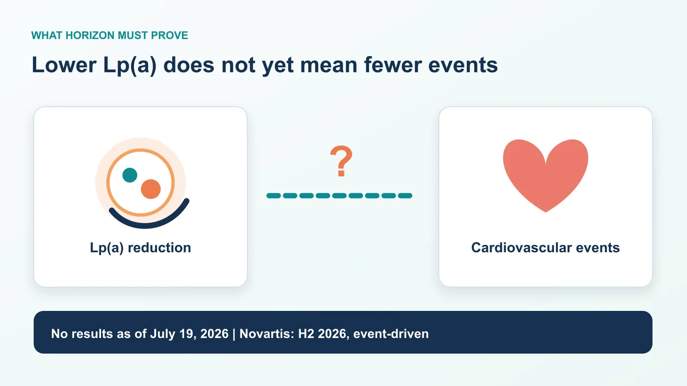
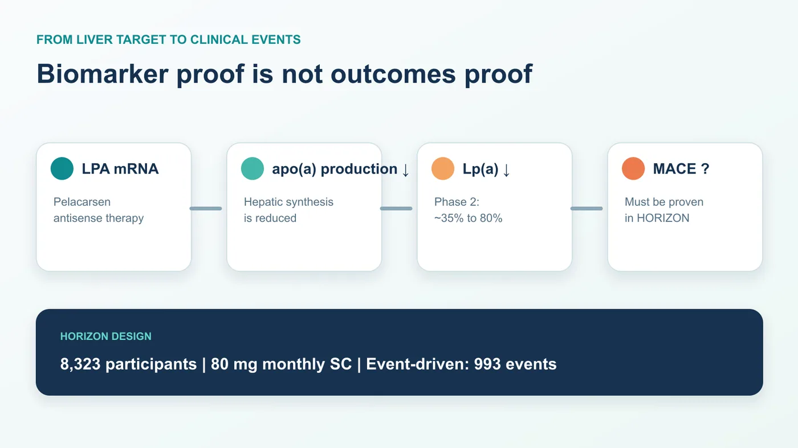
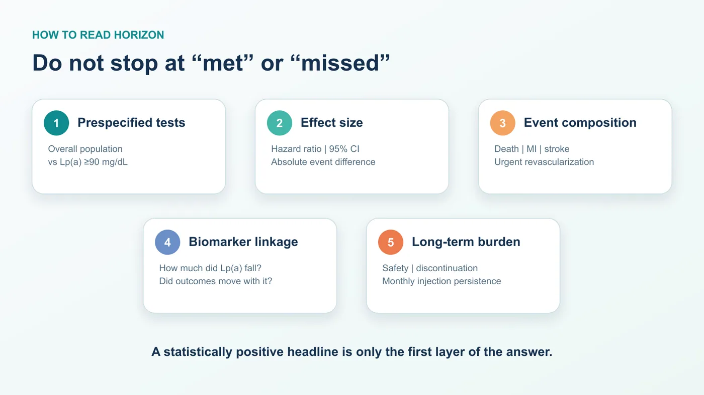
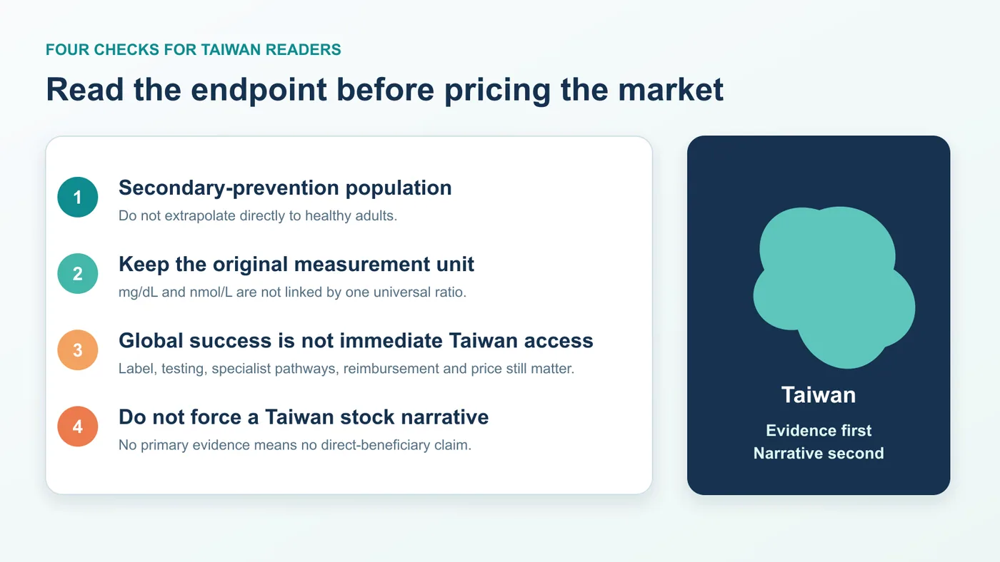

# Pelacarsen's HORIZON Test: Does Lowering Lp(a) Prevent Cardiovascular Events?

Start with the timing, because this is a topic where one premature verb can distort the entire investment and clinical thesis.

As of July 19, 2026, the phase 3 Lp(a) HORIZON trial of pelacarsen has not reported results. ClinicalTrials.gov still lists the study as active, not recruiting, and contains no results section. Novartis' latest quarterly investor presentation places the event-driven readout in the second half of 2026. Ionis says results are expected later this year.

That means it is not accurate to write that the trial has unblinded, that the result is imminent within a specific number of weeks, or that the endpoint has already been met.

HORIZON nevertheless matters far beyond a single corporate catalyst. It is designed to answer one of the most consequential unresolved questions in cardiovascular drug development:

If lipoprotein(a), or Lp(a), is reduced substantially in patients who already have cardiovascular disease and are receiving optimized standard care, will they experience fewer cardiovascular deaths, myocardial infarctions, strokes and urgent coronary revascularizations?

The answer will determine whether Lp(a) moves from being a compelling causal risk factor to a druggable outcomes target. It will also shape the development path for a growing field of antisense oligonucleotides, siRNA agents and oral small molecules. Are these programs simply lowering an attractive biomarker, or are they building a new cardiovascular treatment category?

## 01 | Why Lp(a) and LDL-C Are Not the Same Problem

Lp(a) can be understood as an apoB-containing lipoprotein particle with an additional apolipoprotein(a), or apo(a), component. Its concentration is strongly influenced by genetics and is associated with atherosclerotic cardiovascular disease and calcific aortic-valve stenosis.

The clinical problem is residual risk. A patient's LDL cholesterol may be brought down through statins, ezetimibe, drugs targeting the PCSK9 pathway and other evidence-based therapies. That does not mean the Lp(a) component of cardiovascular risk has been resolved.

This is the background against which HORIZON should be read. Pelacarsen is not being tested in a therapeutic vacuum. It is being added to optimized standard cardiovascular care. The trial is therefore not asking whether Lp(a) management should replace LDL-C management. It is asking whether directly addressing Lp(a) can reduce events after the established parts of risk reduction are already in place.

Genetic studies, epidemiology and biomarker analyses can make the biological direction persuasive. They cannot substitute for a randomized cardiovascular outcomes trial. A causal association does not automatically tell clinicians how much pharmacologic lowering is required, when intervention should begin, which patients benefit most, or whether the effect is large enough to change practice.

That evidentiary gap is precisely what HORIZON was designed to close.

## 02 | Pelacarsen Has Shown That It Can Lower Lp(a), Not Yet That It Can Prevent Events

Pelacarsen is an antisense oligonucleotide, or ASO, directed at the apo(a) production pathway. In simplified terms, it reduces the hepatic production of apo(a), leaving less material available for Lp(a) assembly.

In a randomized, double-blind, placebo-controlled phase 2 trial involving 286 patients, the tested dose regimens produced mean Lp(a) reductions of approximately 35% to 80%. The most intensive regimen achieved a mean reduction of about 80%.

The most common adverse events were injection-site reactions. In that study, there were no significant between-group differences in platelet counts, liver or kidney laboratory measures, or influenza-like symptoms.

These findings are important proof of mechanism. They are not an outcomes victory.

The phase 2 study primarily answered whether the drug engaged its target, how large the biomarker effect could be and what the short- to medium-term safety profile looked like. HORIZON asks whether patients ultimately experience fewer major cardiovascular events.

The distinction is not semantic. An 80% reduction in Lp(a) must never be translated into an 80% reduction in cardiovascular risk. The percentage change in a biomarker and the relative risk reduction in clinical events are not interchangeable.

## 03 | The Trial Design Determines How the Result Should Be Read

HORIZON enrolled 8,323 patients with established cardiovascular disease and Lp(a) of at least 70 mg/dL. Established disease includes a history of myocardial infarction, ischemic stroke or clinically significant symptomatic peripheral artery disease.

Participants were assigned 1:1 to receive pelacarsen 80 mg by subcutaneous injection once monthly or placebo, while continuing optimized standard cardiovascular treatment.

The primary composite endpoint includes:

- cardiovascular death;
- nonfatal myocardial infarction;
- nonfatal stroke; and
- urgent coronary revascularization requiring hospitalization.

The study will test the overall population and a higher-Lp(a) population defined at screening by Lp(a) of at least 90 mg/dL, with multiplicity handled prospectively. That detail matters. If the clearest result emerges only in patients with higher baseline Lp(a), the finding cannot be reframed as proof that every person with an elevated measurement benefits equally.

HORIZON is also event driven. The design calls for 993 primary cardiovascular events confirmed by an independent clinical events committee, with a minimum follow-up of 2.5 years. Reaching a calendar date does not make the data mature automatically. Event accumulation, data cleaning, database lock, statistical analysis and corporate disclosure timing can all affect when a result becomes public.

Novartis' “H2 2026, event-driven” language should therefore be treated as the company's current readout window, not as a guaranteed publication date and certainly not as evidence that the result is already known publicly.

Three different milestones are often collapsed into one.

The first is event maturity: the trial reaches its target event count and the dataset moves toward lock and analysis. The second is a corporate topline announcement: usually a concise disclosure of the primary endpoint and a limited number of safety findings. The third is a full scientific presentation or publication, which may provide baseline characteristics, individual endpoint curves, subgroups, discontinuations and complete adverse-event data.

Even when a sponsor says a trial is complete or a readout has been achieved, public readers may not yet have enough information to judge every important question. Conversely, a shift in timing should not be interpreted as success or failure without a primary-source explanation. Event-driven trials can move because events accrue faster or more slowly than expected.

That is why the verification date belongs at the beginning of this article. HORIZON is a thesis that could be rewritten instantly by new data. Any future headline must be checked again against the trial registry, the sponsor's formal release and the complete scientific dataset.

## 04 | When the Result Arrives, Do Not Stop at “Met” or “Missed”

A press release can reduce a complex cardiovascular outcomes trial to positive or negative. A useful reading of HORIZON requires at least five layers.

### 1. Did the prespecified hypothesis pass?

Start with the overall population and the prespecified Lp(a) at least 90 mg/dL population. Examine how multiplicity was controlled. A nominally significant subgroup does not necessarily mean the trial succeeded statistically as designed.

### 2. How large is the effect?

The hazard ratio matters, but so do its 95% confidence interval, the absolute difference in event rates, follow-up duration and the interpretability of the number needed to treat. A very large trial can produce an attractive p value from a modest difference. Clinicians and payers will ask whether the magnitude is sufficient to change care.

### 3. Which events drive the composite?

Cardiovascular death, myocardial infarction, stroke and urgent revascularization do not carry identical clinical weight. If the composite is driven primarily by a component more sensitive to medical decision-making, the result will be interpreted differently from a consistent reduction in death, myocardial infarction and stroke.

### 4. Does the biomarker effect connect coherently to the outcomes effect?

Readers should look at the Lp(a) reduction achieved in the treatment group, the baseline distribution, whether higher-Lp(a) patients show clearer benefit and whether the relationship between biomarker reduction and events makes biological and clinical sense. This is the bridge between hitting the target and helping the patient.

### 5. What is the long-term cost in safety, persistence and treatment burden?

Injection-site reactions were the most common adverse events in phase 2, but phase 3 is much larger and longer. The result must be examined for serious adverse events, liver, kidney or platelet signals, discontinuation rates and the effect of monthly injections on long-term adherence. Efficacy does not automatically make a chronic therapy easy to adopt.

Together, these five layers define the real HORIZON result.

## 05 | Why One Readout Could Reprice the Entire Lp(a) Field

Pelacarsen is not the only program waiting for an outcomes answer.

Amgen's olpasiran is being studied in the phase 3 OCEAN(a)-Outcomes trial. The study uses subcutaneous dosing every 12 weeks in patients with Lp(a) of at least 200 nmol/L and established atherosclerotic cardiovascular disease.

Eli Lilly's lepodisiran is also in a phase 3 cardiovascular outcomes program, ACCLAIM-Lp(a). The same company is developing the oral small molecule muvalaplin in the phase 3 MOVE-Lp(a) outcomes trial.

The useful comparison is not a leaderboard of which phase 2 program lowers Lp(a) by the highest percentage. The strategic question is whether the first persuasive outcomes result establishes a clinically acceptable bar for the target as a whole.

If HORIZON shows a robust event benefit, with a meaningful effect size, convincing component events and an acceptable safety profile, competition will shift. The debate will move from whether Lp(a) is druggable to which mechanism, formulation, dosing interval, patient segment and price delivers the strongest overall product.

If the result is neutral, the field will need to separate several possible explanations: target biology, timing of intervention, enrollment threshold, follow-up duration, degree of Lp(a) lowering, background therapy and trial design. One molecule missing an endpoint would not prove that every Lp(a) strategy is biologically dead. But a deeper biomarker reduction by a competitor would not make the outcomes question disappear either.

This is why HORIZON is both a product catalyst and a target-validation event.

## 06 | What Taiwan Readers Should Watch

The first issue is measurement. HORIZON uses mg/dL thresholds, while the design paper also provides approximate nmol/L equivalents. Because apo(a) particle size varies, values should not be converted for every patient with one fixed ratio. Read the original unit and assay context.

The second issue is population. This is a secondary-prevention trial. Participants already have a history of myocardial infarction, ischemic stroke or symptomatic peripheral artery disease. Even a positive study could not be applied automatically to otherwise healthy people with no previous cardiovascular event, and it would not justify self-directed testing or treatment.

The third issue is local adoption. A global trial result would still need to pass through regulatory labeling, test availability, specialist care pathways, reimbursement and pricing in Taiwan. Global success is a necessary condition for local use, not next-day access.

The fourth issue is investment discipline. This analysis did not identify primary evidence that a Taiwan-listed company directly shares pelacarsen rights or HORIZON economics. Pelacarsen's central development relationship is between Novartis and Ionis; the major competing outcomes programs are associated with Amgen and Eli Lilly. Attaching an Lp(a) label to a Taiwan company through a loose manufacturing, diagnostic or thematic connection would obscure the actual clinical question.

For investors, the most useful checklist is straightforward:

1. Which prespecified tests pass: the overall population, the Lp(a) at least 90 mg/dL population, or both?
2. What are the hazard ratio, 95% confidence interval and absolute event-rate difference?
3. Which component—cardiovascular death, myocardial infarction, stroke or urgent revascularization—drives the composite?
4. Does the achieved Lp(a) reduction connect coherently to the event benefit?
5. What do long-term safety, discontinuation and monthly-injection persistence look like?
6. Is the sponsor's next step a broad filing, a narrower subgroup strategy or additional research?

## Conclusion | The Test Is Not Whether Pelacarsen Lowers a Number

HORIZON's value does not lie in proving once again that pelacarsen can lower Lp(a). Phase 2 has already provided a clear signal on that question.

The harder threshold is converting the reduction of an inherited residual-risk factor, on top of standard therapy, into fewer myocardial infarctions, strokes, cardiovascular deaths and urgent revascularizations.

As of July 19, 2026, that answer has not been reported. Novartis currently points to an event-driven readout in the second half of 2026.

The most valuable preparation is not guessing the day of the press release. It is defining the evidentiary standard before the data arrive. Markets may take seconds to decide whether a headline is bullish or bearish. Medicine and industry still have to answer the more important question: can changing one laboratory measurement change a patient's cardiovascular fate?

## References

1. [ClinicalTrials.gov | NCT04023552, Lp(a) HORIZON](https://clinicaltrials.gov/study/NCT04023552)
2. [Novartis | Q1 2026 investor presentation](https://www.novartis.com/sites/novartis_com/files/q1-2026-investor-presentation.pdf)
3. [Ionis | First-quarter 2026 financial results](https://ir.ionis.com/news-releases/news-release-details/ionis-reports-first-quarter-2026-financial-results-and)
4. [American Heart Journal | HORIZON design and rationale, PMID 40185318](https://pubmed.ncbi.nlm.nih.gov/40185318/)
5. [New England Journal of Medicine | Pelacarsen phase 2, PMID 31893580](https://pubmed.ncbi.nlm.nih.gov/31893580/)
6. [ClinicalTrials.gov | OCEAN(a)-Outcomes, NCT05581303](https://clinicaltrials.gov/study/NCT05581303)
7. [ClinicalTrials.gov | ACCLAIM-Lp(a), NCT06292013](https://clinicaltrials.gov/study/NCT06292013)
8. [ClinicalTrials.gov | MOVE-Lp(a), NCT07157774](https://clinicaltrials.gov/study/NCT07157774)

---

This article is provided for industry research and educational purposes only. It does not constitute investment, medical, fundraising or securities advice. Individual testing and treatment decisions should be made with a qualified healthcare professional based on the complete clinical context.
