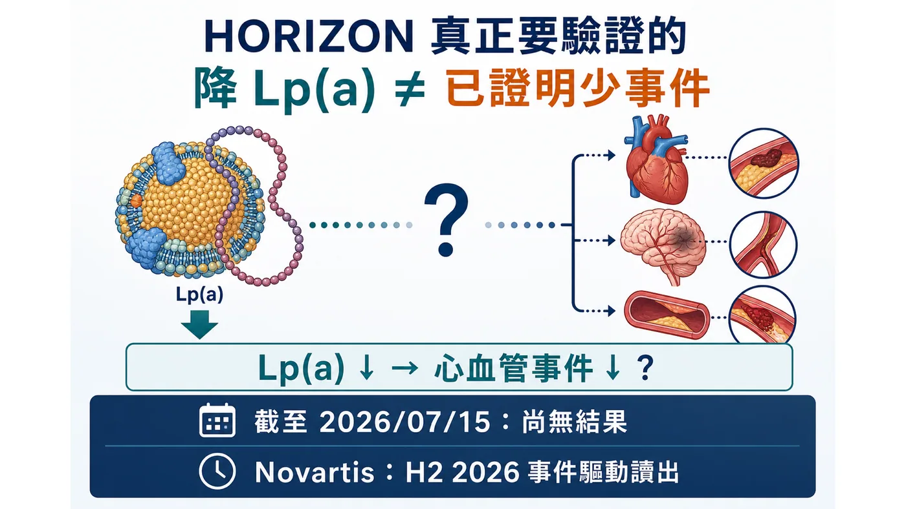
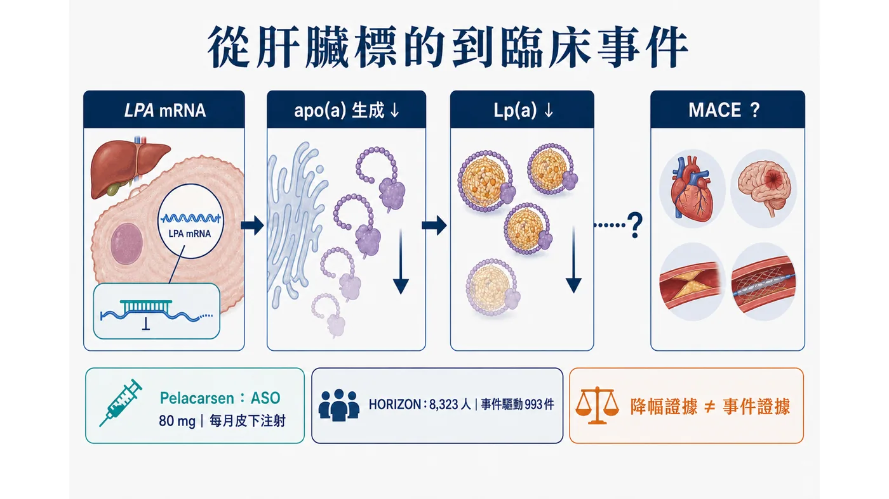
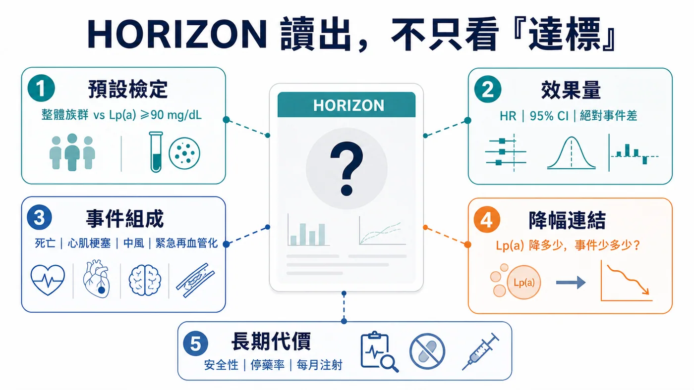
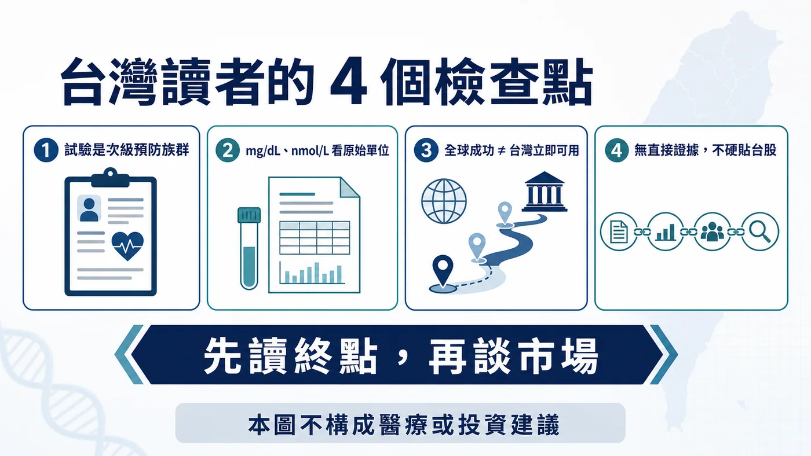

# HORIZON：Lp(a) 降了，心梗會少嗎？

先把時間講清楚。

截至 2026 年 7 月 19 日，pelacarsen 的第三期 Lp(a) HORIZON 試驗還沒有公布結果。ClinicalTrials.gov 顯示研究仍是「Active, not recruiting」，也沒有結果資料；Novartis 最新一季投資人資料把事件驅動讀出放在 2026 年下半年，Ionis 則說結果預計在今年稍晚公布。

所以，現在不能寫「正式揭盲」、不能寫「結果出爐」，也不能把「2026 下半年」改寫成「未來幾週」。

但這不代表 HORIZON 只是又一個等待中的藥廠催化劑。它真正要回答的，是心血管藥物開發裡一個拖了很多年的問題：

把 Lp(a) 大幅壓低，能不能在既有心血管疾病、而且已接受標準治療的人身上，進一步減少心血管死亡、心肌梗塞、中風與緊急冠狀動脈再血管化？

這個答案會決定 Lp(a) 是從「很有說服力的風險因子」，走到「值得被藥物直接治療的事件標的」；也會影響後面一整批 ASO、siRNA 與口服小分子，究竟是在追一個漂亮的生物標記，還是在建立新的心血管治療類別。

資料狀態：ClinicalTrials.gov NCT04023552（2026 年 7 月 19 日重查）；Novartis 2026 Q1 investor presentation；Ionis 2026 Q1 financial results。

## 01｜Lp(a) 為什麼和 LDL-C 不是同一題？

Lp(a)，也就是脂蛋白(a)，可以先把它想成一顆帶有額外 apo(a) 結構的含 apoB 脂蛋白。它的濃度很大程度受遺傳影響，和動脈粥樣硬化性心血管疾病及鈣化性主動脈瓣狹窄風險有關。

臨床上麻煩的地方在於：一個人的 LDL-C 已經因為 statin、ezetimibe、PCSK9 路徑藥物與其他標準治療降下來，不代表 Lp(a) 這條殘餘風險也被處理掉。

這正是 HORIZON 的重要背景。它不是把 pelacarsen 放在沒有治療的真空裡，而是加在「最佳化的心血管標準照護」之上。換句話說，試驗要找的不是取代 LDL-C 管理的方法，而是問：當該做的標準治療已經做了，針對 Lp(a) 還能不能再把事件風險往下推？

這個問題不能只靠遺傳研究、觀察性研究或生物標記降幅回答。那些證據可以告訴我們方向很合理，卻不能代替隨機對照的心血管事件試驗。

HORIZON 設計論文：https://pubmed.ncbi.nlm.nih.gov/40185318/

## 02｜Pelacarsen 已經證明「能降」，還沒證明「能救事件」

Pelacarsen 是針對 apo(a) 生成路徑的反義寡核苷酸（ASO）。簡化來說，它在肝臟端降低 apo(a) 的製造，讓 Lp(a) 的組裝來源變少。

在 286 人的第二期隨機、雙盲、安慰劑對照試驗中，不同劑量方案讓 Lp(a) 平均下降約 35% 到 80%；最高強度方案的平均降幅約 80%。最常見的不良事件是注射部位反應，該試驗沒有看到血小板、肝腎指標或類流感症狀出現顯著組間差異。

這是很重要的 proof of mechanism，卻不是臨床終點的勝利。

因為第二期主要回答的是「藥有沒有打中標的、降幅有多大、短中期安全性如何」，HORIZON 才是在回答「病人最後有沒有少發生重大心血管事件」。兩個問題不能混寫。

尤其不能把「Lp(a) 降 80%」直接翻譯成「心血管風險降 80%」。生物標記的百分比與臨床事件的相對風險下降，從來不是一比一換算。

Pelacarsen 第二期論文：https://pubmed.ncbi.nlm.nih.gov/31893580/

## 03｜HORIZON 的設計，決定我們之後該怎麼讀結果

HORIZON 共納入 8,323 位已有心血管疾病、且 Lp(a) 至少 70 mg/dL 的患者。這裡的既有心血管疾病，包括心肌梗塞、缺血性中風或有症狀的周邊動脈疾病病史。

受試者以 1:1 分派，每月皮下注射 pelacarsen 80 mg 或安慰劑，同時繼續接受最佳化的心血管標準治療。

主要複合終點包括：

- 心血管死亡
- 非致死性心肌梗塞
- 非致死性中風
- 需要住院的緊急冠狀動脈再血管化

試驗會同時檢驗整體族群，以及篩檢時 Lp(a) 至少 90 mg/dL 的較高族群，並預先處理多重檢定問題。這一點很關鍵：如果結果只在更高 Lp(a) 族群清楚，市場與臨床解讀就不能偷換成「所有 Lp(a) 偏高者都受益」。

它也是一個事件驅動試驗。設計要求累積 993 件經獨立委員會確認的主要心血管事件，且最短追蹤 2.5 年。達到日曆上的某一天，不代表資料就自動成熟；事件累積速度、資料清理、統計鎖庫與公司發布節奏都會影響讀出時間。

因此 Novartis 所寫的「H2 2026（event-driven）」應該被理解為公司目前的讀出窗口，不是保證日期，更不是已公布結果。

這裡還有三個很容易混在一起的時間點。

第一是事件數成熟：試驗累積到預定事件、資料開始進入鎖庫與分析。第二是公司公布 topline：通常先交代主要終點與少數關鍵安全訊號。第三才是完整學會報告或論文：基線特徵、各終點曲線、子群、停藥與完整不良事件，往往要更晚才能看見。

所以，即使公司未來說「trial completed」或「data readout achieved」，也不代表公開讀者已經拿到足以判斷全部問題的資料。反過來，讀出窗口往後移，也不應在沒有一級說明時自行解讀成成功或失敗；事件驅動試驗的時程，本來就可能受事件累積速度影響。

這也是為什麼這篇把查證截止日寫在最前面。HORIZON 是一個會被新資料瞬間改寫的題目，任何結果新聞都必須回到試驗登錄、公司正式公告與完整科學資料重新核對，不能用舊稿直接續貼。

試驗登錄：https://clinicaltrials.gov/study/NCT04023552

Novartis 2026 Q1 資料：https://www.novartis.com/sites/novartis_com/files/q1-2026-investor-presentation.pdf

## 04｜結果公布時，先別只找「有沒有達標」

一篇新聞稿很容易只剩下 positive 或 negative，但 HORIZON 真正有用的讀法至少分五層。

第一層：主要終點有沒有過？

先看整體族群與預先設定的 Lp(a) ≥90 mg/dL 子群各自結果，以及多重檢定如何控制。只看到某個子群名目上顯著，不等於試驗在統計上已完整成功。

第二層：效果有多大，不只看 p 值

要看 hazard ratio、95% 信賴區間、絕對事件率差、追蹤時間與 number needed to treat 的可解讀性。大型試驗可以用很小的差距得到漂亮 p 值，但臨床與支付者會追問：差距是否足以改變照護？

第三層：是哪一種事件在拉動結果？

心血管死亡、心肌梗塞、中風與緊急再血管化的重要性不完全相同。如果複合終點主要由較軟、較容易受醫療行為影響的項目推動，說服力會和死亡、心肌梗塞或中風一致下降不同。

第四層：Lp(a) 降幅和事件獲益是否有可理解的關係？

要看治療組實際達到的 Lp(a) 降幅、基線分布、較高 Lp(a) 者是否出現更清楚的效益，以及降幅與事件之間是否呈現合理趨勢。這一層是把「標的有被打中」和「病人真的受益」接起來。

第五層：安全性、停藥率與每月注射的代價

第二期最常見的是注射部位反應，但第三期規模更大、時間更長。結果公布時，還要看嚴重不良事件、肝腎與血小板訊號、停藥率，以及每月注射是否影響長期依從性。有效，不等於一定容易被真實世界採用。

這五層合在一起，才是 HORIZON 的完整答案。

## 05｜為什麼這一讀出會影響整條 Lp(a) 賽道？

因為後面不只 pelacarsen。

Amgen 的 olpasiran 正在 OCEAN(a)-Outcomes 第三期事件試驗中，以每 12 週皮下注射的方式，研究 Lp(a) 至少 200 nmol/L、已有特定動脈粥樣硬化性心血管疾病的患者。Lilly 的 lepodisiran 也已進入 ACCLAIM-Lp(a) 第三期事件試驗；同一家公司另有口服小分子 muvalaplin 的 MOVE-Lp(a) 第三期事件研究。

這裡不需要把每一個分子排成「誰降得最多」的排行榜。真正的產業問題是：第一個清楚的事件證據，會不會替整個標的建立可接受的臨床門檻？

如果 HORIZON 顯示事件獲益，而且效果量、重要事件組成與安全性都站得住腳，後續競爭就會從「Lp(a) 能不能成為藥物標的」，轉向「哪種機制、劑型、給藥頻率、適用族群與價格最有優勢」。

如果結果中性，則要拆解是標的本身、介入時機、納入門檻、追蹤時間、降幅、背景治療，還是特定試驗設計出了問題。不能因為一個分子未達標就直接宣布整個 Lp(a) 生物學死亡，也不能拿其他分子的更高降幅假裝事件問題已經不存在。

競品試驗登錄：

- Olpasiran OCEAN(a)-Outcomes：https://clinicaltrials.gov/study/NCT05581303
- Lepodisiran ACCLAIM-Lp(a)：https://clinicaltrials.gov/study/NCT06292013
- Muvalaplin MOVE-Lp(a)：https://clinicaltrials.gov/study/NCT07157774

## 06｜台灣讀者最該注意的，不是「有沒有一檔概念股」

第一，看到結果時先確認檢驗單位與納入門檻。HORIZON 的門檻用 mg/dL 表示，試驗設計論文也提供約當 nmol/L，但 Lp(a) 的粒子大小有差異，不應把所有人的數值用單一固定比例草率互換。

第二，這是一個次級預防試驗。受試者已經有心肌梗塞、缺血性中風或有症狀周邊動脈疾病等病史。即使試驗成功，也不能直接外推到沒有心血管事件的一般健康族群，更不能自行據此決定檢測或用藥。

第三，台灣臨床落地還會經過核准標示、檢測可近性、專科路徑、給付與定價。全球試驗成功只是必要條件，不等於隔天就能在台灣開立。

第四，本文沒有建立足以支持「台股直接受惠」的一級證據，因此不硬列台股標的。Pelacarsen 的核心權利與開發關係在 Novartis 與 Ionis；競爭事件試驗主要來自 Amgen 與 Eli Lilly。把任何只有鬆散製造、檢測或題材關聯的台灣公司貼上 Lp(a) 概念股，反而會模糊真正的臨床問題。

對投資人來說，最值得看的也不是新聞稿第一行，而是這張檢查表：

1. 整體族群與 Lp(a) ≥90 mg/dL 子群，誰通過預設檢定？
2. hazard ratio、95% 信賴區間與絕對事件差是多少？
3. 心血管死亡、心肌梗塞、中風、緊急再血管化，誰在拉動複合終點？
4. 實際 Lp(a) 降幅和事件獲益能否接得起來？
5. 長期安全性、停藥率與每月注射的接受度如何？
6. 公司所說的下一步，是完整申請、特定子群，還是仍需更多研究？

## 最後的主判斷

HORIZON 的價值不在於再證明一次 pelacarsen 可以把 Lp(a) 壓低。這件事第二期已經給過明確訊號。

它要跨過的是更難的一道門：在標準治療之上，把一個遺傳性殘餘風險因子的下降，轉成病人真正少發生心肌梗塞、中風、心血管死亡與緊急再血管化。

截至 2026 年 7 月 19 日，這個答案仍未公布；Novartis 目前指向 2026 年下半年、事件驅動讀出。

等待結果時，最有價值的準備不是猜哪一天發新聞稿，而是先把判讀標準訂好。因為當數據真的來了，市場只需要幾秒鐘決定漲跌，但醫療與產業真正要回答的，是那個結果能不能把「降低一個數字」變成「改變一個人的心血管命運」。

## 參考資料

1. ClinicalTrials.gov, NCT04023552：https://clinicaltrials.gov/study/NCT04023552
2. Novartis Q1 2026 investor presentation：https://www.novartis.com/sites/novartis_com/files/q1-2026-investor-presentation.pdf
3. Ionis Q1 2026 financial results：https://ir.ionis.com/news-releases/news-release-details/ionis-reports-first-quarter-2026-financial-results-and
4. HORIZON design and rationale, PMID 40185318：https://pubmed.ncbi.nlm.nih.gov/40185318/
5. Pelacarsen phase 2, PMID 31893580：https://pubmed.ncbi.nlm.nih.gov/31893580/
6. OCEAN(a)-Outcomes, NCT05581303：https://clinicaltrials.gov/study/NCT05581303
7. ACCLAIM-Lp(a), NCT06292013：https://clinicaltrials.gov/study/NCT06292013
8. MOVE-Lp(a), NCT07157774：https://clinicaltrials.gov/study/NCT07157774

---

本文僅為公開臨床與產業資料整理，不構成醫療診斷、治療建議、募資或投資建議。個人檢測與治療應由專業醫療人員依病史與完整臨床資料判斷。
