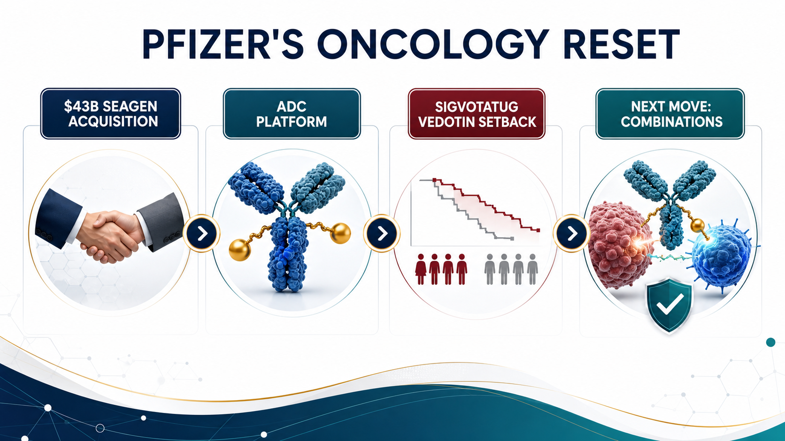
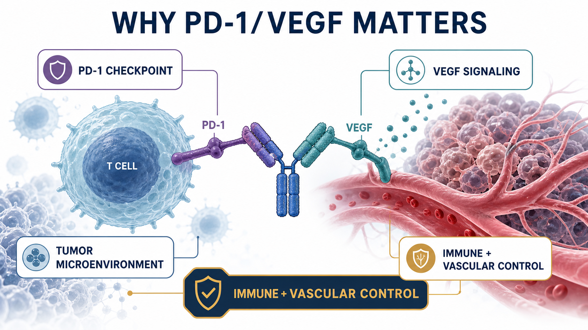
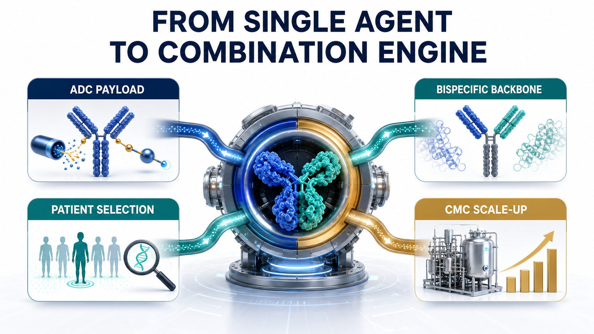
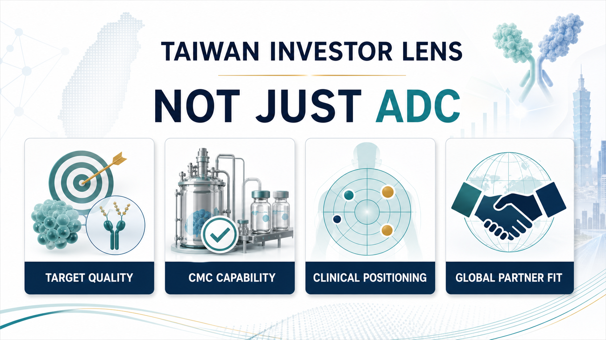

# Pfizer's ADC Bet: Why 3SBio's PD-1/VEGF Bispecific Has Become the New Pivot

Pfizer's oncology strategy is starting to look less like a clean product roadmap and more like a card game it cannot simply leave.

After the COVID vaccine and antiviral cash-flow wave faded, Pfizer had to answer a harder question: where will the next decade of growth come from?

The original answer seemed clear.

In 2023, Pfizer spent about $43 billion to acquire Seagen, bringing one of the world's most mature antibody-drug conjugate platforms into its own oncology franchise. The strategic logic was obvious. Pfizer had not built the same central position in the PD-1 era that Merck achieved with Keytruda or Bristol Myers Squibb achieved with Opdivo. Seagen offered a way back into the center of oncology through ADCs, marketed products, late-stage assets, and a technology platform that could be combined with Pfizer's scale.

But that is where the hard part begins.

An ADC platform does not automatically become a cash machine after it is acquired. The drugs still have to clear clinical endpoints, indication selection, competitive pressure, toxicity windows, and commercial positioning. When a company pays $43 billion for the platform, the market will not only ask whether the technology is interesting. It will ask whether those assets can become the next generation of blockbusters.

The recent Phase III setback for sigvotatug vedotin puts that question directly in front of Pfizer.

On the surface, this is a clinical disappointment for one ADC.

The deeper strategic point is different: as the single-agent ADC story becomes harder, Pfizer is increasingly positioning 3SBio's PD-1/VEGF bispecific antibody SSGJ-707, now Pfizer's PF-08634404, as a central component of its oncology combination strategy.

In other words, Pfizer's ADC bet is no longer only about ADCs.

It is becoming a bet on ADCs plus a new immuno-oncology backbone.

## 01｜Sigvotatug Vedotin's Setback Is Not Just One Failed Trial

Sigvotatug vedotin was one of the important late-stage assets Seagen brought to Pfizer. Previously known as SGN-B6A, it is an ADC targeting integrin beta-6 and has been developed primarily for solid tumors such as non-small cell lung cancer.

The biological rationale is understandable. Integrin beta-6 is expressed in multiple epithelial tumors and has been associated with tumor invasion, metastasis, and poor prognosis. From a mechanism perspective, this is exactly the kind of target that fits the ADC imagination: the antibody finds the cancer cell, while the linker and payload deliver cytotoxic pressure more selectively.

But clinical development is not a theory slide.

ClinicalTrials.gov lists NCT06012435 as a Phase III study comparing sigvotatug vedotin with docetaxel in previously treated non-small cell lung cancer. That comparison matters because docetaxel is an old drug, but it remains a long-standing control standard in later-line lung cancer.

The original Chinese analysis cited that the SigVie-002 / Be6A Lung-01 trial did not significantly improve overall survival in the overall population. If viewed narrowly, this is a single-agent Phase III miss in later-line NSCLC.

For Pfizer, however, the pressure is larger than one trial.

Sigvotatug vedotin is not an isolated asset. It is one of the exam papers by which investors will judge whether Pfizer can integrate and advance Seagen's ADC portfolio. When a highly watched ADC cannot produce a clearly superior outcome in a pivotal setting, the market naturally reopens the $43 billion question: did Pfizer buy a technology platform, or did it buy a set of assets that now need to be reprioritized, recombined, and re-underwritten?

That is Pfizer's uncomfortable position.

ADCs remain important. But "single-agent ADC" no longer automatically means a high-probability commercial story.

## 02｜The Seagen Deal Was Pfizer's Make-Up Exam After Missing the PD-1 Golden Decade

To understand why Pfizer paid $43 billion for Seagen, it is not enough to say ADCs were hot.

The deeper background is that Pfizer did not secure a central position in the previous immuno-oncology era. Merck's Keytruda became one of the most important commercial backbones in oncology over the past decade. It expanded across lung cancer, melanoma, renal cancer, head and neck cancer, gastric cancer, MSI-H / dMMR tumors, and many combination regimens. PD-1 was not just a product. It was a platform for trials, combinations, sequencing, and market control.

Pfizer missed that era.

So it needed a new entry point into the next one.

ADCs gave Pfizer that answer. Seagen brought marketed products, ADC know-how, and a pipeline across multiple clinical stages. For Pfizer, the deal was not simply about buying one drug. It was about buying a ticket back into the core oncology battlefield.

Pfizer's own 2023 announcement framed the deal in exactly that way. With Seagen, Pfizer added ADCETRIS, PADCEV, TIVDAK, TUKYSA, and a broader oncology pipeline spanning ADCs, small molecules, bispecifics, and other immunotherapies.

But buying a platform and turning it into a sustainable product line are two very different tasks.

ADC competition is more crowded than it was only a few years ago. HER2, TROP2, Nectin-4, B7-H4, CLDN18.2, FR-alpha, and many other targets are under development. Payloads have expanded from MMAE and MMAF to DXd, topoisomerase I inhibitors, and newer cytotoxins. The platform story has become more exciting, but the clinical endpoints have also become less forgiving.

For a large drugmaker, the real ADC questions are not simply whether it can make an ADC.

The questions are whether the target separates tumor from normal tissue well enough, whether the payload can produce efficacy without destroying the safety window, whether linker stability and bystander effect fit the tumor type, whether single-agent activity is enough, whether the right combination can be found, and whether the commercial position is still clear when PD-1, chemotherapy, targeted therapy, and other ADCs are already in the field.

Those are the real questions behind the $43 billion acquisition.

## 03｜As Single-Agent ADCs Get Harder, Combinations Become the Next Battlefield

The original appeal of ADCs was simple. They connect antibody targeting with the killing power of chemotherapy. Put more plainly, they make chemotherapy better at finding its way.

But as ADCs move into larger tumor types, earlier lines of therapy, and denser competitive markets, single-agent advantage becomes harder to defend.

There are several reasons.

First, later-line patients have often received many therapies already. Tumor heterogeneity is high, resistance mechanisms are complex, and a single target-plus-payload strategy may not be enough to cross a hard endpoint such as overall survival.

Second, front-line treatment is already occupied by PD-1 / PD-L1 inhibitors, chemotherapy, anti-angiogenic therapy, targeted therapies, and established combinations. A new ADC is not entering an empty market. It must prove that it can change treatment sequencing.

Third, ADCs have their own toxicity constraints. Depending on target and payload, developers must manage lung toxicity, ocular toxicity, peripheral neuropathy, myelosuppression, liver toxicity, and other risks. Combinations can increase efficacy potential, but they can also magnify safety problems.

That means the next phase of ADC competition will not be won only by having more ADC programs.

It will be won by placing the right ADC in the right disease, with the right immune backbone, in the right patient population.

That is why Pfizer now needs PF-08634404.

If single-agent ADCs are not enough, Pfizer needs an immunotherapy platform that can work with ADCs as a combination engine. Historically, that role was often played by Keytruda or Opdivo. But for Pfizer, relying forever on another company's PD-1 backbone would make it difficult to build its own oncology ecosystem.

PF-08634404 therefore matters for more than the addition of another bispecific antibody.

It could become the immune backbone that lets Pfizer reconnect and reposition the Seagen ADC assets.

## 04｜Why PD-1/VEGF? Because It Tries to Touch Both Immunity and Angiogenesis

PF-08634404 originated as 3SBio's SSGJ-707, a bispecific antibody targeting PD-1 and VEGF.

The concept is to place checkpoint inhibition and anti-angiogenic biology into a single molecule. The PD-1 arm is designed to release the brake on T cells. The VEGF arm is intended to influence tumor angiogenesis, immune suppression, vascular normalization, and tumor perfusion within the microenvironment.

This direction did not come out of nowhere.

Over the past few years, PD-1/VEGF bispecifics have become one of the most closely watched areas in immuno-oncology. Summit and Akeso's ivonescimab brought the category into global investor discussion, especially in lung cancer. At the same time, large transactions involving Asian biopharma assets in ADCs and bispecific antibodies have made it clear that some of the next oncology answers may come from faster clinical iteration outside the traditional U.S. and European R&D centers.

Pfizer's decision to license SSGJ-707 is part of that broader acknowledgment.

According to Pfizer's July 24, 2025 announcement, the company completed a global, ex-China licensing agreement with 3SBio for SSGJ-707, gaining exclusive rights to develop, manufacture, and commercialize the PD-1/VEGF bispecific in key markets. Pfizer also stated directly that the candidate complements its ADC portfolio and will support novel combination strategies across major tumor areas.

The economics were meaningful as well. 3SBio is set to receive a $1.25 billion payment, Pfizer is making a $100 million equity investment, and the agreement includes an option to extend rights into China. This is not a small pipeline top-up. It is a strategic licensing transaction.

If Seagen was Pfizer buying its way into an ADC technology platform, PF-08634404 looks like Pfizer buying a new immuno-oncology combination pivot.

## 05｜ClinicalTrials.gov Shows Pfizer Is Already Spreading PF-08634404 Broadly

This is not just a slogan.

ClinicalTrials.gov already lists multiple PF-08634404 studies across tumor types including non-small cell lung cancer, small cell lung cancer, gastroesophageal cancer, metastatic colorectal cancer, hepatocellular carcinoma, renal cell carcinoma, urothelial carcinoma, and endometrial cancer.

The important point is that these are not only monotherapy explorations. They include a large number of combinations.

For example, NCT07222566 evaluates PF-08634404 plus chemotherapy in locally advanced or metastatic non-small cell lung cancer. NCT07226999 studies PF-08634404 in extensive-stage small cell lung cancer with atezolizumab and chemotherapy. NCT07421700 places PF-08634404 together with enfortumab vedotin, PADCEV, in urothelial cancer.

The trial most directly connected to this article's core argument is NCT07227298.

That Phase I/II study is designed to test PF-08634404 with different anti-cancer drugs in advanced cancers. Its intervention list includes PF-08634404, sigvotatug vedotin, and other combination agents.

In other words, Pfizer is already trying to connect a PD-1/VEGF bispecific with an integrin beta-6 ADC.

That is strategically important.

If sigvotatug vedotin could not produce a clear enough overall-survival advantage as a later-line single agent in NSCLC, Pfizer still has two strategic paths. It can move toward earlier treatment lines, and it can search for a better combination backbone. PF-08634404 may serve both roles.

That is why SSGJ-707 could become a pivot.

It is not important because of a geographic label. It is important because Pfizer needs a tool that can help reorder, repackage, and relaunch ADC assets into large tumor settings.

## 06｜What Pfizer May Really Want to Replicate Is the PADCEV + Keytruda Logic

If there is one success story Pfizer would naturally want to replicate, PADCEV plus Keytruda is a reasonable candidate.

PADCEV, or enfortumab vedotin, is a Nectin-4-targeted ADC developed by Seagen and Astellas. It became a major asset in urothelial cancer. Keytruda is Merck's PD-1 antibody. The combination generated strong data in front-line locally advanced or metastatic urothelial cancer and substantially raised the commercial imagination around ADC plus immunotherapy.

But Keytruda belongs to Merck.

For Pfizer, PADCEV + Keytruda validates the direction while also exposing a strategic problem. If the core immune backbone is controlled by another company, part of the platform value of Pfizer's ADC portfolio will always be shared with someone else's PD-1 franchise.

So if Pfizer wants to build its own oncology combination ecosystem, it eventually needs its own immune architecture.

PF-08634404 sits exactly in that position.

It does not need to replace every PD-1 immediately, and it will not succeed in every indication. But if it can produce one or two strong combination signals in lung cancer, urothelial cancer, gastroesophageal cancer, colorectal cancer, or gynecologic tumors, Pfizer would have a path to place Seagen's ADC assets back into its own clinical combinations.

In plain terms, Pfizer is not only buying a bispecific antibody.

It is buying a way to stop borrowing Keytruda's road forever.

## 07｜How Taiwan Investors Should Read It: Do Not Stop at "ADC Concept Stock"

For Taiwan, this story should not be simplified into a search for "ADC concept stocks."

ADC, bispecific antibodies, and immuno-oncology combinations are hot themes. But what global drugmakers actually care about is not whether a slide deck uses the words ADC or bispecific. The real questions are whether a company has a differentiated target, scalable process and CMC capability, and a clinically clear position.

Taiwan investors can read the theme through several angles.

First are companies with true ADC or antibody-platform relevance. OBI Pharma has long worked around glycan antigens, antibody therapeutics, and oncology immunotherapy directions. The key question is not whether the label sounds fashionable, but whether the target choice, clinical data, licensing optionality, and differentiation can avoid global me-too competition.

GlycoNex can be viewed through the lens of glycoscience, antibodies, and differentiated target development. As ADC and bispecific competition becomes more crowded, the valuable asset is not simply another hot target. It is a target and disease position that can actually translate.

Second is biologics manufacturing and CDMO capability. Mycenax Biotech and EirGenix can be watched from the perspective of biologics CDMO, antibody manufacturing, clinical supply, quality systems, and international regulatory manufacturing. If more ADCs, bispecifics, fusion proteins, and immunotherapy combinations enter clinical development, CMC, clinical-drug supply, and process scale-up become increasingly important.

Bora Pharmaceuticals is not an ADC R&D company, but it represents a rare Taiwan-based pharmaceutical platform with international acquisition, manufacturing, and commercial integration experience. As large drugmakers become more sensitive to supply-chain resilience, this type of capability belongs in the broader category of pharmaceutical infrastructure.

Third are new-drug companies already closer to commercialization or later-stage clinical development. PharmaEngine can be read through the lens of oncology licensing and commercialization experience. It is not an ADC theme name, but it reminds the market of a basic truth: for a Taiwan drug asset to be taken seriously internationally, the final conversation still comes back to clinical position, licensing terms, regulatory path, and execution.

Senhwa Biosciences and Medigen Biotechnology can be watched from the perspective of oncology translation, trial execution, and disease-mechanism selection. The relevant question is not the theme label. It is whether trial design, patient stratification, and data accumulation can support the next partnership round.

Taiwan investors should not only ask: who has ADC exposure?

They should ask: whose target is not me-too? Who has clinical translation capability? Who has CMC depth? Who can connect with the combination needs of global drugmakers?

That is the more useful lesson from Pfizer's move.

## 08｜The Real Risk: Bispecifics Are Not Magic, and ADCs Are Not Untouchable

PF-08634404 is not magic.

PD-1/VEGF bispecifics still need more global Phase III validation. Can early or mid-stage data travel across global populations? Can safety remain manageable when combined with PD-1, PD-L1, VEGF inhibition, chemotherapy, and ADCs? Which tumor types will actually support a commercial advantage? None of those questions has been fully answered.

ADCs face the same reality.

One single-agent ADC failure does not mean an entire platform has failed. But one attractive early ADC dataset does not mean Phase III will succeed. ADCs will ultimately be tested by hard questions: does overall survival improve, is progression-free survival meaningful, does response translate into long-term benefit, is toxicity manageable, and is there enough reason for physicians to change prescribing behavior?

Pfizer now has to solve two problems at the same time.

The first is to prove that Seagen's ADC assets are not just expensive collectibles, but can become a sustainable product line.

The second is to prove that PF-08634404 is not just a strong licensing headline, but can become a new backbone for Pfizer's oncology combinations.

If Pfizer answers both questions correctly, it has a chance to recover some of what it missed in the PD-1 era.

If it answers them poorly, the $43 billion Seagen acquisition, the $1.25 billion 3SBio payment, and the broader ADC-plus-immunotherapy story will all be repriced by the market.

## Conclusion｜Pfizer Is Not Only Betting on ADCs. It Is Rebuilding an Oncology Backbone.

On the surface, Pfizer's ADC bet is about a Phase III setback for sigvotatug vedotin.

At a deeper level, it is about how a large drugmaker that missed the golden decade of PD-1 can use ADCs, bispecific antibodies, and combination therapy to fight its way back into oncology leadership.

Seagen gave Pfizer the ADC platform.

PF-08634404 gives Pfizer a chance to build a new immune backbone.

The growing list of Symbiotic studies on ClinicalTrials.gov already hints at Pfizer's thinking. This is not one drug fighting alone. It is an attempt to rearrange bispecifics, ADCs, chemotherapy, and immunotherapy across different cancers.

That path could be valuable, but it will also be expensive and highly dependent on clinical execution.

For Taiwan investors, the most important lesson is not to chase the word ADC.

The next phase of oncology value will move from single-pipeline storytelling toward platform capability, combination design, clinical positioning, CMC execution, and global partnership fit.

It is not enough to have an ADC.

It is not enough to have a bispecific.

The real value belongs to companies that can place the right technology in the right tumor type, the right treatment line, and the right patient population, and then actually change the standard of care.

Pfizer's bet has not paid out yet.

But it has already reminded the market of the next oncology rule: the winner will not simply be the player with the most cards. It will be the player that can turn those cards into a real winning hand.

References:

1. Pfizer, [Pfizer Completes Acquisition of Seagen](https://www.pfizer.com/news/press-release/press-release-detail/pfizer-completes-acquisition-seagen), December 14, 2023.
2. Pfizer, [Pfizer Completes Licensing Agreement with 3SBio](https://www.pfizer.com/news/press-release/press-release-detail/pfizer-completes-licensing-agreement-3sbio), July 24, 2025.
3. ClinicalTrials.gov, [NCT06012435: SGN-B6A versus docetaxel in previously treated NSCLC](https://clinicaltrials.gov/study/NCT06012435).
4. ClinicalTrials.gov, [NCT06758401: sigvotatug vedotin plus pembrolizumab in PD-L1 high NSCLC](https://clinicaltrials.gov/study/NCT06758401).
5. ClinicalTrials.gov, [NCT07227298: PF-08634404 combination study in advanced cancers](https://clinicaltrials.gov/study/NCT07227298).
6. ClinicalTrials.gov, [NCT07222566: PF-08634404 plus chemotherapy in NSCLC](https://clinicaltrials.gov/study/NCT07222566).
7. ClinicalTrials.gov, [NCT07226999: PF-08634404 in extensive-stage small cell lung cancer](https://clinicaltrials.gov/study/NCT07226999).
8. ClinicalTrials.gov, [NCT07421700: PF-08634404 plus enfortumab vedotin in urothelial cancer](https://clinicaltrials.gov/study/NCT07421700).

Disclaimer: This article is for industry research and market observation only. It does not constitute investment advice, trading advice, medical advice, fundraising advice, or a recommendation on any individual security. Biotech and pharmaceutical investing involves clinical, regulatory, licensing, commercialization, currency, and capital-market risks. Readers should make independent judgments and bear their own risk.
