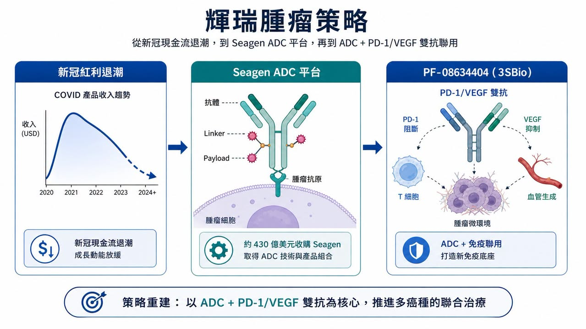
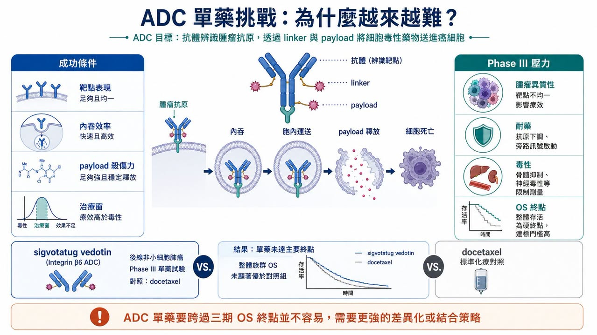
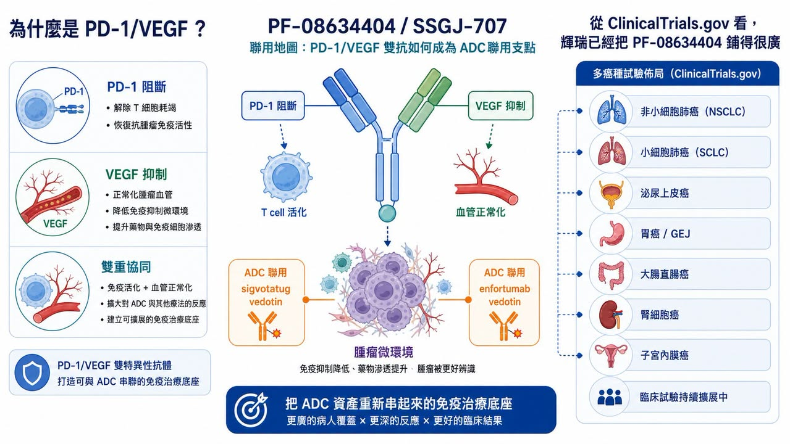
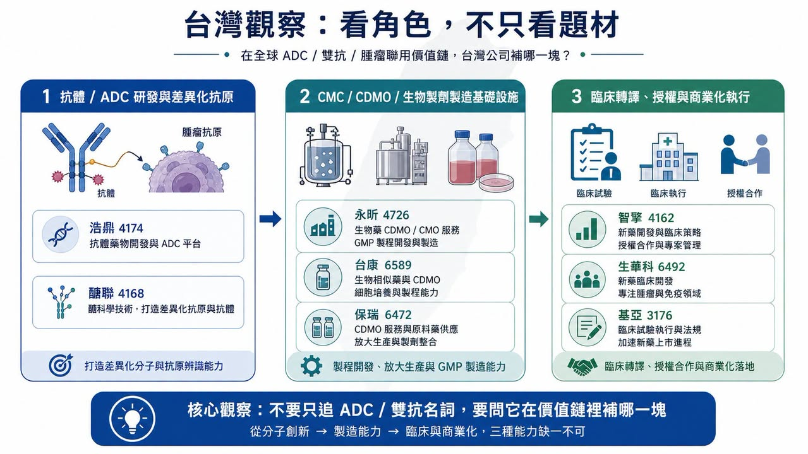

# 【輝瑞 ADC 賭局：430 億美元買下 Seagen 之後，為什麼 3SBio 的 PD-1/VEGF 雙抗變成新支點？】

輝瑞這幾年的腫瘤策略，看起來越來越像一場不能退場的牌局。

新冠疫苗與口服藥帶來的現金流退潮後，輝瑞必須重新回答一個問題：下一個十年的成長引擎在哪裡？

答案本來很清楚。

2023 年，輝瑞用約 430 億美元買下 Seagen，把全球最成熟的 ADC 平台之一收入旗下，試圖用抗體藥物複合體（ADC, antibody-drug conjugate）補回自己在免疫檢查點抑制劑時代錯過的機會。輝瑞官方當時說得很直接：Seagen 加入後，腫瘤管線規模幾乎倍增，涵蓋 ADC、小分子、雙抗與其他免疫療法。

但問題也從這裡開始。

ADC 不是買下平台就會自動長成金雞母。它仍然要過臨床終點、適應症選擇、競品壓力、毒性窗口、商業化定位這幾道門。尤其當一家公司用 430 億美元買下整個平台，市場不會只問「有沒有技術」，而會問：這些資產能不能真的變成下一批 blockbuster？

最近 sigvotatug vedotin 的 Phase III 單藥試驗未能達到主要終點，剛好把這個問題推到台前。

表面上看，這是輝瑞某一支 ADC 的臨床挫折。

這篇真正要拆的主線是：當 ADC 單藥敘事開始變硬，輝瑞正在把 3SBio（三生製藥）的 PD-1/VEGF 雙特異性抗體 SSGJ-707，也就是 Pfizer 代號 PF-08634404，放到整個腫瘤聯合療法策略的核心位置。

換句話說，輝瑞的 ADC 賭局，現在不只是 ADC 本身。

它正在變成「ADC 加上下一代免疫底座」的賭局。

## 01｜sigvotatug vedotin 失利，問題不只是單一試驗

sigvotatug vedotin 原本是 Seagen 帶給輝瑞的重要後期資產之一，早期代號 SGN-B6A。它是一款標靶 integrin beta-6（整合素 β6）的 ADC，主要被推向非小細胞肺癌等實體瘤。

integrin beta-6 在多種上皮來源腫瘤中表現，與腫瘤侵襲、轉移與不良預後有關。從機制上看，這類靶點很適合 ADC 的想像：抗體負責找癌細胞，linker 與 payload 負責把細胞毒性藥物送進去，理論上可以提高腫瘤選擇性，降低對正常組織的傷害。

但臨床不是理論簡報。

ClinicalTrials.gov 登錄的 NCT06012435 是一項 Phase III 試驗，設計為 sigvotatug vedotin 對比 docetaxel（多西他賽），用於先前治療過的非小細胞肺癌患者。這個比較本身很有象徵意義，因為 docetaxel 是老藥，也是後線肺癌治療裡很長期存在的對照標準。

原文提到，這項 SigVie-002 / Be6A Lung-01 試驗在整體族群中未能顯著改善總生存期（OS）。如果只看結果，這就是一個後線單藥 Phase III 失利。

但對輝瑞來說，壓力比一個試驗更大。

因為 sigvotatug vedotin 不是孤立資產。它是 Seagen 收購案後，市場用來檢查輝瑞 ADC 整合能力的一張考卷。當一款被寄予厚望的 ADC 單藥在關鍵後期試驗沒有打出明確優勢，投資人自然會重新問：430 億美元買來的，不只是技術平台嗎？還是買來一堆需要重新排序、重新搭配、重新下注的未完成資產？

這就是輝瑞現在的尷尬。

ADC 仍然是重要技術，但「ADC 單藥」不再自動等於高勝率。

## 02｜Seagen 收購案的核心，是輝瑞錯過 PD-1 黃金十年後的補課

要理解輝瑞為什麼願意付 430 億美元買 Seagen，不能只看 ADC 熱潮。

更深層的背景是，輝瑞在上一輪免疫腫瘤主戰場裡並沒有取得像 Merck 的 Keytruda（pembrolizumab）、BMS 的 Opdivo（nivolumab）那樣的核心位置。

Keytruda 幾乎成為過去十年腫瘤藥物商業化最重要的底座之一。從肺癌、黑色素瘤、腎癌、頭頸癌、胃癌到 MSI-H / dMMR 泛癌種，免疫檢查點抑制劑不只是單一產品，而是連接一整組聯合療法、臨床試驗與商業化路徑的平台。

輝瑞錯過這個時代，就必須在下一個時代找入口。

ADC 正好給了它一個答案。Seagen 有已上市產品，有 ADC 技術積累，也有多條臨床管線。對輝瑞來說，這不是單買一支藥，而是買一整套重新站進腫瘤核心戰場的門票。

官方資料顯示，輝瑞在 2023 年 12 月完成 Seagen 收購，交易企業價值約 430 億美元。Seagen 帶來的，不只是已上市產品如 ADCETRIS、PADCEV、TIVDAK 等，也包括後續 ADC 管線與技術平台。

可是，買平台和把平台變成可持續產品線，是兩件事。

ADC 的競爭已經比幾年前更擁擠。HER2、TROP2、Nectin-4、B7-H4、CLDN18.2、FRα，各種靶點都有人在做。payload 從 MMAE、MMAF、DXd、Topo I inhibitor 到更多新型毒素，平台故事越講越熱，但臨床終點也越來越嚴格。

對大藥廠來說，ADC 真正的挑戰不是「能不能做出一支 ADC」，而是：

靶點表現是否足夠區分腫瘤與正常組織？

payload 是否能打出療效，同時不把安全性窗口打爆？

linker 穩定性與旁觀者效應是否真的適合該癌種？

單藥能不能贏？若不能，能不能找到正確聯用？

在既有 PD-1、化療、標靶藥與其他 ADC 面前，商業定位是否清楚？

這些問題，才是 430 億美元收購案的真正考題。

## 03｜ADC 單藥越來越難，聯合療法才是下一個戰場

ADC 過去最迷人的地方，是它把抗體的標靶辨識能力和化療的殺傷力接在一起。簡單說，就是讓化療更會找路。

但當 ADC 進入更大癌種、更前線治療、更多競爭者時，單藥優勢會越來越難維持。

原因很簡單。

第一，後線患者通常已經接受多種治療，腫瘤異質性高，耐藥機制複雜。ADC 如果只靠單一靶點和單一 payload，不一定能跨過 OS 這種硬終點。

第二，前線治療已經被 PD-1 / PD-L1、化療、抗血管新生、標靶藥與其他聯用方案佔據。新的 ADC 不是和空白市場競爭，而是要證明自己能改變既有治療排序。

第三，ADC 自己也有毒性問題。肺毒性、眼毒性、周邊神經病變、骨髓抑制、肝毒性，依不同 payload 與靶點而異。聯用雖然能提高療效想像，但也可能放大毒性。

所以 ADC 的下一階段，不會只比誰有更多管線。

而是比誰能把 ADC 放到對的位置、配到對的免疫底座、選到對的病人族群。

這也是為什麼輝瑞現在更需要 PF-08634404。

如果 ADC 單藥不夠，輝瑞就需要一個能和 ADC 形成組合拳的免疫平台。過去這個角色多半是 Keytruda 或 Opdivo，但對輝瑞來說，一直靠別人的 PD-1 當底座，不可能真正建立自己的腫瘤生態系。

因此，PF-08634404 的價值，不只是多一款雙抗。

它可能是輝瑞把 Seagen ADC 資產重新串起來的免疫主幹。

## 04｜為什麼是 PD-1/VEGF？因為它想同時碰免疫與血管生成

PF-08634404 來自 3SBio 的 SSGJ-707，是一款 PD-1/VEGF 雙特異性抗體。

這個設計的概念，是把免疫檢查點抑制與抗血管新生放在同一個分子裡。PD-1 端負責解除 T 細胞煞車，VEGF 端則試圖改善腫瘤微環境裡血管生成、免疫抑制與腫瘤灌流等問題。

這條路線不是憑空出現。

近幾年，PD-1/VEGF 雙抗已經成為全球腫瘤免疫領域最受關注的方向之一。Merck 以高額交易拿下 Kelun Biotech 的 ADC 管線後，亞洲 biopharma 在 ADC 與雙抗上的全球存在感逐步上升；Summit 與 Akeso 合作的 ivonescimab（AK112）則讓 PD-1/VEGF 雙抗在肺癌領域被國際市場更認真看待。

輝瑞拿下 SSGJ-707，某種程度上也是在承認一件事：下一代腫瘤免疫的部分答案，可能不只來自美國或歐洲自有研發，也可能來自亞洲 biopharma 的快速試錯與臨床推進。

根據 Pfizer 2025 年 7 月 24 日公告，該公司完成與 3SBio 的全球授權協議，取得 SSGJ-707 在主要海外市場的開發、製造與商業化權利。SSGJ-707 是標靶 PD-1 與 VEGF 的雙抗，Pfizer 也明確提到，這個候選藥會補強其 ADC 產品組合，並用於多個主要腫瘤領域的聯合策略。

交易條件也很重。

3SBio 可取得 12.5 億美元付款，Pfizer 另投資 1 億美元入股，並取得未來擴大權利範圍的選擇權。這不是小型補管線交易，而是戰略型授權。

如果說 Seagen 是輝瑞買回 ADC 技術平台，那 PF-08634404 則像是輝瑞試圖買回一個新的免疫聯合療法支點。

## 05｜從 ClinicalTrials.gov 看，輝瑞已經把 PF-08634404 鋪得很廣
這件事不是口號。

ClinicalTrials.gov 目前已經可以看到 PF-08634404 多項臨床試驗，涵蓋非小細胞肺癌、小細胞肺癌、胃食道癌、轉移性大腸直腸癌、肝癌、腎細胞癌、泌尿上皮癌、子宮內膜癌等。

比較關鍵的是，這些試驗不只是單藥探索，而是大量聯用。

例如 NCT07222566 是 PF-08634404 聯合化療，用於局部晚期或轉移性非小細胞肺癌的 Phase III 試驗。NCT07226999 則是 PF-08634404 在廣泛期小細胞肺癌中與 atezolizumab、化療聯用的 Phase II/III 研究。NCT07421700 進一步把 PF-08634404 與 enfortumab vedotin（PADCEV）放到泌尿上皮癌裡測試。

更直接呼應這篇主題的是 NCT07227298。

這是一項 Phase I/II 試驗，名稱就寫得很清楚：PF-08634404 與不同抗癌藥物聯用，用於晚期癌症，其中介入項目包含 PF-08634404、sigvotatug vedotin 與其他聯合藥物。

換句話說，輝瑞已經在試著把「PD-1/VEGF 雙抗」和「integrin beta-6 ADC」接起來。

這裡的戰略意義很大。

如果 sigvotatug vedotin 單藥在後線 NSCLC 沒有打出足夠明確的 OS 優勢，輝瑞還有兩條路可以走：一是往更早線治療推，二是找更合適的聯用底座。PF-08634404 可能同時扮演這兩個角色。

這也是為什麼 SSGJ-707 可能成為支點。

它不是因為地區標籤而重要，而是因為輝瑞需要一個能把 ADC 資產重新組合、重新定位、重新推向大癌種的底層工具。

## 06｜輝瑞真正想複製的，可能是 PADCEV + Keytruda 的邏輯
如果要找一個輝瑞最想複製的成功案例，PADCEV 加 Keytruda 會是很合理的答案。

PADCEV（enfortumab vedotin）是標靶 Nectin-4 的 ADC，由 Seagen / Astellas 開發，後來成為泌尿上皮癌治療的重要資產。Keytruda 則是 Merck 的 PD-1。兩者聯用在一線局部晚期或轉移性泌尿上皮癌中打出很強的數據，讓 ADC 加免疫療法的商業想像大幅升高。

問題是，Keytruda 是 Merck 的。

對輝瑞來說，PADCEV + Keytruda 代表一個已被驗證的方向，但也提醒它一個尷尬現實：如果核心免疫底座不在自己手上，ADC 的平台價值就會被別人的 PD-1 分走一部分。

所以輝瑞如果想真正打造自己的腫瘤聯合療法生態，最終還是要有自己的免疫骨架。

PF-08634404 就在這個位置上。

它不一定要立刻取代所有 PD-1，也不一定每個適應症都會成功。但只要在肺癌、泌尿上皮癌、胃食道癌、大腸直腸癌或婦科腫瘤中跑出一兩個足夠強的聯用訊號，輝瑞就有機會把 Seagen 留下來的 ADC 資產，重新放進自己的臨床組合裡。

白話講，輝瑞不是只在買一款雙抗。

它是在買「不用永遠借 Keytruda 的路」。

## 07｜台灣投資人可以怎麼看？不要只看 ADC 題材，要看三種能力
放回台灣，這件事不能簡化成「誰是 ADC 概念股」。

ADC、雙抗、免疫聯用這些題材都很熱，但真正能被國際藥廠看見的，不是簡報上寫了 ADC 或 bispecific，而是有沒有能力回答三個問題：有沒有好靶點？有沒有可放大的製程與 CMC？有沒有足夠清楚的臨床定位？

台灣可以從幾個方向觀察。

第一，是真正做 ADC 或抗體平台的公司。

浩鼎（4174）長期布局醣脂抗原與抗體藥物，過去也有 ADC 相關管線與癌症免疫治療方向。這類公司值得看的不是短線題材，而是靶點選擇、臨床資料、授權可能性與是否能避開全球同質化競爭。

醣聯（4168）則可放在醣科學、抗體與特殊靶點開發的脈絡裡看。ADC 與雙抗競爭越來越擁擠後，真正有價值的不是又做一個熱門靶點，而是能不能找到差異化抗原與可轉譯的疾病定位。

第二，是生物製劑製程與 CDMO 能力。

永昕生醫（4726）與台康生技（6589）可從生物藥 CDMO、抗體製程、臨床用藥製造與國際法規製造角度觀察。未來如果更多 ADC、雙抗、融合蛋白、免疫聯用資產進入臨床，CMC、臨床用藥製造、品質系統與放大製程會越來越重要。

保瑞（6472）不是 ADC 研發公司，但它代表台灣少數具備國際併購、跨國製造與商業化整合經驗的製藥平台。當大藥廠越來越重視供應鏈彈性，這類能力可以放在更大的「製藥基礎設施」裡觀察。

第三，是已經走到商業化或臨床後段的新藥公司。

智擎（4162）可以從腫瘤藥物國際授權與商業化經驗切入。它不是 ADC 題材，但能提醒市場：一個台灣新藥資產要被國際市場認真看，最後還是要回到臨床定位、授權條件、法規路徑與商業化執行。

生華科（6492）與基亞（3176）則可以放在腫瘤臨床轉譯、試驗執行與疾病機制選擇的角度觀察。這類公司不是看題材名稱，而是看臨床設計、病人分層與資料能不能累積到足以支撐下一輪合作。

台灣投資人不要只問：誰有 ADC？

更應該問：誰的靶點不是 me-too？誰有臨床轉譯能力？誰有製程與 CMC 能力？誰能接上國際藥廠的聯合療法需求？

這才是輝瑞這件事給台股的啟示。

## 08｜這場賭局真正的風險：雙抗不是萬靈丹，ADC 也不是免死金牌
當然，PF-08634404 也不是萬靈丹。

PD-1/VEGF 雙抗本身還需要更多全球 Phase III 資料驗證。早期或中期資料能不能外推到全球多族群？和既有 PD-1、PD-L1、VEGF 抑制劑、化療、ADC 聯用時，安全性是否可控？在不同癌種裡，真正能打出商業化優勢的是哪幾個？這些都還沒答案。

ADC 也是一樣。

一款 ADC 單藥失利，不代表整個平台失敗；但一款 ADC 早期數據漂亮，也不代表 Phase III 一定成功。ADC 最終會被很現實的問題檢驗：OS 有沒有改善？PFS 是否足夠？ORR 能不能轉成長期獲益？毒性可不可管理？和標準治療相比，有沒有足夠理由改變醫師處方？

輝瑞現在真正的挑戰，是同時解兩道題。

第一道，是證明 Seagen 的 ADC 資產不只是昂貴收藏，而能成為可持續的產品線。

第二道，是證明 PF-08634404 不只是漂亮的授權交易，而能成為輝瑞腫瘤聯合療法的新底座。

這兩道題如果同時答對，輝瑞就有機會補回 PD-1 時代錯過的東西。

如果答錯，430 億美元的 Seagen 收購、12.5 億美元前金的 3SBio 授權，以及一整套 ADC 加免疫聯用想像，都會被市場重新打折。

## 結語｜輝瑞不是只押 ADC，而是在重建自己的腫瘤底座
輝瑞這場 ADC 賭局，表面上是 sigvotatug vedotin 單藥 Phase III 失利。

但更深一層，是一個大藥廠在錯過 PD-1 黃金十年後，如何用 ADC、雙抗與聯合療法重新爭取腫瘤市場的主導權。

Seagen 讓輝瑞拿到 ADC 平台。

PF-08634404 讓輝瑞有機會建立自己的新免疫底座。

ClinicalTrials.gov 上一串以 Symbiotic 命名的試驗，某種程度上已經把輝瑞的想法寫出來了：不是單一藥物作戰，而是把雙抗、ADC、化療、免疫療法放進不同癌種裡重新排列組合。

這是一條可能很有價值的路，但也是一條非常昂貴、非常考驗臨床執行力的路。

對台灣投資人來說，這篇最重要的啟示不是追逐 ADC 熱門字眼。

而是要看懂：下一階段腫瘤新藥的價值，會從單一管線故事，走向平台能力、聯用設計、臨床定位與國際合作能力。

不是有 ADC 就值錢。

不是有雙抗就值錢。

真正值錢的是，誰能把這些技術放到正確的癌種、正確的治療線、正確的病人族群裡，最後真的改變標準治療。

輝瑞這場賭局，還沒有開獎。

但它已經提醒市場：腫瘤藥的下一輪競爭，不會只比誰手上牌多，而是比誰能把牌組成一套真的能贏的打法。

參考資料：

1. Pfizer, [Pfizer Completes Acquisition of Seagen](https://www.pfizer.com/news/press-release/press-release-detail/pfizer-completes-acquisition-seagen), 2023/12/14。

2. Pfizer, [Pfizer Completes Licensing Agreement with 3SBio](https://www.pfizer.com/news/press-release/press-release-detail/pfizer-completes-licensing-agreement-3sbio), 2025/07/24。

3. ClinicalTrials.gov, [NCT06012435, SGN-B6A versus docetaxel in previously treated NSCLC](https://clinicaltrials.gov/study/NCT06012435)。

4. ClinicalTrials.gov, [NCT06758401, sigvotatug vedotin plus pembrolizumab in PD-L1 high NSCLC](https://clinicaltrials.gov/study/NCT06758401)。

5. ClinicalTrials.gov, [NCT07227298, PF-08634404 combination study in advanced cancers](https://clinicaltrials.gov/study/NCT07227298)。

6. ClinicalTrials.gov, [NCT07222566, PF-08634404 plus chemotherapy in NSCLC](https://clinicaltrials.gov/study/NCT07222566)。

7. ClinicalTrials.gov, [NCT07226999, PF-08634404 in extensive-stage small cell lung cancer](https://clinicaltrials.gov/study/NCT07226999)。

8. ClinicalTrials.gov, [NCT07421700, PF-08634404 plus enfortumab vedotin in urothelial cancer](https://clinicaltrials.gov/study/NCT07421700)。

免責聲明：本文僅為產業研究與市場觀察，不構成任何投資建議、買賣建議或個股推薦。生技醫藥投資涉及臨床試驗、法規審查、授權談判、商業化、匯率與資本市場波動等多重風險，投資人應自行判斷並自負盈虧。

更多生技醫藥產業研究與公司觀察，歡迎追蹤藥時事官方網站：

https://drugnews.com.tw/

---

本文僅供產業研究與知識分享，不構成投資、醫療、募資或個股建議。
