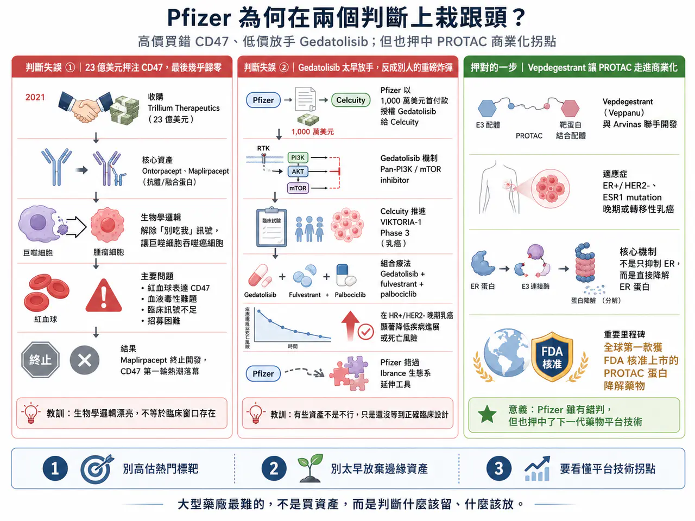
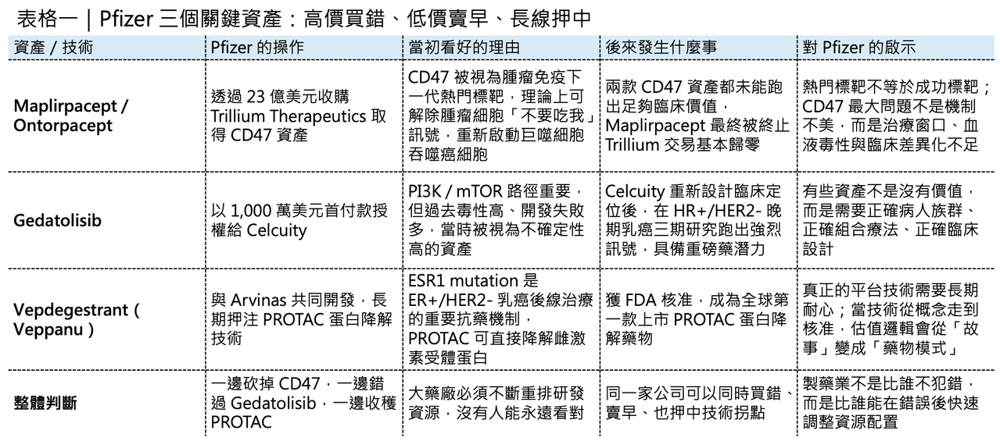
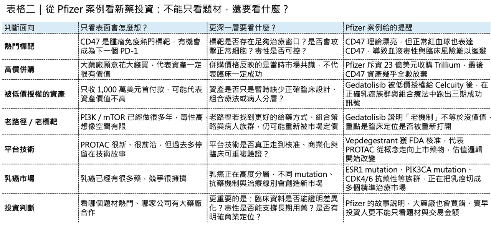

# 大藥廠 輝瑞在兩個判斷上栽跟頭？

【「賤賣」重磅炸彈，Pfizer 為何在兩個判斷上栽跟頭？】

Pfizer 正站在一個很微妙的十字路口。

一邊，是它與 Arvinas 聯手研發的 Vepdegestrant（Veppanu） 獲 FDA 核准，用於治療 ER+/HER2-、帶有 ESR1 mutation 的晚期或轉移性乳癌。這不只是乳癌治療的一個新選項，更是全球第一款獲 FDA 核准上市的 PROTAC 蛋白降解藥物，正式把蛋白降解技術推進商業化元年。

另一邊，Pfizer 在最新管線調整中，終止了從 Trillium Therapeutics 收購而來的最後一款 CD47 資產 Maplirpacept。這意味著，當年斥資約 23 億美元押注 CD47 的交易，最後幾乎沒有留下可商業化的核心產品。

更尷尬的是，Pfizer 早年以 1,000 萬美元首付款授權出去的 Gedatolisib，如今卻在 Celcuity 手中跑出漂亮三期數據，展現出成為重磅乳癌藥物的潛力。Celcuity 先前公布的 Phase 3 VIKTORIA-1 數據顯示，Gedatolisib 與 Faslodex（fulvestrant）、Ibrance（palbociclib） 的組合，在 HR+/HER2- 晚期乳癌中顯著降低疾病進展或死亡風險，消息一出公司股價大幅上漲。

這就是大型藥廠最殘酷的日常：

📌 有時候高價買進的明星標靶，最後變成沉沒成本。

📌 有時候低價放手的邊緣資產，反而在別人手上長成重磅炸彈。

而真正考驗管理層的，從來不是單一交易的輸贏，而是能不能在錯誤、放棄與堅持之間，重新配置資本。Pfizer 這幾年的故事，正好把這件事講得非常清楚。

## 01｜CD47：23 億美元買來的「別吃我」幻夢

時間回到 2021 年。

Pfizer 宣布以約 23 億美元收購 Trillium Therapeutics。那個時候，CD47 是腫瘤免疫領域最火熱的標靶之一。CD47 的邏輯非常迷人。腫瘤細胞會透過 CD47 向巨噬細胞發出「不要吃我」的訊號，讓免疫系統放過它。只要阻斷 CD47 / SIRPα 通路，理論上就能解除這個免疫偽裝，讓巨噬細胞重新吞噬癌細胞。這和 Keytruda（pembrolizumab）、Opdivo（nivolumab） 這類 PD-1 藥物不同。

🧬PD-1 是把 T 細胞重新叫醒。🧬CD47 則是讓巨噬細胞重新開吃。

一個打的是後天免疫。一個打的是先天免疫。

當年市場對 CD47 的想像非常大，因為它看起來像是腫瘤免疫的另一扇門。PD-1 已經證明免疫療法可以改寫腫瘤治療，而 CD47 則被期待成為下一個免疫檢查點。但問題也很快浮上水面。CD47 不只存在於腫瘤細胞，也廣泛存在於正常細胞，尤其是紅血球。這讓許多早期 CD47 藥物繞不開一個核心毒性：血液學副作用，特別是貧血、溶血、輸血需求與骨髓抑制。Trillium 帶給 Pfizer 的兩款核心資產，是 Ontorpacept 和 Maplirpacept。它們都是圍繞 CD47 軸設計的融合蛋白，試圖透過分子工程降低對正常紅血球的結合，減少 CD47 賽道最棘手的血液毒性。

設計邏輯不差。但臨床訊號沒有撐起當初的期待。

Ontorpacept 曾被推進軟組織肉瘤相關研究，但後來從 Pfizer 管線中消失。Maplirpacept 則一度在血液腫瘤中繼續探索，包含與 Monjuvi（tafasitamab）、Revlimid（lenalidomide） 聯用治療 B 細胞淋巴瘤，但相關研究因病患招募問題被終止，後續 Pfizer 也在整體腫瘤組合重排中放棄這項資產。

至此，Pfizer 對 Trillium 的 23 億美元收購，基本宣告失敗。

這不是 Pfizer 一家公司看錯。CD47 整個賽道都曾經集體過熱。最典型的案例，是 Gilead 以 49 億美元收購 Forty Seven，拿下當時全球最受期待的 CD47 抗體 Magrolimab。但後續在 AML、MDS 等多個方向不斷受挫，安全性與療效都沒有如市場預期展開。Gilead 最終全面停止 Magrolimab 開發，也讓 CD47 從「下一個 PD-1」變成腫瘤免疫史上最昂貴的反省案例之一。

Pfizer 這次撤出 Maplirpacept，本質上不是單一公司撤退，而是 CD47 第一輪資本熱潮的尾聲。

它留下的教訓很清楚：

🧬生物學邏輯漂亮，不等於臨床窗口存在。

🧬免疫機制新穎，不等於治療指數足夠。

🧬市場敘事很大，不等於藥物能承受正常組織毒性的現實。

## 02｜Gedatolisib：被 Pfizer 太早放手的乳癌武器

如果說 CD47 是 Pfizer 高價買錯，那 Gedatolisib 就是另一種心痛：低價賣早。

Gedatolisib 是一款泛 PI3K / mTOR inhibitor。

PI3K / AKT / mTOR 是腫瘤訊號傳導裡非常經典的路徑，尤其在乳癌中具有明確生物學意義。問題是，這條路雖然重要，卻非常難做。因為 PI3K / mTOR 路徑不只存在於癌細胞，也與正常代謝、血糖控制、免疫反應密切相關。抑制太強，毒性就上來；抑制太弱，療效又不夠。這也是為什麼 PI3K 藥物一路走來爭議很大。

Novartis 的 Piqray（alpelisib） 是這條賽道最具代表性的商業化產品之一，用於 HR+/HER2-、PIK3CA mutation 乳癌。但 Piqray 的高血糖、皮疹、腸胃道副作用，一直是臨床應用中的痛點。

站在 2021 年，Pfizer 以 1,000 萬美元首付款將 Gedatolisib 授權給 Celcuity，當時並不難理解。

💊 一方面，Pfizer 自己有龐大管線要重排。

💊 另一方面，PI3K / mTOR 賽道過去失敗太多。

💊 再加上當時乳癌創新焦點，正逐步轉向 SERD、ADC、CDK4/6 後線策略與更精準的病人分層。

Gedatolisib 看起來像一顆不確定性很高的種子。但 Celcuity 接手後，這顆種子開始發芽。

在 VIKTORIA-1 研究中，Gedatolisib 與 Faslodex、Ibrance 組合，在 HR+/HER2- 晚期乳癌患者中交出強烈訊號。對先前接受 CDK4/6 inhibitor 與 aromatase inhibitor 治療後疾病進展的患者，Gedatolisib 三藥組合顯著降低疾病進展或死亡風險。這件事對 Pfizer 來說尤其尷尬。因為 Ibrance 本來就是 Pfizer 自己的乳癌核心產品。如果 Gedatolisib 留在 Pfizer 手中，它原本有機會成為 Ibrance 生態的一個後線延伸工具。乳癌治療正在進入高度分層時代。ER+/HER2- 乳癌已經不是單一市場，而是被 ESR1 mutation、PIK3CA mutation、AKT pathway、CDK4/6 resistance、內分泌抗藥性、HER2-low、ADC sequencing 等因素重新切割。

誰手上有更多機制互補的工具，誰就有機會建構完整治療地圖。

Pfizer 現在有 Vepdegestrant，這是好事。但它失去 Gedatolisib，也意味著在 PI3K / mTOR 這條抗藥性處理路線上，少了一把可能很有價值的武器。這不是事後諸葛。而是製藥公司資源配置最難的地方：

💊 每一家公司都必須砍管線。

💊 但有些管線被砍，是因為真的不值得。

💊 有些管線被砍，是因為它還沒等到正確的臨床設計與正確的病人族群。

Gedatolisib 很可能屬於後者。

## 03｜Vepdegestrant：Pfizer 也不是只會看錯

當然，如果只看 CD47 與 Gedatolisib，會讓 Pfizer 顯得像一個連續踩雷的大藥廠。

但事情沒有這麼簡單。Pfizer 在蛋白降解領域，反而押中了重要拐點。Vepdegestrant（Veppanu） 的核准，是 PROTAC 技術史上的里程碑。這款藥不是傳統抑制劑，而是透過蛋白降解機制，誘導雌激素受體蛋白被細胞自身的蛋白酶體系統清除。這和傳統內分泌治療不同。傳統藥物多半是阻斷受體訊號。

PROTAC 的邏輯則是把病理蛋白直接拖去「銷毀」。

Vepdegestrant 瞄準的是 ER+/HER2-、ESR1 mutation 晚期或轉移性乳癌。ESR1 mutation 是內分泌治療抗藥性的重要來源，也是乳癌後線治療升級的核心族群。這次核准也同步凸顯一個重要趨勢：乳癌治療已經從「器官分類」進入「突變與抗藥機制分類」。

同樣是 ER+/HER2- 乳癌，ESR1 mutation、PIK3CA mutation、AKT pathway activation、HER2-low、CDK4/6 resistance，會走向完全不同的治療策略。Vepdegestrant 的價值，不只是多了一個乳癌藥，而是證明 PROTAC 這類蛋白降解技術終於能走到 FDA approval。這代表蛋白降解不再只是資本市場上的技術故事，而是開始變成可上市、可處方、可商業化的藥物模式。

🧩ADC 已經很擁擠。

🧩雙抗已經很擁擠。

🧩細胞治療成本高、場景受限。

🧩蛋白降解則提供另一種藥物設計路徑：不是抑制蛋白，而是移除蛋白。

Pfizer 在這裡沒有錯過。甚至可以說，Pfizer 在 PROTAC 的成功，部分抵消了 CD47 的失敗。

## 04｜大型藥廠最難的不是買，而是判斷什麼該留

Pfizer 這次故事之所以值得看，不是因為它犯錯，所有大藥廠都會犯錯，真正值得看的是，大藥廠在資本配置上面臨越來越殘酷的選擇。

過去的大型藥廠，管線很多，錢也多，可以廣撒網，現在不一樣。

⚖️ 專利懸崖在逼近。

⚖️研發成功率下降。

⚖️ 臨床試驗成本暴漲。

⚖️資本市場不再容忍無止境燒錢。

⚖️投資人要求更清楚的資源配置紀律。

所以 Pfizer 必須砍掉 CD47，也必須砍掉 EGFR T cell engager，也必須砍掉部分免疫刺激偶聯藥物與早期皮膚科資產，這不是單純縮編，而是優先順序重排。Pfizer 現在要回答的問題不是「我們能不能做很多東西」，而是：

⚖️哪些東西值得用 Pfizer 的臨床資源推到底？

⚖️哪些東西即使科學上有趣，也不值得繼續燒錢？

⚖️哪些資產應該早點授權出去？

⚖️哪些資產即使短期不確定，也應該堅持？

這是每一家大型藥廠都會遇到的問題，CD47 告訴我們，熱門標靶不是免死金牌，Gedatolisib 告訴我們，過早放棄可能讓未來重磅炸彈流到別人手上，Vepdegestrant 告訴我們，真正的技術拐點需要長期堅持。所以 Pfizer 的故事不是單純「看錯兩次」。更準確地說，它暴露了製藥業最難的三件事：

🌏第一，判斷一個標靶是不是被市場過度神化。

🌏第二，判斷一個早期資產是不是只是暫時缺少正確臨床設計。

🌏第三，判斷一項平台技術何時會從科學概念變成可上市產品。

這三件事，沒有任何一家藥廠能永遠答對。

## 05｜台灣的CD47

第一個是 漢康-KY（7827）。

漢康-KY 是台灣少數直接踩在 CD47 / SIRPα 路徑上的公司，核心產品 HCB101 是 SIRPα-Fc fusion protein，主打降低與紅血球 CD47 結合、改善安全性，同時誘導巨噬細胞吞噬癌細胞。漢康-KY 已於 2025 年登錄興櫃，並以 FBDB 平台開發多功能融合蛋白免疫療法。

但這裡要講清楚。Pfizer 與 Gilead 在 CD47 上的失敗，不代表 CD47 完全沒有機會；但它代表這條路已經不再適合用「下一個 PD-1」這種敘事包裝。未來 CD47 類藥物如果要被國際藥廠重新認真看待，必須回答三個問題：

🌏能不能避開紅血球毒性？

🌏能不能在實體瘤或血液瘤中拿出真正可重複的療效訊號？

🌏能不能找到比 Magrolimab、Ontorpacept、Maplirpacept 更清楚的差異化臨床定位？

所以漢康-KY 的投資敘事，不應該是「CD47 又紅了」，而應該是「在 CD47 第一代失敗後，下一代分子設計能不能重建治療窗口」。這才是關鍵。

【結語｜Pfizer 的兩次栽倒，說穿了是製藥業的常態】

Pfizer 這一輪故事，可以用三句話概括。

✨ CD47，是高價買進一個被市場過度神化的免疫標靶，最後不得不止損。

✨ Gedatolisib，是低價放手一個當時看起來不夠性感、但後來被正確臨床設計救回來的資產。

✨ Vepdegestrant，則是堅持蛋白降解技術多年後，終於等到第一個商業化里程碑。

這不是一家公司單純犯錯的故事，這是製藥業本質的縮影，新藥研發不是線性邏輯。

✨ 不是熱門標靶一定成功。

✨ 不是冷門資產一定失敗。

✨ 不是高價收購一定買到未來。

✨ 也不是便宜授權出去的東西就一定不值錢。

真正重要的是，藥廠能不能在每一次失敗後，重新理解疾病生物學、臨床設計、毒性窗口與商業場景。Pfizer 栽倒了兩次，但它也跑出了第一款上市 PROTAC，這就是製藥業最真實的樣子。

一邊是昂貴錯誤。

一邊是意外錯過。

另一邊，是終於兌現的技術拐點。

沒有任何一家公司能永遠看對，但真正的強者，是在看錯之後，還有能力繼續押中下一個時代。

------------

參考資料：

[0]: 各公司官網＆公開資料

[1]:

reuters.com

https://www.reuters.com/business/healthcare-pharmaceuticals/us-fda-approves-pfizer-arvinas-breast-cancer-drug-2026-05-01/

www.reuters.com

[2]:

Pfizer’s $2.3B bet ends in failure as CD47 blocker scrapped

The Big Pharma has abandoned the second and final clinical-stage candidate from the Trillium acquisition.

www.fiercebiotech.com

[3]:

Celcuity Stock Triples on Positive Breast Cancer Treatment Study

Celcuity shares skyrocketed to an all-time high when the biotech reported positive results from a Phase 3 trial of its treatment for certain kinds of breast cancer.

www.investopedia.com

[4]:

Pfizer Ends Mid-Stage Trial for CD47 Blood Cancer Drug, Citing Recruitment Problems - BioSpace

Pfizer insists that the discontinuation of the Phase II study was due to recruitment difficulties and was not linked to maplirpacept’s safety or efficacy.

www.biospace.com

[5]:

生技股添新兵 漢康6月20日登興櫃聚焦免疫腫瘤創新藥 | 生醫產業熱點 | 台灣光鹽生物科技學苑

生技股添新兵，專注於免疫腫瘤的創新生物藥開發的漢康 - KY(7827-TW) 將於 6 月 20 日登興櫃。漢康以自建 FBDB 平台為基礎，開發融合蛋白生物藥，專攻腫瘤細胞的免疫偽裝路徑 SIRPα/CD47，具有突破現有 PD-1/PD-L1 免疫療法的潛力。

www.biotech-edu.com

本文僅供產業研究與知識分享，不構成投資、醫療、募資或個股建議。
