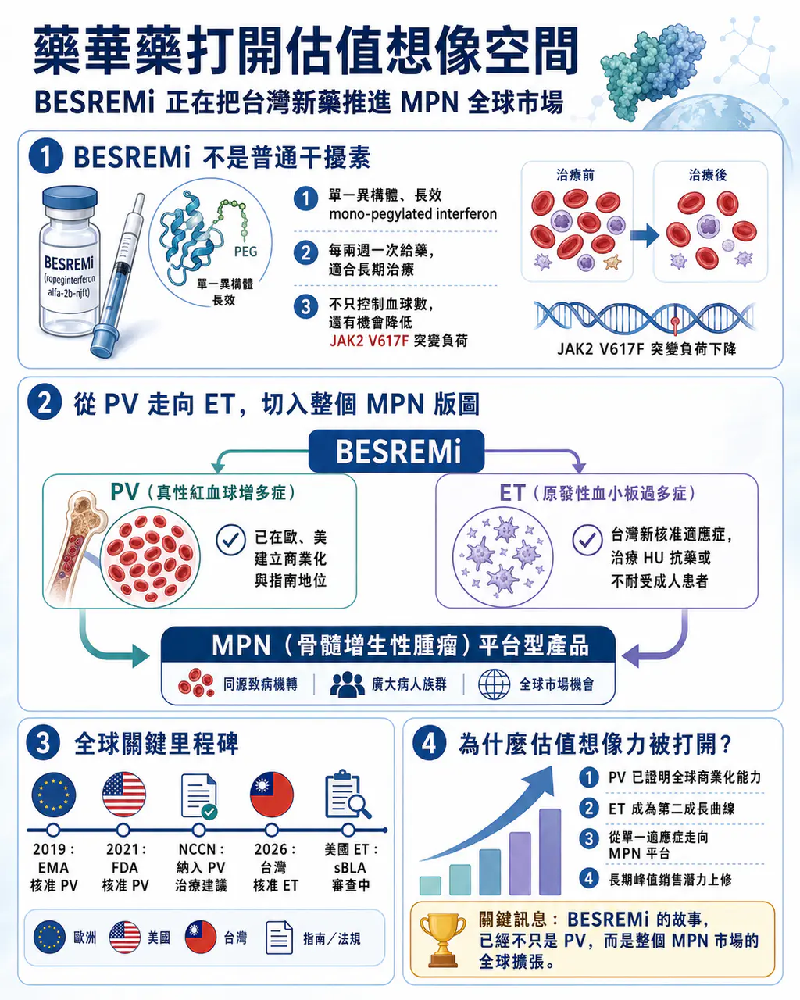
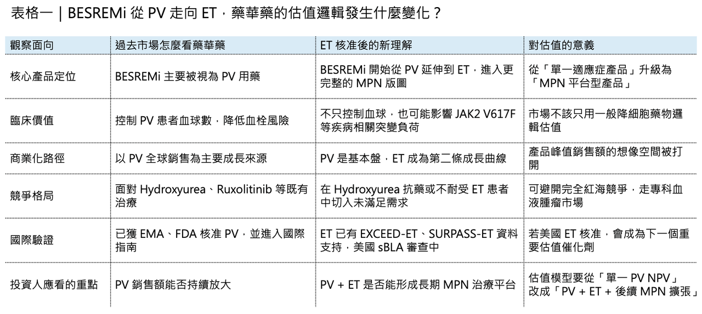
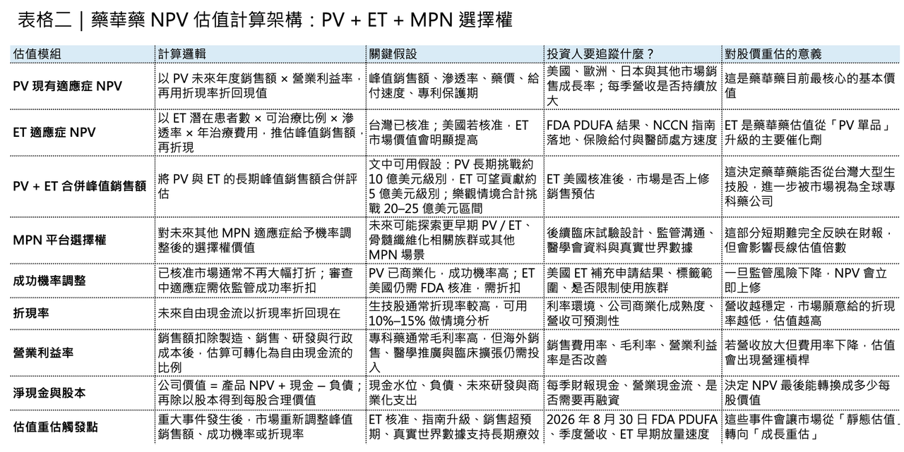
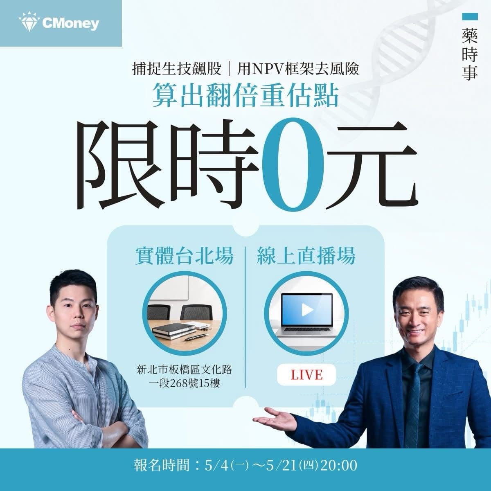

# 藥華藥 打開估值想像空間

(已編輯)

【藥華藥不是只靠一個 PV 適應症：BESREMi 正在把「台灣新藥」推進 MPN 全球市場】

💡 今天藥華藥（6446）漲停！

因為 BESREMi（ropeginterferon alfa-2b）在台灣正式獲衛福部核准用於原發性血小板過多症（Essential Thrombocythemia, ET）成人病人，適用於接受 Hydroxyurea 治療後產生抗藥性或無法耐受的患者。

這代表藥華藥的核心產品正在從真性紅血球增多症（Polycythemia Vera, PV），往更大的骨髓增生性腫瘤（Myeloproliferative Neoplasms, MPN）版圖擴張。BESREMi 不是一般的幹擾素，它真正的價值在於：用一個高度純化、長效、可長期給藥的 ropeginterferon alfa-2b，把過去被視為「控制血球數」的慢性血液腫瘤治療，逐步推向「疾病修飾」的方向。

台灣生技公司過去常被市場貼上「研發夢很大、商業化很遠」的標籤，但藥華藥持續兌現對投資人的承諾！證明台灣的生技依然是有全球化能力的。從台灣出發，直接挑戰歐美血液腫瘤市場，靠臨床數據、藥證、指南、商業化和適應症擴張，一步一步建立全球產品價值。而最重要的，這個新的適應症將打開 藥華藥 的市場銷售空間，估值想像力再次飛升！

## 01｜為什麼 BESREMi 不是普通幹擾素？

🧬 干擾素不是新東西。

干擾素 （Interferon） 是人體自然存在的免疫調節蛋白，過去曾被大量用於病毒性肝炎、血液疾病與部分腫瘤治療。問題在於，傳統干擾素常見副作用較多，給藥頻率高，長期耐受性不佳。即使後來出現 pegylated interferon，也仍然存在分子組成不夠均一、藥物暴露不夠理想、患者長期使用負擔較大等問題。

BESREMi 的差異，在於它是 ropeginterferon alfa-2b，一種單一異構體、長效型的 mono-pegylated interferon。

這個設計有三個關鍵意義。

💡 第一，它不是一團結構不均一的混合物，而是更接近「精準設計」的長效 interferon。分子均一性提升後，藥物在體內的行為更可預測，對慢性疾病長期管理非常重要。

💡 第二，它的半衰期更長，臨床上可以採取每兩週一次的給藥節奏。對 PV、ET 這類需要多年治療的慢性血液腫瘤患者而言，給藥便利性不只是生活品質問題，也會直接影響長期治療持續率。

💡 第三，它不只是壓低血球數，而是有機會降低 JAK2 V617F 等疾病相關突變負荷。這是 BESREMi 與傳統降細胞藥物最大的不同。

Hydroxyurea 可以控制血球數。Ruxolitinib 可以改善症狀，尤其在 Hydroxyurea 抗藥或不耐受的 PV 患者中有其位置。但 interferon 的特殊性在於，它有機會更上游地作用於異常造血克隆。也因此，BESREMi 的價值不僅僅是「多一個可以治療的藥物」，而是把 PV / ET 治療從單純控制血球，推向更接近疾病修飾的方向。

## 02｜PV：BESREMi 第一個打穿的全球市場

🌍 BESREMi 最早真正打開國際市場，是在 PV。

PV 是一種費城染色體陰性的 MPN。患者骨髓過度製造紅血球，常伴隨白血球與血小板升高，血液黏稠度上升，進而增加血栓、中風、心肌梗塞、靜脈栓塞等風險。

過去 PV 治療核心是三件事：放血、低劑量 Aspirin，以及以 Hydroxyurea 為主的降細胞治療。這些治療可以降低血栓風險，但很難說真正改變疾病根源。

BESREMi 的突破，是在 PROUD-PV 與 CONTINUATION-PV 這組長期臨床資料中逐漸展現出來。

在 12 個月時，BESREMi 與 Hydroxyurea 的血液學控制看起來差距不大；但隨著時間拉長，ropeginterferon alfa-2b 的長期優勢開始浮現。PROUD-PV / CONTINUATION-PV 的公開資料顯示，在 36 個月時，BESREMi 在完全血液學反應與分子反應方面優於 Hydroxyurea 或標準治療，特別是長期分子反應更具差異化。

這裡的重點不是短期控制，而是長期趨勢。

PV 不是急性疾病，患者可能需要十年、二十年甚至更久的疾病管理。如果一個藥只能短期把血球數壓下來，和一個藥能長期降低突變克隆負荷，兩者在估值與臨床定位上完全不同。這也是為什麼 BESREMi 能成為 PV 領域少數真正具備全球辨識度的台灣新藥。2019 年，BESREMi 獲 EMA 核准用於成人 PV；2021 年，美國 FDA 核准 BESREMi 用於成人 PV，成為美國第一個核准用於 PV 的 interferon 治療。更重要的是，它後續被納入 NCCN 治療指南。公開資訊顯示，NCCN 曾將 ropeginterferon alfa-2b 列為成人 PV 治療的優先選項，這對美國市場准入、醫師處方信心與支付端接受度都有實質意義。

對創新藥公司而言，藥證只是第一關。

真正能讓產品變成商業資產的，是指南、支付、醫師教育與長期真實世界使用。藥華藥在 PV 上的難得之處，就在於它不是只拿到一張藥證，而是把 BESREMi 推進國際血液腫瘤治療體系。

## 03｜今天 ET 核准，為什麼是另一個關鍵節點？

🩸 ET 和 PV 一樣，同屬 MPN 家族。

ET 的核心特徵是骨髓過度製造血小板。患者可能面臨血栓、出血、脾臟腫大等風險，也有一部分患者長期可能進展至骨髓纖維化或急性白血病。

過去 ET 治療工具並不算多。Hydroxyurea 是常用降細胞治療；Anagrelide 也有其角色；部分患者會使用 interferon。問題是，對 Hydroxyurea 抗藥或不耐受的患者，治療選擇仍然有限。

這次 BESREMi 在台灣獲准用於 Hydroxyurea 抗藥或不耐受的 ET 成人患者，意義就在於它把藥華藥的商業故事從 PV 延伸到 ET。

這不只是市場變大。

更重要的是，BESREMi 正在從單一疾病藥物，變成 MPN 平台型產品。

🩸 PV 是紅血球過度增生。

🩸 ET 是血小板過度增生。

兩者底層都與異常造血克隆、JAK-STAT 訊號路徑、慢性骨髓增生有關。若 ropeginterferon alfa-2b 能在不同 MPN 亞型中逐步累積臨床證據，它的價值就不再只是 PV 單品，而是整個 MPN 慢性治療平台。

藥華藥的估值，不該只看「現在 PV 賣多少」。更重要的是看 BESREMi 能不能完成三件事：

📌 第一，PV 全球商業化能不能持續放大。

📌 第二，ET 能不能取得更多市場核准與指南支持。

📌 第三，未來能否繼續往其他 MPN 適應症延伸，例如骨髓纖維化相關族群或更早期治療場景。

## 04｜ET 的國際線：美國 FDA 與 NCCN 已經提前給出訊號

今天台灣 ET 核准之前，國際市場其實早就已經有幾個重要訊號。

2026 年 1 月，PharmaEssentia 公布 EXCEED-ET Phase 2b 數據。這項北美研究納入 91 名 ET 患者，其中包括 Hydroxyurea 經治患者與未治療患者。公開資料顯示，在整體 ET 族群中，第 10 至 13 個月的反應率約 60.2%；治療未經治療患者的反應率更高，達 68.0%，而 Hydroxyurea 經治患者為 33.4%。研究也觀察到 JAK2 V617F allele burden 從基線 22.2% 降至第 13 個月的 15.4%。

這些數字的意義，不只是血小板控制。

ET 治療最怕的是只看到表面血球數改善，卻沒有看到疾病生物學被真正影響。若 JAK2 V617F allele burden 能隨治療下降，代表藥物可能不只是控制血球，而是對異常造血克隆產生壓力。

同月，美國 FDA 接受 BESREMi 用於 ET 的 sBLA 補充申請，PDUFA 目標日期為 2026 年 8 月 30 日。藥華藥 表示，這項申請由 Phase 3 SURPASS-ET 與 Phase 2b EXCEED-ET 資料支持。

更值得注意的是，NCCN 也已更新指南，將 ropeginterferon alfa-2b-njft 納入 ET 治療建議，並列為 Category 1 preferred regimen，用於對既有治療反應不足或失去反應的高風險 ET 患者。NCCN 指南在美國腫瘤與血液疾病治療裡，不只影響醫師處方，也會影響保險給付與市場准入。

所以，這次台灣核准 ET 不是孤立事件。它更像是 BESREMi 全球 ET 擴張路線中的一塊拼圖。

台灣先核准。美國 FDA 審查進行中。NCCN 已經提前把證據納入臨床治療框架。這三件事合在一起，才是藥華藥今天新聞背後真正的重點。

## 05｜PV 市場不大，但商業價值不能用「病人數」粗暴低估

💰 PV 和 ET 都不是動輒數千萬患者的大眾病。

但罕見慢性血液腫瘤的商業邏輯，不是靠超大病人數，而是靠四個特徵：

📌 第一，患者需要長期治療。

📌 第二，治療目標從控制血球，逐步走向避免血栓、延緩進展、降低突變負荷。

📌 第三，專科醫師高度集中，商業化不需要像糖尿病或高血壓那樣鋪設龐大銷售網。

📌 第四，只要進入指南與給付，產品生命週期可以很長。

這也是為什麼 PV / ET 這類市場看似小眾，但對創新藥公司卻非常重要。它不像腫瘤熱門大適應症那樣擠滿 PD-1、ADC、雙抗，也不像代謝病那樣被巨頭大規模價格戰壓制。若產品能建立清楚差異化，就有機會取得相對穩定的專科市場地位。

BESREMi 的特殊性在於，它不只是 another cytoreductive drug。它有一個非常清楚的定位：長效、可慢性給藥、以 interferon 機制作用於 MPN 疾病根源，並在 PV 與 ET 逐步建立臨床證據。這樣的產品在估值上，應該放在「罕見血液腫瘤長期治療平台」來看，而不是單純用一個 PV 適應症做靜態估值。

從估值角度看 PV 全球理論患者池約數百萬人，但真正可診斷、可治療、可支付的核心市場較小；目前 7 大主要市場 PV 藥物市場已接近 20 億美元等級。ET 則是第二條成長曲線，盛行率約每 10 萬人 24–30 人，7 大主要市場 ET 治療市場約 4 億美元以上，全球市場則有望往 10 億美元以上擴張。若 BESREMi 在 PV 長期做到 10 億美元年銷售額，ET 再貢獻 5 億美元，PV + ET 合計就有機會把產品推向 15 億美元級別；若美國 ET 核准、指南與給付順利轉化，長期峰值銷售額甚至有機會挑戰 20-25 億美元區間。這就是 ET 核准真正打開藥華藥估值想像力的地方。

【結語｜BESREMi 的故事，已經不只是 PV】

✨ BESREMi 最初打開世界，是靠 PV。

但今天更值得注意的是，它正在走出 PV，進入 ET，並試圖把整個 MPN 治療邏輯往前推。這款藥的意義，不只是證明台灣可以做出 FDA 核准新藥。更重要的是，它證明台灣公司也可以在全球專科血液腫瘤市場裡，靠臨床數據、指南、藥證與商業化能力，建立真正可估值、可追蹤、可放大的國際產品。

✨對病人來說，BESREMi 提供的是一個更長期、更有疾病修飾想像空間的治療選擇。

✨對產業來說，BESREMi 是台灣創新藥從「研發故事」走向「全球收入」的代表案例。

對投資人來說，藥華藥則是一堂非常難得的課：如何用 NPV 框架，看懂一款新藥從臨床數據、藥證、指南、適應症擴張，到全球商業化的價值重估過程。

而今天 ET 核准這一步，正是這場重估故事裡非常關鍵的一塊拼圖。

【藥時事 × 全曜財經｜生技類股理財課程上線】

【限時免費－台北場】藥時事｜捕捉生技飆股：用NPV框架算出翻倍重估點

課程裡我們會講解生技醫藥股的估值邏輯，以及投資人如何抓住被低估的生技股票！

我們更是會以台灣生技之光 藥華藥（6446）作為我們的案例拆解他的估值與目標價

以下為報名連結歡迎大家踴躍報名：

【限時免費-線上直播】藥時事｜捕捉生技飆股：用NPV框架算出翻倍重估點｜CMoney 理財寶

藥時事 X CMoney 攜手打造，推出由藥時事主講的《【限時免費-線上直播】藥時事｜捕捉生技飆股：用NPV框架算出翻倍重估點》課程，藉由藥時事的投資經驗分享，幫每一個人做好人生投資。2026年05月21日(四) 20:30-21:30開課，現在報名只要0元 (原價6666元)！限時限額開放，立即報名！

www.cmoney.tw

---------------

參考資料：

[1]:

藥華藥 (6446) 本公司新藥BESREMi（Ropeginterferon alfa-2b）獲 衛福部使用於原發性血小板過多症（ET）核准函 | GeneOnline News

序號：3 發言日期：115/05/12 發言時間：23:06:44 發言人：林國鐘 發言人職稱：執行長 發言人

geneonline.news

"藥華藥 (6446) 本公司新藥BESREMi（Ropeginterferon alfa-2b）獲 衛福部使用於原發性血小板過多症（ET）核准函 | GeneOnline News"

[2]:

www.sciencedirect.com

https://www.sciencedirect.com/science/article/abs/pii/S2352302619302364

www.sciencedirect.com

[3]:

Besremi | European Medicines Agency (EMA)

https://www.ema.europa.eu/en/medicines/human/EPAR/besremi

www.ema.europa.eu

[4]:

藥華藥(6446)新藥美國市場重大突破 獲美國NCCN治療指南  升格為 PV病患首選藥物 - 生技投資第一站-Genet 觀點

藥華藥（台灣櫃買中心股票代碼：6446）今（21）日宣布，美國國家綜合癌症資訊網NCCN（National Comprehensive Cancer Network）在最新的治療指南中，將BESREMi®（Ropeginterferon alfa-2b-njft，簡稱Ropeg，即P1101）在治療成人真性紅血球增多症（Polycythemia vera, PV），從「其他推薦」（other recommendation）升格為「首選藥物2A」（preferred regimen），預料將對美國銷售、以及

www.genetinfo.com

"藥華藥(6446)新藥美國市場重大突破 獲美國NCCN治療指南 升格為 PV病患首選藥物 - 生技投資第一站-Genet 觀點"

[5]:

Linkedin

EXCEED-ET Study Results Demonstrate Significant Efficacy, with Consistent Treatment Response Across the Overall Essential Thrombocythemia Population Results Extend Previously Reported Positive Phase 3 SURPASS-ET Study Data, Demonstrating Superior Efficacy

us.pharmaessentia.com

"PharmaEssentia Announces Positive Topline Phase 2b Data from EXCEED-ET Study Evaluating Ropeginterferon Alfa-2b-njft for Essential Thrombocythemia - PharmaEssentia"

本文僅供產業研究與知識分享，不構成投資、醫療、募資或個股建議。
