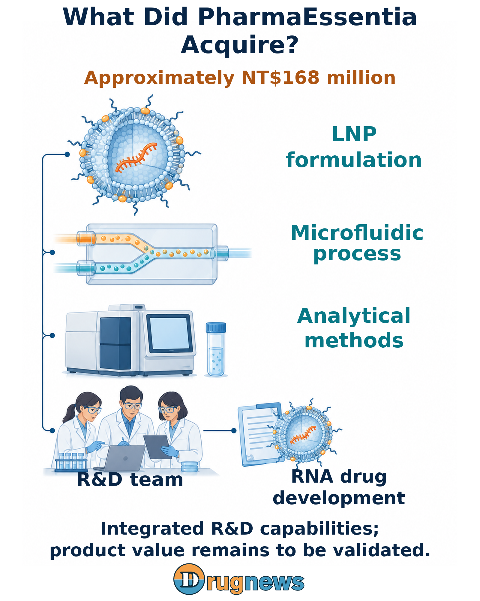
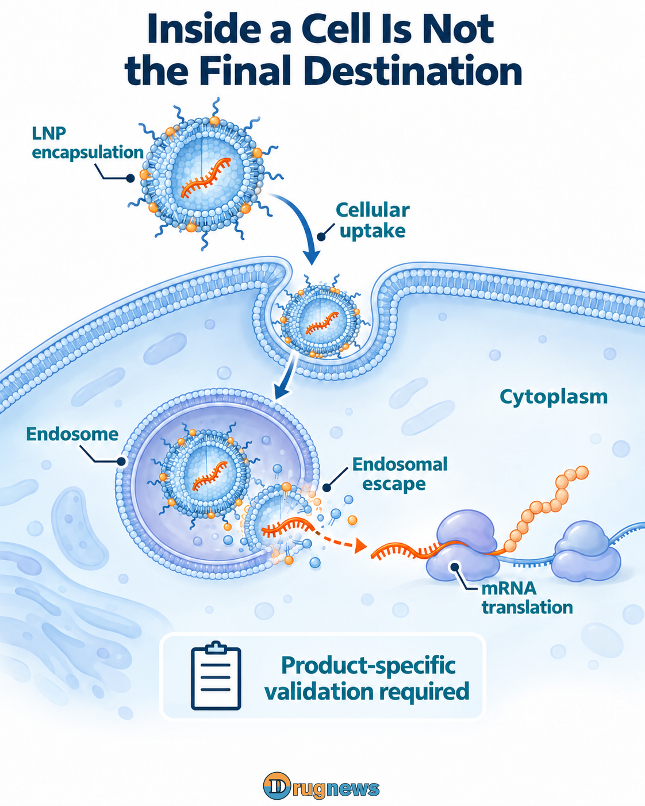
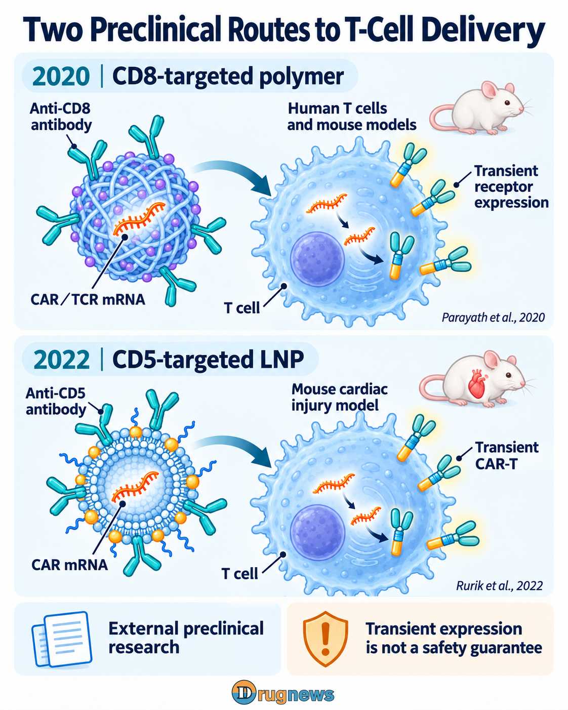
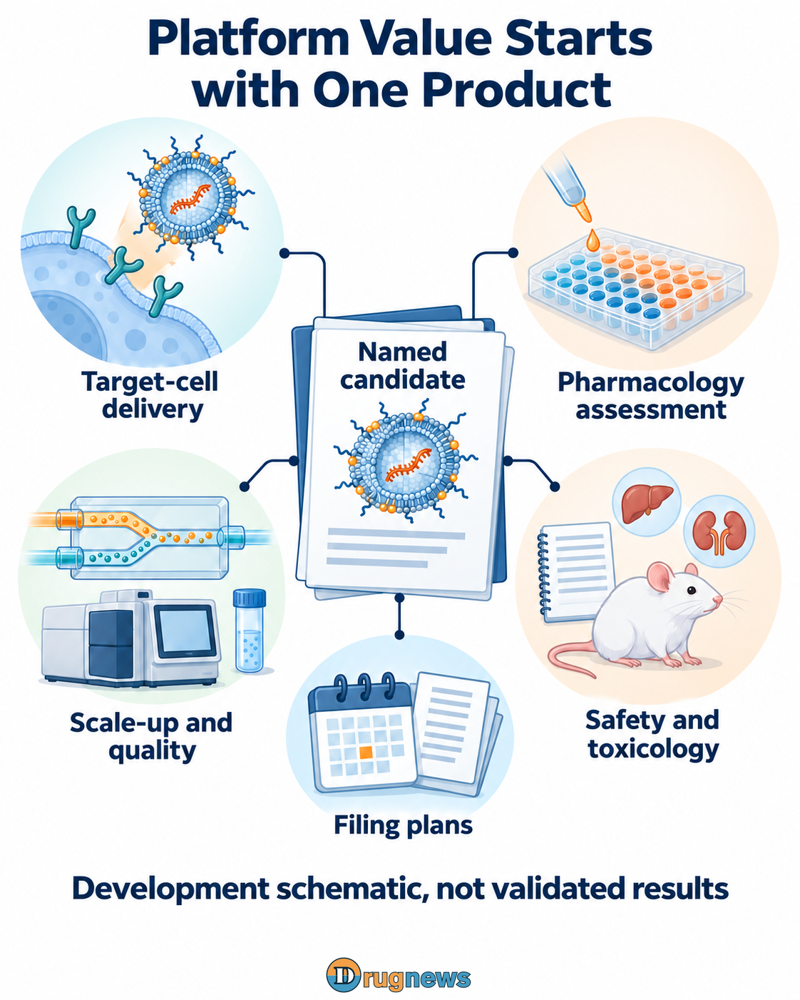

# PharmaEssentia Acquires FormuRx. Could Making Drugs Inside Cells Be Next?

PharmaEssentia (6446) has acquired FormuRx for approximately NT$168 million. According to company-provided news published by Global Bio & Investment, FormuRx develops delivery technologies for getting RNA into cells. The acquisition brings lipid nanoparticle (LNP) formulations, microfluidic processes, analytical capabilities, equipment and a team.

The company's formal English name is FormuRx Pharmaceuticals Co., Ltd. (FormuRx). FINDIT's public company profile lists its establishment in 2019. National Taiwan University's Chinese- and English-language incubator directories record its residency from September 2021 to August 2026, with a focus on lipid nanocarrier-based drugs, delivery systems and dosage-form design. This establishes an incubation relationship, not status as an NTU spin-off.

FINDIT's technology overview also brings together lipid carriers, microfluidic processes and quality by design (QbD). This describes the team's approach to formulation development: incorporating quality and manufacturing considerations from the design stage, rather than pursuing only expression signals in experiments. It is a technology description, not government certification.

The company-provided report also identifies two core development projects, FR-202 and FR-201. These give the acquisition concrete product programs to carry forward: PharmaEssentia gains technology and a team that can continue to adapt, while bringing development priorities into its own decision-making. For a company with experience in protein drugs, rare diseases and TCR-T, this may be better suited to expanding its RNA toolkit than licensing a single molecule. That is a strategic interpretation of the scope acquired, not a complete rationale for selecting the acquisition target confirmed by the announcement.

PharmaEssentia has already turned a long-acting protein into a medicine. RNA offers a way to explore having cells manufacture a specified protein instead. The aim is still to put proteins to work, but the approach moves one layer deeper. The ambition behind this acquisition may be to extend existing protein and disease research into more drug designs. Formulations, processes and the team are the people and tools needed to turn those ideas into something tangible.

The board had resolved on May 13, 2026, to acquire all issued shares. The company-provided report dated September 28 states that the acquisition of the entire shareholding had recently closed. The exact closing date and payment structure have not been disclosed. To understand which product this investment might advance next, the starting point is how the scientific work on the two sides can connect.

Figure 01 | The acquisition brings LNP formulation, microfluidic processing, analytical methods and a team. Product value still requires development and validation.

# From Giving Proteins to Having Cells Express Them

Both approaches study how proteins can change disease, but the questions they need to control differ:

Give the protein directly, and study how long its effects last. BESREMi (ropeginterferon alfa-2b) is a long-acting interferon conjugated to polyethylene glycol (PEG). According to its US prescribing information, it binds to the interferon receptor IFNAR on the cell membrane, activates intracellular signaling and thereby affects gene expression. The label also describes the relationship between drug concentrations and hematologic responses. Protein activity, exposure and duration of action become meaningful only when connected to the disease response.

Have cells express the protein, and study where and how much they make. Once messenger RNA (mRNA) enters the cytoplasm, it can be translated into a specified protein. The research can therefore extend to intracellular functional proteins or cell-surface receptors. Beyond the amount of RNA administered, developers need to examine which cells express the protein, its location, quantity, duration of expression and actual function.

The potential connection is experience in studying protein activity and disease responses. This is a hypothesis about research synergies, not a company-announced plan for RNA-based interferon or combination use with BESREMi. Nor can PEG processes be applied directly to LNPs. RNA requires its own delivery tools.

LNPs first encapsulate and protect RNA and help cells take it up. After the particles enter the endosome, a membrane-bound compartment, the mRNA still has to be released into the cytoplasm before it can be translated. A cell signing for a parcel does not mean it has unpacked it and put it to work. These steps are among the delivery and manufacturing barriers discussed in the LNP research review.

Figure 02 | After cellular uptake, mRNA must escape the endosome into the cytoplasm for translation. Function and quality require product-specific validation.

FormuRx's three areas of expertise address different questions about the same material: how the formulation packages it, whether a microfluidic process can consistently produce the particles, and whether analytical methods can confirm quality after a change. Combining those results with protein-function tests can help distinguish more systematically between RNA that did not reach its destination, insufficient expression, and a protein that appeared but failed to perform the required function. Formulation choices can then follow the product's needs.

# Two Rare-Disease Projects Take RNA Beyond Fluorescence Images

The company report identifies FR-202 for telomere biology disorders, with a planned investigational new drug (IND) application in 2027, and FR-201 for Wilson disease, with a planned IND application in 2028. The payloads and target genes of the two programs have not been disclosed. These timelines are company plans, not authorization to begin human studies, and neither program is listed as a CAR-T product.

Why are these two types of disease worth investigating for RNA developers? The following external studies provide concrete functional questions. They are not FormuRx results, and they cannot be used to assign ATP7B or TERT as the payloads of FR-201 or FR-202.

Wilson disease: Once the protein appears, is copper being handled? A 2025 study by Ma and colleagues used LNPs to deliver ATP7B mRNA. ATP7B participates in copper transport. The study tracked protein localization, copper transport, copper burden in mice and ceruloplasmin activity. Development has to connect delivery, a protein working in the right location, and a change in disease-related function—not simply RNA expression levels.

Telomere biology disorders: Can transient expression produce a change in telomeres? Telomeres are protective structures at the ends of chromosomes. A 2015 study by Ramunas and colleagues delivered modified mRNA encoding TERT into cultured human cells and observed transient telomerase activity and telomere extension. This is functional evidence at the cellular level, not evidence of anti-aging or regenerative efficacy in humans.

The two diseases require different measures of progress. They also provide concrete ways for PharmaEssentia's rare-disease development experience to contribute: selecting identifiable patient populations, considering how long an effect needs to last, and deciding which functional changes can move toward clinical endpoints.

If those questions are incorporated into formulation screening, the team's selection standard can move from “Which batch has the brightest expression signal?” to “Which batch has functional results worth taking toward the clinic?” That is a product decision the acquisition, connected to named development programs, could help improve.

# With TCR-T Already in the Pipeline, What Door Could RNA Open?

PharmaEssentia's public pipeline lists NY-ESO-1 TCR-T and Novel TCR-T. TCR-T is an engineered therapy in which T cells express a specified T-cell receptor. Receptor design is already part of the company's research and development portfolio, giving RNA delivery an existing direction with which it might connect.

A 2020 study by Parayath and colleagues used anti-CD8-targeted polymeric nanocarriers to deliver mRNA encoding a CAR (chimeric antigen receptor) or TCR, investigating transient receptor expression in human T cells and mouse models. The carrier in this study was a polymer, not an LNP.

A 2022 study by Rurik and colleagues used CD5-targeted LNPs to generate transient CAR-T cells in a mouse model of cardiac injury. Both are external preclinical studies. The acquisition report did not provide validation data for FormuRx's T-cell-targeted LNPs or a named in vivo CAR-T program, and transient expression is not, by itself, a guarantee of immune safety.

Figure 03 | Separate external preclinical studies: CD8-targeted polymer carriers in 2020 and CD5-targeted LNPs in 2022. Their systems differ; neither validates FormuRx products.

Putting these studies back into the context of the company's research direction reveals two areas of work that would need to connect:

Receptor design answers “What should be recognized?” Antigen selection, receptor design and functional testing need to establish that T cells can produce the required effect after recognizing their target. This is a question that the existing TCR-T direction and research on RNA-driven receptor expression could share.

Delivery design answers “Who receives the instructions?” After receptor mRNA is delivered into the appropriate T cells, the level and duration of expression still need to be adjusted so that delivery results connect with cellular function. A different delivery method changes more than the material; it may also change how cells are engineered and delivered.

The near-term rare-disease RNA projects can first build experience in formulation, analysis and manufacturing processes. Over the longer term, the team can evaluate which of that experience might connect with receptor design. That broadens future development choices from “Which additional antigen should we work on?” to “How should engineered cells be generated and used?”

# What Level of Control Does NT$168 Million Buy?

Licensing a single molecule obtains product rights within the scope of a contract. A wholly owned acquisition can bring the team and resource allocation into the company's decision-making. According to the report, this payment is for all of FormuRx's issued shares, with its platform, equipment and personnel to be integrated into PharmaEssentia. It is not simply a capital injection into FormuRx.

The approximately NT$168 million can be understood at three levels:

Change the product and formulation together: The same organization can decide which project to pursue first and bring RNA design, formulation and quality questions into the same technical decision, rather than waiting until a candidate is finalized to address scale-up.

Gain a starting point for subsequent products: Analytical methods, mixing processes and records of failed formulations left by the first program may help the next program rule out unsuitable paths earlier. The acquisition brings a team that can keep working, not a formulation that is used once and put away.

Bring more substance to asset-partnership negotiations: When a candidate can be discussed together with its pharmacology, manufacturing and quality data, the company is better positioned to decide which stages to advance itself and where to seek partners. Collaboration can then be built around specific divisions of work.

The price relates to early research and development and future development options, not the near-term cash flow of a mature product. Asset details, payment arrangements and subsequent costs have not been disclosed, so the price tag alone cannot establish whether the acquisition is cheap or expensive. Beyond the acquisition, integration, toxicology and clinical development still require investment. What matters is whether that additional investment can generate repeatable product-development results.

Figure 04 | Full ownership can align product selection, formulation, processing, quality analysis and further development. This schematic does not show validated pharmacology or toxicology results.

# From One Global Product to a Company That Can Keep Developing Drugs

The promising path toward a “Taiwanese BeiGene” is for PharmaEssentia to use the research, clinical and overseas experience accumulated through BESREMi to integrate suitable Taiwanese startups and connect their technologies with international product development. For Taiwan to build its own international biopharmaceutical giant, the key is whether new assets can reach the market one after another.

BESREMi moved from global research to US commercialization and gained approval for an additional indication, essential thrombocythemia (ET), on August 31, 2026. The FormuRx acquisition was resolved in May; these are parallel initiatives in the same year. The June 11 FORUS announcement explicitly states that its Canadian regulatory, medical, commercial and market-access teams will serve BESREMi and future products.

For Taiwanese startups with candidates but without international execution resources, collaboration can go a step beyond technology licensing. If PharmaEssentia can connect process and quality development, multinational clinical planning and regulatory communication, startup teams can carry their strengths in mechanisms and product design toward more mature assets. On the market side, the company can choose between developing markets itself and partnering, according to disease and geography. This would give new technology a chance to connect with an organization capable of taking on subsequent development.

Concrete figures offer a reference for scale. Public Nasdaq data obtained on October 2, 2026, showed a market capitalization of approximately US$41 billion for BeOne Medicines, formerly BeiGene. Its revenue for the second quarter of 2026 was US$1.705 billion. Market capitalization is an equity valuation; revenue is the operating result of a single quarter. Alongside the company's description of its integrated research, clinical and market footprint, this comparison gives the growth ambition a concrete direction: bringing internally developed products to market while continuing to develop the next group of products.

If that path gradually takes shape at PharmaEssentia, the questions the market asks in valuing the company will also broaden. Beyond BESREMi and the existing pipeline, other questions will merit attention: How much additional investment is needed to bring acquired technologies into clinical development? How much of the product rights will the company retain? Which markets can it operate itself? The maturity of the evidence, probability of success and development costs of each program provide a basis for assessing early-stage options. As products advance, those options gradually acquire a more concrete foundation for value.

If FormuRx can move its first programs forward and leave the methods behind for the next one, PharmaEssentia has a chance to become an integrator that takes Taiwanese technology overseas. When research, clinical execution and overseas support no longer have to be built from scratch for every program, how will the market value a PharmaEssentia that can keep bringing new products forward? That is the growth ambition behind the prospect of a “Taiwanese BeiGene.”

This article provides industry information and commercial analysis. It does not constitute individualized medical or investment advice.

# Research and Data Sources

Global Bio & Investment, September 28, 2026; company-provided news
Wholly owned acquisition, context of the approximately NT$168 million transaction, scope acquired and the two planned IND applications
Original report: https://news.gbimonthly.com/tw/invest/show.php?num=90341&range=news

BESREMi US prescribing information and the company announcement dated August 31, 2026
PEGylated interferon, IFNAR signaling, exposure and response, and ET approval
DailyMed label: https://dailymed.nlm.nih.gov/dailymed/drugInfo.cfm?setid=9583405d-53a0-49dc-88eb-5e6384ebabcb
Company announcement: https://us.pharmaessentia.com/fda-approves-pharmaessentias-besremi-ropeginterferon-alfa-2b-njft-for-adults-with-essential-thrombocythemia-a-rare-blood-cancer/

Hou et al., Lipid nanoparticles for mRNA delivery (2021)
RNA protection, cellular uptake, endosomal release and translation to manufacturing
Nature Reviews Materials: https://www.nature.com/articles/s41578-021-00358-0

Ma et al., Hepatocyte-targeted lipid nanoparticle for full-length ATP7B mRNA delivery in Wilson disease (2025)
Protein localization, copper metabolism and animal functional measures in external ATP7B mRNA-LNP research
Original research abstract on PubMed: https://pubmed.ncbi.nlm.nih.gov/41083009/

Ramunas et al., Transient delivery of modified mRNA encoding TERT rapidly extends telomeres in human cells (2015)
Transient telomerase activity and telomere extension in cultured human cells
FASEB Journal DOI: https://doi.org/10.1096/fj.14-259531

PharmaEssentia's public pipeline
NY-ESO-1 TCR-T and Novel TCR-T; the page has no update date, so it is not used to assign a new development stage
Company pipeline page: https://www.pharmaessentia.com/pipeline/pipeline

Parayath et al. (2020); Rurik et al. (2022)
CD8-targeted polymer delivery of CAR/TCR mRNA and CD5-targeted LNP research on CAR-T in mice, respectively
Nature Communications study: https://pubmed.ncbi.nlm.nih.gov/33247092/
Science study: https://pubmed.ncbi.nlm.nih.gov/34990237/

PharmaEssentia's FORUS acquisition announcement, June 11, 2026
Canadian regulatory, medical, commercial and market-access capabilities for BESREMi and future products
Official company announcement: https://us.pharmaessentia.com/pharmaessentia-expands-north-american-commercial-footprint-with-acquisition-of-canadian-partner-forus-therapeutics/

BeOne's public research and market-access information
A reference model for integrated research, clinical and international operations
Official description: https://beonemedicines.com/our-commitment-to-access/

Nasdaq ONC quote and market capitalization, obtained October 2, 2026; quote as of October 1, 2026
Market capitalization of approximately US$41 billion; the quote page is labeled October 1, 2026, and Closed, while the market-capitalization field has no separate timestamp
Nasdaq quote: https://api.nasdaq.com/api/quote/ONC/info?assetclass=stocks
Nasdaq market capitalization: https://api.nasdaq.com/api/quote/ONC/summary?assetclass=stocks

BeOne's second-quarter 2026 Form 10-Q
Number of ordinary shares and the conversion basis of one ADS representing 13 ordinary shares, for checking the company's overall equity scale
Company Form 10-Q: https://ir.beonemedicines.com/media/document/e8111d44-9cdd-4326-80a1-f3158a471bd2/assets/beone2q2026_10Q.pdf?disposition=inline

BeOne's second-quarter earnings announcement, August 5, 2026
Revenue of US$1.705 billion for the second quarter of 2026, as a reference for realized operating scale in a single quarter
Company earnings announcement: https://ir.beonemedicines.com/media/document/06b047db-4795-4815-9a4c-633c486de43e/assets/Q2_2026_Earnings_Release_FINAL.pdf?disposition=inline

National Taiwan University Innovation and Incubation Center's Chinese- and English-language directories of graduated companies; entry dated September 2, 2026
Correspondence between FormuRx's Chinese and English names, incubator residency from September 2021 to August 2026, and its focus on lipid nanocarriers, delivery and dosage forms; an incubation relationship
Chinese directory: https://ntuiic.ntu.edu.tw/graduated.html
English directory: https://ntuiic.ntu.edu.tw/ntuiic-en/graduated-e.html

FINDIT's FormuRx company profile, updated October 2, 2026
Establishment in 2019; the technology description covers lipid carriers, microfluidic processes and QbD, and is not interpreted as government technology certification
Public profile: https://findit.sme.gov.tw/tw/Startup/K2U5T25UN0QwWkRMTjhSc3IzalNlZz09/Basic
