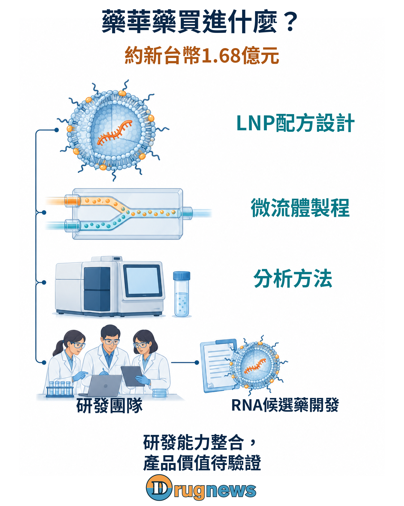
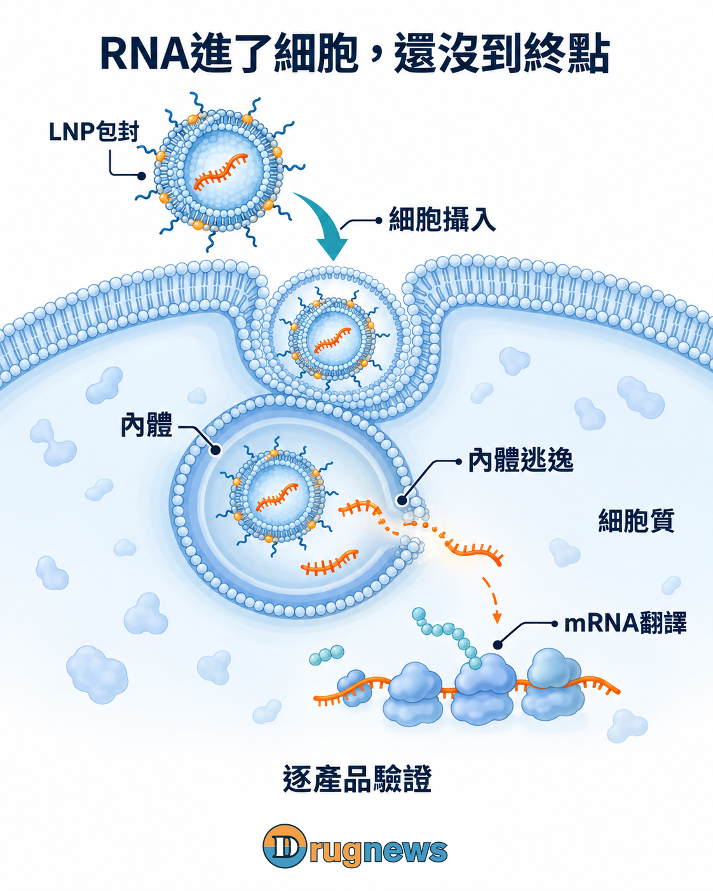
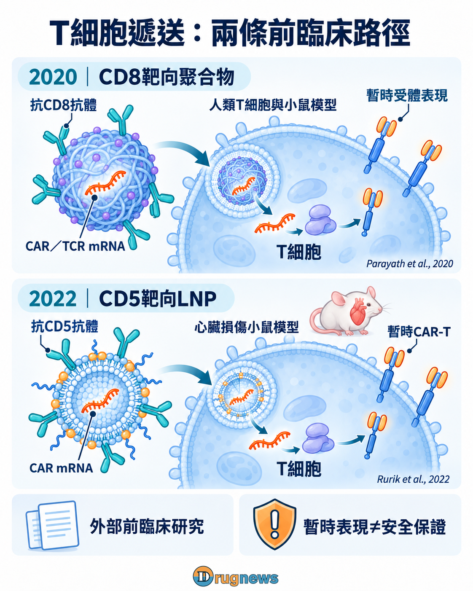
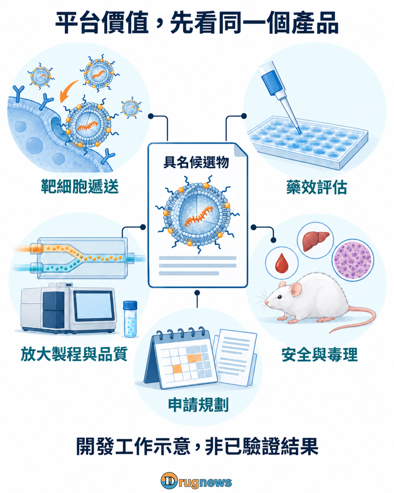

# 藥華藥買下予宇，下一步讓細胞造藥？

藥華藥（6446）買下予宇生技，交易金額約新台幣1.68億元。依環球生技刊載的公司消息，予宇做的是把RNA送進細胞的遞送研發，帶進來的包括脂質奈米顆粒（LNP）配方、微流體製程、分析、設備與團隊。

予宇的正式英文名是FormuRx Pharmaceuticals Co., Ltd.（FormuRx）。FINDIT公開基本資料列示公司2019年成立；臺大中文育成名錄與英文名錄則記錄它在2021年9月至2026年8月進駐，專注脂質奈米載體新藥、遞送系統與劑型設計。這段經歷是育成關係，不等於臺大衍生公司身分。

FINDIT的技術簡介進一步把脂質載體、微流體製程與「品質源於設計」（QbD）放在一起。這描述的是團隊的製劑開發方法：從設計時就把品質與製造問題納入，而非只追求實驗裡的表現訊號。它是技術介紹，不是政府認證。

公司供稿也說明，予宇已有FR-202、FR-201兩項核心研發專案。這讓收購有具體的產品承接點：藥華藥取得的是可繼續調整的技術與團隊，並可把研發排序納入自身決策。對已有蛋白藥、罕病與TCR-T經驗的公司，這可能比只取得單一分子的授權，更適合拓展RNA工具；它是從取得範圍推想的策略，未被公告確認為完整選標理由。

藥華藥已把長效蛋白做成藥；RNA則能探索讓細胞製造指定蛋白。同樣要讓蛋白質發揮作用，做法卻換了一層。這筆收購的野心，可能是把既有的蛋白與疾病研究，延伸到更多新藥設計，而配方、製程和團隊正是要把想法做出來的人與工具。

董事會早在2026年5月13日決議收購全部已發行股份；9月28日的公司供稿則說明，已於日前完成全數股權交割。確切交割日與付款結構未披露。這筆錢接下來能帶動哪一款產品，要從兩邊的科學工作如何接合看起。

圖01｜全資收購承接LNP配方、微流體製程、分析方法與團隊；產品價值仍待後續開發驗證。

# 從給蛋白，到讓細胞表現蛋白

同樣研究蛋白質如何改變疾病，兩種做法要控制的問題不同：

直接給蛋白，研究作用能維持多久。BESREMi（ropeginterferon alfa-2b）是接上聚乙二醇（PEG）的長效干擾素。依美國處方資訊，它結合細胞膜上的干擾素受體IFNAR，啟動細胞內傳訊，進而影響基因表現；標籤也描述藥物濃度與血液學反應的關係。蛋白的活性、暴露與作用時間，必須連到疾病反應才有意義。

讓細胞表現蛋白，研究在哪裡、做出多少。信使RNA（mRNA）進入細胞質後，可被翻譯成指定蛋白，研究範圍因此可延伸到細胞內功能蛋白或細胞膜受體。除了給了多少RNA，還要看哪些細胞表現、蛋白位置、數量、維持時間與實際功能。

兩邊可相接的是蛋白活性與疾病反應的研究經驗；這是研究工作的協同推想，並非公司已公布的RNA干擾素或BESREMi併用計畫，PEG製程也不能直接套到LNP。RNA還需要自己的遞送工具。

LNP先包覆與保護RNA，協助細胞攝入；顆粒進入內體這個膜包住的區室後，mRNA還得釋放到細胞質，才能翻譯。細胞簽收了包裹，不等於已經拆箱上工。LNP研究綜述討論的遞送與製造障礙，就包括這些環節。

圖02｜RNA被細胞攝入後，仍須從內體釋放到細胞質才能翻譯；功能與品質須按產品驗證。

予宇的三項專長，處理的是同一份材料的不同問題：配方怎麼包、微流體製程能否穩定做出顆粒、分析方法能否確認改動後的品質。把這些結果與蛋白功能測試放在一起，就能更有方向地分辨：RNA沒送到、表現量不夠，還是蛋白出現了卻未發揮需要的作用。配方取捨也就能跟著產品需要走。

# 兩個罕病專案，讓RNA不只停在螢光照片

公司消息列出FR-202針對端粒生物學疾病，規劃2027年提出臨床試驗申請（IND）；FR-201針對威爾森氏症，規劃2028年提出IND。兩案的載荷與靶基因未公開，時程屬公司計畫，並非已獲准進入人體，也未列為CAR-T產品。

這兩類疾病為什麼值得RNA開發者研究？以下外部研究提供了具體的功能問題，但不是予宇成果，也不能據此把ATP7B或TERT指定為FR-201、FR-202的載荷。

威爾森氏症：蛋白出現了，銅有沒有被處理？2025年Ma等人的研究以LNP遞送ATP7B mRNA。ATP7B參與銅運輸，研究追蹤蛋白定位、銅運輸，以及小鼠的銅負荷與銅藍蛋白活性。開發要接起來的是「送達、蛋白在正確位置工作、疾病相關功能改變」，不只看RNA表現量。

端粒生物學疾病：短暫表現，能否帶來端粒變化？端粒是染色體末端的保護結構。2015年Ramunas等人的研究在人類培養細胞中遞送編碼TERT的修飾mRNA，觀察到短暫端粒酶活性與端粒延長。這是細胞層級的功能證據，不等於人體抗老或再生療效。

兩種疾病要讀的成績不同，也讓藥華藥的罕病開發經驗有具體加入的位置：挑選可辨認的患者，思考作用需要維持多久，以及哪些功能變化能往臨床終點推進。

如果這些問題在配方篩選時就加入，團隊挑材料的標準，就能從「哪批表現訊號最亮」，推進到「哪批功能結果值得帶往臨床」。這是收購與具名管線接合後，可能改善的產品決策。

# 已有TCR-T，RNA可再打開哪道門？

藥華藥官網管線列有NY-ESO-1 TCR-T與Novel TCR-T。TCR-T是讓T細胞表現指定T細胞受體的工程療法，受體設計本就在公司研發版圖中，RNA遞送因此有一個可以相接的既有方向。

2020年Parayath等人的研究使用抗CD8靶向的聚合物奈米載體，遞送CAR（嵌合抗原受體）或TCR的mRNA，在人類T細胞與小鼠模型研究短暫受體表現。這裡用的是聚合物，不是LNP。

2022年Rurik等人的研究則用CD5靶向LNP，在心臟損傷小鼠模型中產生暫時CAR-T。兩項都是外部前臨床研究；此次收購報導未提供予宇T細胞靶向LNP或具名體內CAR-T的驗證資料，短暫表現本身也不是免疫安全保證。

圖03｜兩項外部前臨床研究：2020年CD8靶向聚合物載體與2022年CD5靶向LNP，研究系統不同；不是予宇產品驗證。

把這些研究放回公司的研發方向，可看見兩項需要接合的工作：

受體設計，回答「辨識什麼」。抗原選擇、受體設計與功能檢測，要確認T細胞辨識目標後能產生需要的作用。這是既有TCR-T方向與RNA受體表達研究可能共用的問題。

遞送設計，回答「指令交給誰」。把受體mRNA送進適當T細胞後，還要調整表現量與持續時間，讓遞送結果接上細胞功能。換一種送法，改變的不只是材料，也可能是細胞改造與交付方式。

近期的罕病RNA專案可以先累積配方、分析與製程經驗；更長期，再評估哪些經驗能與受體設計接合。這讓後續開發選擇從「多做哪個抗原」，延伸到「用什麼方式生成和使用工程化細胞」。

# 1.68億元買的是哪一層控制權？

授權單一分子，取得的是合約約定範圍的產品權利；全資收購則能把團隊與資源配置納入公司決策。依報導，這筆錢對應予宇全部已發行股份的收購，平台、設備與人員將整合進藥華藥，並非單純投入予宇的增資款。

約1.68億元可從三個層次理解：

把產品和配方一起改：同一組織能決定先做哪個專案，也能把RNA設計、配方與品質問題放在同一次技術決策裡，不必等候選物定案才處理放大。

取得後續產品的開發起點：第一案留下的分析方法、混合製程與失敗配方紀錄，可能讓下一案更早排除不適合的路。買進的是能繼續工作的團隊，不是一張用完就收起來的配方。

增加資產合作的談判內容：當候選物能連同藥理、製程與品質資料一起討論，公司才更有條件決定自行推進哪些階段、在哪些地區找夥伴，合作也能圍繞具體分工展開。

這個價格對應早期研發與後續開發選項，不是成熟產品的近期現金流。資產明細、支付方式與後續成本未公開，無從只憑價碼判斷便宜或昂貴；收購之外，仍有整合、毒理與臨床投入。真正值得估量的，是這些新增投入能否形成可重複的產品開發成果。

圖04｜全資收購可把產品、配方、製程、品質分析與後續開發放在同一決策中；圖示不是已驗證的藥效或毒理結果。

# 從一款全球產品，走向能接續出藥的公司

藥華藥值得期待的「台灣版百濟」路徑，是以BESREMi累積的研發、臨床與海外經驗，整合適合的台灣新創，把技術接上國際產品開發。台灣要長出自己的國際Biopharma巨獸，關鍵在於能否讓新資產接連走向市場。

BESREMi從全球研究走到美國商業化，並在2026年8月31日新增原發性血小板增多症（ET）適應症核准；予宇收購早在5月決議，兩者屬同年並行布局。6月11日FORUS公告則明說，加拿大法規、醫學、商業與市場准入團隊將服務BESREMi及未來產品。

對已有候選物、卻缺國際執行資源的台灣新創，合作可以往技術授權之後多走一段。藥華藥若能接上製程與品質開發、跨國臨床規劃及法規溝通，新創團隊就能把機制與產品設計的長處，往更成熟的資產推進；市場端再依疾病與地區選擇自行發展或合作。這讓新技術有機會接上一套能承擔後續開發的組織。

規模可以用具體數字參照：2026年10月2日取得的Nasdaq公開資料顯示，BeOne Medicines（原百濟神州）市值約410億美元；其2026年第二季營收為17.05億美元。市值是股權定價，營收則是單季營運成果。配合公司描述的整合研發、臨床與市場布局，這組參照讓成長想像有了具體方向：既能把自主產品帶向市場，也能接著開發下一批產品。

若這條路逐步在藥華藥成形，市場評價公司的問題也會拓寬。除了BESREMi及既有管線，還值得看：接進來的技術要追加多少投入才能推至臨床、公司保留多少產品權利，以及哪些市場能自行經營。各案的證據成熟度、成功機率與開發成本，是評估早期選項的依據；隨著產品往前走，這些選項才逐步取得更具體的價值基礎。

予宇若能讓首批專案往前走，再把方法留給下一案，藥華藥就有機會逐步成為台灣技術出海的整合者。當研發、臨床執行與海外承接不必每案從頭搭建，市場會如何評價這種能接續推出產品的藥華藥？這正是「台灣版百濟」值得期待的成長想像。

本文提供產業資訊與商業分析，不構成個別化醫療或投資建議。

# 研究與資料來源

環球生技，2026年9月28日，公司提供消息
全資收購、約1.68億元背景、取得範圍與兩項IND規劃
報導原頁：https://news.gbimonthly.com/tw/invest/show.php?num=90341&range=news

BESREMi美國處方資訊及2026年8月31日公司公告
PEG化干擾素、IFNAR訊號、暴露與反應，以及ET核准
DailyMed標籤：https://dailymed.nlm.nih.gov/dailymed/drugInfo.cfm?setid=9583405d-53a0-49dc-88eb-5e6384ebabcb
公司公告：https://us.pharmaessentia.com/fda-approves-pharmaessentias-besremi-ropeginterferon-alfa-2b-njft-for-adults-with-essential-thrombocythemia-a-rare-blood-cancer/

Hou等，Lipid nanoparticles for mRNA delivery（2021）
RNA保護、細胞攝入、內體釋放及製造轉譯
Nature Reviews Materials：https://www.nature.com/articles/s41578-021-00358-0

Ma等，Hepatocyte-targeted lipid nanoparticle for full-length ATP7B mRNA delivery in Wilson disease（2025）
外部ATP7B mRNA-LNP研究的蛋白定位、銅代謝及動物功能指標
PubMed原研究摘要：https://pubmed.ncbi.nlm.nih.gov/41083009/

Ramunas等，Transient delivery of modified mRNA encoding TERT rapidly extends telomeres in human cells（2015）
人類培養細胞中的暫時端粒酶活性與端粒延長
FASEB Journal DOI：https://doi.org/10.1096/fj.14-259531

藥華藥公開管線
NY-ESO-1 TCR-T與Novel TCR-T；頁面未標更新日，不據此補新階段
公司管線頁：https://www.pharmaessentia.com/pipeline/pipeline

Parayath等（2020）；Rurik等（2022）
分別為CD8靶向聚合物CAR／TCR mRNA與CD5靶向LNP的小鼠CAR-T研究
Nature Communications研究：https://pubmed.ncbi.nlm.nih.gov/33247092/
Science研究：https://pubmed.ncbi.nlm.nih.gov/34990237/

藥華藥FORUS收購公告，2026年6月11日
加拿大法規、醫學、商業及市場准入，供BESREMi與未來產品使用
公司官方公告：https://us.pharmaessentia.com/pharmaessentia-expands-north-american-commercial-footprint-with-acquisition-of-canadian-partner-forus-therapeutics/

BeOne公開研發與市場可近性資料
整合研發、臨床與國際布局的模式參照
官方說明：https://beonemedicines.com/our-commitment-to-access/

Nasdaq ONC報價與市值（2026-10-02取得；報價截至2026-10-01）
市值約410億美元；報價頁標示2026-10-01、Closed，市值欄未另標獨立時戳
Nasdaq報價：https://api.nasdaq.com/api/quote/ONC/info?assetclass=stocks
Nasdaq市值：https://api.nasdaq.com/api/quote/ONC/summary?assetclass=stocks

BeOne 2026年第二季10-Q
普通股數及1 ADS對應13股普通股的換算口徑，供公司整體股權規模核對
公司10-Q：https://ir.beonemedicines.com/media/document/e8111d44-9cdd-4326-80a1-f3158a471bd2/assets/beone2q2026_10Q.pdf?disposition=inline

BeOne第二季財報公告，2026年8月5日
2026年第二季營收17.05億美元，作為已實現單季營運規模的參照
公司財報公告：https://ir.beonemedicines.com/media/document/06b047db-4795-4815-9a4c-633c486de43e/assets/Q2_2026_Earnings_Release_FINAL.pdf?disposition=inline

臺大創新育成中心中英文離駐企業名錄，項目日期2026年9月2日
予宇中英文名稱對應、2021年9月至2026年8月進駐及脂質奈米載體／遞送／劑型方向；屬育成關係
中文名錄：https://ntuiic.ntu.edu.tw/graduated.html
英文名錄：https://ntuiic.ntu.edu.tw/ntuiic-en/graduated-e.html

FINDIT予宇基本資料，2026年10月2日更新
2019年成立；技術簡介描述脂質載體、微流體製程與QbD，不作政府技術認證解讀
公開資料頁：https://findit.sme.gov.tw/tw/Startup/K2U5T25UN0QwWkRMTjhSc3IzalNlZz09/Basic
