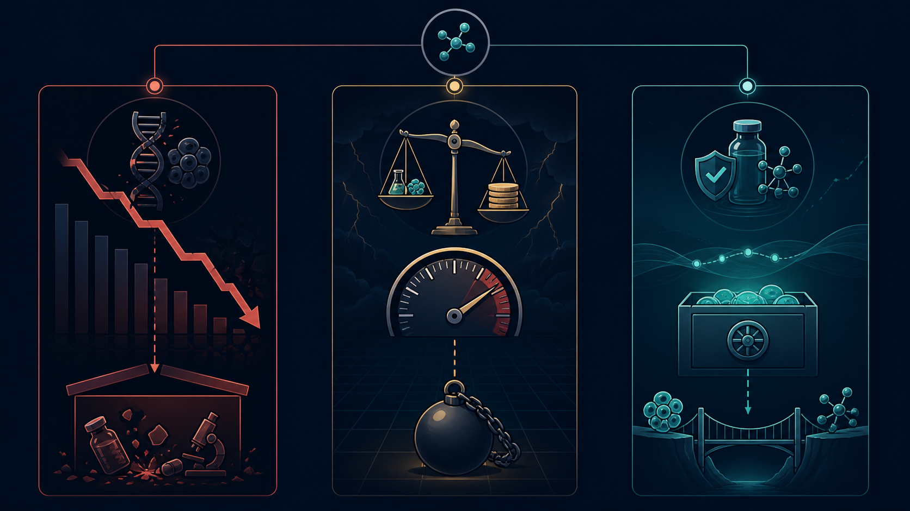

# A New Drug Launched. Seven Months Later, the Company Sought Liquidation

Iterum's ORLYNVAH generated just $0.4 million in net product revenue in its first quarter on the market, while selling, general and administrative expense was about $6.5 million. From commercial launch in August 2025 to its application for liquidation in March 2026 took roughly seven months. This was not a clinical failure. It was a case in which post-approval commercialization cash flow did not have time to grow. One case does not represent every biotech company, but it is a reminder that launch replaces development risk with revenue, cost and financing risk. This article is not investment advice.

## 01 | Iterum: $0.4 million in revenue collided with $6.5 million in expense

Iterum's story resembles a post-launch free fall.

ORLYNVAH is an oral penem antibiotic. In October 2024, the FDA approved it for uncomplicated urinary tract infections in certain adult women: infections caused by specified bacteria where oral antibacterial options are limited or unavailable.

Every qualifier in that label narrows the market.

Antibiotics are not ordinary chronic-disease medicines. Physicians must consider antimicrobial resistance, culture results, stewardship and reimbursement rules. A new antibiotic can have clinical value without prescriptions flowing as naturally as they might for a blood-pressure medicine. Health systems often want to reserve a new antibiotic for patients who truly need it. That is good public-health practice, but it is brutal for a small company that depends on a single product.

Iterum had hoped ORLYNVAH would be its final chance to turn the company around. It spent nearly a year preparing for the market, building a commercial team and working with outside partners. The product launched commercially in August 2025.

The first-quarter result arrived quickly: net product revenue was only $0.4 million, a figure that also included initial channel stocking. In the same quarter, selling, general and administrative expense reached $6.5 million, with the increase driven primarily by commercialization activity.

This was not simply a case of “poor sales.”

It meant that every step the company took toward the market was burning cash much faster than current revenue was arriving. Physician education, distribution, payer access, patient support and a sales team do not stop charging simply because prescriptions have not yet scaled. Before launch, R&D spending can look like the highest mountain. After launch, what can crush a company may be the market bill that must be paid every day.

At the end of September 2025, Iterum had only $11 million in cash remaining. The company discussed ORLYNVAH commercial rights with two potential counterparties, but no transaction was completed. Its share price and listing status continued to deteriorate.

On March 27, 2026, the company applied to the High Court of Ireland for liquidation. On April 13, the court formally ordered it to be wound up. Roughly seven months passed between ORLYNVAH's commercial launch and the liquidation application; the court issued its formal order the following month.

A drug had completed clinical development, passed review and actually reached pharmacy shelves, yet it did not have time to turn prescriptions into cash flow.

The lesson from Iterum is not that antibiotics lack value. It is that clinical need, patients who can be prescribed a drug, the reimbursement route and commercial cost are never the same thing. A market can look large, but if the patients who can actually be found, diagnosed, reimbursed and prescribed treatment are too few, the market size on paper is a mirage.

## 02 | Karyopharm: a first-in-class target could not rescue the balance sheet

Karyopharm has not collapsed.

That must be stated first, because it is not currently a replay of Iterum. It is an ongoing stress test.

The company's core product, XPOVIO (selinexor), is the world's first approved exportin 1 (XPO1) inhibitor. It entered the multiple-myeloma market in 2019, and “first in class” was once Karyopharm's brightest label.

But arriving first does not mean being the first to build a large market.

XPOVIO entered a hematologic-oncology field with intense competition and rapidly shifting treatment options. A new mechanism faces more than a regulatory certificate: it must contend with therapies physicians already know, the condition of later-line patients, adverse-event management and pressure from other new therapies moving earlier in treatment.

In the second quarter of 2026, XPOVIO generated $30.8 million in net product revenue, up about 3.7% from $29.7 million a year earlier. That is not no business, but neither does it show the kind of explosive growth that can plainly carry the cost of an entire company.

In the same quarter, Karyopharm recorded $29.0 million in R&D expense and $25.9 million in selling, general and administrative expense; its operating loss was $22.5 million and its net loss was $67.0 million. The latter includes interest and substantial non-cash fair-value changes in financial instruments, so it cannot simply be treated as cash flowing out in full. It nevertheless reflects a capital structure already under strain.

The more dangerous numbers are on the balance sheet.

At quarter end, cash, cash equivalents, restricted cash and investments totaled $65.4 million. The company expected existing liquidity to last only into September 2026. On September 10, $15.8 million of loan principal was due. Karyopharm explicitly stated that without additional financing or a lender waiver, payment would be expected to take it below a $10 million minimum-liquidity covenant and trigger default.

For a biotech company, the science clock may be measured in “next year's data.” The bank clock can be precise to a single date.

Karyopharm's clinical hope is also splitting into different paths. In July 2026, the Phase 3 XPORT-EC-042 trial of XPOVIO in endometrial cancer missed its primary endpoint. Another Phase 3 study, SENTRY in myelofibrosis, delivered one positive and one negative result across its co-primary endpoints.

At week 24, XPOVIO plus ruxolitinib produced at least a 35% reduction in spleen volume in 49.8% of patients, versus 28.0% in the control group, a highly significant difference. But the co-primary symptom-score endpoint did not meet its target, with a p-value of 0.825.

In subsequent written feedback, the FDA said spleen-volume reduction appeared capable of serving as a surrogate endpoint reasonably likely to predict overall survival. Karyopharm therefore plans to submit a supplemental new drug application for myelofibrosis under an accelerated-approval pathway, with long-term overall-survival data to confirm clinical benefit.

That is a real regulatory pathway, not a check that has already cleared.

Karyopharm now faces a sharp contradiction. It does not lack a product, revenue or clinical opportunities. What it lacks is time to wait for those opportunities to become approvals and sales. A first-in-class halo can attract attention, but it cannot substitute for cash or ask creditors to postpone the calendar.

## 03 | Theravance: not unable to continue, but unwilling to wager its cash on the next bet

Theravance is the easiest of the three companies to describe incorrectly.

It does not face an immediate cash shortage. At the end of the second quarter of 2026, it had $387.7 million in cash and marketable securities and no debt. Its COPD medicine YUPELRI continued to grow, and the company retained revenue and milestone opportunities linked to partnered products.

What disappeared was the R&D story.

Theravance had placed ampreloxetine in neurogenic orthostatic hypotension. After an earlier Phase 3 study failed, a subgroup signal emerged in patients with multiple system atrophy, and the company designed the Phase 3 CYPRESS study for that population. In March 2026, CYPRESS again missed its primary endpoint.

After that failure, Theravance did not use nearly $400 million of cash to search for another high-risk asset. It decided to discontinue ampreloxetine, phase out its R&D function and sharply reduce general and administrative costs. After restructuring, operating expenses were expected to be about 60% lower than in 2025.

Theravance then put itself on the transaction table.

On June 29, 2026, it entered into a definitive acquisition agreement with Zymeworks: $17 in cash per share plus a contingent value right that would allow former shareholders to retain some future proceeds if ampreloxetine is licensed, sold or commercialized.

As of August 10, the transaction was still expected to close in the second half of 2026, subject to shareholder approval and other customary conditions. The correct description is therefore “signed and awaiting closing,” not “acquired.”

Theravance was not pushed into liquidation by cash, as Iterum was, and it was not guarding an imminent loan date like Karyopharm. It made a different kind of harsh choice: when commercial assets still had value and cash remained on the balance sheet, but there was no R&D direction worth continuing to fund, it stopped acting as an independent R&D biotech company.

That is not necessarily failure.

For employees and scientists who had invested years in the work, it is certainly the end of an era. For shareholders, however, it may be a rational exit that avoids burning remaining value in another high-risk trial.

The same headline—“a biotech company disappears”—can conceal completely different capital outcomes: liquidation, default pressure and acquisition.

## 04 | Real commercialization capability is not simply selling a drug

The biotech industry easily treats “independent commercialization” as a coming-of-age ritual.

Hiring a company's own sales force, negotiating with payers and bringing a medicine to patients can indeed retain more of a product's economics than licensing it to a large pharmaceutical company. It can also build organizational capability. But retaining all upside also means taking on all fixed cost, inventory, access and scale-up risk.

Real commercialization capability is not proving that a company can issue an invoice. It is making each unit of commercial investment generate enough cash to fund the next round of innovation.

If a company must keep raising capital after launch simply to maintain its sales force; if each additional unit of revenue first requires even more fixed cost; if the growth of the only product cannot keep up with the R&D burn of the next pipeline, then the company has merely changed from “using investors to fund R&D” to “using investors to fund R&D and sales.”

That is why the post-approval death valley is often harder for the market to see early than clinical failure.

Clinical results are binary events: success or failure is usually revealed in a day. Commercialization slippage looks more like chronic blood loss. Prescriptions edge up each quarter, payer coverage gradually improves, management keeps saying the second half will be better, and the company always appears to have hope. Cash does not wait.

## 05 | Before judging a commercial biotech, look at four clocks

### 1. The revenue clock

Do not look only at how many patients a market contains. Ask how many will be diagnosed, fit the label, obtain coverage and ultimately start treatment. First-quarter channel stocking is not the same as patient demand, and shipments into distribution are not the same as continuing prescriptions.

### 2. The cost clock

What share of revenue is absorbed by sales expense? How much physician education and patient support are needed for every additional patient? Is the company building economies of scale that improve with revenue, or must it add another layer of cost every time it sells a box of medicine?

### 3. The pipeline clock

A single product can support a company, but only if it is truly large enough and durable enough. If the first drug produces only limited cash, the next indication and next pipeline cannot be delayed repeatedly. Karyopharm's problem is precisely that revenue exists, while the successor has not had time to fully deliver.

### 4. The capital clock

How long can cash last? When is the next debt due? Are there minimum-liquidity covenants? If the company raises capital at a low share price, how severe will dilution be? Drug R&D is about scientific probability; the capital market ultimately asks a different question: can you survive until the day the answer is announced?

The four clocks do not run separately.

Slow uptake makes fixed costs look heavier. Heavy costs compress pipeline investment. Pipeline failure then reduces financing capacity. Eventually, what first appears to be a local commercial problem spreads along the balance sheet into a corporate survival problem.

## 06 | The real warning for biotech companies in Taiwan and China

Chinese-speaking biotech markets have placed increasing emphasis on “independent commercialization” in recent years. The direction itself is not wrong. If every asset is licensed out too early, a company will never build its own product and market capability.

But independent commercialization should not become an exercise in saving face.

Whether a company should sell its own drug ought to depend on whether patients are concentrated, physicians can be covered efficiently, the reimbursement path is clear, product differentiation can support the price and cash can survive the slowest plausible uptake scenario. If the answers are not attractive, regional licensing, co-promotion, a phased team build-out or even a company sale at a good price may be more rational than insisting on selling alone.

Theravance reminds the market that the best capital allocation can sometimes be to stop betting while value is still visible. Iterum reminds it that misjudging the speed of commercialization can turn an approved drug from a lifeline into an accelerant. Karyopharm tells us that the hardest state is not having no hope at all; it is having hope that needs a year when cash may have only a month left.

## Conclusion | The FDA grants a ticket, not a life-support machine

The launch of a new drug is absolutely worth celebrating.

It means science, clinical development, manufacturing and regulation have crossed countless gates, and patients finally have one more option. But for a company, FDA approval never means that risk has been reset to zero. It moves the questions from the laboratory to the market.

Can the product be found, prescribed and reimbursed? Can revenue catch up with commercial cost? Can the next pipeline take over in time? Can the company secure its next breath before capital markets close?

Those questions determine whether a biotech company can truly become a biopharma company: moving from a drug-development organization dependent on external financing to a pharmaceutical enterprise with continuing product cash flow.

We used to think of Phase 3 as biotech's death valley.

More and more cases now suggest that the truly lethal cliff may lie after approval: the lights are on, the store is open and the first prescription has been written, but money disappears from the balance sheet faster than patients arrive.

A launched drug proves only that it is eligible to be sold.

The company's survival proves that it is a business.

## Primary Sources

1. [Iterum | Third-quarter 2025 financial results](https://ir.iterumtx.com/press-releases/detail/159/iterum-therapeutics-reports-third-quarter-2025-financial)
2. [Iterum | Liquidation application and provisional liquidation](https://www.sec.gov/Archives/edgar/data/1659323/000119312526127785/itrm-20260327.htm)
3. [Iterum | Announcement following the court liquidation order](https://content.bsx.com/CompanyDocuments/1099939718/Iterum%20-%20BSX%20Announcement%20-%201%20June%202026.pdf)
4. [Karyopharm | Second-quarter 2026 financial results](https://investors.karyopharm.com/2026-08-13-Karyopharm-Reports-Second-Quarter-2026-Financial-Results-and-Highlights-Continued-Progress-Toward-Myelofibrosis-sNDA-Submission)
5. [Karyopharm | Phase 3 SENTRY results](https://investors.karyopharm.com/2026-06-02-Karyopharm-to-Present-Results-from-Phase-3-SENTRY-Trial-of-Selinexor-Plus-Ruxolitinib-in-Myelofibrosis-in-Late-Breaking-Oral-Presentation-at-ASCO-2026-with-Simultaneous-Publication-in-the-Journal-of-Clinical-Oncology)
6. [Karyopharm | Myelofibrosis filing pathway](https://investors.karyopharm.com/2026-07-30-Karyopharm-Plans-to-Submit-sNDA-for-Selinexor-Plus-Ruxolitinib-in-Myelofibrosis-Under-Accelerated-Approval-Pathway)
7. [Theravance | Phase 3 CYPRESS and restructuring](https://investor.theravance.com/news-releases/news-release-details/theravance-biopharma-reports-phase-3-cypress-study-did-not-meet)
8. [Theravance | Second-quarter 2026 financial results and pending acquisition](https://investor.theravance.com/news-releases/news-release-details/theravance-biopharma-inc-reports-second-quarter-2026-financial)

This article is for pharmaceutical-industry and investment education. It does not constitute medical or investment advice. Company status and regulatory progress are current only through August 26, 2026. Karyopharm has not entered bankruptcy, and the Theravance–Zymeworks transaction remained pending as of the verification date.
