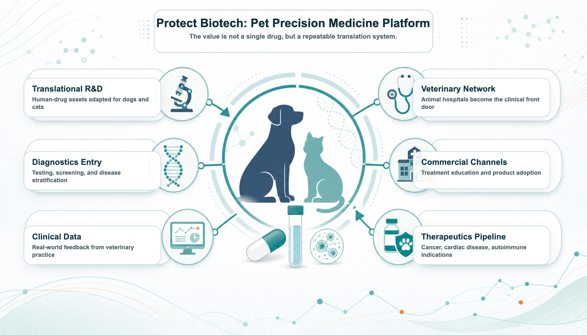
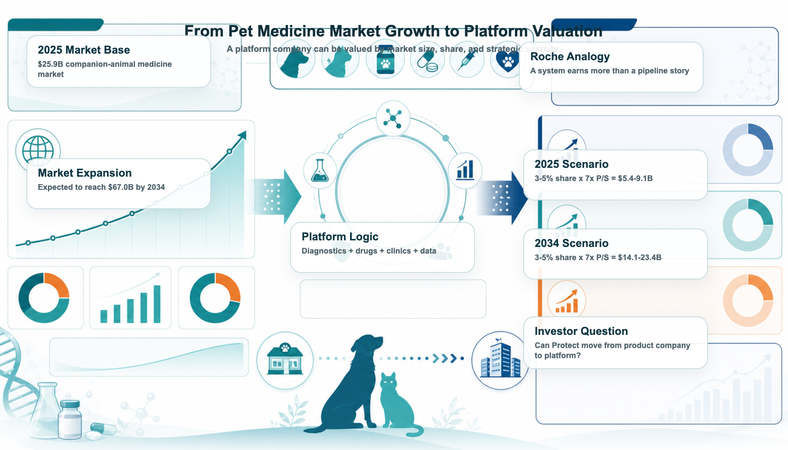
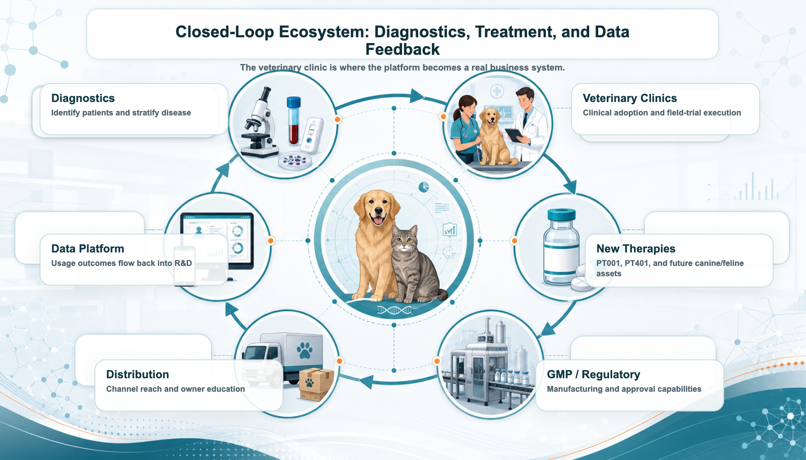

# Toward the “Roche of Pet Medicine”: Protect Biotech’s Platform Bet

As companion animals age and owners become more willing to pay for serious-disease care, the next major question in pet medicine is no longer whether people will spend money on their pets. They already do. The more important question is whether any company can build the first true platform for severe companion-animal diseases: a system that connects drugs, diagnostics, veterinary clinics, regulation, GMP manufacturing, commercial channels, and clinical data feedback.

That is why Taiwan’s Protect Biotech (7850) is worth reading through a more ambitious lens.

Roche is not simply a large pharmaceutical company. Its real strength is the system it has built around medicines, diagnostics, R&D, clinical development, regulation, global commercialization, and disease management. In human medicine, Roche is more than a company that sells drugs. It is a platform that can pair diagnostics with treatment and manage disease areas across a long product life cycle.

That system is the source of Roche’s moat and valuation premium.

In companion-animal medicine, however, the industry still lacks a platform company with a comparable role. The market has large animal-health companies, but serious pet medicine is still fragmented. Cancer, cardiac disease, autoimmune disease, chronic disease, and geriatric care are becoming more important, yet the industry has not fully connected new drugs, diagnostics, veterinary practice, regulatory translation, GMP manufacturing, channels, and data into one defensible business loop.

This is the gap Protect Biotech is trying to fill.

Protect is not interesting only because it has pet-drug assets such as PT001 and PT401. The more important point is that it is building a human-drug-to-pet-medicine translation platform. The company is trying to take relatively mature, lower-risk technologies from human medicine and translate them into major canine and feline diseases. If that process can be combined with field trials, regulation, GMP, veterinary channels, diagnostics, and data feedback, Protect could become more than a single-pipeline pet-drug company.

It could become a pet precision-medicine platform.

## 1. The largest opportunity in pet medicine is no longer food or supplements

For years, the pet economy was mostly discussed through food, supplies, supplements, and consumer spending. But the valuation upgrade in pet medicine comes from a different change: pets are aging, and owners increasingly treat them as family members.

When a pet is simply a pet, consumers buy companionship. When a pet becomes family, owners are willing to consider treatment options. What happens when a dog develops cancer? What happens when a cat develops cardiac disease? What happens when an older companion animal has an autoimmune condition?

These are not supplement questions. They are medical questions.

According to Grand View Research, the global companion-animal medicine market is estimated at about US$25.88 billion in 2025 and is expected to reach about US$66.96 billion by 2034, implying a compound annual growth rate of roughly 11.22%.

The problem is that the market is upgrading faster than the industry structure. Today’s pet-medicine market still has four major gaps:

- Too few drugs designed specifically for serious canine and feline diseases. Many treatment decisions still borrow from human-medicine experience.
- Diagnostics and treatment are not fully integrated. Some diseases can be detected, but treatment pathways remain underdeveloped.
- Regulatory and clinical translation remain difficult. Human technologies cannot simply be moved into dogs and cats without proper animal-specific validation.
- The channel loop is incomplete. A product is not enough; adoption requires veterinary clinics, owner education, treatment workflows, and long-term follow-up.

This is why pet medicine needs its own “Roche.” The market does not merely need a bigger pet-drug company. It needs a platform company that can systematize serious-disease solutions.

## 2. Why a platform matters: serious medicine creates value through systems

The difference between serious medicine and consumer health is straightforward. Supplements can be sold through branding, channels, and marketing. Serious-disease treatment cannot.

It needs a complete system: diagnostics, treatment pathways, regulatory work, veterinary adoption, owner willingness to pay, and real-world data.

That is what makes Roche valuable in human medicine. In 2025, Roche reported group sales of CHF61.5 billion, including CHF47.7 billion from pharmaceuticals and CHF13.8 billion from diagnostics. The group also invested CHF12.2 billion in R&D. Roche’s strength does not come from any single product. It comes from the way drugs, diagnostics, R&D, and commercialization reinforce one another.

A drug can lose patent protection. A pipeline can fail. But a system can keep absorbing new drugs and new diagnostics, then amplify them through the same value chain.

Protect Biotech is not Roche in scale. That is not the point. The point is structural symmetry.

Protect is positioning itself at a moment when global pet medicine is entering a phase that may require a platform integrator. By linking new drugs, diagnostics, veterinary clinics, regulation, and channels, the company is trying to capture a platform position in the next stage of companion-animal healthcare.

Animal health already has large companies. Zoetis, IDEXX, and Elanco have shown that animal health can support multibillion-dollar businesses. What remains scarce is a company that can turn serious geriatric pet diseases into integrated disease solutions: drugs, diagnostics, regulation, clinical adoption, and commercial channels.

PT001, PT401, and Protect’s broader canine and feline oncology, cardiac, and autoimmune pipeline should therefore be read as more than isolated product programs. If the company can combine veterinary clinical practice, diagnostic testing, and data feedback, it may gradually build a precision-medicine loop for serious companion-animal disease.

That is the core reason Protect deserves market attention.

## 3. Pet drugs can be more capital efficient than human drugs

Many investors hear “pet drug” and immediately assume the market is too small, prices are too low, and owners will not pay. That intuition is only half right. The pet-drug market is smaller than human medicine, but the development path can also be shorter, lighter, and more capital efficient.

HealthforAnimals has estimated that a new active ingredient for companion animals in the United States takes about 6.5 years on average to develop, with average development spending around US$22.5 million. Even high-cost cases can be far below the scale of human drug development. By contrast, human drugs often require more than a decade of work and hundreds of millions to billions of dollars in investment.

Pet-drug development is not easy. It still requires regulation, clinical evidence, manufacturing, and channels. But it does not necessarily require the same global Phase III burden that defines human medicine before value can begin to emerge.

This is where Protect’s model becomes interesting. The company is not trying to discover everything from scratch in the traditional heavy-asset way. Its strategy is to translate human-medicine assets that already have some level of maturity and safety validation into canine and feline serious diseases.

That can help the company bypass some of the most expensive and failure-prone early R&D stages. The next layer of value then comes from target-animal studies, regulatory execution, veterinary channels, and field-trial feedback.

If the model works, Protect’s translation path could create platform value with a level of capital efficiency that would be hard to replicate in conventional human-drug development.

**Table 1. Human drugs versus companion-animal drugs: why pet medicine can be lower-cost and faster**

| Comparison item | Human drugs | Companion-animal drugs |
| --- | --- | --- |
| Development cost | Common estimates can reach hundreds of millions to billions of US dollars | New active ingredients for companion animals average about US$22.5 million; higher-cost cases around US$62 million |
| Development timeline | Often more than 10 years, with expensive late-stage trials | US companion-animal new drugs average about 6.5 years |
| Clinical evidence | Large, multicenter, often multinational studies with many patients | Target-animal safety, efficacy, and field trials are central |
| Regulatory path | IND → Phase I/II/III → NDA/BLA | New Animal Drug Application (NADA) or conditional approval pathways in the US; local veterinary-drug and field-trial rules apply in Taiwan |
| Payment decision | Hospitals, physicians, insurers, national health systems, pharmacy benefit managers, guidelines | Veterinary clinics, owners, channel education, disease urgency |
| Success factors | Large clinical trials and reimbursement systems | Target-animal fit, veterinary acceptance, owner willingness to pay, channel penetration |
| Platform value | Drug R&D, patents, indication expansion, global commercialization | Human-drug translation, field-trial efficiency, veterinary channels, data feedback |

## 4. Why Protect resembles Roche structurally

Why Protect?

Roche’s position in human medicine does not come only from size. It comes from structure. Protect is much smaller, but its strategic direction is not limited to one pet-drug pipeline. It is trying to build a lightweight closed loop in pet medicine: capital efficient, clinically grounded, and able to iterate quickly through veterinary practice.

**Table 2. Roche and Protect Biotech: the structural similarities**

| Dimension | Roche in human medicine | Protect Biotech in pet medicine |
| --- | --- | --- |
| Core positioning | Global platform across medicines, diagnostics, and disease management | Translation platform across pet drugs, diagnostics, veterinary clinics, and channels |
| Product core | Major disease areas such as oncology, immunology, hematology, and ophthalmology | PT001 cancer vaccine, PT401 canine cardiac gene therapy, PT004/PT302-PT304 canine and feline oncology and autoimmune assets |
| Diagnostic entry point | Diagnostics support disease stratification, early detection, and treatment decisions | Mountain Vet’s testing, diagnostics, and regenerative-medicine capabilities connect to veterinary-clinic channels |
| Clinical setting | Hospitals, physicians, trial centers | Animal hospitals, field trials, veterinary clinical feedback |
| Regulation and manufacturing | Global drug approvals, GMP, clinical and commercial infrastructure | Partnership with Yung Shin strengthens GMP manufacturing, regulatory support, and channel resources |
| Commercial leverage | Global markets, hospital access, diagnostics-treatment loop | Veterinary networks, pet-product channels, owner education, treatment workflows |
| Data feedback | Clinical, diagnostic, and disease-management data support the next generation of products | Field trials, veterinary use experience, diagnostic data, and treatment outcomes can feed future pipeline development |

The similarity is not scale. It is architecture.

If Roche is the strategic reference point, Protect is trying to build a parallel structure in companion-animal medicine: use diagnostics to identify the serious-disease gap, use innovative therapies to create treatment options, use field trials and regulation to build trust, and use veterinary clinics and commercial channels to bring the solution into real-world care.

The structure looks like this:

new-drug assets + diagnostic entry points + veterinary clinics + regulatory and manufacturing capabilities + commercial channels + market feedback.

That is what a “Roche of pet medicine” would need to look like.

## 5. If Protect becomes a pet-medicine platform, how large could the capital-market imagination become?

If a true “Roche of pet medicine” emerges, it could become a multibillion-dollar platform company. The value would come from its position across the entire serious-disease value chain.

Start with Roche as a reference point. Roche’s market capitalization is roughly US$338.9 billion. Compared with roughly US$1.6 trillion of global medicine spending in 2025, Roche’s market value is about 21% of that base.

Now apply a similar conceptual framework to companion-animal medicine. The global companion-animal medicine market is estimated at US$25.88 billion in 2025. If a future platform company captured a relative position comparable to Roche’s role in human medicine:

US$25.88 billion × 21% implies about US$5.4 billion.

Using 23% to 24% suggests a roughly US$6.0 billion platform scenario.

That is why a future “Roche of pet medicine” could plausibly be discussed as a US$5 billion to US$6 billion platform idea, even before considering a larger 2034 market.

Protect’s current market value is far smaller, around NT$1.8 billion, or roughly US$60 million. If the company can prove that it is not just developing individual pet drugs but building a global serious-pet-medicine platform, the valuation logic could change materially.

And 2025 is only the starting point. The global companion-animal medicine market is expected to grow from about US$25.88 billion in 2025 to US$66.96 billion by 2034. If Protect were to establish a meaningful platform position by that time, even a conservative 18% ecosystem position would imply a possible long-term platform value above US$12 billion.

**Table 3. Reading Protect’s valuation imagination through Roche**

| Comparison item | Human medicine: Roche | Pet medicine: Protect long-term scenario |
| --- | --- | --- |
| Market reference | Global pharmaceutical and diagnostics market | Global companion-animal medicine market |
| Market size base | 2025 global medicine spending of roughly US$1.6T; 2030 around US$2.6T | 2025 about US$25.88B; 2034 about US$66.96B |
| Company value / platform position | Roche around US$338.9B market cap | If Protect becomes a pet-medicine platform, a US$5-6B scenario becomes discussable; with market growth, a US$12B+ ceiling can be considered |
| Relative market position | About 21% of the 2025 global medicine market | US$6B is about 23% of the 2025 companion-animal medicine market; US$12B is about 18% of the 2034 market |
| Business structure | Pharma + diagnostics + global R&D + commercialization | New drugs + diagnostics + regenerative medicine + Mountain Vet network + regulatory / GMP + channels + BD transactions |
| Key question | Can Roche keep placing new medicines and diagnostics into a global disease-management system? | Can Protect keep translating human medical technology into canine and feline serious-disease therapies, then commercialize through clinics, diagnostics, regulation, and channels? |

**Table 4. Reading Protect through animal-health platform peers**

| Comparison item | Animal-health platform reference | Protect Biotech long-term platform scenario |
| --- | --- | --- |
| Valuation logic | Zoetis and IDEXX are not merely animal-drug companies; they are animal-health platforms | If Protect upgrades from pet-drug company to serious-pet-medicine platform, valuation can shift from single-pipeline logic to platform logic |
| Value source | Drug innovation, diagnostics traffic, channel execution, sticky real-world data | PT001, PT401, Mountain Vet diagnostics and clinic resources, regulatory / GMP capabilities, data feedback, repeatable pipeline development |
| Multiple reference | Zoetis around 5x P/S; IDEXX around 9x P/S; average roughly 7x P/S | 7x P/S can be used as a neutral reference for a future platform scenario |
| 2025 scenario | Leading animal-health platforms can support multibillion-dollar market values | If Protect reaches 3-5% effective share of the US$25.88B 2025 market, revenue potential is about US$0.78-1.29B; at 7x P/S, valuation is about US$5.4-9.1B |
| 2034 scenario | Continued market growth can raise the platform ceiling | If Protect reaches 3-5% effective share of the US$66.96B 2034 market, revenue potential is about US$2.01-3.35B; at 7x P/S, valuation is about US$14.1-23.4B |
| Key conclusion | Animal health has already proven that platform companies can command higher valuations than single-product businesses | Protect’s US$6-12B long-term imagination can be cross-checked through market size, effective share, and platform P/S multiples; the larger 2034 market opens a higher ceiling |

## 6. The real ecosystem: diagnostics, treatment, clinics, and data feedback

A platform cannot remain a slogan. It needs a setting where the business loop actually happens.

In pet medicine, that setting is the veterinary clinic.

Whoever enters the clinic can enter the real pet-medicine market. Protect’s cooperation with Yung Shin strengthens GMP manufacturing and regulatory support. Its acquisition of Mountain Vet brings diagnostic capabilities and access to a network of animal hospitals. Together, these pieces can form a real closed loop:

diagnostics identify patients → veterinary clinics deliver treatment → new therapies offer solutions → regulation enables compliant launch → channels expand adoption → clinical data flows back → the next product is developed with better information.

If Protect’s platform strategy matures, this ecosystem could become powerful. New-drug development becomes the growth engine. Diagnostics become the traffic entry point. Veterinary practice becomes the application setting. Regulation becomes the pass. Channels become the amplifier. Clinical data becomes the fuel for the next product cycle.

## 7. The real ambition: becoming indispensable in global pet medicine

Protect still has major milestones to prove.

PT001 field-trial results will test whether the company can translate a mature human-medical technology into pet cancer treatment. PT401’s clinical signals and regulatory progress will determine whether canine cardiac gene therapy can become a credible business opportunity. The autoimmune and additional canine/feline oncology pipeline will shape whether Protect can move from one-product company to multi-asset platform.

The integration of Mountain Vet and the veterinary-clinic network is just as important. The question is whether the channel is only a sales endpoint or whether it can become a diagnostic entry point, clinical-validation engine, and market-penetration platform.

In other words, Protect is not only trying to prove one drug. It is trying to prove a business model:

translate human medical technology into serious canine and feline therapies, then connect that process with diagnostics, veterinary clinics, regulation, GMP, commercial channels, and clinical data feedback.

If PT001 or PT401 succeeds in regulatory approval and commercialization, the market would not only be seeing one successful pet drug. It would be seeing evidence that Protect’s human-drug-to-pet-medicine translation system can work. After that, the regulatory cost, clinical risk, channel development cost, and market-education burden for future assets could all fall structurally.

That is what the “Roche of pet medicine” really means.

It is not one drug. It is a translation factory that can keep incubating, validating, advancing, and commercializing new products.

Protect is still early. Time and evidence must validate the model. But if the first core pipeline succeeds, the first treatment setting is adopted by veterinary clinics, and the first product establishes a regulatory and commercial template, the company’s market logic could change.

From pet-drug company to serious-pet-medicine platform.

From single-pipeline story to repeatable translation factory.

From Taiwan emerging-stock company to a platform with a possible role in the global upgrade of companion-animal medicine.

That is why Protect Biotech deserves to be understood again.

## Sources and publishing note

This article is an industry, company-positioning, and valuation-scenario analysis based on publicly available information. It is not investment advice, medical advice, fundraising advice, or a recommendation on any security.

## References

https://www.grandviewresearch.com/industry-analysis/companion-animal-medicine-market-report

https://www.roche.com/investors/annualreport25

https://companiesmarketcap.com/roche/marketcap/

https://finance.yahoo.com

https://www.marketbeat.com/compare-stocks/

https://www.healthforanimals.org/reports/innovation-report/

https://www.fda.gov/animal-veterinary/development-approval-process/new-animal-drug-applications

https://www.fda.gov/media/106055/download

https://www.moa.gov.tw

https://law.moa.gov.tw/LawContent.aspx?id=GL001397

https://www.grandviewresearch.com/industry-analysis/veterinary-oncology-market

https://www.grandviewresearch.com/industry-analysis/veterinary-cardiology-market-report

https://www.grandviewresearch.com/industry-analysis/companion-animal-diagnostics-market

https://www.gminsights.com/industry-analysis/pet-cancer-therapeutics-market

https://www.gminsights.com/industry-analysis/veterinary-autoimmune-disease-therapeutics-market

https://www.iqvia.com/insights/the-iqvia-institute/reports/the-global-use-of-medicines-2026

https://www.biotech-edu.com/protect-over-the-counter/

https://www.genetinfo.com/investment/featured/item/88559.html

https://www.mountainvet.com.tw/regenerative/%E7%89%A7%E9%A8%B0%E7%94%9F%E7%89%A9%E8%88%87%E5%AF%B6%E6%B3%B0%E7%94%9F%E9%86%AB%E7%AD%96%E7%95%A5%E7%B5%90%E7%9B%9F-%E6%90%B6%E6%94%BB%E5%B9%B4%E5%8D%83%E5%84%84%E6%AF%9B%E5%AD%A9%E5%95%86%E6%A9%9F/

https://www.beileybiofund.com/blogs/portfolio-news/protect20260506

https://www.cnyes.com/twstock/7850

https://www.tpex.org.tw/zh-tw/esb/trading/info/stock-pricing.html?code=7850

---

This article is for industry research and knowledge sharing only. It does not constitute investment, medical, fundraising, or stock-specific advice.
