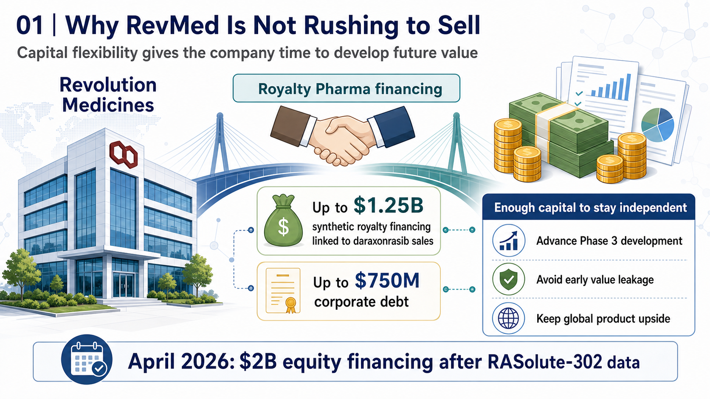
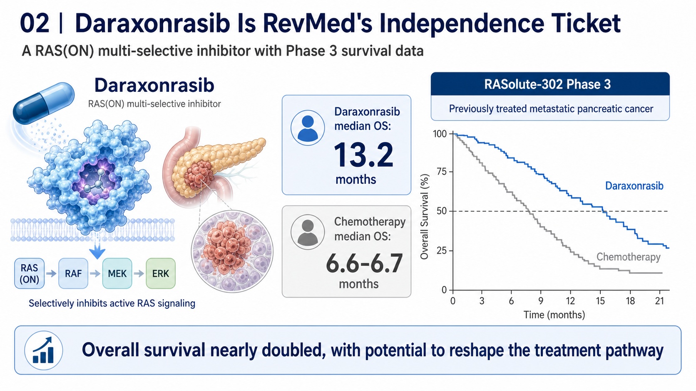
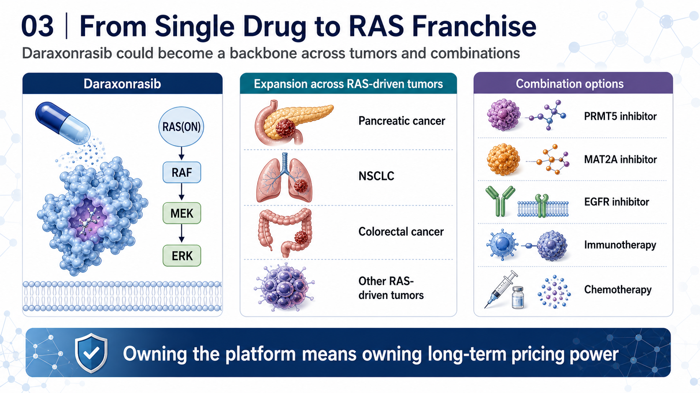
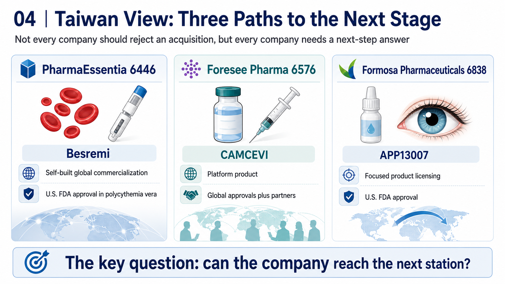

# RevMed Says No to Being Bought: Biotech's Independent Era

The acquisition rumors around Revolution Medicines, or RevMed, have never really stopped.

The reason is simple: RevMed holds one of the scarcest cards in global oncology development today: daraxonrasib.

Earlier this year, the *Financial Times* reported that Merck had held talks to acquire RevMed, with market speculation placing the possible transaction value in the USD 28 billion to USD 32 billion range. The deal did not materialize. But the market's imagination around RevMed only became stronger. Once a clinical-stage biotech has been seriously studied by a pharmaceutical company at Merck's level, investors naturally ask a different question:

Is RevMed the next acquisition target?

Or is it the next independent biopharma company?

In a recent interview, CEO Mark Goldsmith made the company's posture fairly clear. RevMed has indeed had conversations with multiple pharmaceutical companies, but being acquired is not the company's current priority.

The meaning behind that statement is not that RevMed does not understand its own value. It is that the company does not believe this is the moment to sell its future all at once.

That is not the most common path in the old biotech world. In the past, when a clinical-stage biotech produced strong data, the most common ending was an acquisition by Big Pharma. Running Phase 3, managing global regulatory work, building a commercial team, and carrying launch risk were expensive, slow, and dangerous.

RevMed does not seem eager to follow that old script. It wants to grow up on its own.

## 01 | Why RevMed Is Not Rushing to Sell

The first reason RevMed is not in a hurry is capital.

In June 2025, RevMed reached a flexible financing agreement with Royalty Pharma for up to USD 2 billion. The structure included up to USD 1.25 billion in synthetic royalty financing linked to future daraxonrasib sales, plus up to USD 750 million in corporate debt.

This type of financing matters. It allows RevMed to avoid raising capital too cheaply through dilution or giving away global product value through an early licensing deal. It gives the company time to continue holding the asset's full strategic upside.

In April 2026, after the pivotal Phase 3 RASolute-302 data were announced, RevMed completed a USD 2 billion equity financing. In practical terms, the company converted a clinical catalyst directly into research, development, and commercialization ammunition.

That makes RevMed different from a typical cash-constrained biotech.

It is not being forced to sit at the negotiating table.

It has time.

It has capital.

More importantly, it has a drug that may be strong enough to support an independent commercialization story.

## 02 | Daraxonrasib Is RevMed's Independence Ticket

The core of RevMed's story is daraxonrasib.

Daraxonrasib is an oral RAS(ON) multi-selective inhibitor. In plain terms, it is a small-molecule drug designed to inhibit activated RAS signaling. For decades, RAS was viewed as a difficult or even undruggable target. In pancreatic cancer, KRAS mutations are extremely common, yet the field has lacked truly effective direct inhibitors for many years.

The breakthrough with daraxonrasib is that it is not merely a laboratory concept. It has already produced survival data in a Phase 3 pancreatic cancer trial.

In RASolute-302, daraxonrasib was used in previously treated metastatic pancreatic cancer and significantly prolonged overall survival. Data presented at ASCO showed:

Median overall survival in the daraxonrasib arm reached 13.2 months.

Median overall survival in the chemotherapy arm was roughly 6.6 to 6.7 months.

Overall survival nearly doubled.

For pancreatic cancer, that is not a small improvement. It is the kind of data that can change a treatment pathway.

Pancreatic cancer has long been one of the most difficult tumor types in oncology. Diagnosis is often late, disease progression is fast, and response to traditional chemotherapy is limited. If an oral RAS inhibitor can deliver a clear overall-survival benefit in this setting, it is not just RevMed's first product. It becomes the foundation for building a global oncology company.

This is why RevMed is not rushing to sell.

If daraxonrasib launches successfully and scales commercially, RevMed can move from being a high-potential biotech into a cash-generating oncology company.

## 03 | RevMed Is Not Trying to Sell One Drug. It Is Trying to Build a RAS Franchise

RevMed's ambition is not limited to second-line pancreatic cancer.

The value of daraxonrasib is that it may become a therapeutic backbone for RAS-mutant solid tumors.

Pancreatic cancer is the first major breakthrough point. After that, the program could extend into first-line pancreatic cancer, non-small cell lung cancer, colorectal cancer, and other RAS-driven tumors.

More importantly, RAS inhibitors are moving from monotherapy toward combination therapy.

Recent early data for Tango Therapeutics' vopimetostat in combination with daraxonrasib in MTAP-deleted, RAS-mutant pancreatic cancer gave investors a glimpse of what a RAS backbone could mean. In the future, daraxonrasib could be combined with PRMT5 inhibitors, MAT2A inhibitors, EGFR inhibitors, immunotherapy, or chemotherapy.

If daraxonrasib becomes the central backbone of a RAS treatment platform, RevMed's value is no longer only the sales of one product. It becomes the control right over an entire RAS franchise.

That is the second reason the company is not in a rush to be acquired.

If RevMed sells today, it sells today's value.

If it launches the first drug itself, builds a commercial organization, and lets the pipeline follow, it is no longer selling a product. It is preserving the long-term pricing power of the company itself.

## 04 | Why Biotech Independence Is More Possible Now

In the past, independent commercialization was extremely difficult for biotech companies.

It required capital, a sales force, global regulatory capabilities, medical affairs, market access, supply chain operations, and commercial talent. These capabilities used to sit almost entirely inside Big Pharma.

Now the environment has changed.

First, capital tools have multiplied.

Royalty financing, structured debt, PIPEs, follow-on offerings, and synthetic royalties mean that a clinical-stage company does not always have to sell itself to survive. RevMed's USD 2 billion financing arrangement with Royalty Pharma is a representative example of this new capital toolkit.

Second, the CXO ecosystem has matured.

Clinical operations, CMC, drug supply, testing, medical writing, regulatory consulting, and other functions can increasingly be outsourced. A biotech does not need to build every heavy-asset function from zero.

Third, Big Pharma talent has spilled outward.

Commercial, medical, access, and global-market talent increasingly joins high-potential biotech companies. That makes it more plausible for a biotech to assemble a credible launch organization before approval.

Fourth, rare-disease and specialty-drug markets offer smaller but deeper commercialization entry points.

Not every drug requires a ten-thousand-person sales force. If the disease is highly specialized, the patient population is well defined, and the physician universe is concentrated, a biotech has a better chance to commercialize on its own.

That is why companies such as argenx, Madrigal, Alnylam, and Vertex are often treated as important examples of independent biopharma. RevMed may be trying to move toward the same path.

## 05 | What Makes RevMed Different: It Has a Reusable First Card

Biotech companies that truly grow up usually need a first product that can support the company.

That first product does more than generate revenue. It allows the company to accumulate an entire operating system:

Clinical-development capability.

Regulatory filing capability.

Medical-affairs capability.

KOL networks.

Market access.

A sales team.

Post-marketing research.

Product supply chain.

Once the first product succeeds, these capabilities can support the second and third products.

That is the key transition from a research-stage biotech into a biopharma company. If RevMed can bring daraxonrasib to the global market successfully, it will earn that ticket.

This is why outside observers should not understand RevMed only through the question of whether USD 32 billion is enough.

The issue is not just whether the price is high.

The issue is whether management believes the future value can be higher.

If daraxonrasib can become a standard treatment in pancreatic cancer and later extend into multi-tumor combination regimens, today's acquisition price may not fully reflect the long-term value.

## 06 | Independence Is Not a Romantic Story. RevMed Still Faces Three Hard Battles

Of course, saying no to an acquisition does not guarantee success.

RevMed still faces at least three major battles.

The first is regulatory execution.

Daraxonrasib has strong Phase 3 data, but it still must be reviewed by the FDA and other regulatory agencies. Label language, indication scope, and whether additional studies are required will all affect the pace of commercialization.

The second is commercialization.

Pancreatic cancer is a high-unmet-need market, but physician education, molecular testing, treatment sequencing, payer access, and positioning against existing chemotherapy regimens all take time. Oral dosing is convenient, but convenience does not automatically create rapid uptake.

The third is the follow-on pipeline.

If RevMed depends only on daraxonrasib, the market can give it a high valuation, but it will also judge every piece of data with a high bar. The company must prove that the RAS platform is not only one product, but a repeatable engine for new therapies.

RevMed's independent path is therefore not easy money. The company is choosing to keep the biggest uncertainty in its own hands, while also keeping the biggest upside for itself.

## 07 | Taiwan View: Not Every Company Should Stay Independent, but Every Company Needs a Next-Step Answer

This question is especially relevant when we bring it back to Taiwan.

Many Taiwanese new-drug companies have historically followed a path of licensing, collaboration, or regional development. It has been harder for them to become true global independent biopharma companies.

The first company closest to an independent biopharma path is PharmaEssentia, ticker 6446.

PharmaEssentia's Besremi, or ropeginterferon alfa-2b, has received U.S. FDA approval for adults with polycythemia vera. This is one of the few Taiwanese examples of a self-developed product entering the U.S. and global markets while building commercialization capabilities.

The second is Foresee Pharmaceuticals, ticker 6576.

Foresee's CAMCEVI, a six-month leuprolide mesylate depot formulation, has received approvals in markets including the United States, Canada, the European Union, Taiwan, Israel, and the United Kingdom, and it has launched in the United States. Its three-month formulation, CAMCEVI ETM, also received FDA approval in 2025.

Foresee is not fully commercializing globally by itself. But it shows that a Taiwanese company can use a long-acting injectable technology platform to create globally approvable products.

The third is Formosa Pharmaceuticals, ticker 6838.

Formosa's APP13007 has received U.S. FDA approval for the treatment of inflammation and pain after ocular surgery, with commercialization advanced through partners. It is not a RevMed-style independent buildout, but it shows that a Taiwanese new-drug company can use a clear indication, a defined regulatory path, and international collaboration to move beyond pure research.

These three companies represent three Taiwanese models:

PharmaEssentia is the closest to self-built global commercialization.

Foresee represents platform product plus global approval plus partner-driven scale.

Formosa represents focused product licensing and U.S. approval.

Taiwanese biotech companies do not all need to imitate RevMed by rejecting acquisitions.

But they should learn one lesson:

A good new-drug company cannot forever wait to be bought. It must be able to answer whether it can reach the next stage on its own.

## Conclusion | RevMed's Refusal Reflects a Change in Biotech's Role

RevMed's story is not only an acquisition rumor.

It represents a broader change: top-tier biotech companies no longer have to treat acquisition as the only endpoint.

When capital tools mature, outsourcing ecosystems become complete, commercial talent flows outward, and specialty-drug markets can be developed in a focused way, a company with a sufficiently strong first product can once again have a path toward independent biopharma status.

Biotech's fate is no longer only to be sold.

For companies holding a true breakthrough asset, independent growth has again become a credible path.

## References

[0] Company websites and public disclosures.

[1] Financial Times report on Revolution Medicines, Merck discussions, and management's stance on a sale: https://www.ft.com/content/3b1e5908-1cf4-4cc8-ade2-f0636a90739c

[2] Investors.com coverage of Revolution Medicines and daraxonrasib pancreatic-cancer data: https://www.investors.com/news/technology/revolution-medicines-stock-pancreatic-cancer-treatment/

[3] Royalty Pharma company disclosures and public information: https://www.royaltypharma.com/

[4] U.S. FDA information on Besremi approval for polycythemia vera: https://www.fda.gov/drugs/news-events-human-drugs/fda-approves-treatment-rare-blood-disease

[5] Foresee Pharmaceuticals public information on CAMCEVI: https://www.foreseepharma.com/

[6] Formosa Pharmaceuticals public information on APP13007: https://www.formosapharma.com/

---

This article is for industry research and educational purposes only. It does not constitute investment, medical, fundraising, or stock-specific advice.
