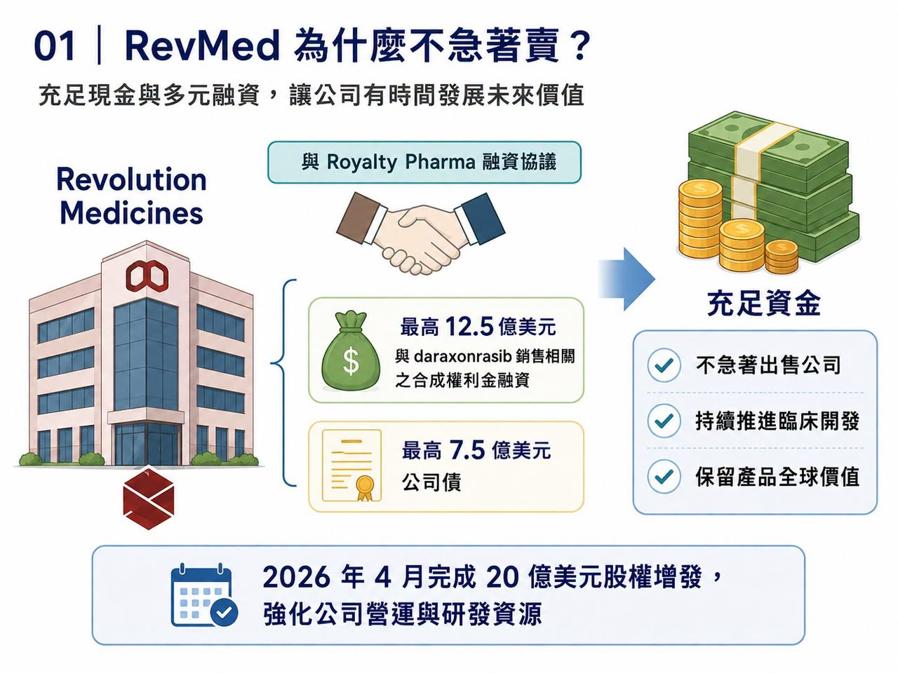
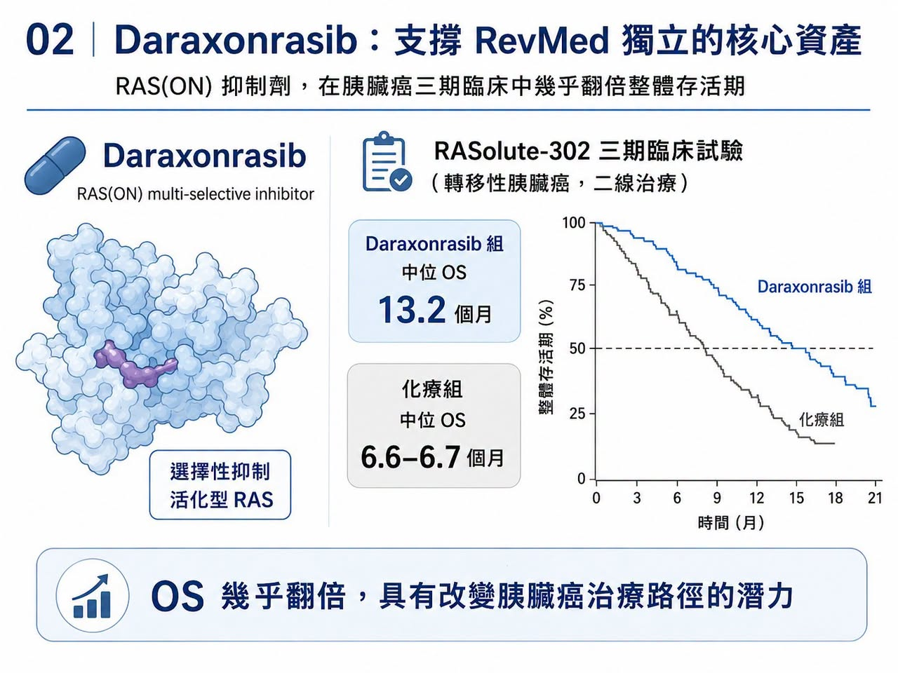
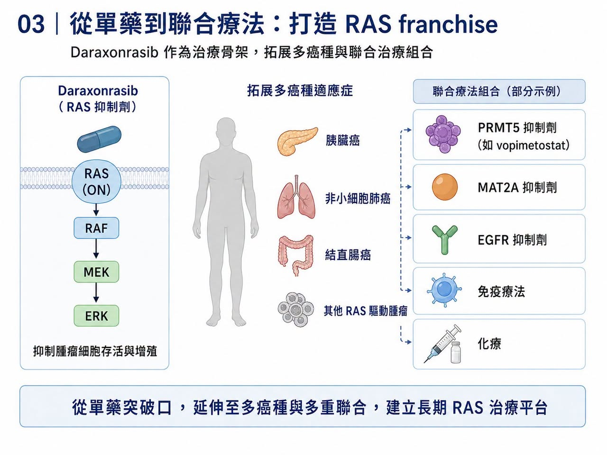
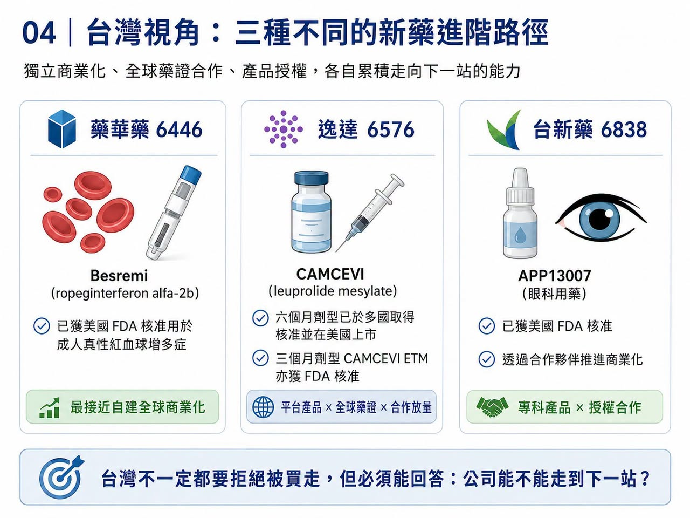

# 拒絕被併購的 RevMed：Biotech 的獨立時代

圍繞 Revolution Medicines（RevMed）的併購傳聞，一直沒有真正停過。

原因很簡單：它手上握著當前全球腫瘤研發最稀缺的一張牌——daraxonrasib。

今年稍早，《Financial Times》曾報導，Merck 曾洽談收購 RevMed，市場傳聞交易對價落在 280 億至 320 億美元區間。後來交易沒有成局，但外界對 RevMed 的想像反而更強。因為當一家 Biotech 已經被默沙東這種等級的大藥廠認真看過，市場自然會問：

它到底是下一個被併購標的？

還是下一個獨立長大的 Biopharma？

RevMed CEO Mark Goldsmith 最近接受訪問時，態度其實很清楚：公司確實和多家藥廠有過溝通，但被收購不是當下優先事項。

這句話背後的意思，不是 RevMed 不知道自己值錢，而是它認為自己還沒到該把未來一次賣掉的時候。這在過去的 Biotech 世界裡，並不常見。以前，一家臨床階段 Biotech 做出漂亮資料，最常見的結局是被 Big Pharma 收走。因為自己做 Phase 3、自己做全球法規、自己建商業團隊，太貴、太慢、太冒險。

但 RevMed 似乎不想走這條老路，它想自己長大。

## 01｜RevMed 為什麼不急著賣？

RevMed 不急，第一個原因是手上有錢。

2025 年 6 月，RevMed 和 Royalty Pharma 達成最高 20 億美元的彈性融資協議。其中包括最高 12.5 億美元與 daraxonrasib 銷售相關的合成權利金融資，以及最高 7.5 億美元公司債。這種融資方式很關鍵。因為它讓 RevMed 不必急著用低價增發或早期授權來換現金，也可以繼續保留產品的全球價值。2026 年 4 月，RevMed 又在 RASolute-302 關鍵三期資料公布後，完成 20 億美元股權增發。這相當於把臨床利多直接轉成研發與商業化彈藥。所以 RevMed 和一般缺錢 Biotech 不同。

它不是被迫坐上談判桌。

它有時間。

也有資金。

更重要的是，它有一款足以支撐獨立商業化敘事的藥。

## 02｜Daraxonrasib 是 RevMed 的獨立門票

RevMed 的核心，是 daraxonrasib。

這是一款 RAS(ON) multi-selective inhibitor，也就是針對活化狀態 RAS 訊號的口服小分子抑制劑。RAS 曾經長期被視為「不可成藥」靶點。尤其在胰臟癌裡，KRAS 突變比例極高，卻多年沒有真正有效的直接抑制藥物。Daraxonrasib 的突破，在於它不只是實驗室裡的概念，而是已經在胰臟癌三期臨床中做出生存期資料。在 RASolute-302 研究中，daraxonrasib 用於既往治療過的轉移性胰臟癌患者，顯著延長整體存活期。

ASCO 公布資料顯示：

Daraxonrasib 組中位整體存活期達 13.2 個月。

化療組約 6.6 至 6.7 個月。

整體存活期幾乎翻倍。

對胰臟癌來說，這不是小改善，這是足以改變治療路徑的資料。胰臟癌長期是腫瘤治療裡最難攻克的癌種之一。診斷晚、進展快、對傳統化療反應有限。若一款口服 RAS 抑制劑能在這裡做出明確整體存活期獲益，它就不只是 RevMed 的第一款產品，而是公司建立全球商業化體系的基石。

這就是為什麼 RevMed 不急著賣。

如果 daraxonrasib 成功上市並放量，RevMed 就能從「高潛力 Biotech」變成「有現金流的腫瘤藥公司」。

## 03｜RevMed 想做的，不只是賣一個藥，而是建立 RAS franchise

RevMed 的野心，並不只在二線胰臟癌。

Daraxonrasib 的價值在於，它有機會成為 RAS 突變實體瘤的治療骨架。

胰臟癌只是第一個突破口。後續還可以往一線胰臟癌、非小細胞肺癌、結直腸癌，以及多種 RAS 驅動腫瘤延伸。更重要的是，RAS 抑制劑正在從單藥走向聯合療法。近期 Tango Therapeutics 的 vopimetostat 聯合 daraxonrasib，在 MTAP 缺失、RAS 突變胰臟癌中做出早期高反應率，讓市場看到 RAS 抑制劑作為 backbone，也就是治療骨架的想像。未來 daraxonrasib 可能和 PRMT5 inhibitor（PRMT5 抑制劑）、MAT2A inhibitor（MAT2A 抑制劑）、EGFR inhibitor（EGFR 抑制劑）、免疫療法或化療形成不同組合。一旦 daraxonrasib 成為 RAS 療法平台核心，RevMed 的價值就不是單一產品的銷售額，而是整個 RAS franchise 的控制權。

這也是它不急著被併購的第二個原因。

如果今天賣給大藥廠，它賣的是現階段價值。

如果自己把第一款藥做上市，把商業團隊建起來，再讓後續管線跟上，它賣的就不是產品，而是公司本身的長期定價權。

## 04｜Biotech 的獨立時代，為什麼現在更可能發生？

過去，Biotech 想獨立商業化很難。

因為它需要錢、需要銷售團隊、需要全球法規能力、需要醫學事務、需要市場准入、需要供應鏈、需要商業化人才。這些能力過去幾乎都集中在 Big Pharma 手裡。但現在，環境變了。

第一，資本工具變多。

Royalty financing（權利金融資）、structured debt（結構型債務）、PIPE（私募股權融資）、follow-on offering（增發）、synthetic royalty（合成權利金），都讓臨床階段公司不一定非得把公司賣掉才能活下去。RevMed 與 Royalty Pharma 的 20 億美元融資，就是這種新時代資本工具的代表。

第二，CXO 產業鏈成熟。

臨床營運、CMC（化學、製造與管制）、藥物供應、檢測、醫學寫作、法規顧問，都能外包。Biotech 不必從零建立所有重資產能力。

第三，Big Pharma 人才外溢。

很多商業化、醫學、准入與全球市場人才，開始加入高潛力 Biotech。這讓 Biotech 有機會在上市前就搭建出相對成熟的商業團隊。

第四，罕見病與專科藥市場提供了更小而深的商業化入口。

不是每一款藥都需要萬人銷售隊伍。若疾病高度專科化、患者分層清楚、醫師群集中，Biotech 有機會自己做商業化。

這也是為什麼近年 argenx、Madrigal、Alnylam、Vertex 這些公司被視為獨立 Biopharma 的重要樣本，RevMed 可能正在走向同一條路。

## 05｜RevMed 和過去 Biotech 不同：它有「可複用」的第一張牌
真正能長大的 Biotech，通常需要一款能養活公司的第一產品。這款產品不只帶來收入，還會讓公司沉澱一整套能力：

臨床開發能力。

法規申請能力。

醫學事務能力。

KOL 網絡。

支付准入。

銷售團隊。

上市後研究。

產品供應鏈。

第一款藥上市成功後，這些能力就能服務第二款、第三款藥。

這就是 Biotech 從研發公司變成 Biopharma 的關鍵。RevMed 若能成功把 daraxonrasib 推向全球市場，它就會取得這張門票。這也是為什麼外界不能只用「320 億美元要不要賣」來理解 RevMed。

問題不是價格高不高，問題是管理層相信未來能不能更高。

如果 daraxonrasib 真能成為胰臟癌標準治療，再延伸到多癌種聯合療法，今天的收購報價未必能反映長期價值。

## 06｜但獨立不是浪漫故事，RevMed 仍有三場硬仗
當然，拒絕被收購不等於一定成功，RevMed 接下來至少有三場硬仗。

第一，監管。

Daraxonrasib 的三期資料強，但仍需要 FDA 與其他監管機構審查。標籤怎麼寫、適應症範圍多大、是否需要額外研究，都會影響商業化速度。

第二，商業化。

胰臟癌雖是高未滿足需求市場，但醫師教育、分子檢測、治療序列、支付准入、與現有化療方案的定位，都需要時間。口服藥方便，但不代表自動放量。

第三，後續管線。

如果 RevMed 只靠 daraxonrasib 一款藥，市場會給它高估值，但也會用很高標準檢視所有資料。它必須證明 RAS 平台不只是一款產品，而是一個可以持續產生新藥的引擎。

所以 RevMed 的獨立之路，不是躺著收錢。它只是選擇把最大的不確定性留在自己手上，也把最大的上行空間留給自己。

## 07｜台灣可以怎麼看？不是每家公司都該獨立，但藥華藥、逸達、台新藥各有啟示
這個題目放回台灣，非常值得看。台灣過去很多新藥公司習慣走授權、合作、區域開發，不太容易真正走到全球獨立 Biopharma。

第一個最接近「獨立 Biopharma」路徑的，是藥華藥（6446）。

藥華藥的 Besremi（ropeginterferon alfa-2b，ropeginterferon alfa-2b 長效干擾素）已獲美國 FDA 核准用於成人真性紅血球增多症。這是台灣公司少數真正以自研產品打入美國與全球市場、並建立商業化能力的案例。FDA 核准新聞稿也明確指出，Besremi 為治療成人 polycythemia vera，也就是真性紅血球增多症的藥物。

第二個是逸達（6576）。

逸達的 CAMCEVI（leuprolide mesylate，亮丙瑞林長效針劑）六個月劑型已在美國、加拿大、歐盟、台灣、以色列與英國等市場取得核准，美國也已上市。其三個月劑型 CAMCEVI ETM 也在 2025 年取得 FDA 核准。逸達不是完全自己做全球商業化，但它代表台灣公司可以靠平台型長效針劑技術，做出全球可核准產品。

第三個是台新藥（6838）。

台新藥的 APP13007 已獲美國 FDA 核准，用於眼科手術後發炎與疼痛治療，並透過合作夥伴推進商業化。它不是 RevMed 式獨立發展，但代表台灣新藥公司可透過清楚適應症、明確法規路徑與國際合作，走出比單純研發更接近商業化的路線。

這三家公司代表三種台灣模式：

藥華藥是最接近自建全球商業化的模式。

逸達是平台產品全球藥證加合作放量模式。

台新藥是小而清楚的產品授權與美國藥證模式。

台灣不一定要每家公司都學 RevMed 拒絕被買走。

但至少要學一件事：

好的新藥公司不能永遠只等被買，必須有能力回答自己能不能走到下一站。

## 結語｜RevMed 拒絕被買，背後是 Biotech 角色的改變
RevMed 的故事，不只是併購傳聞。

它代表一個更大的變化：頂尖 Biotech 不再必然把被收購視為終點。

當資本工具成熟、外包產業鏈完整、商業化人才流動、專科藥市場可被集中開發，一家公司只要有足夠強的第一款產品，就有機會自己走向 Biopharma。

Biotech 的命運，不再只有賣身一條路。

對真正握有 breakthrough asset，也就是突破性核心資產的公司來說，獨立長大，已經重新成為一條可行路徑。

參考資料：

[0]: 各公司官網＆公開資料

[1]: https://www.ft.com/content/3b1e5908-1cf4-4cc8-ade2-f0636a90739c

[2]: https://www.royaltypharma.com/

[3]: https://www.investors.com/news/technology/revolution-medicines-stock-pancreatic-cancer-treatment/

[4]: https://www.fda.gov/drugs/news-events-human-drugs/fda-approves-treatment-rare-blood-disease

[5]: https://www.foreseepharma.com/

所有心情：

4次分享

---

本文僅供產業研究與知識分享，不構成投資、醫療、募資或個股建議。
