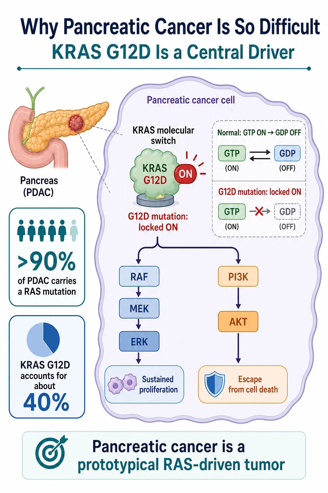
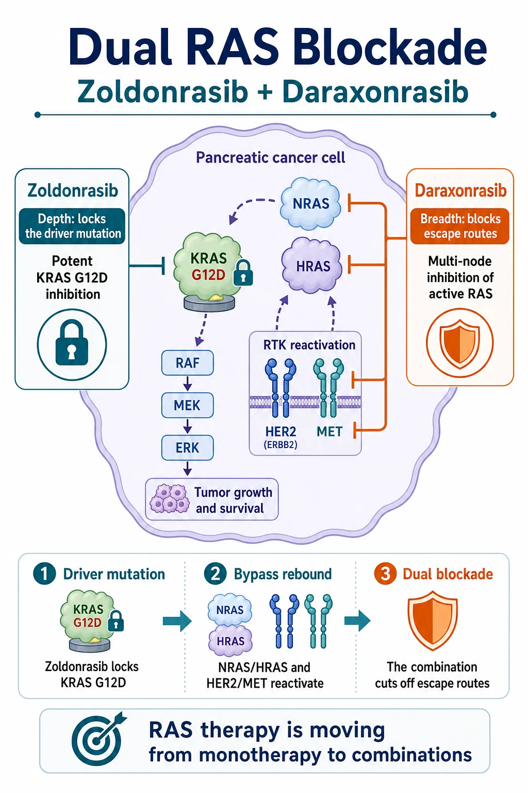
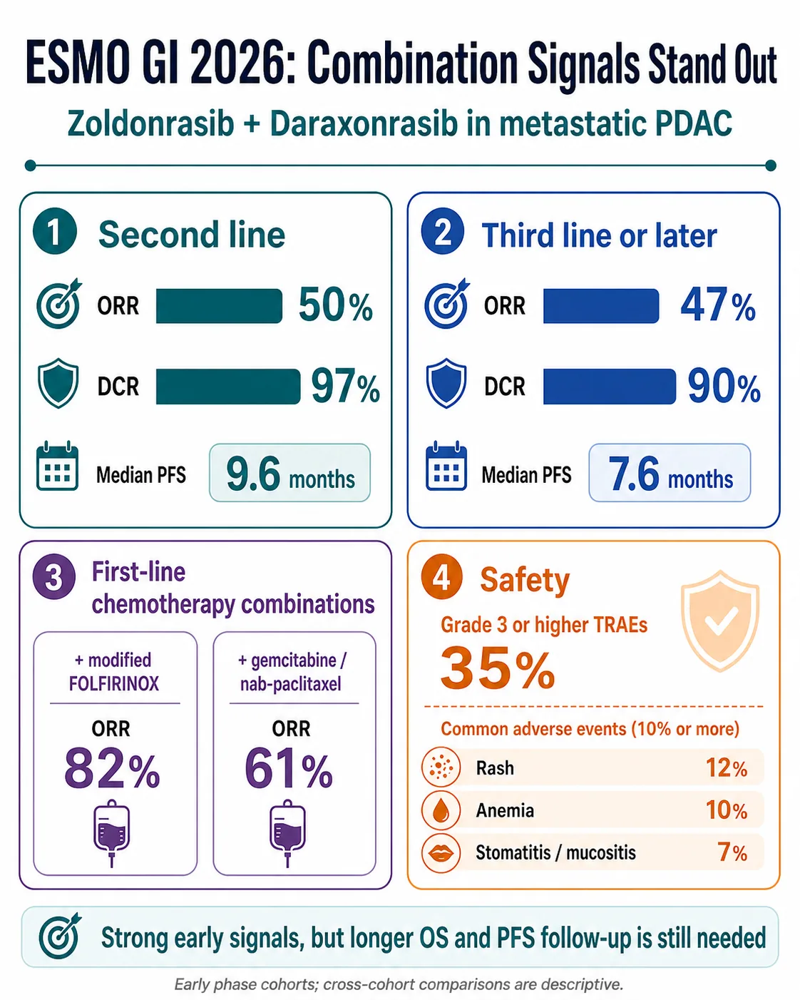
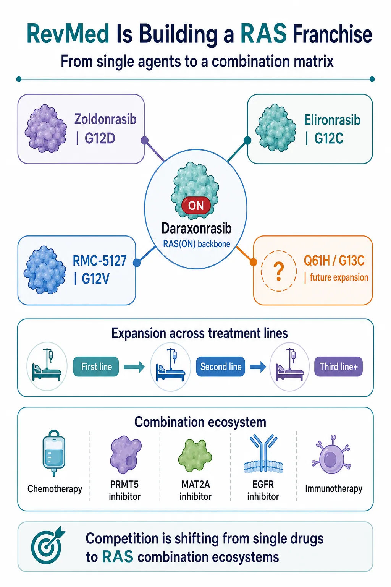

# RevMed Upends Pancreatic Cancer Again: The RAS Combination Era Has Arrived

For years, pancreatic cancer's most frightening feature was not only its mortality. It was the absence of a targeted therapy capable of changing the treatment path in a meaningful way.

More than 90% of pancreatic ductal adenocarcinomas carry a RAS mutation, and KRAS G12D is the largest single molecular subgroup. Yet RAS spent decades labeled “undruggable.” Its surface offered few stable pockets, its signaling changed shape dynamically, and even successful target engagement could be followed by pathway rebound.

That old framework is now breaking apart.

Revolution Medicines, better known as RevMed, has already shown in the phase 3 RASolute 302 trial that daraxonrasib can extend median overall survival to 13.2 months, compared with 6.7 months for investigator's choice, in previously treated metastatic pancreatic cancer. That result did more than validate one molecule. It established that broad RAS(ON) inhibition can produce a survival benefit in a disease long dominated by chemotherapy.

The next step is even more consequential. Data presented around ESMO GI 2026 suggest that the KRAS G12D-selective inhibitor zoldonrasib can be paired with daraxonrasib or frontline chemotherapy to create a deeper and broader attack on RAS-driven disease.

Drugnews' view is that the competitive question has changed. The market is no longer asking only which company can produce the best single KRAS inhibitor. It is asking which company can build the treatment backbone, combination logic and mutation-specific franchise around RAS.

## 01 | Why Pancreatic Cancer Is So Difficult: KRAS Is the Central Switch

KRAS behaves like a molecular switch. In its GTP-bound state, it is active and transmits growth signals through downstream pathways such as RAF-MEK-ERK and PI3K-AKT. After GTP is converted to GDP, the normal protein can turn off.

The G12D mutation interferes with that shutoff process. The switch remains biased toward the active state, allowing continuous proliferative and survival signaling.

This matters especially in pancreatic cancer because RAS is not a peripheral feature of the disease. It is embedded in the biology of most tumors. Blocking the pathway therefore offers a potentially powerful point of intervention, but it also creates intense selective pressure. Cancer cells can recover signaling through wild-type RAS isoforms, receptor tyrosine kinases or parallel pathways.

That is why a selective inhibitor can produce depth without necessarily producing breadth. It may suppress the dominant mutant driver very effectively while leaving the tumor opportunities to rewire around it.

Conversely, a broad RAS inhibitor may cover multiple escape routes but face a narrower therapeutic window because it acts across a wider signaling network. The central challenge is therefore not merely to “hit KRAS.” It is to suppress the driver deeply enough, shut down the most relevant bypass mechanisms and still preserve a tolerable dose intensity.

Pancreatic cancer has been one of the harshest tests of that balance. Its dense tumor microenvironment, rapid clinical progression and limited treatment window make incremental signals difficult to translate into durable benefit. A therapy that works here can carry implications far beyond one indication.

## 02 | Zoldonrasib Plus Daraxonrasib: Depth and Breadth, Not Just 1 + 1

Zoldonrasib and daraxonrasib play different roles.

Zoldonrasib is designed to inhibit KRAS G12D selectively. Its strategic value is depth: it concentrates pressure on the mutation that drives a large share of pancreatic tumors.

Daraxonrasib is a multi-selective RAS(ON) inhibitor. Its value is breadth: it can intercept active RAS signaling across multiple nodes and may constrain escape through other RAS proteins or reactivated upstream signaling.

The biological logic behind the combination is straightforward. When the G12D driver is inhibited, a tumor may reactivate signaling through NRAS, HRAS, HER2, MET or other receptor-driven pathways. Adding daraxonrasib aims to keep those rescue routes from restoring enough pathway output for the tumor to survive.

This is not simply two inhibitors attacking the same protein twice. It is a division of labor. One agent locks down the principal mutant driver; the other attempts to limit the network's ability to reorganize.

The same reasoning explains why zoldonrasib is also being explored with chemotherapy. Modified FOLFIRINOX and gemcitabine plus nab-paclitaxel remain central first-line regimens. If selective RAS inhibition can deepen response without making the regimen impossible to deliver, the addressable opportunity moves from salvage treatment toward the much larger first-line setting.

That step is commercially important. A later-line targeted therapy can establish proof of concept. A tolerable first-line combination can redefine the treatment architecture, expand duration of therapy and make the drug part of the default regimen rather than a rescue option.

## 03 | The Signals Are Strong, but the Samples Are Still Early

The early combination data are difficult to ignore.

In a second-line metastatic pancreatic cancer cohort, zoldonrasib plus daraxonrasib produced a 50% objective response rate, a 97% disease-control rate and median progression-free survival of 9.6 months.

In patients treated in the third line or later, the reported objective response rate was 47%, the disease-control rate was 90% and median progression-free survival was 7.6 months.

In first-line combinations, zoldonrasib plus modified FOLFIRINOX produced an objective response rate of 82%, while zoldonrasib plus gemcitabine and nab-paclitaxel produced an objective response rate of 61%.

Those numbers are impressive in the context of metastatic pancreatic cancer, but the interpretation still needs discipline.

The second-line and third-line-or-later cohorts each included approximately 30 patients. Small, early-phase cohorts can overstate effect size, especially when enrollment, baseline prognosis and follow-up differ. Response rate is not the same as overall survival, and cross-cohort comparisons are descriptive rather than randomized evidence.

The frontline chemotherapy combinations are even earlier. The key questions are not only whether tumors shrink, but whether the response remains durable, whether progression-free survival holds up and whether overall survival ultimately improves.

Safety will also determine whether the combination can become a backbone. Grade 3 or higher treatment-related adverse events were reported in 35% of patients in the highlighted combination dataset. Common events included rash at 12%, anemia at 10%, and stomatitis or mucositis at 7%. Treatment discontinuation rates were reported at 2% and 5% across the relevant cohorts, while daraxonrasib dose intensity was approximately 76%.

The 76% figure deserves attention. A combination can look compelling at the efficacy level yet become commercially difficult if dose reductions, interruptions or cumulative toxicity prevent sustained delivery. The important follow-up questions are whether dose intensity stabilizes, whether adverse events can be managed predictably and whether efficacy persists after real-world dose modification.

The investment conclusion is therefore not that these cohorts have already established a new standard of care. It is that RevMed has generated a sufficiently strong early signal to justify phase 3 development and to force the rest of the RAS field to answer a harder combination-therapy question.

## 04 | RevMed Is Turning RAS Into a Franchise

RevMed's strongest strategic asset may not be any single drug. It is the architecture of the portfolio.

Daraxonrasib provides the broad RAS(ON) backbone.

Zoldonrasib covers KRAS G12D, the largest mutation subgroup in pancreatic cancer.

Elironrasib, also known as RMC-6291, addresses KRAS G12C.

RMC-5127 targets KRAS G12V.

Additional programs aimed at variants such as Q61H and G13C could extend the matrix further.

This portfolio matters because it allows RevMed to connect several dimensions of development at once: mutation subtype, line of therapy, tumor type and combination partner.

The company can pursue second-line pancreatic cancer with a validated broad RAS inhibitor, move into first-line treatment through chemotherapy combinations, and layer mutation-selective agents onto the same backbone. The approach can then extend into lung cancer, colorectal cancer and other RAS-driven solid tumors.

That changes how a KRAS G12D asset should be valued. In the previous framework, a G12D inhibitor was largely a stand-alone product story. In the new framework, its value also depends on whether it can become a modular component of a broader RAS regimen.

The strategic questions become:

- Can a G12D inhibitor combine safely with a pan-RAS or RAS(ON) backbone?
- Can it improve chemotherapy outcomes without making the regimen undeliverable?
- Can it be paired with PRMT5 or MAT2A inhibitors to exploit additional vulnerabilities?
- Can EGFR inhibition control feedback in the relevant tumor types?
- Can immunotherapy contribute after RAS signaling and the tumor microenvironment are altered?

RevMed has effectively turned a single-node race into a matrix competition. Companies will need not only a potent molecule, but also a defensible place inside a combination ecosystem.

## 05 | The International RAS Field Will Be Repriced

RevMed's progress raises the standard for every international competitor.

Bristol Myers Squibb's MRTX1133 was one of the earliest high-profile KRAS G12D programs and remains in clinical development for G12D-mutant solid tumors. Its challenge is no longer simply to demonstrate target activity. It must show differentiated clinical depth, a manageable safety profile and a credible combination path.

Eli Lilly's LY4066434 takes a broader pan-KRAS approach. That creates the possibility of mutation breadth, but it also places therapeutic-window and dose-intensity questions at the center of the thesis.

Incyte's INCB161734 is an oral KRAS G12D inhibitor with early clinical data and pancreatic-cancer development activity. It will be judged not only on monotherapy response, but also on whether it can combine with chemotherapy or complementary RAS-pathway agents.

The field now faces four sharper questions.

First, can a molecule create a meaningful monotherapy difference?

Second, can it combine safely with chemotherapy, broad RAS inhibition or other pathway mechanisms?

Third, can it produce overall-survival evidence in a disease where response rate alone is not enough?

Fourth, can the company establish a combination setting in which it owns the treatment backbone rather than merely supplies an add-on component?

RevMed has raised the bar from entering the clinic to controlling a strategic position in the regimen.

## Conclusion | The “King of Cancers” Has Not Been Defeated, but the Treatment Logic Has Changed

The most important feature of these data is not a single response-rate number.

It is the change in what pancreatic-cancer drug development can plausibly look like.

For years, progress largely meant adjusting chemotherapy combinations. Now the RAS field has reached phase 3 overall-survival evidence in later-line disease, first-line combination development, dual blockade of KRAS G12D and broader RAS signaling, and a portfolio strategy spanning multiple mutation subtypes.

Daraxonrasib has shown that broad RAS(ON) inhibition can generate an overall-survival benefit in metastatic pancreatic cancer.

Zoldonrasib has shown early evidence that selective G12D inhibition can be combined with daraxonrasib or chemotherapy to produce deeper signals.

The next decisive test is whether randomized phase 3 trials can convert those signals into a new standard of care.

Pancreatic cancer has not been solved. But RevMed has made the old claim that RAS is simply undruggable much harder to defend. If daraxonrasib reaches the market and the combination programs validate, RevMed may no longer be valued as a biotech built around one successful molecule.

It could become the prototype of a next-generation RAS oncology company.

And the competitive era would shift from “who has the first single agent?” to “who can build the most durable RAS treatment ecosystem?”

## References

1. [Revolution Medicines | Phase 1/2 clinical data for zoldonrasib combination regimens, July 2, 2026](https://ir.revmed.com/news-releases/news-release-details/revolution-medicines-presents-phase-12-clinical-data-zoldonrasib)
2. [ClinicalTrials.gov | RASolute 302: daraxonrasib versus investigator's choice in previously treated metastatic PDAC (NCT06625320)](https://clinicaltrials.gov/study/NCT06625320)
3. [Revolution Medicines | RASolute 302 ASCO plenary presentation and overall-survival results](https://ir.revmed.com/node/13046/pdf)
4. [ClinicalTrials.gov | Zoldonrasib phase 1/1b study (NCT06040541)](https://clinicaltrials.gov/study/NCT06040541)
5. [ClinicalTrials.gov | RASolute 305 first-line phase 3 study (NCT07621718)](https://clinicaltrials.gov/study/NCT07621718)
6. [Revolution Medicines | First-quarter 2026 corporate and pipeline update](https://ir.revmed.com/node/12976/pdf)
7. [ClinicalTrials.gov | MRTX1133 study in advanced solid tumors with KRAS G12D mutation (NCT05737706)](https://clinicaltrials.gov/study/NCT05737706)
8. [ClinicalTrials.gov | LY4066434 study in KRAS-mutant solid tumors (NCT06607185)](https://clinicaltrials.gov/study/NCT06607185)

## Disclaimer

This article is provided for industry research and educational purposes only. It does not constitute investment, medical, fundraising or securities advice.
