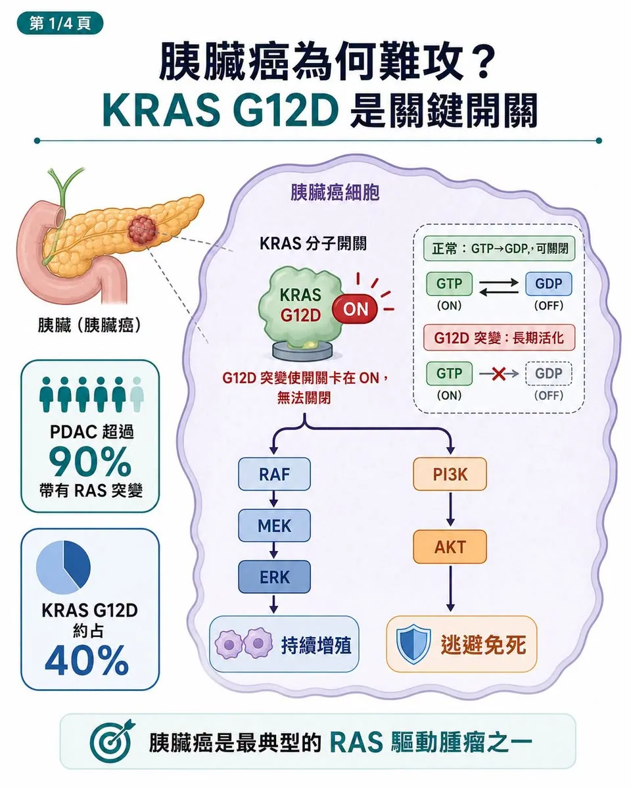
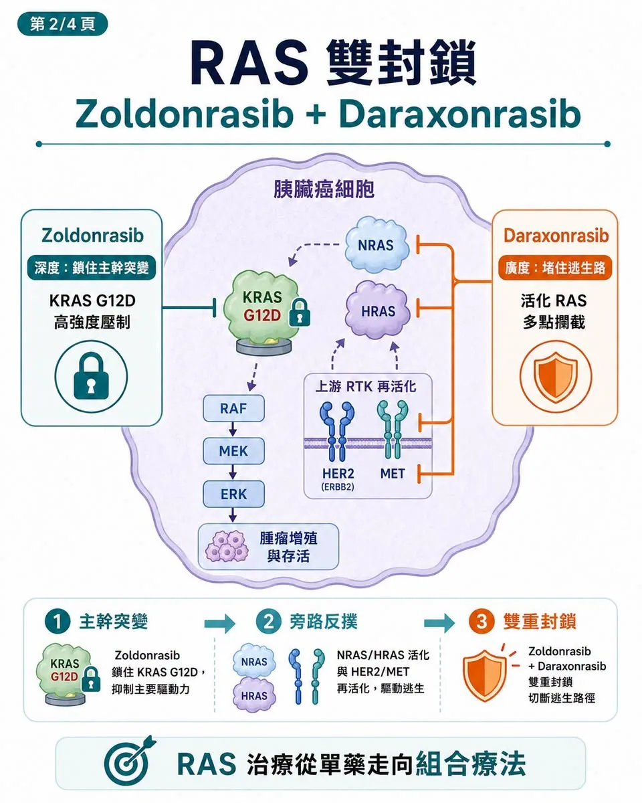
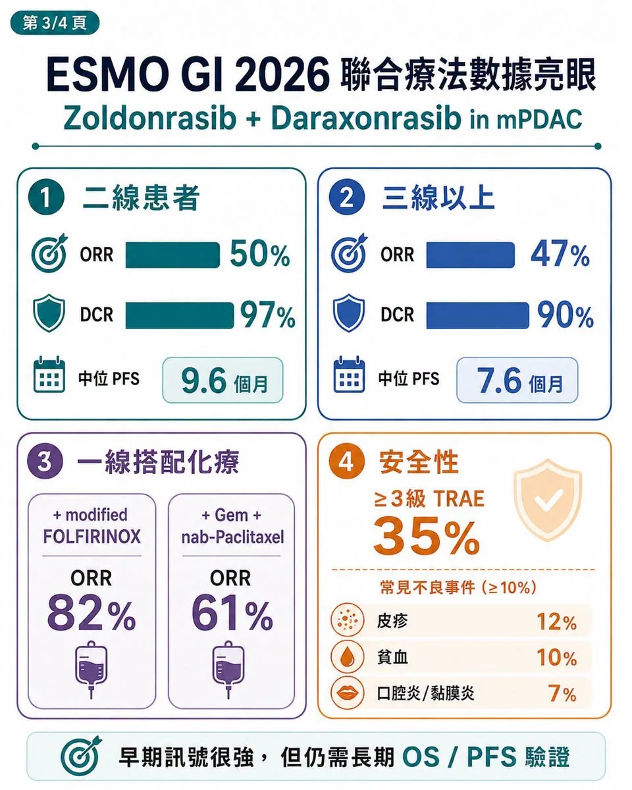
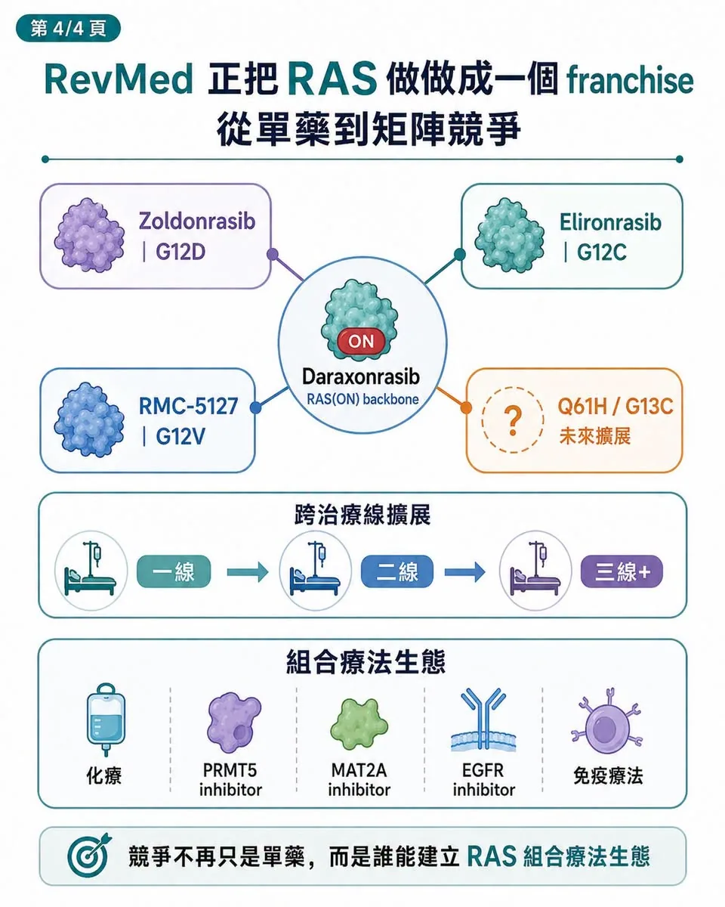

# 又一次RevMed 直接掀桌，胰臟癌進入 RAS 組合療法時代

胰臟癌這個「癌王」，可能真的要被 RAS 藥物撬開一道縫了。

過去，胰臟癌最可怕的地方，不只是死亡率高，而是長期缺乏真正能改寫治療路徑的標靶藥。

KRAS 突變明明出現在超過九成胰臟導管腺癌（PDAC）患者身上，卻因為蛋白結構太滑、缺乏好口袋，長期被視為「不可成藥」。

直到 Revolution Medicines，也就是 RevMed，把 RAS(ON) 抑制劑推到三期陽性。

它的核心藥物 daraxonrasib（RMC-6236），是一款口服 RAS(ON) multi-selective inhibitor，也就是 RAS 活化狀態多選擇性抑制劑。在先前 RASolute-302 三期試驗中，daraxonrasib 用於既往治療過的轉移性 PDAC，將中位整體存活期拉到 13.2 個月，對照化療約 6.7 個月，死亡風險顯著下降，幾乎把後線胰臟癌治療標準直接重寫。

但 RevMed 想要的，顯然不只是二線胰臟癌。

7 月 2 日，RevMed 在 2026 ESMO GI 公布另一組更有想像力的資料：KRAS G12D 抑制劑 zoldonrasib（RMC-9805）聯合 daraxonrasib，在 RAS G12D 轉移性胰臟癌患者中展現強勁訊號。

二線患者中，zoldonrasib 加 daraxonrasib 的 ORR，也就是客觀緩解率，達 50%；DCR，也就是疾病控制率，達 97%；中位 PFS，也就是無惡化存活期，達 9.6 個月。三線以上患者 ORR 也有 47%，DCR 達 90%。同時，在一線患者中，zoldonrasib 聯合標準化療也做出高反應率：

搭配 modified FOLFIRINOX 的 ORR 達 82%。

搭配 gemcitabine plus nab-paclitaxel，也就是吉西他濱加白蛋白結合型紫杉醇的 ORR 達 61%。

這組資料真正重要的地方，不是又多一款 KRAS G12D 藥物。而是 RevMed 正在用 RAS 矩陣管線，試圖把胰臟癌從一線到後線全部吃下來。

## 01｜為什麼胰臟癌這麼難？KRAS 是關鍵開關

要理解這組聯合療法，必須先理解 KRAS。

KRAS 在正常細胞裡像一個訊號開關。當外部有生長訊號時，KRAS 結合 GTP，進入活化狀態，通知細胞增殖；當訊號結束後，GTP 被水解成 GDP，KRAS 回到關閉狀態。這個「開—關」循環，原本非常精密。問題是，KRAS G12D 突變會讓 KRAS 蛋白結構改變，使它難以正常關閉。結果是 KRAS 長期卡在活化狀態，不斷向下游送出兩條訊號：

一條透過 RAF-MEK-ERK 告訴細胞繼續增殖。

另一條透過 PI3K-AKT 告訴細胞不要死亡。

這也是為什麼 KRAS 突變癌細胞很難打。你不是在處理一個單點訊號，而是在處理一個被鎖死的生長引擎。在胰臟癌中，KRAS G12D 又是最常見的突變亞型之一。

RevMed 公告指出，PDAC 是主要癌種中最典型的 RAS-driven malignancy，也就是 RAS 驅動惡性腫瘤，超過 90% 患者帶有 RAS 突變，其中 RAS G12D 約占 40%。所以，誰能真正壓住 G12D，誰就有機會改寫胰臟癌治療。

## 02｜Zoldonrasib 加 Daraxonrasib：不是 1+1，而是「深度＋廣度」

這次最值得玩味的，不是 zoldonrasib 單藥，而是它和 daraxonrasib 的組合。

Zoldonrasib 是口服 RAS(ON) G12D-selective covalent inhibitor，也就是 RAS 活化狀態 G12D 選擇性共價抑制劑，主打深度。它用共價方式鎖住 KRAS G12D，針對最大亞型做高強度壓制。

Daraxonrasib 則是 RAS(ON) multi-selective inhibitor，主打廣度。

它不是只打 G12D，而是覆蓋多種活化 RAS 訊號，包括 G12D、G12V、G12R，以及部分癌細胞繞路後重新啟動的 RAS 訊號。兩者聯用的邏輯，不是簡單把兩個藥加在一起，而是在 RAS 通路上做雙重封鎖。

第一層，是縱向深度。Zoldonrasib 對 KRAS G12D 做高強度、持久性壓制，把最主要的驅動突變先封住。

第二層，是橫向廣度。Daraxonrasib 則負責堵住癌細胞的逃生路。癌細胞若透過 NRAS、HRAS 旁路，或 HER2、MET 等上游受體重新啟動野生型 RAS 訊號，daraxonrasib 仍有機會把這些活化 RAS 訊號一起攔下來。

這就是為什麼這組聯合療法有意思。

KRAS G12D 單藥面對的最大問題，是癌細胞會逃。它可以擴增 KRAS G12D 拷貝數，製造更多靶蛋白來稀釋抑制劑效果；也可以啟動其他 RAS 家族成員，繞過 G12D；還可以透過上游 RTK 訊號重建下游 ERK、AKT 活性。

Zoldonrasib 解決的是「主幹突變」。

Daraxonrasib 解決的是「旁路反撲」。

這就是 RAS 雙封鎖的精髓。

## 03｜資料真的強，但還不能忘記它仍是早期樣本

從療效來看，zoldonrasib 加 daraxonrasib 的訊號相當亮眼。

二線 RAS G12D 轉移性 PDAC 患者 ORR 50%、DCR 97%、中位 PFS 9.6 個月；

三線以上 ORR 47%、DCR 90%、中位 PFS 7.6 個月。

對照傳統後線胰臟癌治療，這組數字非常有衝擊力。更重要的是，這不是挑最漂亮的患者族群。RevMed 公布資料顯示，這些患者多數已有後線治療經驗，且相當高比例存在肝轉移。胰臟癌肝轉移通常代表預後更差、進展更快、化療滲透更困難，能在這樣的人群中打出接近五成反應率，確實不容易。安全性方面，zoldonrasib 加 daraxonrasib 的 3 級以上治療相關不良事件發生率為 35%。常見 3 級以上事件包括：

皮疹 12%。

貧血 10%。

口腔炎／黏膜炎 7%。

因不良事件停用 zoldonrasib 與 daraxonrasib 的比例分別為 2% 與 5%。這組安全性比市場原先想像更好。但也必須保持冷靜。

第一，樣本數仍不大。二線 30 人、三線以上 30 人，訊號很強，但還不能替代三期結論。

第二，daraxonrasib 劑量強度只有 76%。這代表臨床上可能仍需要在療效與皮疹、口腔炎等毒性之間找平衡。

第三，真正決定這個組合價值的，仍是後續 OS、PFS 長期追蹤與三期驗證。OS 是整體存活期，PFS 是無惡化存活期，這些才是胰臟癌治療能否真正改寫標準的關鍵。

所以，這不是可以直接宣告勝利的資料。但它足以宣告一件事：

RAS 治療不再是單藥故事，而是進入組合療法時代。

## 04｜RevMed 正在做的，是把 RAS 做成一個 franchise

RevMed 最可怕的地方，不只是有 daraxonrasib。而是它正在把 RAS 做成一套產品矩陣。

Daraxonrasib 負責廣譜 RAS(ON) 抑制，是平台骨架。

Zoldonrasib 負責 KRAS G12D，是胰臟癌最大突變族群。

Elironrasib（RMC-6291）負責 G12C。

RMC-5127 則瞄準 G12V。

後面還有 Q61H、G13C 等更細分突變亞型。

這種布局的意義在於，RevMed 不是只想做一款胰臟癌藥，而是想重建 RAS-driven cancers，也就是 RAS 驅動癌症的治療版圖。從二線胰臟癌，到一線胰臟癌，再到肺癌、結直腸癌與其他 RAS 突變實體瘤，它正在把不同 RAS 分型一塊一塊接起來。這也會改變整個 KRAS G12D 賽道的估值邏輯。

過去市場看 G12D，常把它當成單一突變抑制劑故事。但現在，daraxonrasib 成功後，G12D 抑制劑的價值不只是單藥，而是能不能成為 RAS backbone，也就是 RAS 治療骨架上的加成模組。換句話說，G12D 不再只是自己打。而是要看它能不能跟 pan-RAS、化療、PRMT5 inhibitor、MAT2A inhibitor、EGFR inhibitor 或免疫療法一起打。

也就是：

G12D 能不能搭 pan-RAS？

能不能搭化療？

能不能搭 PRMT5 抑制劑？

能不能搭 MAT2A 抑制劑？

能不能搭 EGFR 抑制劑？

能不能搭免疫療法？

這就是 RevMed 掀桌的地方。它把一條原本單點競爭的賽道，改造成矩陣競爭。

## 05｜國際玩家都會重新被定價
RevMed 的資料一出來，整個 RAS 賽道都會被重新看待。

Bristol Myers Squibb 旗下的 MRTX1133 曾是 KRAS G12D 領域早期焦點之一，目前仍有 G12D 實體瘤臨床試驗登錄紀錄。

Eli Lilly 的 LY4066434 則是 pan-KRAS inhibitor，也就是泛 KRAS 抑制劑，正在 KRAS 突變實體瘤中評估安全性與耐受性。

Incyte 的 INCB161734 也是口服 KRAS G12D inhibitor，也就是口服 KRAS G12D 抑制劑，已有早期臨床結果發表，並開始推進胰臟癌相關研究。

這些公司面對的問題會變得更尖銳：

你的藥能不能單藥打出差異？

能不能安全地和化療、pan-RAS 或其他機制聯用？

能不能在胰臟癌這種高死亡率疾病裡做出真正 OS？

能不能建立自己的組合療法主場？

RevMed 已經把標準拉高了。未來 RAS 賽道的競爭，不只是誰最快進臨床，而是誰能在組合療法裡站住位置。

## 結語｜癌王沒有被終結，但治療邏輯真的變了
RevMed 這次資料，真正改變的不是一個 ORR 數字。

它改變的是胰臟癌研發的想像。過去，胰臟癌治療多半圍繞化療組合微調；現在，RAS 標靶終於開始走進後線三期陽性、一線聯合、G12D 雙封鎖與多突變矩陣布局。

Daraxonrasib 證明，廣譜 RAS(ON) 抑制可以在胰臟癌做出 OS。

Zoldonrasib 證明，G12D 抑制可以與 pan-RAS 或化療形成更強組合。

接下來真正要看的，是三期試驗能否把這些早期訊號轉成標準治療。

胰臟癌還沒有被攻克。但 RevMed 至少做成一件事：它讓市場第一次相信，RAS 不再只是不可成藥的老故事，而可能成為胰臟癌下一個治療骨架。如果 daraxonrasib 成功上市，RevMed 也許不只是 Biotech。

它會成為下一代 RAS oncology company，也就是 RAS 腫瘤治療公司的原型。而整個 RAS 賽道，也會從「誰先做出單藥」進入「誰能建立組合療法生態」的新階段。

## 參考資料

1. [Revolution Medicines｜Phase 1/2 clinical data for zoldonrasib combination regimens, 2026-07-02](https://ir.revmed.com/news-releases/news-release-details/revolution-medicines-presents-phase-12-clinical-data-zoldonrasib)
2. [ClinicalTrials.gov｜RASolute 302: daraxonrasib versus investigator's choice in previously treated metastatic PDAC (NCT06625320)](https://clinicaltrials.gov/study/NCT06625320)
3. [Revolution Medicines｜RASolute 302 ASCO plenary presentation and overall-survival results](https://ir.revmed.com/node/13046/pdf)
4. [ClinicalTrials.gov｜Zoldonrasib phase 1/1b study (NCT06040541)](https://clinicaltrials.gov/study/NCT06040541)
5. [ClinicalTrials.gov｜RASolute 305 first-line phase 3 study (NCT07621718)](https://clinicaltrials.gov/study/NCT07621718)
6. [Revolution Medicines｜First-quarter 2026 corporate and pipeline update](https://ir.revmed.com/node/12976/pdf)
7. [ClinicalTrials.gov｜MRTX1133 study in advanced solid tumors with KRAS G12D mutation (NCT05737706)](https://clinicaltrials.gov/study/NCT05737706)
8. [ClinicalTrials.gov｜LY4066434 study in KRAS-mutant solid tumors (NCT06607185)](https://clinicaltrials.gov/study/NCT06607185)

---

本文僅供產業研究與知識分享，不構成投資、醫療、募資或個股建議。
