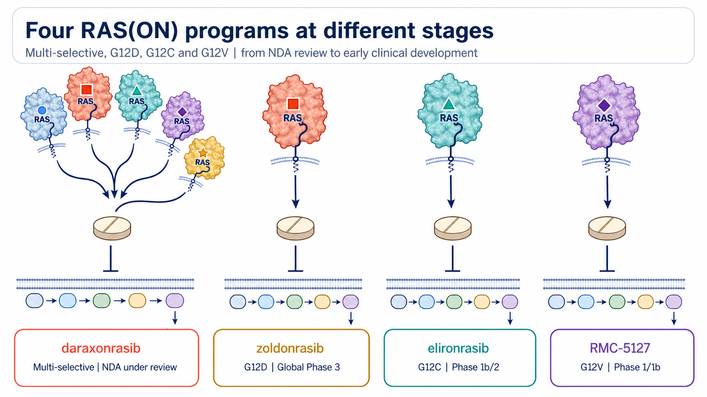
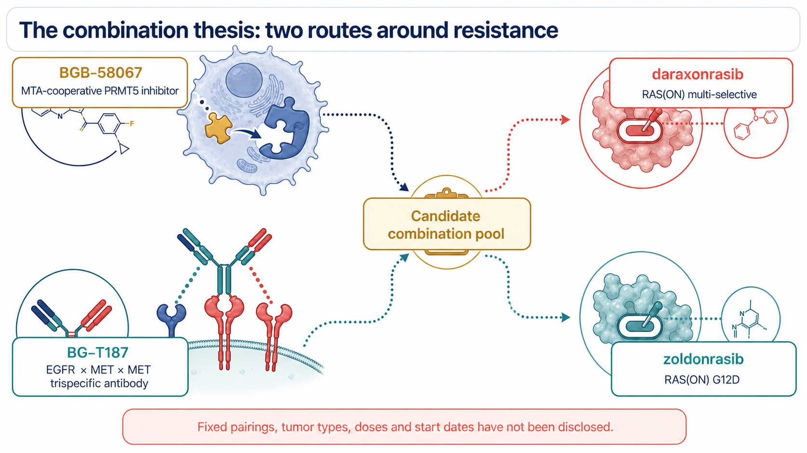
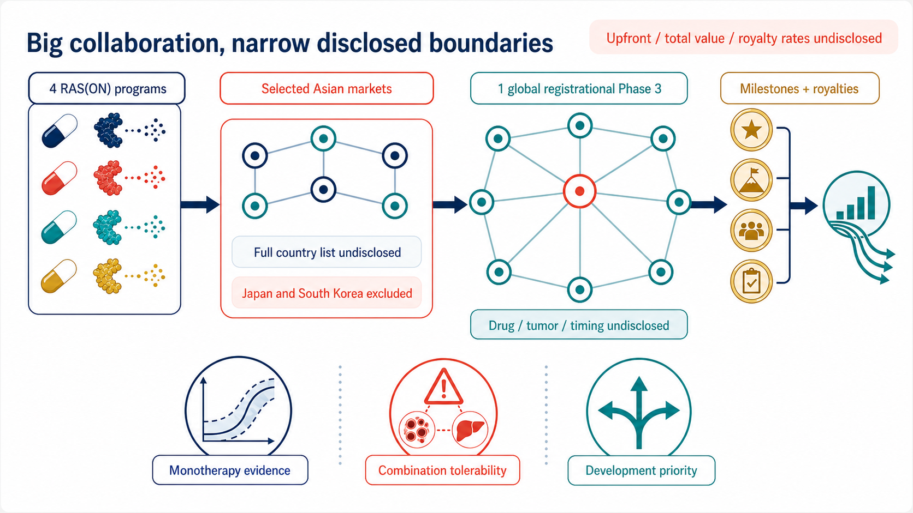

# BeOne Bets on Four RAS Drugs: The Real Asset Is Development Optionality

On August 10, BeOne Medicines and Revolution Medicines laid out a collaboration spanning four RAS(ON) programs, two BeOne combination assets, commercialization rights in selected Asian markets and one global registrational Phase 3 study.

This is not an acquisition, and the global rights to all four drugs have not changed hands. BeOne is gaining a development and commercialization entry point in selected Asian markets, together with opportunities to test its own oncology assets alongside Revolution Medicines' RAS portfolio. Revolution Medicines retains rights outside the licensed territory while adding a partner that can fund and execute a global registrational Phase 3 trial.

Four programs make the announcement look large. The more important question is which company is buying time for the other.

## 01 | Four RAS strategies enter at different stages

RAS can be understood as a molecular switch inside a cancer cell. Oncogenic mutations can hold that switch in an active position, continuously transmitting growth signals downstream. Earlier drugs often trapped an inactive form of RAS. Revolution Medicines' RAS(ON) platform is designed to engage the active state that is driving the tumor.

The four clinical programs covered by the collaboration are not equally mature.

**Daraxonrasib (RMC-6236)**

Daraxonrasib is a multi-selective RAS(ON) inhibitor intended to cover several common RAS genotypes. The US Food and Drug Administration accepted its new drug application on July 22, 2026, for previously treated metastatic pancreatic ductal adenocarcinoma. That filing is supported by data from a global randomized Phase 3 study.

**Zoldonrasib (RMC-9805)**

Zoldonrasib targets RAS G12D. Revolution Medicines has started the global Phase 3 RASolute 305 study, testing zoldonrasib with standard chemotherapy in previously untreated metastatic RAS G12D pancreatic cancer.

**Elironrasib (RMC-6291)**

Elironrasib targets RAS G12C and remains in early clinical development. The recruiting Phase 1b/2 study includes both monotherapy and a combination with daraxonrasib.

**RMC-5127**

RMC-5127 targets RAS G12V. The first patient was dosed in January 2026, and the program remains in Phase 1/1b.

BeOne is therefore not taking in four equally ripe assets. One has reached FDA review, one is in Phase 3, and two are still defining dose, patient selection and the combinations most worth pursuing.

## 02 | The combinations are the most ambitious part of the deal

The companies point to two BeOne assets as potential combination partners:

- **BGB-58067**, an MTA-cooperative PRMT5 inhibitor designed around the dependence of MTAP-deleted tumors on PRMT5; and
- **BG-T187**, an EGFR × MET × MET trispecific antibody with one EGFR-binding site and two MET-binding sites, intended to address upstream signaling and bypass activation.

The wording of the announcement matters. Planned studies will combine BGB-58067 and BG-T187 with daraxonrasib “or” zoldonrasib. This is a pool of candidate combinations. The companies have not disclosed a fixed pairing for every asset, the tumor types, doses or start dates. It would be inaccurate to draw all four permutations as active programs.

The scientific logic is straightforward. After RAS is suppressed, a tumor may reconnect through upstream signaling, bypass pathways or alternative survival programs. PRMT5 and EGFR/MET offer two different ways to surround that escape route.

But combining two attractive targets does not automatically create a better therapy. Human data must establish whether efficacy can be added, toxicity remains manageable, and sequencing and dose produce a usable therapeutic window. At present, the companies have a mechanistic hypothesis and a collaboration framework, not evidence that the combinations work.

## 03 | The Asian rights look broad, but the disclosed boundary is narrow

Revolution Medicines is granting BeOne exclusive rights to the four programs in “selected Asian markets.” Depending on the market, those rights may include development and commercialization or commercialization alone.

The companies have not published the full country list. The agreement therefore cannot be described as covering all of Asia, and Taiwan cannot be assumed to be inside the territory. What is explicit is that Japan and South Korea remain outside the licensed territory, with Revolution Medicines retaining development and commercial rights in both countries.

The financial terms leave an equally large blank space. Revolution Medicines is eligible for development milestones, sales milestones and tiered royalties on net sales in the collaboration territory. The upfront payment, aggregate milestone value and royalty rates were not disclosed.

“Eligible to receive” is an important phrase. It describes payments that may occur if future conditions are met; it does not mean the money has already been received.

## 04 | The biggest unanswered question: which program gets the global Phase 3?

The heaviest commitment in the agreement is BeOne's obligation to fund and conduct one global registrational Phase 3 study for one of Revolution Medicines' four RAS(ON) inhibitors.

As of August 12, the companies had not identified the drug, tumor type, line of therapy or start date.

That blank may be more revealing than the undisclosed transaction value. Daraxonrasib already has several global Phase 3 programs. Zoldonrasib has entered a first-line pancreatic-cancer Phase 3. Elironrasib and RMC-5127 are earlier. The final choice will show how the partners rank scientific risk, clinical speed and market opportunity.

Revolution Medicines has not handed over global development. The announcement explicitly says the company will continue its broad global registrational program. BeOne is taking responsibility for one additional Phase 3 study and the agreed development or commercial work inside the collaboration territory.

## 05 | What did each company actually buy?

For BeOne, the collaboration is an acceleration ticket in solid tumors.

BeOne already has PRMT5 and EGFR/MET assets, cross-regional clinical execution and a commercial network across Asia. By connecting four RAS(ON) inhibitors, it gains regional rights, combination entry points and the opportunity to lead a global Phase 3 without building an entire RAS chemistry platform from zero.

For Revolution Medicines, the exchange creates development capacity and geographic reach. The company retains rights outside the licensed territory while a partner funds and executes one global Phase 3. Milestones and royalties allow Revolution Medicines to participate in part of the value created in selected Asian markets. That structure may preserve internal capital for its other registrational studies while opening markets where its footprint is thinner.

Drugnews' reading is that the central asset in this deal is optionality, not the simple sum of four drugs.

Three items now deserve close attention:

1. **The monotherapy foundation.** Daraxonrasib's regulatory progress, zoldonrasib's Phase 3 trial, and whether the two earlier programs can produce durable safety and efficacy signals.
2. **The combination window.** Which pairings actually start, how patients are selected, and whether toxicity can be controlled.
3. **The global Phase 3 choice.** Which program is selected, how regional work is divided, and whether the collaboration moves faster than Revolution Medicines could on its own.

Four drugs make the network look large. One selected Phase 3 will reveal where that network is actually tightening.

## References

1. [Revolution Medicines: clinical development and regional commercialization collaboration announcement, August 10, 2026](https://revmed.gcs-web.com/news-releases/news-release-details/revolution-medicines-and-beone-medicines-announce-clinical)
2. [BeOne Medicines: clinical development and regional commercialization collaboration announcement, August 10, 2026](https://ir.beonemedicines.com/news/BeOne-Medicines-and-Revolution-Medicines-Announce-Clinical-Development-and-Regional-Commercialization-Collaboration/0a35a8d0-de94-4e43-a54c-c08af0e2e7ad)
3. [SEC: BeOne Medicines first-quarter 2026 Form 10-Q cover data](https://www.sec.gov/Archives/edgar/data/1651308/000162828026030867/R1.htm)
4. [BeOne Medicines: Hong Kong investor site in Traditional Chinese](https://hkexir.beonemedicines.com/zh-hant)
5. [Revolution Medicines: clinical development pipeline](https://www.revmed.com/pipeline/)
6. [Revolution Medicines: FDA accepts daraxonrasib NDA, July 22, 2026](https://ir.revmed.com/news-releases/news-release-details/revolution-medicines-new-drug-application-daraxonrasib-accepted/)
7. [Revolution Medicines: RASolute 305 global Phase 3 begins treating patients, June 23, 2026](https://ir.revmed.com/news-releases/news-release-details/revolution-medicines-begins-treating-patients-rasolute-305-phase/)
8. [ClinicalTrials.gov: elironrasib and daraxonrasib Phase 1b/2, NCT06128551](https://clinicaltrials.gov/study/NCT06128551)
9. [Revolution Medicines: first patient dosed with RMC-5127, January 29, 2026](https://ir.revmed.com/news-releases/news-release-details/revolution-medicines-doses-first-patient-clinical-trial/)
10. [ClinicalTrials.gov: RMC-5127 Phase 1/1b, NCT07349537](https://clinicaltrials.gov/study/NCT07349537)
11. [BeOne Medicines: oncology pipeline](https://beonemedicines.com/science/pipeline/)
12. [BeOne Medicines: global clinical development pipeline](https://beonemedicines.com/wp-content/uploads/2026/02/Clinical-Pipeline_2026-February.pdf)
13. [ClinicalTrials.gov: BGB-58067, NCT06589596](https://clinicaltrials.gov/study/NCT06589596)
14. [ClinicalTrials.gov: BG-T187, NCT06598800](https://clinicaltrials.gov/study/NCT06598800)

Verification cutoff: August 12, 2026.

## Disclaimer

All four drug candidates remain investigational. This collaboration does not establish their safety, efficacy or regulatory approval. This article provides biotech-industry analysis based on public information and does not constitute investment advice, medical advice or treatment guidance.
