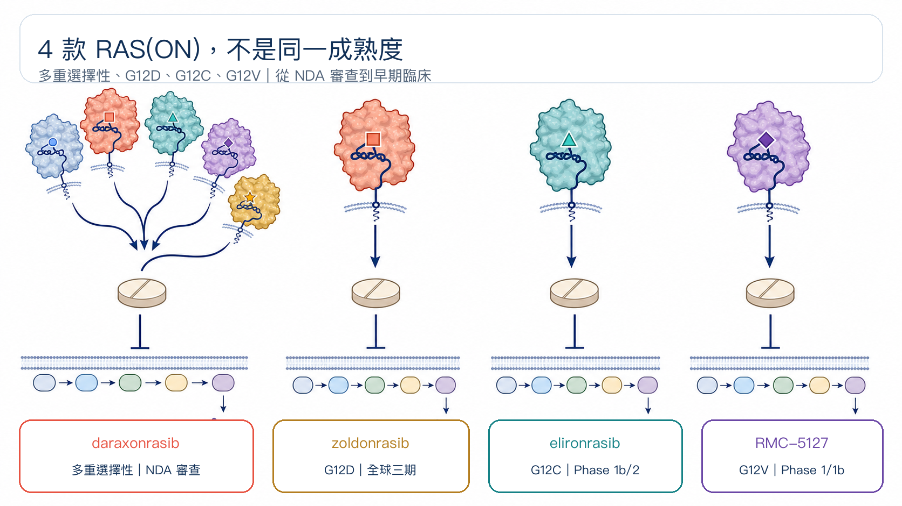
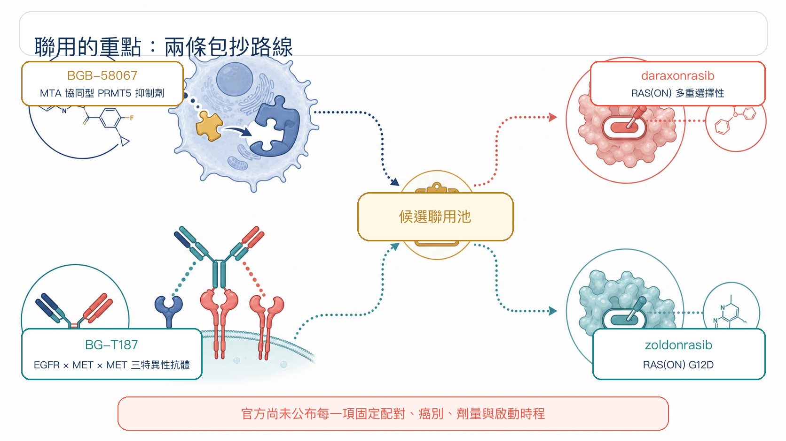
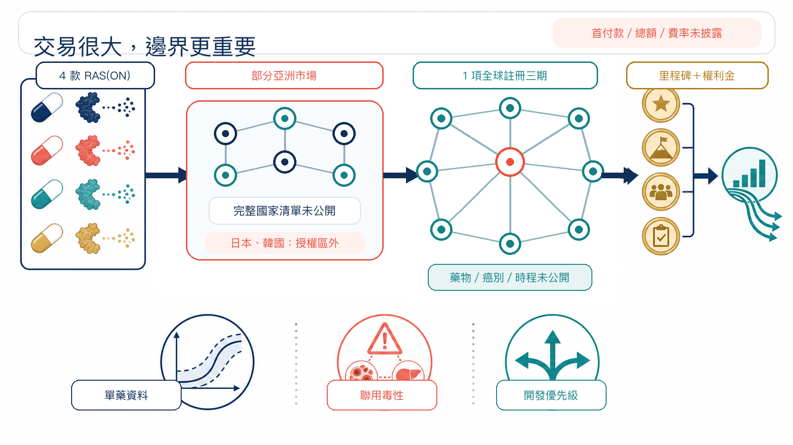

# 百濟神州一口氣押上 4 款 RAS 新藥

8 月 10 日，百濟神州（BeOne Medicines）與 Revolution Medicines，把一張「四款 RAS(ON) 新藥、兩款聯用資產、亞洲商業化、全球三期」的合作網攤上桌。

這筆交易沒有買下一家公司，也沒有把四款藥的全球權利整批搬走。百濟神州拿到的，是部分亞洲市場的開發與商業化入口，加上把自家腫瘤資產接進 RAS 管線的試驗機會；Revolution Medicines 則保留區域外權利，同時多了一支能出資並執行全球註冊性三期的隊伍。

四款資產很搶眼；更關鍵的問題是，誰在替誰搶時間。

## 01｜一次接進四種 RAS 戰法

RAS 可以想成癌細胞裡的分子開關。突變讓它長時間卡在啟動狀態，持續把生長訊號往下游送。早期藥物多半抓住關閉狀態；Revolution Medicines 的 RAS(ON) 平台，鎖定正在驅動腫瘤的活化狀態。

這次納入合作的四款臨床資產，成熟度並不相同：

**daraxonrasib（RMC-6236）**

多重選擇性 RAS(ON) 抑制劑，可涵蓋多種常見 RAS 基因型。美國 FDA 已在 2026 年 7 月 22 日受理其用於既往治療過的轉移性胰臟導管腺癌 NDA，背後已有全球隨機三期資料。

**zoldonrasib（RMC-9805）**

鎖定 RAS G12D。公司已啟動全球三期 RASolute 305，測試它搭配標準化療，用於未治療的轉移性 RAS G12D 胰臟癌。

**elironrasib（RMC-6291）**

鎖定 RAS G12C。目前仍在早期臨床開發，登錄中的 Phase 1b/2 研究同時評估單藥，以及與 daraxonrasib 的聯用。

**RMC-5127**

鎖定 RAS G12V，2026 年 1 月才完成首位患者給藥，仍在 Phase 1/1b。

換句話說，百濟神州接進來的不是四顆同樣成熟的果實。裡面有一款已走到 FDA 審查、一款正在三期，也有兩款仍在尋找劑量、病人與最佳組合。

## 02｜聯用才是這筆合作最有野心的地方

雙方公告把聯用方向指向百濟神州的兩款資產：

- **BGB-58067**：MTA 協同型 PRMT5 抑制劑，瞄準 MTAP 缺失腫瘤對 PRMT5 的依賴。
- **BG-T187**：EGFR × MET × MET 三特異性抗體，以一個 EGFR 結合位置、兩個 MET 結合位置處理上游訊號與旁路活化。

公告寫得很精準：規劃中的研究，會讓 BGB-58067、BG-T187 搭配 daraxonrasib「或」zoldonrasib。這是一個候選聯用池，尚未公布每一項固定配對、癌別、劑量與啟動時程，不能自行畫成四種組合全部開跑。

科學邏輯不難理解。RAS 被壓住後，腫瘤可能透過上游訊號、旁路路徑或細胞存活機制重新接電。PRMT5 與 EGFR／MET 提供兩條不同的包抄路線。

但聯用從來不是把兩個好靶點放在一起就會自然變好。療效能否疊加、毒性能否承受、先後次序與劑量是否找得到窗口，都要由人體資料回答。現在有的是機制假說與合作框架，還沒有聯用成功的結論。

## 03｜亞洲權利看起來很大，邊界其實很細

Revolution Medicines 授予百濟神州四款藥在「部分亞洲市場」的獨家權利。依不同市場，權利可能是開發加商業化，也可能只有商業化。

官方沒有公布完整國家清單，因此不能直接寫成「亞洲全拿」，也不能推定台灣就在授權範圍。已經確定的是，日本與韓國留在授權區外，仍由 Revolution Medicines 保有開發及商業權利。

財務條款也留了大片空白。公告只確認 Revolution Medicines 有資格取得開發里程碑、銷售里程碑，以及合作區域淨銷售額的分級權利金；首付款、里程碑總額與權利金級距都沒有公開。

這些字眼很重要。「有資格取得」代表未來達標才可能發生，不等於款項已經入帳。

## 04｜全案最大的伏筆：哪一款進全球三期？

合作裡最重的一句，是百濟神州將出資並執行一項全球註冊性 Phase 3，對象是 Revolution Medicines 四款 RAS(ON) 抑制劑其中之一。

截至 8 月 12 日，雙方沒有說明是哪一款藥、哪個癌別、哪一線治療，也沒有給出啟動時間。

這個空白比交易金額更值得追。daraxonrasib 已有多項全球三期，zoldonrasib 也已進入胰臟癌一線三期；elironrasib 與 RMC-5127 的成熟度更早。最終選擇會透露雙方如何排序科學風險、臨床速度與市場空間。

Revolution Medicines 並未把全球開發交出去。公告明寫，公司仍會推進自身廣泛的全球註冊研究；百濟神州承擔的是其中一項額外三期，以及合作區域內約定的開發或商業任務。

## 05｜兩家公司各自買到什麼？

對百濟神州來說，這是一張實體瘤加速券。

公司手上已有 PRMT5 與 EGFR／MET 資產，也有跨區域臨床執行與亞洲商業網路。接進四款 RAS(ON) 抑制劑後，它不必從零搭出一整套 RAS 化學平台，就能取得區域權利、聯用入口與一項全球三期的主導機會。

對 Revolution Medicines 來說，換到的是開發產能與地理覆蓋。它保留區域外權利，讓合作夥伴替一項全球三期出資執行，並用里程碑與權利金分享部分亞洲價值。這有機會把內部資源留給其他註冊研究，同時進入原本布局較薄的市場。

藥時事的判讀是：這筆合作的核心資產叫「選擇權」，不是四款藥的簡單加總。

接下來要追三件事：

1. **單藥底盤**：daraxonrasib 的監管進展、zoldonrasib 三期，以及兩款早期資產能否交出可延續的安全性與療效。
2. **聯用窗口**：最後啟動哪些配對、患者怎麼選、毒性是否壓得住。
3. **全球三期落點**：哪一款藥被選中，誰負責哪些地區與工作，時程能否比 Revolution Medicines 單打獨鬥更快。

四款藥讓合作看起來很大；一項被選中的三期，才會告訴市場這張網究竟往哪裡收。

## 參考資料

1. [Revolution Medicines：雙方臨床開發與區域商業化合作公告（2026-08-10）](https://revmed.gcs-web.com/news-releases/news-release-details/revolution-medicines-and-beone-medicines-announce-clinical)
2. [BeOne Medicines：雙方臨床開發與區域商業化合作公告（2026-08-10）](https://ir.beonemedicines.com/news/BeOne-Medicines-and-Revolution-Medicines-Announce-Clinical-Development-and-Regional-Commercialization-Collaboration/0a35a8d0-de94-4e43-a54c-c08af0e2e7ad)
3. [SEC：BeOne Medicines 2026 年第一季 Form 10-Q 封面資料](https://www.sec.gov/Archives/edgar/data/1651308/000162828026030867/R1.htm)
4. [BeOne Medicines：香港投資人繁中官網](https://hkexir.beonemedicines.com/zh-hant)
5. [Revolution Medicines：臨床開發管線](https://www.revmed.com/pipeline/)
6. [Revolution Medicines：FDA 受理 daraxonrasib NDA（2026-07-22）](https://ir.revmed.com/news-releases/news-release-details/revolution-medicines-new-drug-application-daraxonrasib-accepted/)
7. [Revolution Medicines：RASolute 305 全球三期開始治療患者（2026-06-23）](https://ir.revmed.com/news-releases/news-release-details/revolution-medicines-begins-treating-patients-rasolute-305-phase/)
8. [ClinicalTrials.gov：elironrasib／daraxonrasib Phase 1b/2，NCT06128551](https://clinicaltrials.gov/study/NCT06128551)
9. [Revolution Medicines：RMC-5127 首位患者給藥（2026-01-29）](https://ir.revmed.com/news-releases/news-release-details/revolution-medicines-doses-first-patient-clinical-trial/)
10. [ClinicalTrials.gov：RMC-5127 Phase 1/1b，NCT07349537](https://clinicaltrials.gov/study/NCT07349537)
11. [BeOne Medicines：腫瘤管線](https://beonemedicines.com/science/pipeline/)
12. [BeOne Medicines：全球臨床開發管線](https://beonemedicines.com/wp-content/uploads/2026/02/Clinical-Pipeline_2026-February.pdf)
13. [ClinicalTrials.gov：BGB-58067，NCT06589596](https://clinicaltrials.gov/study/NCT06589596)
14. [ClinicalTrials.gov：BG-T187，NCT06598800](https://clinicaltrials.gov/study/NCT06598800)

查證截止日：2026 年 8 月 12 日。

## 免責聲明

所有候選藥皆屬研究中產品，尚未因此次合作證明安全、有效或取得核准。本文為生技醫藥產業與公開資料整理，不構成投資、醫療或用藥建議。
