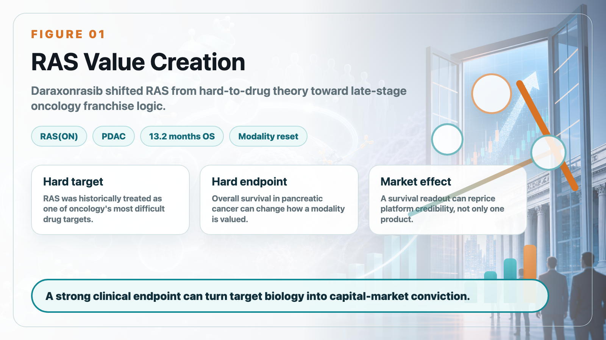
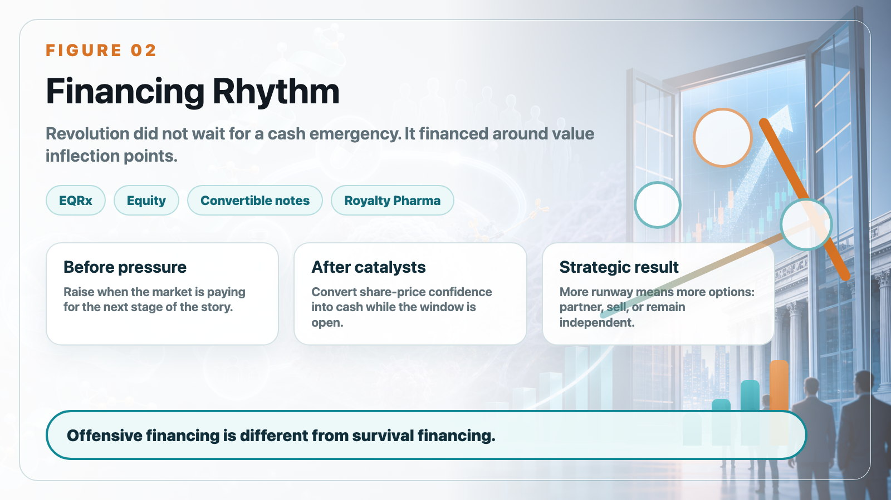
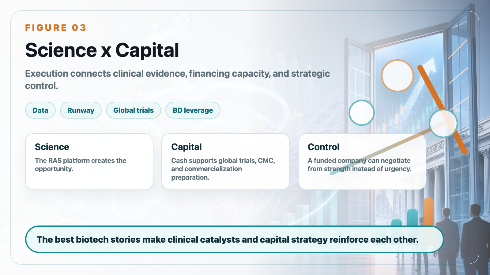

# Revolution Medicines: Why Biotech Winners Need Capital Strategy, Not Just Good Science

Revolution Medicines is one of the most important biotech stories of 2026 because it sits at the intersection of two forces: a hard scientific problem and an even harder capital-markets problem.

The scientific story is RAS-addicted cancer. For decades, RAS was treated as one of oncology's most difficult drug targets. Revolution Medicines has pushed that idea into a different phase with its RAS(ON) inhibitor platform, especially daraxonrasib, also known as RMC-6236.

In previously treated metastatic pancreatic ductal adenocarcinoma, the Phase 3 RASolute-302 study showed median overall survival of 13.2 months for daraxonrasib versus 6.7 months for standard chemotherapy. In pancreatic cancer, that is not a small improvement. It is the type of data that can change how investors, physicians, and potential partners think about an entire modality.

But the Revolution Medicines case is not only about one strong clinical readout. It is also a case study in how biotech companies turn scientific momentum into financial runway.

Innovative drug development consumes cash at a brutal pace. Revolution Medicines reported a first-quarter 2026 net loss of roughly US$454 million, with R&D spending rising sharply as daraxonrasib, zoldonrasib, elironrasib, and related RAS programs moved forward. That level of spending would be dangerous for a company without capital-market access. For Revolution, it became part of the strategy.

The company has repeatedly raised money when the market was willing to pay for the next stage of the story. It did not wait until the cash balance became an emergency. After clinical catalysts and share-price re-rating, it converted investor confidence into cash. That is the difference between defensive financing and offensive financing.

The EQRx transaction was especially instructive. In a weak biotech market, Revolution used an all-stock acquisition to bring in a large cash position and support the RAS(ON) portfolio. Later, it added equity offerings, convertible notes, and a Royalty Pharma flexible funding agreement. The point was not simply to "raise money." The point was to preserve control.

For a late-stage oncology biotech, cash is not just a resource. It is negotiating leverage. A company with enough capital can keep running global trials, prepare commercialization, and decide whether to partner, sell, or remain independent from a position of strength.

That is why Revolution Medicines matters for investors beyond the RAS story. Many biotech companies can describe a large opportunity. Fewer can build the clinical, financial, and organizational structure needed to reach the opportunity without being forced into a weak transaction.

The lesson for biotech readers is clear. Science creates the opening. Clinical data creates evidence. Capital creates time. Execution connects the three. Revolution Medicines is compelling because those forces reinforce each other.

The company is not valuable merely because it can raise money, and it is not valuable merely because it has a RAS story. Its real strength is that every clinical catalyst can become capital-market momentum, and every financing can buy more time for clinical execution.

For Taiwan biotech companies, this is a useful reminder. The market window does not stay open forever. Mature biotech strategy means planning financing around value inflection points, not waiting until the runway is almost gone.

This article is intended for industry research and knowledge sharing only. It does not constitute investment, medical, fundraising, or individual stock advice.
