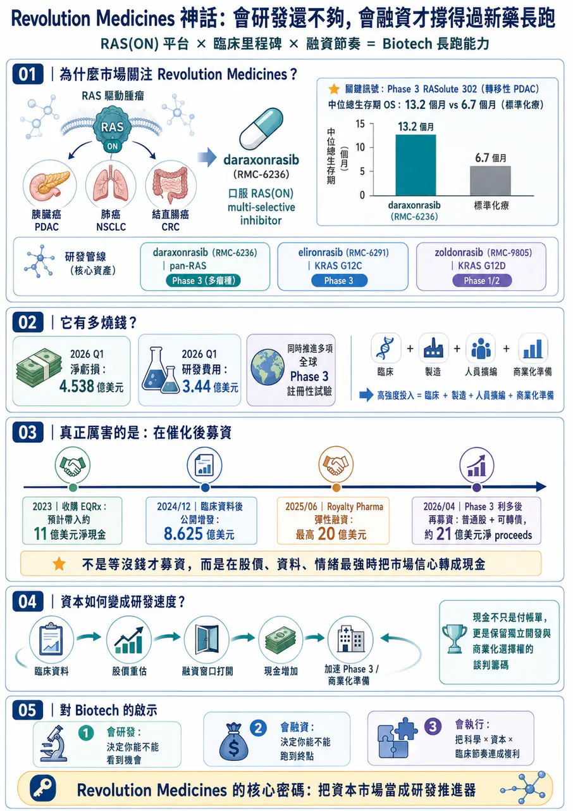
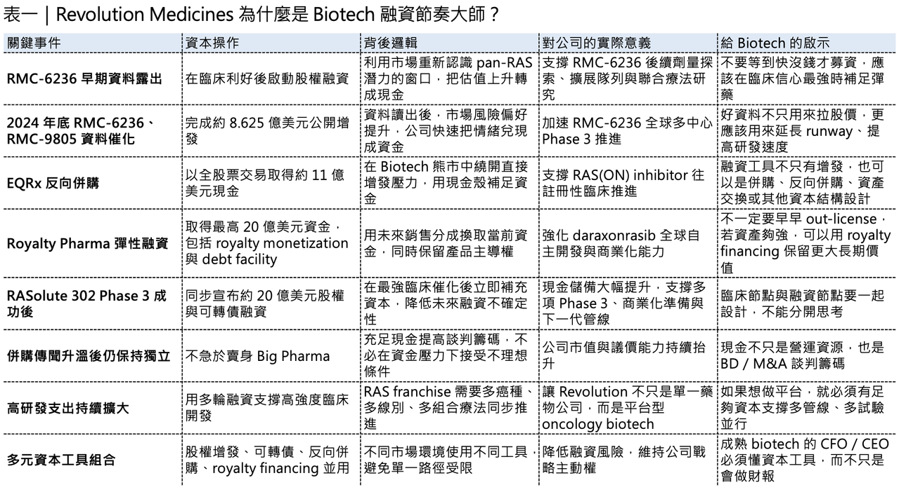
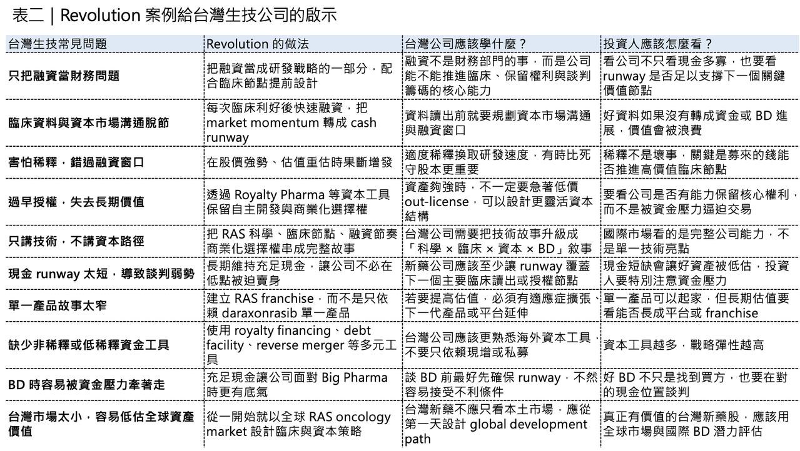

# Revolution Medicines 神話：會研發還不夠，會融資才撐得過新藥長跑

## Revolution Medicines 的千億神話：會研發還不夠，會融資才撐得過新藥長跑
2026 年，全球最受矚目的 Biotech 之一，毫無疑問是 Revolution Medicines。這家公司站在一個極難、也極誘人的位置：RAS-addicted cancers。RAS 曾經長期被視為「難成藥」甚至「不可成藥」靶點，但 Revolution Medicines 透過 RAS(ON) inhibitor 平台，在胰臟癌、肺癌、結直腸癌等高未滿足需求腫瘤裡，逐步把這個故事從科學假說推進到臨床現實。

💰 尤其是 daraxonrasib（RMC-6236）。

這款口服 RAS(ON) multi-selective inhibitor 在 previously treated metastatic pancreatic ductal adenocarcinoma（PDAC）Phase 3 RASolute 302 試驗中，讓患者 median overall survival 達到 13.2 個月，而標準化療組為 6.7 個月，幾乎翻倍；這也是為什麼市場會把 Revolution Medicines 視為下一個可能改寫胰臟癌治療格局的公司。

但今天不只談管線，Revolution Medicines 最值得學的地方，不只是它會研發，而是它非常會融資。新藥開發不是只靠科學理想就能跑完的長跑。對 Biotech 來說，時間是最昂貴的資產，而資金就是推進臨床、擴張管線、建立商業化能力、拒絕低價賣身的燃料。Revolution Medicines 的故事，本質上回答了一個問題：新藥公司要成為真正的全球玩家，會研發很重要；但會在正確時間、用正確工具、拿到足夠資金，同樣重要。
## 01｜Revolution 是燒錢黑洞，也是融資高手

🔥 創新藥公司燒錢，並不稀奇，但 Revolution Medicines 的燒錢速度，仍然非常驚人。

2026 年第一季，公司淨虧損達 4.538 億美元，較 2025 年同期的 2.134 億美元明顯擴大。光是研發費用，單季就達 3.44 億美元，比前一年同期的 2.057 億美元大幅成長。公司也說明，研發費用增加主要來自 daraxonrasib 與 zoldonrasib 的臨床試驗與製造費用增加、人員擴編，以及股權薪酬費用上升。這種虧損不是因為公司失控，而是因為它正在用極高強度推進 RAS 管線。

Revolution Medicines 目前的核心不只是一顆 daraxonrasib（RMC-6236）。它還有 elironrasib（RMC-6291），也就是 RAS(ON) G12C-selective inhibitor；以及 zoldonrasib（RMC-9805），也就是 RAS(ON) G12D-selective inhibitor。這些資產分別切入 pan-RAS、KRAS G12C、KRAS G12D 等不同腫瘤驅動突變，也讓公司不是單一產品故事，而是逐漸往 RAS franchise 靠近。

daraxonrasib 目前已經進入四項全球 Phase 3 註冊性試驗，其中包括三項 PDAC 試驗與一項 NSCLC 試驗，這種臨床推進方式非常昂貴。

胰臟癌、肺癌、結直腸癌都是大適應症；若同時做單藥、聯合療法、不同治療線別、不同 RAS variant，不只臨床費用高，CMC、供藥、全球試驗中心、法規互動、未來商業化準備也都會同步燒錢。所以 Revolution Medicines 的問題不是會不會燒錢，真正的問題是：它有沒有能力一直補燃料？

目前看來，它非常有能力。截至 2026 年 3 月底，公司現金、約當現金與有價證券為 19 億美元；4 月完成增發與可轉債後，又取得約 21 億美元淨 proceeds。換句話說，Revolution Medicines 的商業本質很清楚：它一邊高強度燒錢，一邊用更高效率把資本市場的信心轉成現金。這就是它能跑在多數 Biotech 前面的原因。
## 02｜真正厲害的不是募到錢，而是每次都在催化後募錢

Revolution Medicines 的融資能力，最值得看的是節奏。

💰 它不是等到帳上現金快燒完，才被迫去市場上找錢。

💰 它通常是在臨床資料、股價上升、產業情緒最熱的時候，快速把利好轉成現金。

這一點非常重要，因為Biotech 融資最怕的不是稀釋，而是在錯誤時間稀釋。如果公司在市場低迷、資料不明、現金壓力逼近時才融資，投資人會要求更大折價，股權稀釋會更重，甚至可能被迫接受不利條款，但如果在關鍵臨床利好之後融資，情況完全不同，這時市場正在重新定價公司，股價上來了，估值上來了，投資人情緒也上來了。公司用同樣股數，可以換到更多現金；用同樣現金，付出的稀釋更低，而Revolution Medicines 很懂這件事。

⏱️ 2024 年 12 月，公司在公布 RMC-6236、RMC-9805 等 RAS(ON) inhibitor 臨床資料後，迅速完成公開增發，募得 8.625 億美元 gross proceeds，發行價格為每股 46 美元。

⏱️ 2026 年 4 月，RASolute 302 關鍵 Phase 3 資料公布後，公司又立刻啟動更大規模融資。最初公司宣布計畫發行 7.5 億美元普通股與 2.5 億美元可轉換公司債；幾天後，交易放大為 約 20 億美元 concurrent upsized offerings，其中包括 10,563,381 股普通股，每股定價 142 美元，以及 5 億美元 0.50% convertible senior notes due 2033。

這就是典型的資本市場窗口管理，臨床資料出來，股價重估，市場風險偏好打開。公司不戀戰，不等「股價可能更高」，直接把當下最確定的市場熱度，轉成最確定的現金，很多創辦人不喜歡增發，覺得稀釋股權很痛。但對 Biotech 來說，最痛的不是稀釋，最痛的是在關鍵臨床節點前沒錢。如果一家公司因為怕稀釋，而錯過資本市場窗口，最後可能被迫延後試驗、縮小臨床規模、砍管線，甚至在最不利的時候賣給大藥廠。

💰 Revolution Medicines 的邏輯很清楚：在有利窗口募資，不是保守，而是進攻。
## 03｜EQRx 反向併購：熊市裡最聰明的現金補給

🧩 Revolution Medicines 的資本操作裡，最精彩的一步，是收購 EQRx。

2023 年，Biotech 市場環境並不好。利率高、風險資產承壓、二級市場融資困難，很多公司即使有不錯資產，也很難用好價格募到足夠資金。但 Revolution Medicines 選了一條很不一樣的路。

它用全股票交易收購 EQRx，並在 2023 年 11 月完成交易。公司公告指出，這筆收購預計為 Revolution Medicines 帶來約 11 億美元 net cash proceeds，用於支持 RAS(ON) inhibitor 研發，並且 EQRx 原有項目將逐步 wind down。

這是一個非常聰明的操作，EQRx 當年是美國 biotech 泡沫時代很具代表性的公司，曾經想用低價創新藥挑戰既有定價體系，但後來商業模型走不通，管線與市場信心都大幅受挫。對 Revolution Medicines 來說，EQRx 最重要的不是管線，而是現金。這筆交易的本質，是在熊市裡找到一個現金殼，並且用股票收購的方式把大量資金拿進來，避免在低迷市場環境下直接大幅折價增發。

這也展示了一個成熟 biotech 管理層很重要的能力：

🧩融資不只有公開增發一種形式。

🧩可以是 equity offering。

🧩可以是 convertible notes。

🧩可以是 reverse merger。

🧩可以是 royalty financing。

🧩可以是 debt facility。

🧩可以是 partnership funding。

🧩也可以是 non-dilutive or less-dilutive capital。

真正好的 CFO 與 CEO，不只是會把公司財務報表管好，而是知道在不同市場環境下，用什麼資本工具最划算。EQRx 交易讓 Revolution Medicines 在 2023 年就拿到足夠彈藥，支撐 RMC-6236 往後期註冊性試驗推進。這不是偶然，這是資本戰略。
## 04｜Royalty Pharma 交易：不是缺錢才融資，而是為了保留獨立商業化選擇權
2025 年 6 月，Revolution Medicines 又做了一筆很關鍵的交易。

它與 Royalty Pharma 簽訂 20 億美元 flexible funding agreement，資金結構包括最高 12.5 億美元 synthetic royalty monetization，以及最高 7.5 億美元 corporate debt。這筆資金主要支持 daraxonrasib 以及 RAS(ON) inhibitor portfolio 的全球開發與商業化。這筆交易最有意思的地方，是 Revolution Medicines 當時並不是沒錢，它已經有相當強的現金部位，但它仍然選擇和 Royalty Pharma 做 彈性融資（flexible funding）。

🛡️ 原因很簡單：它要保留自主權。

Royalty Pharma 這類資金，不等同傳統大藥廠授權，如果 Revolution Medicines 把 daraxonrasib 早早授權給 Big Pharma，短期可能拿到很大 首付款（upfront），但也可能失去全球開發與商業化主導權，未來產品真正做大時，最大價值會被合作方拿走。

Royalty Pharma 交易則提供另一種選擇。

它讓 Revolution Medicines 用未來 daraxonrasib 銷售分成換取現在資金，但公司仍保留產品開發與商業化控制權。官方公告也特別強調，這筆資金支持公司推動 獨立全球開發和商業化策略。事實上，很多 Biotech 最後被迫賣身，原因不是資產不好，而是資金不夠。

🛡️ 臨床越往後期越貴。

🛡️ 上市準備越往前越貴。

🛡️ 全球商業化更貴。

🛡️ 當公司沒有足夠資金，就只能接受大藥廠條件。

但 Revolution Medicines 透過 EQRx、公開增發、可轉債、Royalty Pharma 等多重工具，把現金儲備拉到足以支撐獨立商業化的程度。這讓它面對 Merck、AbbVie、AstraZeneca 這類潛在買方時，不必低頭。2026 年初，市場一度傳出 Merck 可能以 280 億至 320 億美元收購 Revolution Medicines，且其他大型藥廠也在關注這家公司。Reuters 報導也提到，daraxonrasib 是潛在交易的核心資產，並指出 Mizuho 分析師估計 Revolution RAS inhibitor portfolio 到 2035 年可能有超過 100 億美元 經風險調整後的全球銷售額 潛力。

🛡️ 這就是現金的價值，現金不是只用來付帳單，現金也是談判籌碼。
## 05｜📈 Revolution 的真正能力，是把臨床 momentum 轉成資本 momentum
很多 biotech 會研發，但不會資本市場溝通，也有些公司很會募資，但臨床資料撐不起故事，Revolution Medicines 最強的地方，是把兩者接在一起。

它不是空講 RAS 靶點很大，它用臨床資料一步步證明：RAS(ON) inhibitor 不是只停留在實驗室概念，而是有可能在胰臟癌這種極難治療癌種裡做出真正臨床獲益。

然後每一次資料推進，它都把市場信心轉化成資本，資本再反過來支持更多臨床，這是一個正循環。

📈 臨床資料帶動股價。

📈 股價窗口帶動融資。

📈 融資帶動試驗加速。

📈 試驗加速帶動更多資料。

📈 更多資料再帶動更高估值與更強談判地位。

這就是 Revolution Medicines 的核心密碼，不是單純「會搞錢」，而是它把資本市場當成研發戰略的一部分。對創新藥公司來說，研發與融資不能分開看，如果研發節奏快，但資金跟不上，會死。如果資金很多，但研發沒有進展，也會死。真正好的公司，是兩者同步。
## 06｜台灣生技最缺的，往往不是題材，而是融資節奏
台灣生技市場有一個常見問題：股價熱的時候，公司沒有準備好；公司缺錢的時候，市場已經冷了。這會讓很多公司陷入被動，真正成熟的 biotech，不應該等現金 runway 只剩 12 個月才去募資。而是要在每一個價值轉折點前後，提前規劃資金策略。

⛽ Phase 1 有安全性資料後，要不要募資？

⛽ Phase 2 有初步療效後，要不要募資？

⛽ FDA meeting 前後，要不要補強現金？

⛽ 授權談判前，要不要先把 cash runway 拉長？

⛽ 臨床試驗啟動前，資金是否足以支撐完整讀出？

⛽ 如果市場突然給你高估值，要不要接受稀釋換取戰略自主權？

這些問題都很現實，很多創辦人不喜歡稀釋。但在新藥世界裡，過度害怕稀釋，有時候反而會讓公司失去主導權。如果你因為不想稀釋，而讓公司現金不足，最後可能被迫低價授權、低價賣身，或在最差時間點募資。Revolution Medicines 的做法剛好相反，它不等到絕對必要才募資，它在市場願意給錢的時候募資。

這句話看起來簡單，但很多公司做不到，因為人性總覺得股價還會更高，條件還會更好，下一次還有機會，但 Biotech 沒有永遠開著的融資窗口。

⛽ 市場情緒會變。

⛽ 臨床資料會變。

⛽ 競品格局會變。

⛽ 利率會變。

⛽ 監管環境會變。

所以真正成熟的融資策略，不是追求最完美的價格，而是在可接受稀釋下，確保公司永遠有能力推進最重要的臨床與商業化選擇。
## 07｜會融資，不是投機，而是對病人和股東負責
有些人不喜歡把新藥公司和「搞錢」放在一起，覺得做藥應該談科學、談病人，不該談錢。

但這種想法太浪漫，新藥研發本來就是資本密集產業。

🧠如果公司沒錢，最好的科學也只能停在實驗室。

🧠如果公司沒錢，臨床試驗做不完。

🧠如果公司沒錢，資料讀不出來。

🧠如果公司沒錢，就只能把資產早早賣掉，讓別人決定它的命運。

所以會融資不是投機，會融資是新藥公司對病人、員工與股東負責，差別在於，融資是為了什麼。如果融資只是為了延續公司生命、繼續講故事，那沒有意義。但如果融資是為了加速關鍵臨床、建立商業化能力、保留產品權利、避免被迫賣身、讓資產價值最大化，那就是非常重要的公司能力。

Revolution Medicines 的融資能力之所以值得學，不是因為它募到很多錢，而是它每一次融資都服務於一個更大的戰略：

🧠建立 RAS franchise。

🧠加速 daraxonrasib 全球註冊。

🧠推進 zoldonrasib、elironrasib 與後續突變選擇性管線。

🧠保留自主商業化能力。

🧠提高面對 Big Pharma 的談判籌碼。

這才是高階融資，不是把錢募進來而已，而是讓錢變成公司下一階段的戰略自由度。
## 08｜Revolution 的啟示：Biotech 最後比的是「科學 × 資本 × 執行」的複利
Revolution Medicines 的崛起，不能只歸因於融資。

如果沒有 RAS(ON) inhibitor 的科學突破，沒有 daraxonrasib 的臨床資料，沒有胰臟癌 Phase 3 的強力結果，再會融資也撐不起 300 億美元級別的市場想像。但反過來也一樣，如果只有科學突破，卻沒有足夠資本支持多項 Phase 3、全球商業化準備與後續管線推進，公司可能早就被迫以更低價格賣給大型藥廠。所以 Revolution Medicines 的真正能力，是 科學、資本、執行三者同頻。

🧬 科學提供方向。

🧬 臨床提供證據。

🧬 資本提供速度。

🧬 執行力把這三者連起來。

這也是為什麼這家公司會成為 2026 年全球 Biotech 最重要的案例之一。它告訴市場：

🧬 在創新藥產業，真正長大的公司，不只是會做研究。

🧬 它們還要會設計臨床節點。

🧬 會管理資本窗口。

🧬 會談判非稀釋或低稀釋資金。

🧬 會保留商業化選擇權。

🧬 會在對的時間拒絕賣身。

🧬 會把每一次臨床進展，轉化成更大的公司自由度。
## 結語｜Revolution Medicines 的神話，不只是 RAS，而是把資本變成研發速度
Revolution Medicines 的故事，表面上是 RAS 靶點突破，更深一層，是一家 Biotech 如何把資本市場當成研發推進器。它燒錢很快，但它融資更快。

它不是等到現金快用完才找錢，而是在資料最強、情緒最好、估值被重估時果斷出手。它不是只靠股權增發，也會用 EQRx 反向併購、Royalty Pharma 彈性融資、可轉債等不同工具，讓公司在不同市場環境下都能保持主動權。它也不是為了融資而融資，而是為了支撐 RAS(ON) inhibitor portfolio 的全球開發與商業化。

這才是 Revolution Medicines 最值得學的地方。

會研發，決定你能不能看到機會。

會融資，決定你能不能把機會跑到終點。
------------
參考資料：

[0]:各公司官網＆公開資料

[1]:

reuters.com

https://www.reuters.com/business/healthcare-pharmaceuticals/revolution-medicines-experimental-cancer-pill-helps-improve-survival-late-stage-2026-04-13/

www.reuters.com

"Revolution Medicines' experimental cancer pill boosts survival in late-stage study | Reuters"

[2]:

Revolution Medicines Reports First Quarter 2026 Financial Results and Update on Corporate Progress - BioSpace

https://www.biospace.com/press-releases/revolution-medicines-reports-first-quarter-2026-financial-results-and-update-on-corporate-progress

www.biospace.com

"Revolution Medicines Reports First Quarter 2026 Financial Results and Update on Corporate Progress - BioSpace"

[3]:

ir.revmed.com

https://ir.revmed.com/news-releases/news-release-details/daraxonrasib-demonstrates-unprecedented-overall-survival-benefit

ir.revmed.com

"Daraxonrasib Demonstrates Unprecedented Overall Survival Benefit in Pivotal Phase 3 RASolute 302 Clinical Trial in Patients with Metastatic Pancreatic Cancer | Revolution Medicines"

[4]:

ir.revmed.com

https://ir.revmed.com/news-releases/news-release-details/revolution-medicines-announces-closing-upsized-public-offering-2/

ir.revmed.com

[5]:

ir.revmed.com

https://ir.revmed.com/news-releases/news-release-details/revolution-medicines-inc-announces-proposed-offerings-common

ir.revmed.com

---

本文僅供產業研究與知識分享，不構成投資、醫療、募資或個股建議。
