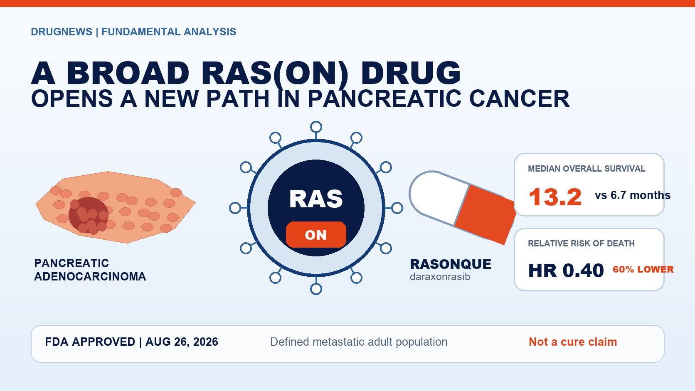
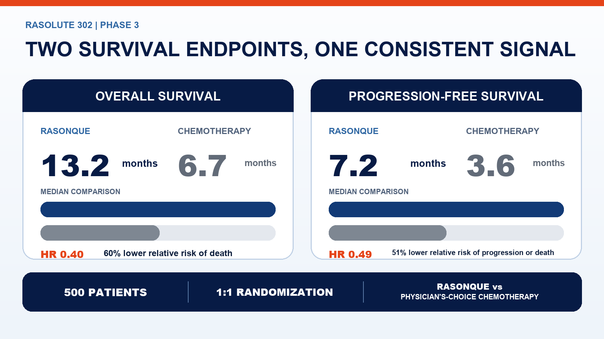
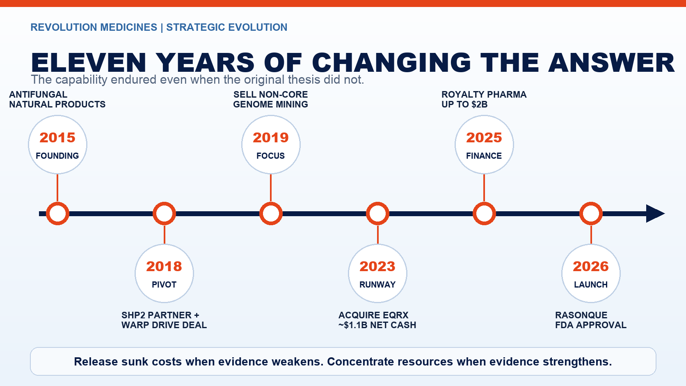
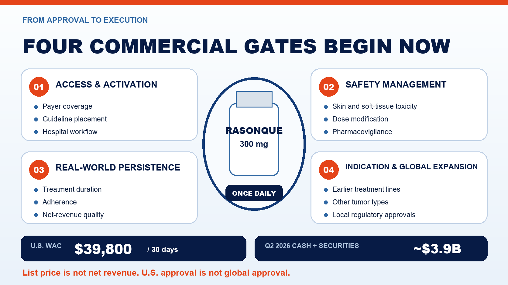

# Pancreatic Cancer Finally Gets a Broad RAS(ON) Drug: Inside RASONQUE's FDA Approval

Pancreatic cancer is devastating not only because it is often detected late. The deeper frustration is that researchers have known for decades that RAS sits behind most pancreatic tumors, yet the protein resisted conventional drug design for more than forty years.

On August 26, 2026, the U.S. Food and Drug Administration approved Revolution Medicines' RASONQUE, or daraxonrasib, 6.5 months ahead of the agency's original action date. It is the first approved broad RAS(ON) inhibitor capable of targeting several activated RAS forms, and the first approved therapy to directly address the dominant oncogenic driver in pancreatic cancer.

In the 500-patient Phase 3 RASolute 302 trial, median overall survival reached 13.2 months with RASONQUE versus 6.7 months with physician's-choice chemotherapy. The hazard ratio for death was 0.40. Median progression-free survival was 7.2 versus 3.6 months, with a hazard ratio of 0.49.

Both median survival measures nearly doubled. That is a major result in a disease with few effective later-line options.

It is not, however, evidence that pancreatic cancer has been conquered. The approval covers adults with metastatic pancreatic adenocarcinoma who have received at least one prior systemic therapy or who are not candidates for multi-agent systemic therapy. It is not a universal treatment for early-stage disease, and median outcomes do not predict the result for an individual patient.

The company story is equally instructive. Revolution began in 2015 as a natural-products and antifungal biotechnology company. Over eleven years, it replaced its original strategy, acquired a platform without human proof of concept, used stock to acquire roughly $1.1 billion in expected net cash and financed commercialization without surrendering control of the core asset. This was not a company that knew the right answer from the beginning. It was a company willing to change the answer as evidence changed.

## 01 | Why RAS Resisted Drug Development for Four Decades

RAS functions like a growth switch inside the cell. Under normal conditions it cycles between active and inactive states. Certain mutations hold the switch in an active configuration, continually transmitting proliferative signals. Pancreatic ductal adenocarcinoma is especially dependent on this pathway, most commonly through KRAS G12D, G12V and G12R variants.

Traditional small molecules struggled because the RAS surface is relatively smooth and lacks the deep pockets that drug designers usually exploit. RAS also operates through tightly coordinated protein interactions inside the cell. The challenge was less like fitting a key into a lock than trying to grip a polished metal sphere with no obvious handle.

KRAS G12C inhibitors proved that RAS was not completely inaccessible. But G12C represents only a subset of tumors and is not a dominant mutation in pancreatic cancer.

RASONQUE takes a different approach. It is an oral, noncovalent tri-complex inhibitor. Rather than relying on RAS alone to provide a binding pocket, the molecule recruits another intracellular protein to create a new interface and trap RAS in its active, or ON, state. This architecture enables inhibition across multiple mutant and wild-type RAS proteins.

That design is commercially important. The U.S. label does not require a companion diagnostic selecting one rare mutation before treatment can be considered. The label is broader than a single-mutation strategy, although it remains limited to the approved metastatic pancreatic adenocarcinoma population.

## 02 | How Much Weight Should Investors Put on 13.2 Versus 6.7 Months?

RASolute 302 was a global, randomized, open-label Phase 3 trial. Five hundred patients with metastatic pancreatic adenocarcinoma whose disease had progressed after first-line therapy were assigned one-to-one to RASONQUE 300 mg once daily or one of four physician-selected cytotoxic chemotherapy regimens.

The study included patients with several RAS G12 mutations as well as patients without a detected tumor RAS mutation. It met its primary and key secondary endpoints in both the RAS G12 population and the full study population.

The results in all randomized patients were:

- Median overall survival: **13.2 months versus 6.7 months**.
- Hazard ratio for death: **0.40**, corresponding to a 60% reduction in the relative risk of death over follow-up.
- Median progression-free survival: **7.2 months versus 3.6 months**.
- Hazard ratio for progression or death: **0.49**, corresponding to a 51% reduction in relative risk.

These figures should not be collapsed into a single slogan. The medians describe the point at which half the patients in each group had experienced the event. Hazard ratios compare risk across the full follow-up period. A 0.40 hazard ratio does not mean that mortality becomes 40%, and a 6.5-month difference in medians does not mean that every patient lives exactly 6.5 months longer.

The parallel improvement in progression-free and overall survival makes the evidence more persuasive than a result supported by only one endpoint. Yet individual outcomes will still depend on performance status, disease burden, prior therapy, subsequent treatment and adverse-event management.

Safety is part of the value equation. Official materials warn about skin and soft-tissue toxicity, stomatitis, diarrhea, gastrointestinal perforation, interstitial lung disease or pneumonitis, and embryo-fetal toxicity. In the pancreatic adenocarcinoma study, 86% of RASONQUE-treated patients experienced skin toxicity and 10% had Grade 3 events.

Oral administration can reduce infusion burden. It does not make the treatment trivial or cost-free.

## 03 | The First Strategic Decision: Tear Up the Founding Script

Third Rock Ventures launched Revolution Medicines in 2015 with a $45 million Series A financing. The company's original lead story was not cancer or RAS. It centered on natural-product chemistry and antifungal medicines, including an effort to preserve the potency of amphotericin B while reducing kidney toxicity.

A company's name, founding team and first financing are usually tied to its initial thesis. That makes admitting that the original program should no longer command the most resources psychologically and organizationally difficult.

Revolution shifted toward oncology and difficult-to-drug targets. It first advanced an SHP2 inhibitor upstream of RAS signaling and entered a global partnership with Sanofi in 2018 that included a $50 million upfront payment.

Many companies would have protected the first asset validated by a large pharmaceutical partner at almost any cost. Revolution instead defined itself as a company able to solve difficult molecular problems, not as the owner of one irreplaceable program. That distinction made the later move into direct RAS inhibition possible.

## 04 | The Second Strategic Decision: Buy Warp Drive Before Human Proof

Revolution acquired Warp Drive Bio in 2018. The transaction brought tri-complex technology designed to engage activated RAS and a set of early oncology programs. At the time, direct RAS(ON) inhibition had no clinical proof of concept and looked speculative to much of the industry.

Revolution's financial statements allocated $55.8 million to acquired in-process research and development and $13.6 million to tri-complex and genomic-mining technologies. Those accounting allocations should not be simplified into the claim that Revolution paid $69 million in cash for the company.

The acquisition also demonstrates what platform discipline looks like. Revolution did not retain every program merely because it had been acquired. It kept the tri-complex capabilities aligned with RAS and oncology, then sold the non-core antibiotic genome-mining platform to Ginkgo Bioworks in 2019.

Sanofi decided in 2022 to terminate the SHP2 collaboration, effective in 2023. By then, Revolution's next-generation RAS(ON) pipeline had already entered the clinic. The old lead program receded only after a new engine was operating. That sequencing helped prevent a partner exit from becoming a corporate cliff.

## 05 | The Third Strategic Decision: Acquire Cash, Not Another Drug

Scientific conviction solves only half of late-stage biotechnology. Running broad RAS programs across tumor types, treatment lines and global Phase 3 studies requires an unusually deep capital base.

In 2023, Revolution acquired EQRx in an all-stock transaction. EQRx's low-cost medicines model had faltered, and its pipeline offered limited strategic fit. The asset Revolution wanted was the balance sheet.

The completed transaction was expected to add roughly $1.1 billion in net cash, in exchange for approximately 55 million newly issued Revolution shares. Existing shareholders absorbed dilution; the company bought more time to advance several RAS programs in parallel.

In 2025, Revolution entered a flexible financing agreement with Royalty Pharma worth up to $2 billion. It included up to $1.25 billion in synthetic-royalty financing and up to $750 million in secured debt.

That money was not free. Royalty Pharma can receive tiered royalties on RASONQUE sales for fifteen years, while borrowed amounts carry interest and repayment obligations. Revolution preserved global development and commercialization control by exchanging part of its future cash flow and accepting financial liabilities.

At the end of June 2026, the company held about $3.9 billion in cash, cash equivalents and marketable securities. This gave it the capacity to launch independently rather than sell a core asset under financing pressure immediately before approval.

Media reports have described acquisition interest from large pharmaceutical companies. But as of the FDA approval, Revolution had not announced a definitive sale, and no company or regulatory primary source established that its board formally rejected a $30 billion offer. A compelling rumor is not a completed capital-allocation decision.

The verified conclusion is narrower: EQRx, equity issuance and Royalty Pharma financing bought Revolution the option not to sell immediately.

## 06 | Approval Starts the Commercial Exam

RASONQUE is now available for prescription in the United States. Revolution disclosed a wholesale acquisition cost of $39,800 for a 30-day supply, or nearly $478,000 on a mechanical annualized basis.

Wholesale acquisition cost is not a patient's out-of-pocket expense and is not the net revenue that Revolution will recognize. Rebates, payer discounts, patient assistance, channel fees, treatment duration, dose modification and discontinuation will separate list price from realized economics.

The market will now follow at least six variables:

1. How quickly oncologists place oral RASONQUE into later-line care.
2. Whether payer access and patient-support programs shorten time to treatment.
3. Whether skin toxicity, stomatitis and diarrhea can be managed in routine practice.
4. Whether real-world treatment duration approaches clinical-trial experience.
5. Whether first-line pancreatic cancer, lung cancer and other development programs succeed.
6. Whether the $3.9 billion balance sheet can support an entire RAS product family without being consumed by rapid expansion.

Asia adds another strategic variable. On August 10, 2026, Revolution and BeOne Medicines announced a collaboration covering daraxonrasib and three other clinical-stage RAS(ON) inhibitors in parts of Asia. Depending on the market, BeOne received exclusive development and commercialization rights or exclusive commercialization rights. Japan and South Korea are outside the licensed territory.

U.S. approval increases the strategic value of those regional rights. It does not constitute approval in Asian markets. Local filings, clinical requirements, labels, pricing, reimbursement and launch execution remain separate gates.

## 07 | Revolution Bet on More Than One Drug

It is tempting to rewrite the RASONQUE story as a straight line drawn by a visionary company that saw the answer a decade in advance. The record is more useful precisely because it was not linear.

In 2015, Revolution was developing natural-product antifungals.

In 2018, its most visible clinical strategy centered on SHP2. That same year, it acquired Warp Drive's RAS(ON) technology.

In 2023, it issued a large block of shares to acquire EQRx's cash.

In 2025, it exchanged a portion of future sales and accepted debt capacity to finance independent commercialization.

Only in 2026 did RASONQUE become the world's first approved broad RAS(ON) targeted medicine.

The company did not protect one answer through the entire journey. It protected a more durable operating principle: release sunk costs when evidence weakens, and concentrate talent, capital and time when a stronger hypothesis emerges.

For patients, the 13.2-month median overall survival result matters more than the strategy lesson. For the biotechnology industry, the approval also clarifies what a platform should mean. A platform is not a slide with ten simultaneous pipelines. It is an underlying capability that can find a better problem after an initial thesis fails—and that can raise the probability of a second product after the first one succeeds.

Pancreatic cancer has not been defeated. But a door blocked by RAS for more than forty years has finally opened a meaningful distance.

## Primary Sources

1. [FDA | Approval of daraxonrasib for metastatic pancreatic adenocarcinoma](https://www.fda.gov/drugs/resources-information-approved-drugs/fda-approves-daraxonrasib-metastatic-pancreatic-adenocarcinoma)
2. [FDA | First-in-class targeted therapy press announcement](https://www.fda.gov/news-events/press-announcements/fda-approves-first-class-targeted-therapy-metastatic-pancreatic-cancer)
3. [Revolution Medicines | RASONQUE approval and RASolute 302 results](https://ir.revmed.com/news-releases/news-release-details/us-fda-approves-revolution-medicines-rasonquetm-daraxonrasib)
4. [Revolution Medicines | SEC filing disclosing wholesale acquisition cost](https://ir.revmed.com/node/13376/html)
5. [Revolution Medicines | 2015 founding and Series A financing](https://ir.revmed.com/node/6491/pdf)
6. [Revolution Medicines | Acquisition of Warp Drive Bio](https://ir.revmed.com/news-releases/news-release-details/revolution-medicines-acquires-warp-drive-bio-expand-drug/)
7. [Revolution Medicines | 2019 financial filing and acquired-asset allocations](https://ir.revmed.com/node/6746/html)
8. [Revolution Medicines / Sanofi | 2018 SHP2 partnership](https://ir.revmed.com/news-releases/news-release-details/sanofi-and-revolution-medicines-launch-global-partnership)
9. [Revolution Medicines | Completion of the EQRx acquisition](https://ir.revmed.com/news-releases/news-release-details/revolution-medicines-completes-acquisition-eqrx)
10. [Revolution Medicines | $2 billion Royalty Pharma financing agreement](https://ir.revmed.com/news-releases/news-release-details/revolution-medicines-enters-2-billion-flexible-funding-agreement)
11. [Revolution Medicines | Second-quarter 2026 financial results](https://ir.revmed.com/news-releases/news-release-details/revolution-medicines-reports-second-quarter-2026-financial)
12. [Revolution Medicines / BeOne Medicines | RAS(ON) collaboration in parts of Asia](https://ir.revmed.com/news-releases/news-release-details/revolution-medicines-and-beone-medicines-announce-clinical)

Fact-check cutoff: August 29, 2026.

> Disclaimer: This article is intended for biotechnology industry research and knowledge sharing. It does not constitute investment, medical, treatment, fundraising or individual stock advice. The U.S. approval applies to a defined adult metastatic pancreatic adenocarcinoma population; other countries, tumor types and earlier treatment lines require separate regulatory authorization.
