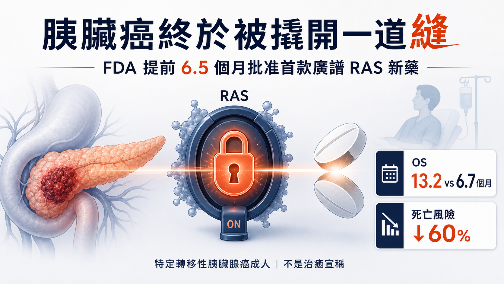
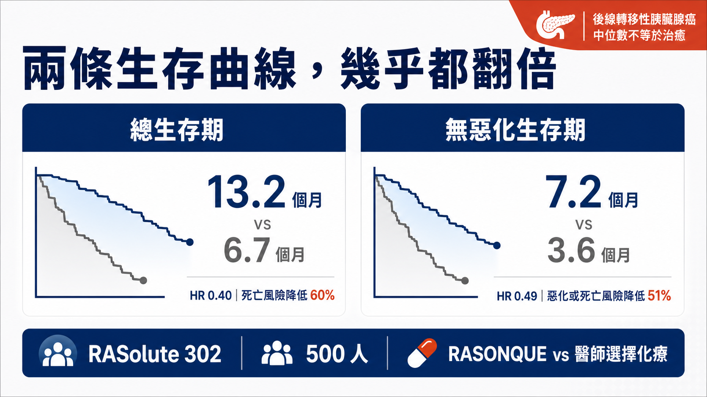
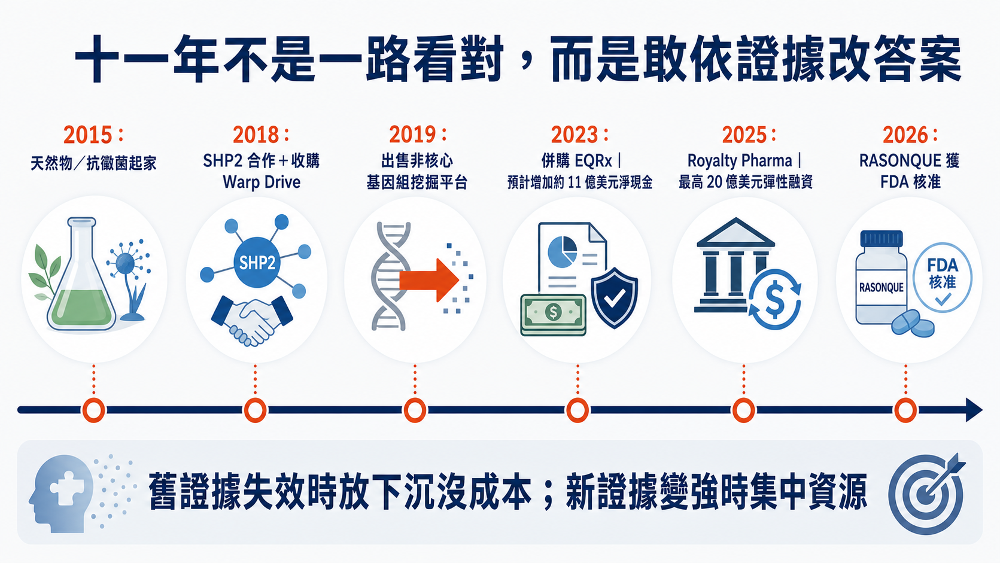
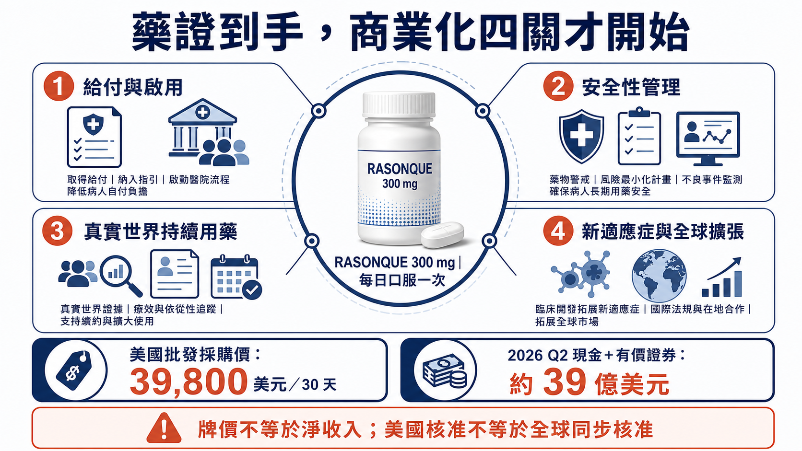

# 胰臟癌終於被撬開一道縫！FDA 提前 6.5 個月批准首款廣譜 RAS 新藥

────────────────────

胰臟癌最令人絕望的地方，不只是發現得晚。

更殘酷的是，人類早就知道多數胰臟癌背後站著 RAS，卻用了四十多年，始終很難真正抓住它。

2026 年 8 月 26 日，美國食品藥物管理局（FDA）提前 6.5 個月批准 Revolution Medicines 的 RASONQUE，通用名 daraxonrasib。這是第一款獲准、可同時瞄準多種活化態 RAS 的廣譜標靶藥，也是首款直接針對胰臟癌主要致癌驅動因素的核准療法。

在 500 人第三期試驗裡，RASONQUE 把中位總生存期從化療組的 6.7 個月拉到 13.2 個月，死亡風險降低 60%；中位無惡化生存期則從 3.6 個月延長至 7.2 個月。

兩條曲線幾乎都翻了一倍。

但「胰臟癌被攻克」仍然不是正確答案。這次核准只適用於已接受至少一次全身治療，或不適合多藥全身治療的轉移性胰臟腺癌成人；它不是早期患者的萬用藥，也不是所有人都能長期控制疾病。

真正值得寫下來的，是另一件事：一家 2015 年還在做抗黴菌藥的新創，如何在十一年裡換掉原始劇本、買下一套當時沒有人體證據的技術、用股票買回 11 億美元現金，最後把一個被稱為「不可成藥」的靶點推到市場。

這不是一路看對答案。

而是每次證據改變時，都敢重新下注。

一、RAS 為什麼難了四十年？

RAS 像細胞裡的生長開關。

正常狀態下，它會在「開」與「關」之間切換；發生特定突變後，開關可能長時間卡在啟動狀態，不斷把增殖訊號送下去。胰臟導管腺癌尤其依賴這條路徑，最常見的是 KRAS G12D、G12V 與 G12R 等變異。

問題是，RAS 的表面平滑、缺乏傳統小分子容易卡住的口袋，而且它與細胞內重要蛋白互動緊密。過去的藥物開發像想用一把普通鑰匙，去轉動一顆沒有鎖孔的金屬球。

近年率先成功的 KRAS G12C 抑制劑，證明 RAS 不是完全不能碰；但 G12C 只涵蓋部分腫瘤，在胰臟癌裡並不是主流突變。

RASONQUE 走的是另一條路。

它是一款口服、非共價的「三元複合體抑制劑」。藥物不是只靠 RAS 自己的表面，而是借用細胞內另一個蛋白，一起形成新的結合介面，抓住處於啟動狀態的 RAS。它可以同時抑制多種突變型與野生型 RAS 的訊號，因此不需要先用伴隨式診斷，挑出某一種單一突變才能開藥。

簡單說，過去是在等鎖孔出現；這套技術是把旁邊的蛋白一起拉過來，現場造出一個可以下手的位置。

二、13.2 個月對 6.7 個月，數據到底有多重？

支持核准的 RASolute 302，是一項全球、隨機、開放標籤第三期試驗。

500 名先前接受過一線治療、疾病仍惡化的轉移性胰臟腺癌患者，以一比一分組，接受每天一次、300 毫克 RASONQUE，或由醫師選擇四種標準細胞毒性化療之一。

試驗同時納入多種 RAS G12 突變，也納入沒有檢出腫瘤 RAS 突變的患者。結果在 RAS G12 族群與全部受試者中，都達到主要與關鍵次要終點。

全部受試者的結果如下：

• 中位總生存期：13.2 個月對 6.7 個月。

• 死亡風險：相較化療降低 60%，風險比 0.40。

• 中位無惡化生存期：7.2 個月對 3.6 個月。

• 疾病惡化或死亡風險：相較化療降低 51%，風險比 0.49。

這裡要分清楚兩種讀法。

13.2 個月對 6.7 個月，是兩組患者各自走到一半事件發生時的「中位數」；風險比 0.40，則是把整段追蹤期間的死亡風險一起放進比較。兩個數字回答的問題不同，不能把它們簡化成「每個人都一定多活 6.5 個月」，也不能把死亡風險降低 60% 寫成死亡率只剩 40%。

同樣地，無惡化生存期從 3.6 個月到 7.2 個月，代表延後疾病惡化的訊號和總生存期方向一致，讓結果不只靠單一終點支撐。可真正落到一位患者身上，仍會受到身體狀況、疾病負荷、先前治療、後續用藥與副作用管理影響。大型試驗告訴我們整體趨勢，不替任何個人預先寫好結局。

在胰臟癌這個五年相對存活率極低、後線選擇有限的市場，這不是邊緣改善。

可它也不是「治癒」。中位數代表一半患者高於、一半低於這個時間；完整判讀還要看不同患者的反應持續時間、後續治療與長期存活尾端。標題可以有爆點，醫療邊界不能被爆點吃掉。

安全性也要算進來。官方資料列出的警示包括皮膚與軟組織毒性、口腔炎、腹瀉、腸胃穿孔、間質性肺病或肺炎，以及胚胎與胎兒毒性。胰臟腺癌試驗中，86% 接受 RASONQUE 的患者出現皮膚毒性，其中 10% 為第三級。

口服不等於輕鬆，更不等於沒有代價。

三、第一個關鍵決定：親手撕掉創業劇本

Revolution Medicines 在 2015 年由 Third Rock Ventures 以 4,500 萬美元 A 輪資金孵化。

當時它的主角不是癌症，也不是 RAS，而是天然物化學與抗黴菌藥。最早的候選方向，來自兩性黴素 B：保留強大抗黴菌能力，同時設法降低腎臟毒性。

一家公司的名字、團隊與第一筆錢，往往都綁在原始故事上。

真正困難的不是發現新方向，而是承認舊方向不再值得占用最多資源。Revolution 後來把重心轉向腫瘤與難成藥靶點，先推進位於 RAS 訊號上游的 SHP2 抑制劑，2018 年再與賽諾菲簽下全球合作，取得 5,000 萬美元預付款。

很多公司走到這裡，會努力保護第一個被大藥廠看上的資產。

Revolution 沒有把 SHP2 當成永遠不能換掉的招牌。

它把自己定義成「能解決複雜分子問題的公司」，而不是「只能做某一顆藥的公司」。這個差別，後來決定了整家公司能不能轉向 RAS。

四、第二個關鍵決定：在沒有人體證據時，買下 Warp Drive

2018 年，Revolution 收購 Warp Drive Bio。

Warp Drive 帶來的關鍵資產，是利用三元複合體抓住活化態 RAS 的技術與早期腫瘤計畫。當時 RAS(ON) 還沒有人體概念驗證，直接抑制活化態 RAS 對許多人而言仍像科幻。

公司的財務文件把收購取得的在研資產記為 5,580 萬美元，另有 1,360 萬美元分配至三元複合體與基因組挖掘等技術；這些是會計上的資產配置，不宜直接簡化成「花 6,900 萬美元買公司」。

更重要的是，Revolution 沒有把收購進來的所有東西都留下。

它保留與 RAS 和腫瘤相關的三元複合體能力，2019 年把抗生素相關的基因組挖掘平台出售給 Ginkgo Bioworks。平台愈多，簡報看起來愈熱鬧；可公司資源有限，真正的策略通常不是「什麼都要」，而是知道什麼不再屬於自己。

後來賽諾菲在 2022 年決定終止 SHP2 合作，2023 年生效。此時 Revolution 的下一代 RAS(ON) 管線已經進入臨床。

舊主線退場時，新主線不是才開始畫圖。

這種提前換檔，才讓合作終止沒有變成公司的斷崖。

五、第三個關鍵決定：買的不是藥，是 11 億美元現金

科學方向看對，只解決一半問題。

把一款廣譜 RAS 藥推進多癌種、不同治療線別與全球第三期，需要的是一條極深的資本護城河。

2023 年，Revolution 以換股方式併購 EQRx。EQRx 原本的平價新藥模式受挫，管線對 Revolution 沒有明顯戰略價值；真正被買下的，是資產負債表。

交易完成後，Revolution 預計取得約 11 億美元淨現金，代價是發行約 5,500 萬股新股。這不是免費午餐：舊股東承受稀釋，公司則用股權換回把 RAS 管線平行推進後期的時間。

2025 年，公司又與 Royalty Pharma 簽下最高 20 億美元彈性融資，其中包括最高 12.5 億美元的未來銷售權利金安排，以及最高 7.5 億美元的公司債務。

這筆錢也不是贈與。

若 RASONQUE 開始銷售，Royalty Pharma 可在十五年內依銷售級距取得權利金；債務部分則要付息與償還。Revolution 保留全球開發與商業化控制權，交換的是未來部分現金流與財務義務。

截至 2026 年 6 月底，公司現金、約當現金與有價證券約 39 億美元。這讓它有能力自己上市，不必在核准前因為缺錢被迫出售核心資產。

市場曾出現大型藥廠洽購 Revolution 的媒體傳聞，但截至 RASONQUE 核准，公司沒有公告一筆確定收購，也沒有一級來源能證明它正式拒絕了「300 億美元報價」。這種故事很吸睛，卻不能當作已發生的董事會決策來寫。

真正可以確認的是：Revolution 用 EQRx、增資與 Royalty Pharma，為「不必立刻賣公司」買到了選擇權。

六、藥證到手，商業考試才剛開始

RASONQUE 已在美國開放處方。公司向美國證券交易委員會申報的批發採購價，是每 30 天 39,800 美元。

這個價格若機械年化，接近 47.8 萬美元；它不是患者實付金額，也不是公司最後能認列的淨收入。保險折扣、病患援助、通路費用、停藥率與實際治療時間，都會把牌價與營收拉開。

Revolution 從臨床階段公司，一夜跨進商業化階段。接下來市場會盯六件事：

1. 醫師是否迅速把口服 RASONQUE 放進二線治療。

2. 保險給付與病患援助能否縮短啟用時間。

3. 皮膚毒性、口腔炎與腹瀉能否被妥善管理。

4. 真實世界的用藥持續時間，能否接近試驗。

5. 第一線胰臟癌與肺癌等新適應症能否繼續成功。

6. 39 億美元現金能否養出整個 RAS 產品家族，而不是被快速擴張吞掉。

還有亞洲變數。

2026 年 8 月 10 日，Revolution 與百濟神州（現英文名 BeOne Medicines）簽下合作，百濟取得 daraxonrasib 等四款 RAS(ON) 抑制劑在部分亞洲市場的獨家開發與商業化權利，或依市場取得獨家商業化權利；日本與韓國不在該授權區域內。

美國核准提高了這組區域權利的戰略價值，卻不等於亞洲各市場已同步核准。後續仍要看當地申請、試驗、標籤、定價與上市執行。

七、Revolution 真正押中的，不只是一顆藥

回頭看，RASONQUE 的故事很容易被寫成「天才公司十年前就看見答案」。

事實正好相反。

2015 年，它在做抗黴菌天然物。

2018 年，最前面的資產是 SHP2。

同一年，它才把 Warp Drive 的 RAS(ON) 技術買進來。

2023 年，它用大量新股換取 EQRx 的現金。

2025 年，它再用未來部分銷售與債務，換取自主商業化的資本。

2026 年，RASONQUE 才成為全球首款廣譜 RAS 標靶藥。

這家公司沒有一路守著同一個答案。

它守住的是另一件事：舊證據失效時，願意放下沉沒成本；新證據足夠強時，敢把人才、資本與時間集中上去。

對患者而言，最重要的當然是 13.2 個月，而不是公司策略課。

對生技產業而言，這次核准則留下另一個答案：所謂平台，不能只在簡報裡同時擺十條管線。真正的平台，是第一個假說倒下後，底層能力還能找到更值得解的問題；第一款藥成功後，又能讓第二款藥的成功機率提高。

胰臟癌還沒有被打敗。

但那扇被 RAS 堵了四十多年的門，終於被推開一道真實的縫。

而 Revolution 最值得記住的，也許不是它一次押中 RAS。

是它在答案仍不清楚的十年裡，一次又一次，願意改掉昨天的自己。

—

主要資料來源：美國 FDA RASONQUE 核准公告與新聞稿；Revolution Medicines RASONQUE 核准公告、2026 年第二季財報、SEC 8-K／10-Q；Third Rock Ventures 2015 年創立公告；Revolution Medicines 收購 Warp Drive Bio、出售基因組挖掘平台、收購 EQRx、與 Royalty Pharma 融資及與 BeOne Medicines 合作公告。

＊本文為醫藥產業與投資教育，不構成醫療、用藥或投資建議。RASONQUE 的美國核准範圍為特定轉移性胰臟腺癌成人；其他國家、其他癌種與更早治療線別仍須各自取得監管核准。
