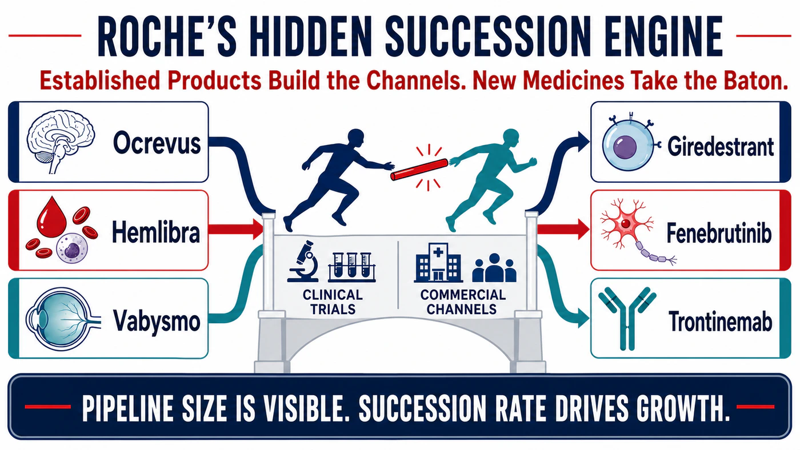
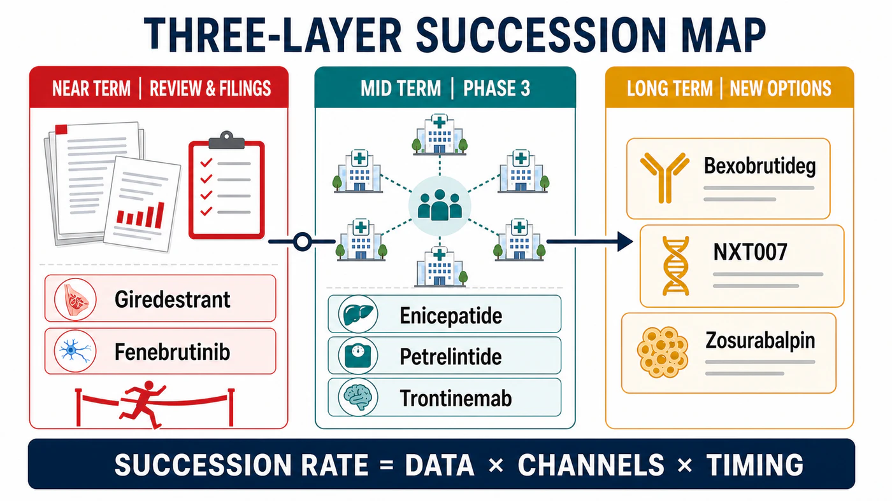
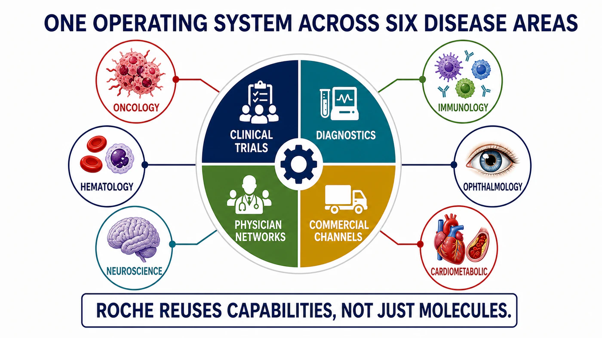
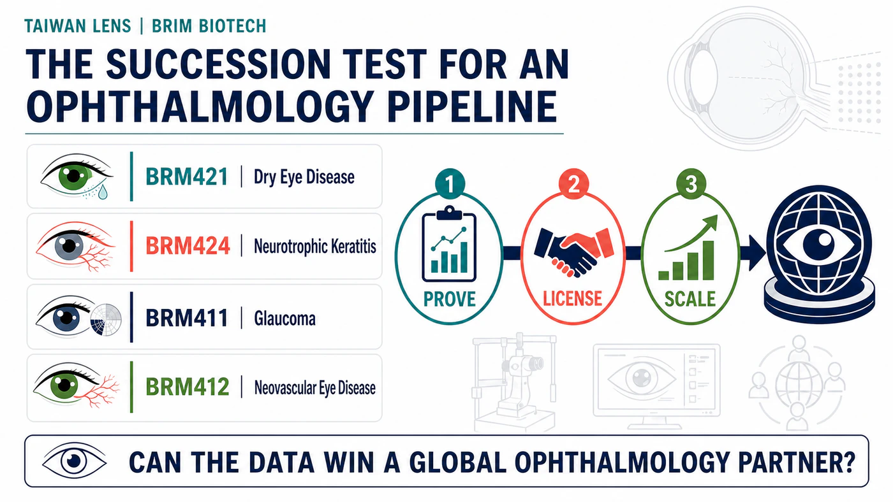

# Roche's Hidden Succession Engine: How 19 New Molecules Could Power the Next Growth Cycle

When one company is placing bets across breast cancer, multiple sclerosis, Alzheimer's disease, obesity, and targeted protein degradation, the easy description is "portfolio diversification."

It is a safe phrase. It is also nearly devoid of information.

Put Roche's moves over the past year on a single timeline and the picture looks less like diversification than a relay race.

Roche's pharmaceutical division generated CHF 47.669 billion in sales in 2025. Three non-oncology products — Ocrevus, Hemlibra, and Vabysmo — contributed CHF 15.866 billion, or roughly one-third of pharmaceutical revenue. In 2026, two applications for the oral breast cancer drug giredestrant entered FDA review; the multiple sclerosis candidate fenebrutinib completed three positive phase 3 trials; and additional legs of the race began to take shape in obesity, Alzheimer's disease, and protein degradation.

At its 2025 Pharma Day, Roche said that as many as 19 new molecules could have launch potential before 2030. That is a large number, but it is not the answer that matters most.

The more important calculation is how many of those runners can take the baton on time.

- In the near term, watch two FDA applications and three positive phase 3 trials.
- In the middle distance, ask whether obesity and Alzheimer's assets can become new pillars.
- Further out, test whether recently acquired technologies can scale through Roche's existing channels.

## 01 | The Transformation Has Already Happened. The Income Statement Said So First.

When investors discuss Roche, they often start with HER2-positive breast cancer, hematologic malignancies, and a roster of classic antibodies. That impression is not wrong. It simply overlooks half of the income statement.

Ocrevus generated CHF 7.010 billion in 2025 sales, Hemlibra CHF 4.754 billion, and the ophthalmology drug Vabysmo CHF 4.102 billion. Roche's five leading growth drivers contributed a combined CHF 21.4 billion, and only Phesgo was an oncology product. The others spanned neuroscience, hematology, ophthalmology, and immunology.

Roche's revenue engine is already diversified. The more useful question in 2026 is whether the next products can enter the same specialties, reach the same physicians, and use the same commercial system before the current engines begin to slow.

That timing gap will determine whether Roche's growth cycle forms one continuous curve or a series of isolated peaks.

Big Pharma does not fear aging drugs. The painful part is when the next runner has not reached the bend.

## 02 | The Two Legs Closest to the Finish: Giredestrant and Fenebrutinib

In breast cancer, Roche is betting on giredestrant, an oral selective estrogen receptor degrader.

The FDA has accepted two applications. The first covers giredestrant plus everolimus for ESR1-mutated, ER-positive, HER2-negative advanced breast cancer, with a PDUFA target date of December 18, 2026. The second covers adjuvant treatment in ER-positive, HER2-negative early breast cancer. It received priority review and has a target date of November 30.

Together, the applications span advanced and early disease. Roche now has an opportunity to hand more than three decades of breast cancer clinical development, regulatory experience, and commercial infrastructure to a next-generation oral endocrine therapy.

The succession logic in neuroscience is equally clear.

Ocrevus is already Roche's largest product, with CHF 7.010 billion in 2025 sales. The drug behind it is fenebrutinib, an oral BTK inhibitor designed to penetrate the brain. FENhance 1, FENhance 2, and FENtrepid all met their primary endpoints across relapsing and primary progressive multiple sclerosis. Roche has said it will submit the full data package to regulators.

The commercial attraction is straightforward: the same multiple sclerosis centers and physician networks could potentially support both injectable Ocrevus and oral fenebrutinib, while giving patients a wider range of choices.

This leg of the race still carries risk. Roche's complete April release reported seven deaths from different causes in the fenebrutinib groups during the reporting period across the two relapsing multiple sclerosis studies, plus one after the reporting period, compared with one death in the teriflunomide groups. Further analysis remains underway. Positive phase 3 results make the path to filing clearer; the safety profile will influence labeling, physician adoption, and the eventual pace of uptake.

## 03 | The Next Layer of Options: Obesity, Alzheimer's, and BTK Degradation

Assets approaching regulatory review protect the near term. Roche is also buying time for the revenue curve further out.

Its heaviest commitment is in obesity. Roche partnered with Zealand Pharma on petrelintide for $1.65 billion upfront and as much as $5.3 billion including development and commercial milestones. In phase 2 data released in 2026, participants achieved mean weight loss of up to 10.7% at week 42, versus 1.7% with placebo. Roche is now moving petrelintide and enicepatide, formerly CT-388, toward phase 3 development and is planning a phase 2 combination study.

Alzheimer's disease puts Roche's pharmaceutical and diagnostic capabilities on the same map. Two phase 3 studies of trontinemab, TRONTIER 1 and TRONTIER 2, are underway. A third study, PrevenTRON, is designed for asymptomatic people whose biomarkers indicate a high risk of disease. Roche also has the CE-marked Elecsys pTau217 blood test to help identify amyloid pathology.

As treatment moves into earlier populations, finding the right patient becomes as important as the drug's effect. Roche has a rare end-to-end pathway: diagnostics find the patient, clinical trials test the medicine, and the same healthcare system can support commercialization.

Its June agreement with Nurix Therapeutics added another cross-disease option. Roche paid $700 million upfront for co-development and commercialization rights to bexobrutideg, also known as NX-5948, a BTK degrader being developed across B-cell malignancies, immunology, and neurological disease. The potential transaction value is as high as $2.3 billion.

These programs appear dispersed on the surface. Behind them, the capabilities overlap heavily: antibody and molecular engineering, patient stratification, global phase 3 execution, diagnostics, and specialist channels that already exist.

## 04 | Roche's Most Valuable Asset Is the Time It Does Not Need to Spend Rebuilding a Market

Roche's 19 potential new molecules constitute a large option pool. They will not all succeed, and they do not need to.

Our team is more interested in the "succession rate." The most expensive work for a large drugmaker often begins after approval: educating physicians again, establishing testing, negotiating reimbursement, and building a commercial organization. Roche's two closest-to-market programs already reconnect with its breast cancer and multiple sclerosis franchises, while trontinemab links into an existing diagnostics entry point. Whether those assets can avoid the time and cost of rebuilding a market will affect the next revenue cycle sooner than the headline count of 19.

Succession rate asks a more complete question than which individual drug will win. It must also estimate when established products will slow, when a successor can enter, how much time existing physician networks and diagnostics can save, and how much Roche must still spend on milestones, trials, and launch execution after acquiring an asset.

Both giredestrant review dates fall near the end of 2026. Fenebrutinib still has to pass regulatory and safety scrutiny. Obesity is crowded with exceptionally well-funded competitors. Trontinemab ultimately has to prove value on clinical functional outcomes. If any runner loses pace, the revenue curve could still develop a gap.

Pipeline size determines how long the story can be. Succession rate determines whether the revenue curve breaks.

## 05 | A Taiwan Comparison: Can BRIM Biotechnology Hand Ophthalmology Assets to a Mature Channel?

Taiwan's BRIM Biotechnology, ticker 6885, offers a smaller-scale comparison.

BRIM concentrates its main research resources in ophthalmology. Its website lists BRM421 for dry eye disease, BRM424 for neurotrophic keratitis, BRM411 for glaucoma, and BRM412 for neovascular eye disease. A Taiwan phase 2 dose-ranging study of BRM421 has received approval in principle to proceed. BRM424 has completed a protocol change for its US phase 2 study and begun enrollment.

BRIM is in the first half of the relay: advancing candidates toward clinical proof of concept that could support licensing, then handing them to a partner with late-stage development and commercialization capabilities. Roche sits at the other end of the value chain, showing how a mature pharmaceutical company can amplify ophthalmology assets with specialist physicians, imaging diagnostics, reimbursement access, and global distribution. The companies differ greatly in scale and commercial position. The comparison is useful because it shows how value changes hands along the same chain.

Vabysmo's CHF 4.102 billion in 2025 sales demonstrates that an ophthalmology product can become a major Big Pharma pillar once it connects with specialists, imaging, reimbursement, and global channels. BRIM's investment question can be reduced to three verbs: prove, license, scale.

- **Prove:** Can BRM421's new formulation and dosing support a phase 3 design? Can BRM424 establish a clear clinical effect in phase 2?
- **License:** After proof of concept, can BRIM secure an international partner with ophthalmology channels and late-stage development expertise?
- **Scale:** Can manufacturing, formulation, and supply support multinational trials and eventual commercialization?

Roche's current strategy offers a direct lesson for Taiwanese drug developers: an asset's value has a chance to expand only after it connects with a mature disease franchise. Science opens the door. Clinical execution, licensing, and commercial channels determine how far that door leads.

## Conclusion | Roche's Deepest Moat Is Preventing the Revenue Baton From Being Dropped

Roche's next growth cycle may not be supported by one suddenly dominant blockbuster.

Giredestrant reconnects with breast cancer, fenebrutinib with multiple sclerosis centers, and trontinemab with pTau217 testing. Obesity and BTK degradation provide options further out. Every program carries risk, but each has an existing place to land.

Drugnews' assessment is that Roche has already completed the first stage of diversification. Two FDA decisions near the end of 2026, the safety review of fenebrutinib, and the transition of obesity assets into phase 3 will deliver the first meaningful report card for this operating system.

What is hardest to replicate in Big Pharma often sits outside the headline. It includes physician relationships, trial networks, diagnostic entry points, regulatory experience, and commercial teams. Those capabilities rarely appear beside a drug's name. Their weight becomes visible when established and emerging products exchange the baton.

A blockbuster can illuminate a few years. A succession system can keep the light across the entire revenue statement.

## References

1. [Roche | Full-year results 2025](https://www.roche.com/media/releases/med-cor-2026-01-29)
2. [Roche | FDA grants priority review to giredestrant in early breast cancer](https://www.roche.com/media/releases/med-cor-2026-06-02)
3. [Roche | FDA accepts giredestrant application in advanced breast cancer](https://www.roche.com/media/releases/med-cor-2026-02-20)
4. [Roche | Third pivotal fenebrutinib phase 3 study meets primary endpoint](https://www.roche.com/investors/updates/inv-update-2026-03-02)
5. [Roche | Complete phase 3 efficacy and safety data for fenebrutinib](https://www.roche.com/media/releases/med-cor-2026-04-21c)
6. [Roche | Agreement with Nurix for bexobrutideg](https://www.roche.com/investors/updates/inv-update-2026-06-08)
7. [Roche | Petrelintide transaction terms](https://www.roche.com/media/releases/med-cor-2025-03-12)
8. [Roche | Petrelintide phase 2 results](https://www.roche.com/media/releases/med-cor-2026-03-05)
9. [Roche | 2026 ADA obesity pipeline update](https://www.roche.com/investors/updates/inv-update-2026-06-01)
10. [Roche | 2026 AAIC Alzheimer's and diagnostics update](https://www.roche.com/investors/updates/inv-update-2026-07-07)
11. [Roche | Pharma Day 2025 pipeline and pre-2030 launch potential](https://assets.roche.com/f/176343/x/059c686d27/20250922_pharma-day-2025_vf_online.pdf)
12. [Roche | Pharmaceutical pipeline](https://www.roche.com/solutions/pipeline)
13. [BRIM Biotechnology | Company and research model](https://www.brimbiotech.com/en/)
14. [BRIM Biotechnology | Development milestones](https://www.brimbiotech.com/about-us/milestone)

## Disclaimer

This article is provided solely for industry research and market observation. It does not constitute investment advice, a recommendation to buy or sell securities, or an endorsement of any company. Biopharmaceutical investing involves clinical, regulatory, licensing, commercialization, currency, and capital-market risks. Readers must make their own decisions and bear responsibility for the outcomes.
