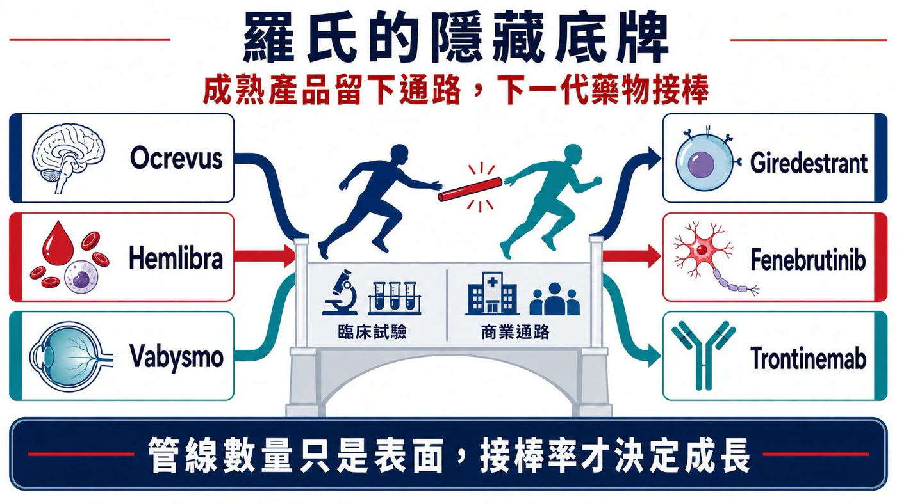
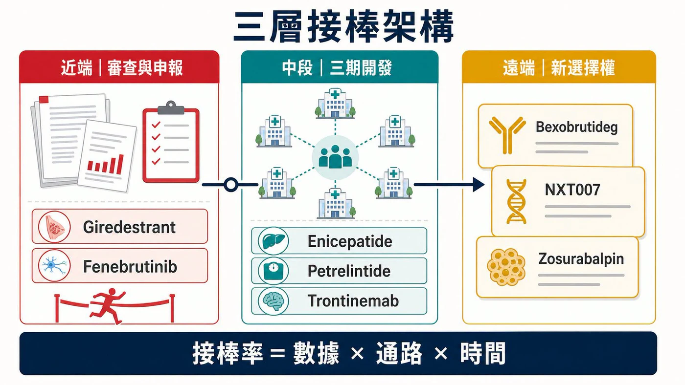
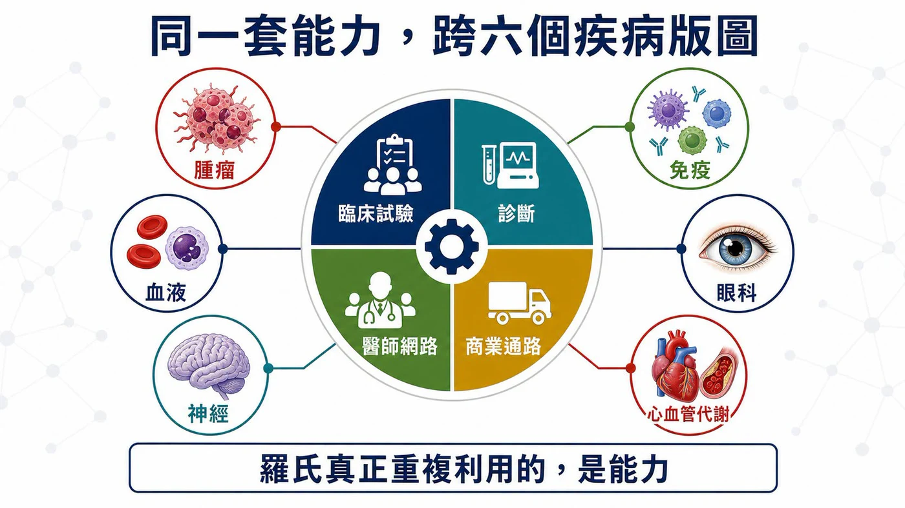
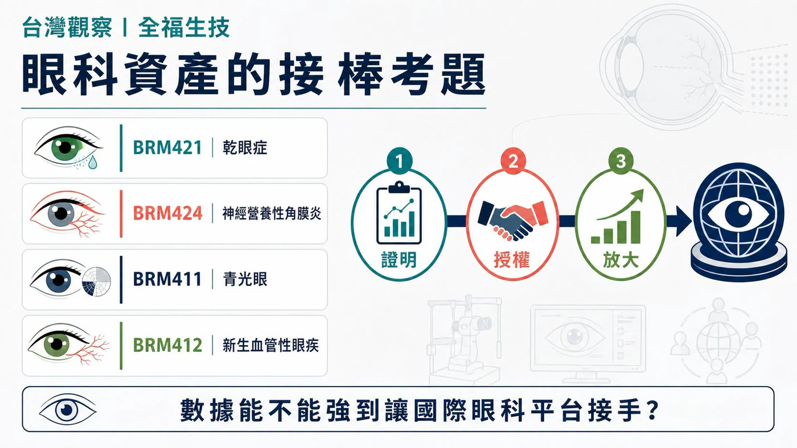

# 羅氏的隱藏底牌：19 個新分子排隊接棒，下一個成長週期怎麼長出來？

一家公司同時在乳癌、多發性硬化症、阿茲海默症、減重與蛋白質降解下注，很容易被寫成「多元布局」。

這四個字很安全，也幾乎沒有資訊量。

把羅氏近一年的動作排在一起，畫面更像一場接力賽。

2025 年，羅氏製藥事業銷售 476.69 億瑞士法郎。Ocrevus、Hemlibra、Vabysmo 三款非腫瘤產品合計 158.66 億瑞士法郎，已經撐起約三分之一的製藥收入。到了 2026 年，乳癌口服新藥 giredestrant 有兩項申請進入 FDA 審查；多發性硬化症新藥 fenebrutinib 連續完成三個陽性三期；減重、阿茲海默症與蛋白質降解療法也往後排出新的棒次。

羅氏在 2025 年藥品日提出，2030 年前最多有 19 個新分子具備上市潛力。這個數字很大，卻還不是最關鍵的答案。

真正值得算的，是下一棒有多少能準時接上。

- 近端，看兩項 FDA 申請與三個陽性三期。
- 中段，看減重和阿茲海默症能否長成新支柱。
- 遠端，看剛買進的技術能否沿著既有通路放大。

## 01｜轉型早已發生，收入表先說了

市場談羅氏，第一個想到的仍常是 HER2 乳癌、血液腫瘤與幾款經典抗體藥。這個印象沒有錯，只是少看了半張收入表。

2025 年，Ocrevus 銷售 70.10 億瑞士法郎，Hemlibra 為 47.54 億，眼科藥 Vabysmo 也來到 41.02 億。羅氏前五大成長動能合計貢獻 214 億瑞士法郎，其中只有 Phesgo 屬於腫瘤；其餘還包括神經、血液、眼科與免疫產品。

羅氏的收入引擎早已分散。2026 年更值得追的問題，是新藥能否在舊引擎放慢之前，沿著同一個科別、同一批醫師與同一套商業系統接進來。

這個時間差，會決定成長週期是一條連續曲線，還是幾座彼此分離的高峰。

大藥廠不怕藥會變老。真正難熬的，是接棒的人還沒跑到彎道。

## 02｜最靠近終點的兩棒：giredestrant 與 fenebrutinib

乳癌這一棒，羅氏押的是口服選擇性雌激素受體降解劑 giredestrant。

FDA 已受理兩項申請。第一項用於 ESR1 突變、ER 陽性、HER2 陰性的晚期乳癌，搭配 everolimus，預定審查期限為 2026 年 12 月 18 日；第二項則用於 ER 陽性、HER2 陰性的早期乳癌輔助治療，獲優先審查，預定審查期限為 11 月 30 日。

兩個申請橫跨晚期與早期病人。羅氏累積三十多年的乳癌臨床、法規與商業網路，現在有機會交給下一代口服內分泌療法繼續使用。

神經科學的接棒同樣清楚。

Ocrevus 已是羅氏最大的產品，2025 年銷售 70.10 億瑞士法郎。接在後面的 fenebrutinib，是可進入腦部的口服 BTK 抑制劑。FENhance 1、FENhance 2 與 FENtrepid 三個關鍵三期均達主要終點，涵蓋復發型與原發進展型多發性硬化症，羅氏表示將把完整資料送交監管機關。

商業上的吸引力很直接：同一套多發性硬化症中心與醫師網路，有機會同時承接注射型 Ocrevus 與口服 fenebrutinib，病人選擇也會變多。

這一棒仍有風險。羅氏四月公布的完整資料顯示，在兩個復發型多發性硬化症試驗中，fenebrutinib 組於報告期內出現七例不同原因的死亡，報告期後另有一例；teriflunomide 組為一例，進一步分析仍在進行。三期陽性讓申請資格變得更清楚，安全性資料則會直接影響標籤、醫師接受度與最終放量速度。

## 03｜下一層選擇權：減重、阿茲海默症與 BTK 降解

接近審查的產品守住近端，羅氏也在替更遠的收入曲線買時間。

減重是出手最重的一塊。羅氏與 Zealand Pharma 合作開發 petrelintide，簽約金 16.5 億美元，開發與銷售里程碑計入後，總潛在價值最高 53 億美元。2026 年公布的二期試驗中，受試者在第 42 週平均減重最高 10.7%，安慰劑組為 1.7%。羅氏目前正把 petrelintide 與 enicepatide（CT-388）推向三期開發，也規劃兩者的二期組合試驗。

阿茲海默症則把羅氏的藥品與診斷能力放到同一張圖上。Trontinemab 的 TRONTIER 1、2 兩個三期試驗正在進行；另一個 PrevenTRON 三期，準備研究尚未出現症狀、但生物標記顯示高風險的人。羅氏同時擁有已取得 CE 標誌的 Elecsys pTau217 血液檢測，能協助辨認類澱粉蛋白病理。

藥物往更早期病人移動時，先找出誰適合治療，會變得和藥效一樣重要。羅氏在這裡擁有一條少見的完整路徑：檢測先找到人，臨床試驗再驗證藥，商業化之後仍由同一套醫療體系接手。

六月與 Nurix Therapeutics 的合作，又添了一張跨領域選擇權。羅氏支付 7 億美元簽約金取得 BTK 降解劑 bexobrutideg（NX-5948）的共同開發與商業化權利，總潛在交易價值最高 23 億美元，開發範圍橫跨 B 細胞惡性腫瘤、免疫與神經疾病。

這些題目表面分散，後台卻高度共用：抗體與分子工程、病人分層、全球三期執行、診斷能力，以及已經存在的科別通路。

## 04｜羅氏最值錢的，是省下重建市場的時間

羅氏的 19 個潛在新分子，代表一個很大的選擇權池。它們不會全部成功，也不需要全部成功。

我們團隊更在意「接棒率」。大藥廠最昂貴的工作，常在核准之後：重新教育醫師、建立檢測、談給付，再拉起一支商業團隊。最靠近上市的兩條線，已經清楚接回羅氏原有的乳癌與多發性硬化症版圖；trontinemab 則接上診斷入口。它們能否省下重建市場的時間，會比 19 這個總數更早影響下一段收入。

接棒率要回答的，比哪一顆藥會成功更完整。它還要估算：現有大藥何時放緩，下一顆藥何時能進場，原有的醫師網路與診斷入口能替它省下多少重建市場的時間，以及買進資產後還要負擔多少里程碑、試驗與上市費用。

Giredestrant 的兩個審查期限集中在 2026 年底，fenebrutinib 還要跨過監管與安全性檢視；減重市場擠滿資金雄厚的對手；trontinemab 最終仍得用臨床功能終點證明價值。任何一棒慢下來，都可能讓收入曲線留下空檔。

因此，管線數量只決定故事有多長；接棒率才決定收入曲線有沒有斷點。

## 05｜台灣看全福生技：眼科資產能不能接上成熟通路

台灣可以用全福生技（6885）做一個小型對照。

全福把主要研發資源放在眼科。公司官網列出的產品包括乾眼症新藥 BRM421、神經營養性角膜炎新藥 BRM424、青光眼新藥 BRM411，以及新生血管性眼疾新藥 BRM412。BRM421 的台灣二期劑量探索試驗已獲原則同意進行；BRM424 則完成美國二期設計變更並啟動收案。

全福目前站在接力賽的前半段：把候選藥推到可授權的臨床概念驗證，再交給具備後期開發與商業化能力的夥伴。羅氏站在價值鏈另一端，展示成熟藥廠如何用專科醫師、影像診斷、給付與全球通路放大眼科資產。兩者規模與商業位置不同，放在一起看的意義，是同一條價值鏈如何交棒。

Vabysmo 在 2025 年已賣出 41.02 億瑞士法郎，說明眼科產品只要接上專科醫師、影像診斷、給付與全球通路，也能長成大型藥廠的重要支柱。全福的投資問題可以壓縮成三個動詞：證明、授權、放大。

- 證明：BRM421 的新配方與劑量能否支持下一步三期設計？BRM424 二期能否建立清楚的臨床效果？
- 授權：概念驗證完成後，能否找到有眼科通路與後期開發能力的國際夥伴？
- 放大：製程、配方與供應能否承受多國臨床和未來商業化？

羅氏這一輪布局給台灣新藥公司最直接的提醒，是一項資產接進成熟疾病版圖之後，價值才有機會被放大。科學先把門打開，後面的臨床、授權與通路，決定這扇門能通到哪裡。

## 結語｜羅氏最深的護城河，是不讓收入斷棒

羅氏的下一個成長週期，未必會由某一顆突然爆紅的藥單獨撐起。

Giredestrant 接回乳癌版圖，fenebrutinib 接回多發性硬化症中心，trontinemab 與 pTau217 把診斷和治療串在一起，減重與 BTK 降解劑則提供更遠的選擇權。每一條線都有風險，卻都能找到一個已經存在的落點。

藥時事團隊的判斷是：羅氏的多元化早已完成第一段路。2026 年底的兩項 FDA 決定、fenebrutinib 的安全性檢視，以及減重資產的三期推進，會交出這套系統的第一批成績單。

大藥廠真正難複製的，往往藏在新聞標題以外。它包括醫師關係、試驗網路、診斷入口、法規經驗和商業團隊。這些能力平常不會出現在藥名旁邊，到了新舊產品交棒時，才看得出重量。

一顆明星藥會照亮幾年；一套接棒系統，才可能把光留在整張收入表上。

## 參考資料

1. [Roche｜2025 年全年業績](https://www.roche.com/media/releases/med-cor-2026-01-29)
2. [Roche｜Giredestrant 早期乳癌 NDA 獲 FDA 優先審查](https://www.roche.com/media/releases/med-cor-2026-06-02)
3. [Roche｜Giredestrant 晚期乳癌 NDA 獲 FDA 受理](https://www.roche.com/media/releases/med-cor-2026-02-20)
4. [Roche｜Fenebrutinib 第三個關鍵三期達主要終點](https://www.roche.com/investors/updates/inv-update-2026-03-02)
5. [Roche｜Fenebrutinib 四月完整三期與安全性資料](https://www.roche.com/media/releases/med-cor-2026-04-21c)
6. [Roche｜與 Nurix 合作開發 Bexobrutideg](https://www.roche.com/investors/updates/inv-update-2026-06-08)
7. [Roche｜Petrelintide 合作交易條件](https://www.roche.com/media/releases/med-cor-2025-03-12)
8. [Roche｜Petrelintide 二期結果](https://www.roche.com/media/releases/med-cor-2026-03-05)
9. [Roche｜2026 ADA 減重管線更新](https://www.roche.com/investors/updates/inv-update-2026-06-01)
10. [Roche｜2026 AAIC 阿茲海默症藥品與診斷更新](https://www.roche.com/investors/updates/inv-update-2026-07-07)
11. [Roche｜2025 Pharma Day 管線與 2030 上市潛力](https://assets.roche.com/f/176343/x/059c686d27/20250922_pharma-day-2025_vf_online.pdf)
12. [Roche｜藥品研發管線](https://www.roche.com/solutions/pipeline)
13. [全福生技｜公司與研發模式](https://www.brimbiotech.com/en/)
14. [全福生技｜研發里程碑](https://www.brimbiotech.com/about-us/milestone)

## 免責聲明

本文僅為產業研究與市場觀察，不構成任何投資建議、買賣建議或個股推薦。生技醫藥投資涉及臨床試驗、法規審查、授權談判、商業化、匯率與資本市場波動等多重風險，投資人應自行判斷並自負盈虧。
