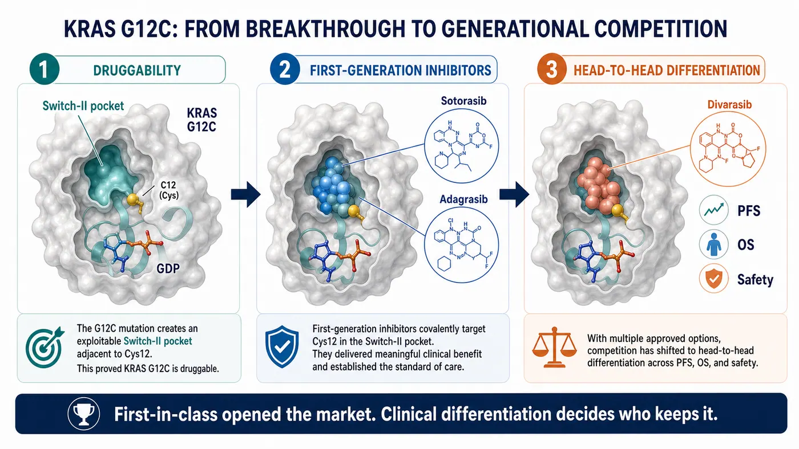
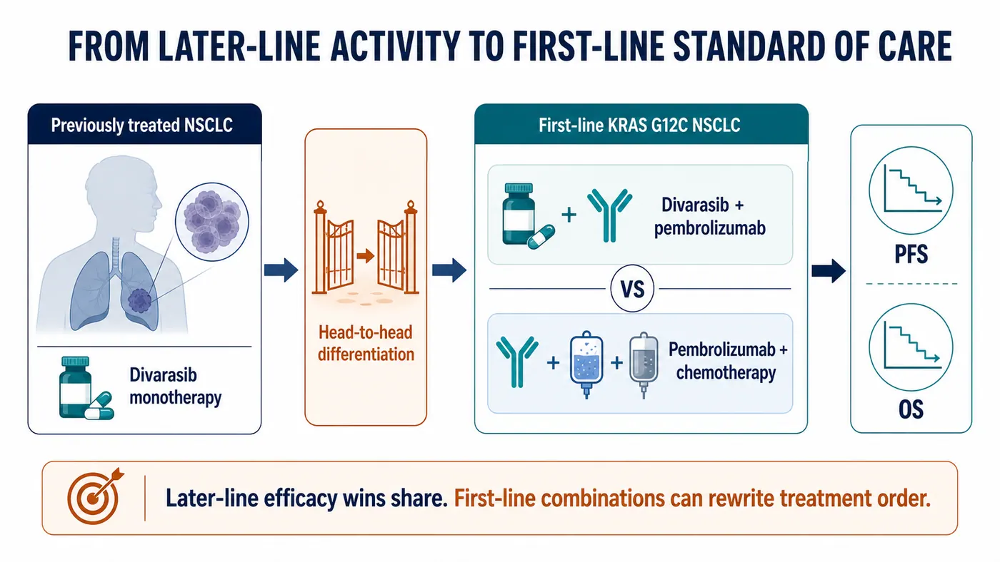
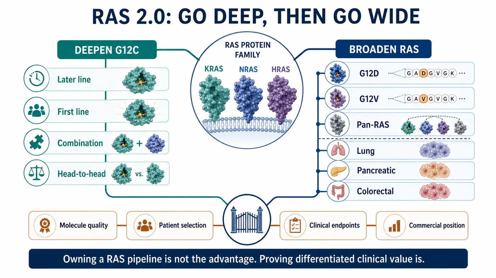
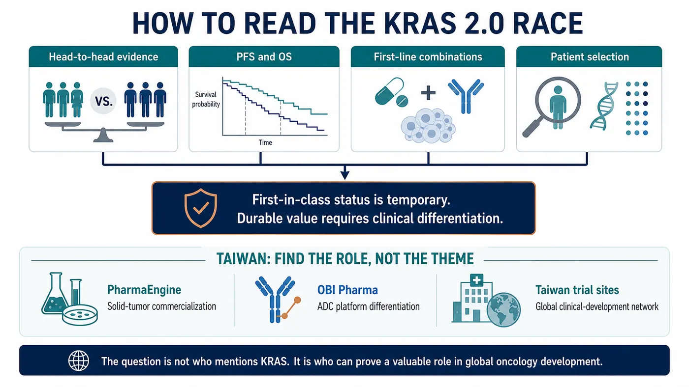

# Winning First Is Not Winning: Roche's Divarasib Pushes KRAS Into a Generational Elimination Race

When sotorasib was approved in 2021, the industry finally felt that the KRAS mountain had been breached.

At that point, the question was whether a cancer driver long described as “undruggable” could be reached by a medicine at all.

The question has now changed.

Roche's divarasib has gone head to head against the marketed KRAS G12C inhibitors sotorasib and adagrasib in Phase III, and Roche reported that the study met its primary and key secondary objectives. RAS competition is no longer about who first proved that KRAS could be drugged. It is about who can enter the same target class and displace the previous generation.

Drugnews' central judgment is that this is more than one clinical win for Roche. The measuring stick for the RAS industry is changing. First-mover approval can open a market, but it cannot lock that market indefinitely. The molecules that endure will be those that can establish generational differentiation through progression-free survival, overall survival, safety, combination strategy, and patient selection.

Winning first is not the same as winning. In the RAS field, that distinction is becoming increasingly real.

## 01 | KRAS Has Moved From “Undruggable” to a Same-Target Elimination Race

KRAS is not a niche target.

It has long been considered one of the most important and difficult oncogenic drivers, appearing across lung, pancreatic, colorectal, and other solid tumors. Historically, the protein was thought to present a smooth surface with few useful pockets, while its affinity for GTP and GDP made stable pharmacological intervention exceptionally difficult.

That is why sotorasib mattered. It showed that a small molecule could engage KRAS G12C and moved RAS from a scientifically important but commercially frustrating field into a target class that major pharmaceutical companies, biotechs, and investors were willing to fund.

The awkward reality for a first-in-class product, however, begins precisely at that moment.

The first product opens the door. Once the door is open, followers no longer need to prove that the door exists. They need to prove that they can move through it faster, more reliably, and farther than the pioneer.

The first generation of KRAS G12C medicines completed the historic move from zero to one. The field has now entered a one-to-many elimination round. Investors and physicians will not ask only who launched first. They will ask which molecule has better pharmacology, which one produces harder clinical endpoints, which one can move into earlier lines, which one combines effectively with immunotherapy or chemotherapy, and which one is strong enough to change treatment practice.

That is why the divarasib result matters. It was not an uncontrolled study or a comparison with placebo. Roche placed its next-generation candidate directly against the marketed first-generation options.

When a later entrant accepts that comparison and reports improvements in PFS and an interim OS analysis, the market must relearn a basic rule: early position in RAS does not guarantee durable security.

## 02 | Divarasib Is Not Merely Another G12C Inhibitor

Divarasib is a KRAS G12C inhibitor, but “another molecule against the same target” is an inadequate description.

The basic logic of the class is to exploit the cysteine created by the G12C mutation. A covalent inhibitor can lock mutant KRAS in an inactive state and interrupt downstream signaling. The breakthrough was the identification of an actionable Switch-II pocket.

Sotorasib and adagrasib proved that this route could work. A workable route, however, is not necessarily the best route.

Divarasib was designed around greater potency and selectivity. The early clinical study published in the New England Journal of Medicine in 2023 showed activity across KRAS G12C-positive solid tumors. Among patients with NSCLC, the confirmed response rate was 53.4%, and median progression-free survival was 13.1 months. Those results were not a definitive answer, but they were enough to explain why Roche was prepared to pursue a much harder clinical comparison.

The industrial significance is larger than either number.

Competition in an emerging targeted-therapy class initially asks whether the target can be reached. Once several drugs reach it, the competition becomes a much finer test of molecular quality: binding kinetics, residence time, depth of inhibition, selectivity, tolerability, dosing, combination space, and whether those properties translate into meaningful clinical differentiation.

RAS is now undergoing that transition.

The scientific story can no longer stop at “KRAS is finally druggable.” Every company must answer a harsher question: exactly how is its molecule better than the previous generation, and can that advantage be seen by physicians, patients, regulators, and payers?

## 03 | The First Route in RAS 2.0: Move Into the Front Line

The first KRAS G12C inhibitors entered through later-line treatment, which was a rational development path. New mechanisms usually establish activity first in patients who have exhausted standard options, then move earlier.

The largest commercial opportunity, however, is not in the later line.

For a KRAS G12C inhibitor to become a more central lung-cancer therapy, it must enter first-line treatment. That means combinations with pembrolizumab, chemotherapy, or other agents, and evidence that the regimen changes the disease course earlier than the existing standard.

This is why Roche's Krascendo 2 program deserves close attention. The ClinicalTrials.gov record describes a randomized, open-label Phase III study of divarasib plus pembrolizumab versus pembrolizumab plus pemetrexed and platinum chemotherapy in previously untreated advanced or metastatic non-squamous NSCLC with KRAS G12C. The planned enrollment is approximately 600 patients, and the primary endpoints include PFS and OS.

This is not an incremental extension.

If the later-line head-to-head study asks whether divarasib is better than the first generation, the front-line Phase III study asks whether divarasib can change the order of treatment. The former can redistribute market share. The latter can reshape the standard of care.

RAS 2.0 will increasingly become a contest in clinical-development design. Single-agent activity is only the first layer. The real challenge is choosing combinations with immunotherapy, chemotherapy, EGFR, SHP2, or other approaches; controlling overlapping toxicity; and using patient selection to maximize benefit.

That shift makes RAS more than a medicinal-chemistry battlefield. It becomes a coordinated test of clinical development, translational medicine, companion diagnostics, and commercialization.

## 04 | The Second Route: Broaden From G12C to G12D, G12V, and Pan-RAS

G12C is important, but it is not the whole RAS landscape.

KRAS G12C defines a meaningful group in lung cancer, while G12D, G12V, G12R, and other variants matter across pancreatic, colorectal, and additional solid tumors. Pancreatic cancer in particular is highly dependent on KRAS signaling and has long lacked effective targeted therapy, making G12D and pan-RAS programs central to the next competitive wave.

The industry map now has two layers.

The first is to deepen G12C: move from later line to first line, from monotherapy to combination therapy, and from first-generation to next-generation molecules.

The second is to broaden RAS: expand from G12C into G12D and G12V, and potentially into strategies that cover several RAS variants. This layer is harder, but successful programs would address a market larger than G12C alone and support a more credible platform story.

The divarasib event therefore affects more than G12C.

It raises the evaluation standard for the entire RAS field. Whether a company is developing a G12D, G12V, or pan-RAS program, investors will ask the same question: is this another program following a fashionable target, or a next-generation molecule capable of demonstrating clinical differentiation?

That is especially unforgiving for early-stage biotechs.

RAS is not an overlooked target. Capital and competitors are already present. Merely owning a RAS pipeline no longer creates value by itself. Value depends on whether molecular design, mutation selection, clinical population, combination strategy, and commercial positioning have been worked into one coherent program.

## 05 | The First-in-Class Halo Is Shortening; Hard Clinical Endpoints Are Lengthening

Biotechnology loves the first-in-class label.

It can mean the first product to open a target, enter a market, and establish physician awareness. That position is valuable, but the RAS experience shows that it is not a permanent pass.

In a crowded target class, the first-mover benefit may be shorter than expected. When followers combine stronger molecular properties with head-to-head data, attention can move quickly from who arrived first to who can remain in clinical practice.

The lesson extends well beyond RAS.

Early-stage companies often tell investors that they are first, globally leading, or earliest to a particular position. Those statements may open a presentation. They cannot close the investment case in a market where capital is more selective, clinical development is more expensive, and target classes are more crowded.

Hard endpoints close the case.

PFS, OS, duration of response, safety, quality of life, dosing convenience, and combination feasibility determine whether a product can enter guidelines, cause physicians to switch, and win payer support.

The second half of the RAS race is no longer a storytelling contest. It is an endpoint contest.

## 06 | How Taiwan Fits: Find a Verifiable Position on the Precision-Oncology Map

Bringing the discussion back to Taiwan does not mean searching for a simplistic “KRAS concept stock.” A better approach is to place RAS 2.0 on a broader precision-oncology map. Which companies can differentiate in solid tumors? Which teams have translational and clinical-development capabilities? Which organizations possess international development or commercialization experience?

The first company worth placing on that map is PharmaEngine (4162).

Its flagship product, ONIVYDE, is an important commercialized pancreatic-cancer asset, and its development portfolio continues to focus on precision oncology through programs such as PEP07 and PEP08. PharmaEngine is not a same-target KRAS G12C competitor. Its relevance is a different question on the same solid-tumor map: can a Taiwan company create a durable role in high-unmet-need cancers through clinical positioning, lifecycle strategy, and international commercialization experience?

The second is OBI Pharma (4174).

OBI has shifted its focus toward ADC products and enabling platforms. Its public materials describe OBI-902, a TROP2-directed ADC in clinical development, alongside GlycOBI, ThiOBI, and HYPrOBI technologies. These are not RAS medicines, but OBI faces the same capital-market challenge: in an increasingly crowded oncology environment, one appealing story is insufficient. The company must demonstrate that its platform produces differentiated assets that international partners can understand and value.

The Krascendo 2 registry also lists multiple Taiwan clinical-trial locations. Taiwan is therefore not only a market that reads global oncology news. It participates in the clinical network that develops precision lung-cancer medicines. Medical-center trial capability, molecular-testing infrastructure, and experience in international studies are part of Taiwan's oncology foundation.

Taiwan analysis should not shrink every global event into a thematic trading connection.

The more valuable question is whether companies and medical institutions can establish a verifiable role as global development standards change. RAS 2.0 shows that oncology will increasingly reward differentiation, hard endpoints, and international execution. Taiwan companies are subject to the same test.

## 07 | What Investors Should Actually Track

The divarasib signal is clear, but it should not be overextended.

It does not mean every KRAS drug will succeed, or that the RAS field is free of risk. The opposite is more likely: the field will become more crowded, more expensive, and more dependent on clinical-design quality.

Four issues deserve attention.

First, head-to-head trials will matter more.

In a popular target class, placebo and historical comparisons are increasingly inadequate. A later entrant that wants to change the market must confront the existing options directly.

Second, PFS and OS are harder than narrative.

Early response rates can excite the market, but durable improvement in progression-free or overall survival determines therapeutic position.

Third, first-line combinations determine the ceiling.

Later-line monotherapy can establish activity. First-line combinations can expand the market, but they also introduce toxicity, cost, and trial-design complexity.

Fourth, Taiwan companies must be evaluated within the global competitive problem.

Whether the asset is PharmaEngine's solid-tumor commercialization experience, OBI's ADC platform, or Taiwan medical centers' participation in international studies, the relevant issue is not short-term thematic association. It is whether the organization can prove a valuable role in the global development network.

The RAS story has moved from undruggability to generational competition. The field is maturing, and its tolerance for weak differentiation is falling.

## Conclusion | First Movers Open Markets; Differentiation Keeps Them

Roche's divarasib result does more than escalate a KRAS G12C product battle. It changes how the entire RAS field is evaluated.

The first generation proved that KRAS could be reached by a medicine. The next generation must prove deeper inhibition, stronger durability, and better clinical outcomes.

Those are fundamentally different tasks.

The first depends on scientific breakthrough; the second on clinical execution. The first makes the market believe in a target; the second reallocates market share. The first asks who won early. The second asks who can remain.

Drugnews is more interested in the second question.

The most compelling feature of innovative drug development is not that every early leader stays ahead. Once a field is truly opened, the market reorders it under stricter, more practical, and more unforgiving standards.

RAS has reached that point.

Winning first is not winning. Only a molecule that carries its differentiation into clinical endpoints earns the right to keep the story.

## References

1. Roche | Divarasib shows superiority in head-to-head Phase III Krascendo 1: https://www.roche.com/investors/updates/inv-update-2026-07-02
2. New England Journal of Medicine / PubMed | Single-Agent Divarasib in Solid Tumors with a KRAS G12C Mutation: https://pubmed.ncbi.nlm.nih.gov/37611121/
3. ClinicalTrials.gov | NCT06497556, Krascendo 1: https://clinicaltrials.gov/study/NCT06497556
4. ClinicalTrials.gov | NCT04449874, GO42144 divarasib study: https://clinicaltrials.gov/study/NCT04449874
5. ClinicalTrials.gov | NCT06793215, Krascendo 2: https://clinicaltrials.gov/study/NCT06793215
6. National Cancer Institute | Divarasib drug dictionary: https://www.cancer.gov/publications/dictionaries/cancer-drug/def/divarasib
7. PharmaEngine | Products and R&D: https://www.pharmaengine.com/
8. OBI Pharma | Pipeline and technology: https://www.obipharma.com/

This article is intended for industry research and knowledge sharing only. It does not constitute investment, medical, fundraising, or individual stock advice.
