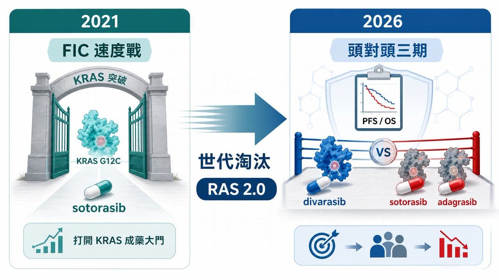
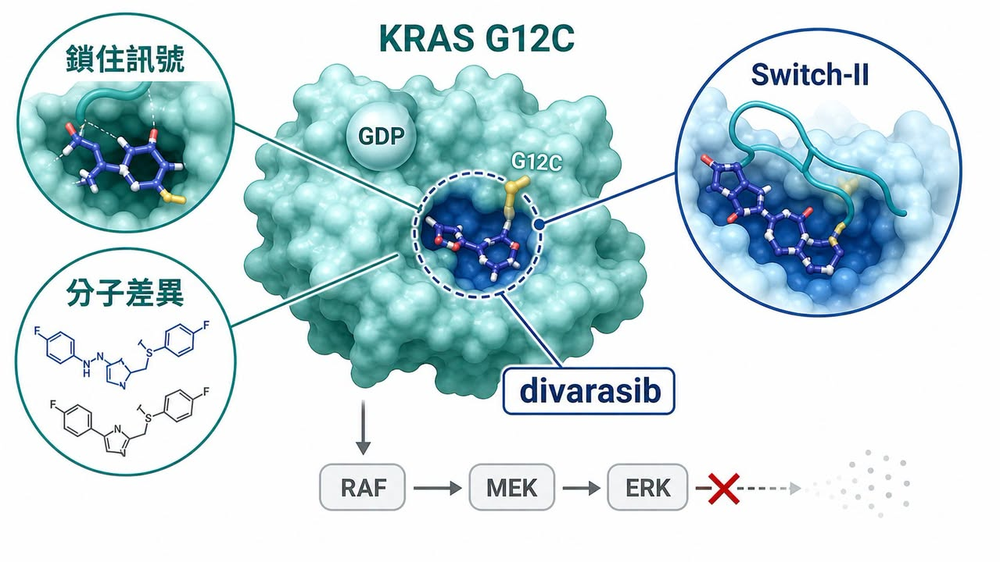
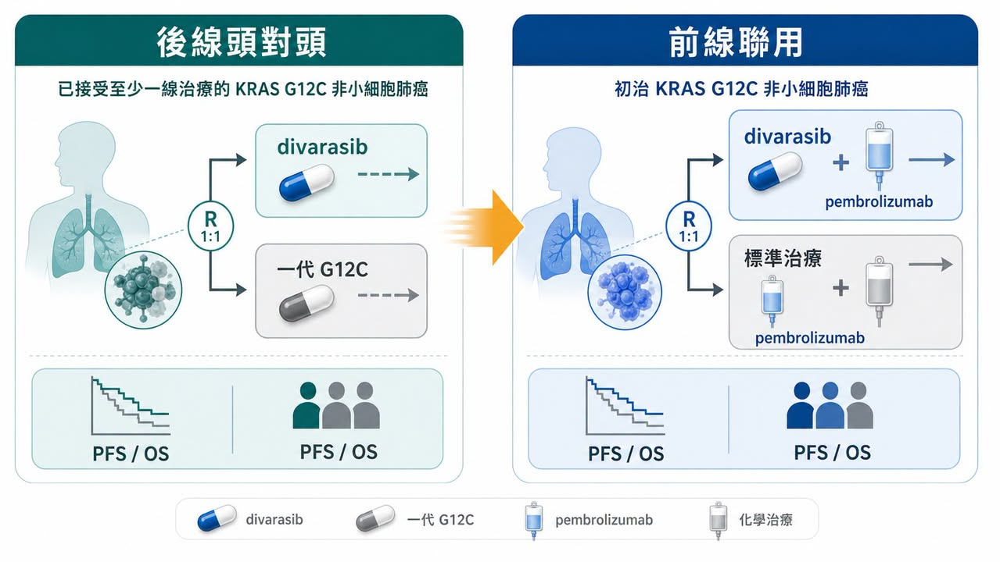
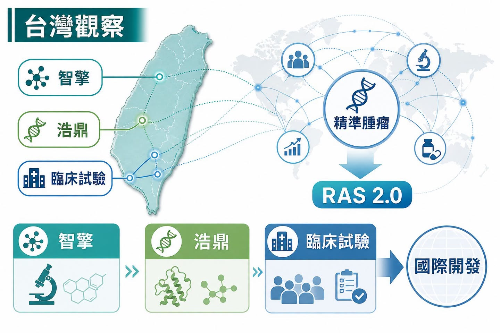

# 先贏不是贏：Roche divarasib 把 KRAS 賽道推進世代淘汰戰

2021 年，sotorasib 獲批上市，很多人第一次覺得 KRAS 這座山真的被鑿開了。

那一刻的問題是：這個曾經被說成「不可成藥」的癌症靶點，到底能不能被藥物打中？

現在問題換了。

Roche 的 divarasib 在一項頭對頭三期試驗中，對上已上市的 sotorasib 與 adagrasib，公開資料顯示試驗達到主要與關鍵次要目標。也就是說，RAS 賽道的競爭已經從「誰先證明 KRAS 可以成藥」，進到「誰能在同一個靶點裡，把上一代產品淘汰掉」。

藥時事團隊的判斷是：這不是 Roche 贏了一場臨床而已，而是 RAS 產業開始換尺。先發上市可以打開市場，但不能永久鎖住市場；真正能留下來的，會是能用 PFS、OS、安全性、聯用策略與患者分層證明自己有代際差異的分子。

先贏不是贏。這句話在 RAS 賽道，正在變得越來越現實。

## 01｜KRAS 從不可成藥，走到同靶點淘汰賽

KRAS 不是小靶點。

它長期被視為癌症裡最重要、也最難處理的驅動基因之一，出現在肺癌、胰臟癌、結直腸癌等多種實體瘤。問題是，KRAS 蛋白過去被認為表面太滑、口袋太少、與 GTP / GDP 結合太緊，藥物很難找到真正能穩定卡住的位置。

所以 sotorasib 的意義很大。它讓市場第一次看到 KRAS G12C 可以被小分子藥物打中，也讓 RAS 從「科學上很重要，但商業上很難做」的領域，正式變成大型藥廠、Biotech 和資本市場都願意下注的賽道。

可是，FIC 產品最尷尬的地方也在這裡。

它負責把門打開，但門一旦打開，後面的競爭者就不用再證明「這個門存在」。它們要證明的是：自己能不能走得更快、更穩、更遠。

KRAS G12C 的第一代產品，已經完成了「0 到 1」的歷史任務。現在進入的是「1 到 N」的淘汰賽。這時候市場不會只問誰先上市，而會問誰的分子活性更好、誰的臨床終點更硬、誰能推到前線、誰能和免疫治療或化療組合，誰能讓醫師願意真的改變治療路徑。

這也是 divarasib 這次結果重要的地方。它不是拿安慰劑對照，也不是只拿單臂數據講故事，而是直接把已上市的一代產品拉到同一張桌上比較。

當一個後來者敢打頭對頭，而且打出 PFS 與 OS 層面的優勢訊號，市場就會重新理解一件事：RAS 不再是誰先卡位誰就安全的賽道。

## 02｜divarasib 的重點，不只是「又一顆 G12C 抑制劑」

divarasib 也是 KRAS G12C 抑制劑，但它的故事不能只用「又一顆同靶點藥」帶過。

KRAS G12C 藥物的基本邏輯，是抓住 G12C 突變多出來的半胱胺酸，讓藥物能以共價方式把 KRAS 鎖在不活化狀態，阻斷下游訊號。早期突破的關鍵，是找到 Switch-II pocket 這個可以利用的口袋。

第一代產品 sotorasib、adagrasib 已經證明這條路走得通。但走得通，和走到最好，是兩回事。

divarasib 的設計重點，是更強的 potency 與 selectivity。NEJM 2023 年發表的早期臨床研究顯示，divarasib 在 KRAS G12C 陽性實體瘤中有臨床活性；在 NSCLC 病人中，確認反應率達 53.4%，中位無惡化存活期為 13.1 個月。這些不是最終答案，但足夠讓市場理解 Roche 為什麼敢把它推進更硬的臨床對決。

這裡的產業意義，比單一數字更大。

過去很多標靶藥的競爭，是「有沒有這個靶點」。但一旦同靶點藥物變多，競爭就會變成更細的分子品質問題：結合速度、停留時間、抑制深度、選擇性、耐受性、劑量、聯用空間，以及能不能在真實臨床終點上轉化成差異。

RAS 賽道正在經歷這個轉變。

科學故事不再只停在「KRAS 終於可以成藥」。接下來，每一家公司都得回答更殘酷的問題：你的分子到底比上一代好在哪裡？這個好，能不能被醫師、病人、監管機構與支付方一起看見？

## 03｜2.0 時代的第一條路：往前線推

KRAS G12C 第一代藥物大多從後線治療切入，這很合理。新機制一開始通常先在標準治療失敗後的病人身上證明有效，再慢慢往前線推。

但真正的大市場不在後線。

如果 KRAS G12C 抑制劑要成為肺癌治療裡更核心的藥物，就必須進入第一線，尤其是和 pembrolizumab、化療或其他治療組合，證明自己能比現有標準治療更早改變病程。

這也是為什麼 Roche 後續的 Krascendo 2 很值得看。ClinicalTrials.gov 登錄資料顯示，這是一項三期、隨機、開放標籤研究，評估 divarasib 加 pembrolizumab，對比 pembrolizumab 加 pemetrexed 與 platinum chemotherapy，用於先前未治療的 KRAS G12C 突變晚期或轉移性非鱗狀 NSCLC，預估收案 600 人，主要終點包含 PFS 與 OS。

這不是小修小補。

如果後線頭對頭是證明「我比一代更好」，那麼前線三期就是證明「我能不能改寫治療順序」。前者影響市場份額，後者影響標準治療。

RAS 2.0 的競爭，會越來越像一場臨床設計能力的戰爭。單藥有效只是第一層，能不能找到適合聯用的免疫治療、化療、EGFR、SHP2 或其他組合，能不能避開毒性疊加，能不能用患者分層把效益最大化，才是後面真正困難的地方。

這也讓 RAS 賽道不再只是小分子化學家的戰場，而是臨床開發、轉譯醫學、伴隨診斷與商業化團隊的共同考題。

## 04｜第二條路：從 G12C 往 G12D、G12V 與 Pan-RAS 拓寬

G12C 很重要，但它不是 RAS 的全部。

肺癌裡 KRAS G12C 是關鍵族群之一，可是在胰臟癌、結直腸癌與其他實體瘤裡，G12D、G12V、G12R 等突變同樣重要。尤其胰臟癌高度依賴 KRAS 驅動，卻長期缺少真正有效的標靶治療，這讓 G12D 與 Pan-RAS 管線變成下一波兵家必爭之地。

這裡的產業邏輯很像 RAS 的第二層地圖。

第一層，是把 G12C 做深，從後線做到前線，從單藥做到聯用，從第一代做到第二代。

第二層，是把 RAS 做寬，從 G12C 擴到 G12D、G12V，甚至多突變型態的 RAS 抑制策略。這一層的難度更高，但一旦成功，市場會比單一 G12C 更大，也更接近真正的 RAS 平台故事。

所以這次 divarasib 事件不只會影響 G12C。

它會把整條 RAS 賽道的評分標準一起抬高。未來不管公司做的是 G12D、G12V、Pan-RAS，市場都會問同一件事：你是又一個追逐熱門靶點的故事，還是能在臨床上證明差異的下一代分子？

這對早期 Biotech 會很殘酷。

因為 RAS 不是冷門靶點，資本早就湧進來了。當同賽道公司越來越多，僅僅擁有一條 RAS 管線不會自動值錢。真正值錢的是，能不能把分子設計、突變選擇、臨床族群、聯用策略與商業定位全部想清楚。

## 05｜FIC 光環正在變短，臨床硬終點正在變長

創新藥產業很喜歡 FIC。

FIC 代表第一個打開新靶點、第一個進入市場、第一個建立醫師認知。這種地位當然有價值。但 RAS 這次提醒市場，FIC 不是永久通行證。

在一個熱門靶點裡，先發紅利可能比想像中更短。尤其當後來者能用更強的分子特性與頭對頭數據證明自己有差異，市場會很快把注意力從「誰第一個來」轉向「誰最後能留下來」。

這句話對整個生技產業都很重要。

過去很多早期公司喜歡用「我們是第一個」「我們是全球領先」「我們卡位最早」來說服投資人。但在資本越來越精準、臨床越來越昂貴、競爭越來越擁擠的時代，這些敘事只能拿來開場，不能拿來結帳。

真正能結帳的是臨床硬終點。

PFS、OS、反應持續時間、安全性、生活品質、給藥便利性、聯用可行性，這些才會決定產品能不能進指南、能不能被醫師換用、能不能被支付方接受。

RAS 賽道的下半場，已經不是故事賽，而是硬終點賽。

## 06｜台灣可以怎麼看：從同一張腫瘤精準治療地圖找座標

把視角拉回台灣，這篇不是要尋找一個簡單的「KRAS 概念股」答案。比較好的看法，是把 RAS 2.0 放進一張更大的腫瘤精準治療地圖：誰在實體瘤裡做出差異化？誰有臨床轉譯能力？誰有國際化開發或商業化經驗？

第一個可以放進觀察的是智擎生技（4162）。

智擎的代表性產品 ONIVYDE 是胰臟癌治療裡重要的商業化資產，公司也持續把研發重點放在精準癌症療法，例如 PEP07、PEP08 等管線。它的位置不是 KRAS G12C 同靶點，而是在同一張實體瘤地圖上回答另一個問題：台灣公司能不能在高未滿足需求癌種裡，靠臨床定位、產品生命周期與國際商業化經驗留下角色。

第二個是台灣浩鼎（4174）。

浩鼎近年把重心轉向 ADC 產品與平台，公開資料提到 OBI-902 等 TROP2 ADC 進入臨床開發，並持續推進 GlycOBI、ThiOBI、HYPrOBI 等 ADC 技術。它和 RAS 藥物不是同一種技術，但它面對的是同一個資本市場問題：在腫瘤新藥越來越擁擠的世界，單一故事不夠，必須證明平台能做出差異化資產，並被國際合作夥伴理解。

另外，Roche 的 Krascendo 2 登錄資料裡，也能看到多個台灣臨床試驗據點。這代表台灣不只是讀新聞的市場，也在全球肺癌精準治療開發網絡裡扮演臨床場域角色。對台灣生技投資人來說，這種醫學中心臨床試驗能力、分子檢測基礎與國際試驗參與經驗，本身就是台灣腫瘤產業的重要底盤。

台灣的觀察角度，不需要每次都縮成題材連動。

更值得看的，是這些公司和醫療體系能不能在全球新藥競爭規則改變時，找到自己的可驗證位置。RAS 2.0 告訴我們，腫瘤新藥以後會越來越看重差異化、硬終點與國際化能力。這些問題，台灣公司也躲不掉。

## 07｜投資人真正該看什麼？

這次 divarasib 的訊號很清楚，但也要避免過度解讀。

它不代表所有 KRAS 藥都會成功，也不代表 RAS 賽道沒有風險。相反地，這個領域接下來會更卷、更貴、更吃臨床設計。

投資人可以看幾個方向。

第一，頭對頭試驗會變重要。

熱門靶點裡，安慰劑或歷史對照越來越不夠。真正要改變市場，後來者必須敢和現有療法正面比較。

第二，OS 與 PFS 會比故事更硬。

早期反應率可以讓市場興奮，但能不能延長無惡化存活或總生存，才會決定治療地位。

第三，前線聯用會決定天花板。

後線單藥能證明活性，但第一線組合才可能放大市場。只是聯用也會帶來毒性、成本與臨床設計難度。

第四，台灣公司要被放回全球競爭問題裡看。

不管是智擎的實體瘤商業化經驗、浩鼎的 ADC 平台，或台灣醫學中心參與國際試驗的能力，重點都不是短線題材，而是能不能在國際開發網絡中證明自己的角色。

RAS 的故事，已經從「不可成藥」進到「代際競爭」。這代表市場成熟了，也代表容錯率降低了。

## 結語｜先發打開市場，差異化留下市場

Roche divarasib 這次真正打響的，不只是 KRAS G12C 的產品戰，而是整個 RAS 賽道的評價規則。

第一代產品證明了 KRAS 可以被藥物打中。第二代產品要證明的是，打得更深、更穩、更能改變臨床終點。

這是兩種完全不同的考題。

前者靠科學突破，後者靠臨床硬仗；前者讓市場願意相信一個靶點，後者讓市場重新分配份額；前者問誰先贏，後者問誰能留下來。

藥時事團隊更在意的是後者。

因為創新藥產業最迷人的地方，不是每個第一名都能一路領先，而是當賽道真的被打開以後，市場會用更嚴格、更現實、更殘酷的方式重新排序。

RAS 現在就走到這裡。

先贏不是贏。能把差異化做到臨床終點裡，才有資格把故事留到最後。

## 參考資料

1. Roche｜Divarasib shows superiority in head-to-head Phase III Krascendo 1: https://www.roche.com/investors/updates/inv-update-2026-07-02
2. New England Journal of Medicine / PubMed｜Single-Agent Divarasib in Solid Tumors with a KRAS G12C Mutation: https://pubmed.ncbi.nlm.nih.gov/37611121/
3. ClinicalTrials.gov｜NCT06497556, Krascendo 1: https://clinicaltrials.gov/study/NCT06497556
4. ClinicalTrials.gov｜NCT04449874, GO42144 divarasib study: https://clinicaltrials.gov/study/NCT04449874
5. ClinicalTrials.gov｜NCT06793215, Krascendo 2: https://clinicaltrials.gov/study/NCT06793215
6. National Cancer Institute｜Divarasib drug dictionary: https://www.cancer.gov/publications/dictionaries/cancer-drug/def/divarasib
7. 智擎生技｜產品與研發資料: https://www.pharmaengine.com/
8. OBI Pharma｜Pipeline and technology: https://www.obipharma.com/

更多完整長文與產業追蹤，會整理在藥時事官網：https://drugnews.com.tw/

免責聲明：本文僅為產業研究與公開資料整理，不構成任何投資建議、買賣建議或個股推薦。生技醫藥投資涉及臨床試驗、法規審查、授權談判、商業化、匯率與資本市場波動等多重風險，投資人應自行判斷並自負盈虧。
