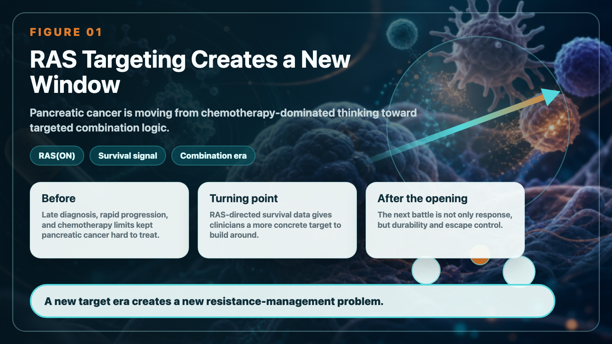
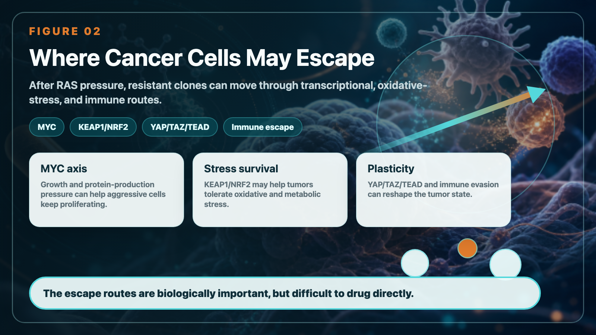
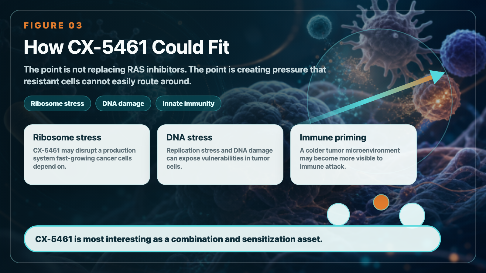

# RAS Targeting Opens a New Pancreatic-Cancer Window: How Senhwa's CX-5461 Positions for the Next Resistance-Management War

#RAS Target opens a new situation in pancreatic cancer: Shenghuake CX-5461 is stuck in the next battle of "drug resistance management"

The treatment of pancreatic cancer is ushering in a long-awaited turning point.

For a long time, pancreatic cancer has been almost the most difficult obstacle to overcome among solid tumors: late diagnosis, rapid progression, limited chemotherapy options, and highly immunosuppressive tumor microenvironment have caused many drugs to fail repeatedly. But as RAS targeted therapy began to produce key data, this core driving signal that was considered “undruggable” in the past was finally truly uncovered.

Revolution Medicines' Daraxonrasib achieved a median overall survival of 13.2 months in patients with previously treated metastatic pancreatic ductal adenocarcinoma in the Phase 3 RASolute 302 trial, compared with 6.7 months in the control chemotherapy arm. For pancreatic cancer, this is no ordinary progression, but an important milestone.

Because more than 90% of pancreatic cancers are related to RAS signal driving. When RAS(ON) inhibitors produce survival data in phase III clinical trials, it means that pancreatic cancer has officially shifted from being dominated by chemotherapy to the era of true RAS targeted therapy.

But new problems also arise.

> RAS inhibitors are not an endpoint. The real next war is drug resistance.

## 01｜After RAS is suppressed, where will the cancer cells escape?

Whether it is the traditional RAS-off inhibitory strategy or the RAS-on inhibitors that have attracted the most attention in recent years, they essentially suppress the RAS driving signals of cancer cells. But the most difficult thing about pancreatic cancer is that it not only grows, but also escapes.

When the main signal RAS is turned off, cancer cells may find a way out again through other pathways:

- MYC activation.
- KEAP1/NRF2 antioxidant stress pathway.
- YAP/TAZ/TEAD transcriptional regulatory pathway.
- Remodeling of tumor microenvironment.
-Immune to escape.

These paths have one thing in common: they are important, but difficult to cure.

MYC has long been regarded as the core driver factor in cancer that is the most difficult to directly target; YAP/TAZ/TEAD is involved in tumor plasticity and transcriptional reprogramming; KEAP1/NRF2 is related to the survival ability of cancer cells in the face of oxidative stress and metabolic stress.

Therefore, after the success of RAS inhibitors, what we really need to ask in clinical practice is not just "whether RAS drugs are effective", but: where will cancer cells escape after being inhibited by RAS? Is there any way we can block these escape routes in advance?

This is where the positioning of Biotech CX-5461 (Pidnarulex) starts to get interesting.

## 02｜CX-5461: Not replacing RAS inhibitors, but adding to the resistance puzzle

CX-5461 is not a RAS inhibitor.

Its real value is not to replace RAS-targeted drugs such as Daraxonrasib, but to have the opportunity to become a joint treatment partner in the era of RAS-targeted drugs. CX-5461 was first recognized because it inhibits ribosomal RNA synthesis, which cancer cells are highly dependent on. In order for cancer cells to proliferate rapidly, they need to produce a large amount of protein; and ribosomes are like protein factories in cells. CX-5461 stresses this factory, further interfering with cancer cell survival.

But there's more to its story. Research and company disclosures show that CX-5461 may also induce DNA damage and replication stress, and activate innate immune signals, making cold tumors with originally low immune responses more likely to be recognized by the immune system. In vernacular terms, CX-5461 may do three things at the same time:

- Subject cancer cells to ribosome production stress.
- Exposing cancer cells to DNA damage and replication stress.
- Make it easier for the tumor microenvironment to initiate an immune response.

This is also the core logic behind its combined use with the PD-1 inhibitor Tislelizumab.

If RAS inhibitors are like shutting down the main engine of pancreatic cancer, then the idea of ​​CX-5461 is to make the remaining cancer cells face multiple pressures at the same time and improve the immune system's chance of clearing the cancer cells.

## 03｜Changing the tumor from cold to hot is the key to immunotherapy of pancreatic cancer

Pancreatic cancer has long been regarded as a typical "cold tumor".

The so-called cold tumors mean that it is difficult for immune cells to enter, the tumor antigens are insufficiently presented, and the immune system cannot easily identify cancer cells. Therefore, when PD-1 inhibitors are used alone in pancreatic cancer, it is often difficult to achieve the same effect as melanoma or lung cancer.

Therefore, the key to pancreatic cancer immunotherapy is not just "whether there is PD-1", but whether the immune system can see the cancer cells first.

Biopharmaceuticals’ current strategy is to combine CX-5461 with Tislelizumab to evaluate a variety of advanced or metastatic solid tumors, including pancreatic cancer, colorectal cancer, and melanoma. The industrial significance of this design is that it does not simply add an anti-cancer drug, but attempts to push cold tumors with originally low immune responses into a state that is more susceptible to immune attack.

In other words, the role of CX-5461 can be more accurately understood as: a potential immune sensitization and drug resistance management tool after the era of RAS targeting.

## 04｜Multiple pathways of pressure create a higher threshold for drug resistance

The key points raised this time are actually very critical.

RAS inhibitor resistance does not follow a single path. These nodes, MYC, KEAP1/NRF2, YAP/TAZ/TEAD, may all become the escape direction of cancer cells. The biggest trouble in these directions is that it is difficult to directly develop them into medicines. The potential value of CX-5461 lies in that it does not target a single drug resistance node, but uses multiple pressures to make it more difficult for cancer cells to easily circumvent and survive. Instead of just hitting a button, it applies to cancer cells simultaneously:

- Ribosome stress.
- DNA damage stress.
- Immune activation stress.

If these mechanisms can be proven clinically to translate into actual disease control in the future, CX-5461 has the opportunity to become a combination therapy candidate to raise the resistance threshold in the era of RAS inhibitors.

To be precise here: it cannot be said that CX-5461 has solved RAS resistance at this time. However, it can be said that the multiple mechanisms of CX-5461 give it the clinical potential to explore drug resistance management and immune sensitization in patients who are KRAS-positive and have poor response after treatment or RAS inhibition.

This is where it is most worthy of market tracking.

## 05｜FDA agrees to accept the design, the significance is to "enter the real drug resistance scenario"

One of the important designs in the current PD-1 combination plan of Shenghuake and Tislelizumab is to allow the inclusion of KRAS-positive patient groups who have received or participated in relevant clinical trial treatments. This design has also been approved by the US FDA for implementation.

Pay special attention here.

> What the FDA agrees with is the clinical trial design and acceptance conditions, but it does not mean that the efficacy has been proven.

But it still makes sense. Because it allows CX-5461 to not only theoretically discuss drug resistance after RAS inhibition, but also has the opportunity to truly enter the KRAS-positive, treated patients, a group closer to future clinical needs for verification. What the market will look at next is not how beautiful the mechanism is, but:

- Is security controllable?
- Is there any synergistic signal when used together with PD-1?
- Whether cold tumors actually become more immunologically active.
- Whether KRAS-positive patients show signs of disease control or long-term survival.
- Whether biomarkers can be identified to screen patients most likely to benefit.

These data will determine whether CX-5461 can truly transform from a drug story in Taiwan to an international combination treatment asset for difficult-to-treat solid tumors.

## 06｜Not only pancreatic cancer, HRD and PARP resistance are also another value line

In addition to pancreatic cancer and RAS drug resistance, CX-5461 also has another value line worth tracking in the field of HRD, that is, homologous recombination deficient tumors.

CX-5461 has a history of disease control in patients with BRCA-mutated advanced ovarian cancer who have received PARP inhibitors. This means that it may not only be applicable to RAS-driven tumors, but may also find differential localization in cancers with DNA repair defects, PARP resistance, or high reliance on replication stress.

This is important. Because the value of CX-5461 should not be tied to a single pancreatic cancer story. A more complete positioning should be: a multi-mechanism anti-cancer drug candidate that can exert ribosome pressure, DNA damage pressure and immune activation pressure on cancer cells. Pancreatic cancer is an important scenario for combination therapy in the era of RAS targeting. HRD tumors are another potential scenario in the field of DNA damage and PARP resistance.

## 07｜Three nodes that Sheng Huake really needs to look at

For investors, Shenghuake is not simply a "pancreatic cancer subject", nor is it a pure "RAS subject". What really matters is the three clinical nodes.

- First, whether the CX-5461 + Tislelizumab trial can be successfully launched and accepted. This is the critical first step for Shenghuake to move from a single-drug mechanism to immune combination therapy.
- Second, whether immune sensitization and disease control signals can be seen in KRAS-positive treated patients. This will determine whether CX-5461 can truly block the post-RAS inhibitor era.
- Third, whether a biomarker strategy can be established that can be understood by international pharmaceutical companies. MYC, KRAS, DNA damage response, immune infiltration, PD-L1, and STING pathway activation may all become important languages ​​for the precise development of CX-5461 in the future.

If these data are gradually established, the story of CX-5461 is not just a single breakthrough for a Taiwanese drug company, but has the opportunity to become a differentiated asset in the international combination treatment of difficult-to-treat solid tumors.

## Conclusion｜RAS inhibitors open the door, CX-5461 wants to defend the next drug resistance barrier

The success of Daraxonrasib means that pancreatic cancer treatment has officially entered the era of RAS targeting.

But the RAS target won't be the end.

When the RAS signal is suppressed, cancer cells move to MYC, KEAP1/NRF2, YAP/TAZ/TEAD and immune escape pathways, which is almost the next battle.

The value of CX-5461 lies in the fact that it does not target a single drug resistance node, but uses ribosome pressure, DNA damage pressure and innate immune activation to try to push cancer cells into a state where it is more difficult to escape and easier to be recognized by the immune system.

If RAS inhibitors are the first card for precision treatment of pancreatic cancer, then the combination of CX-5461 and PD-1 inhibitors may be an important candidate strategy for drug resistance management and immune sensitization in the next stage. Of course, all this still needs to be verified with clinical data. What really matters is not how beautiful the mechanism of CX-5461 is, but whether it can produce reproducible safety, immune activation and disease control signals in patients who are KRAS-positive, treated or have poor response to RAS inhibition.

This is the most worthy of market tracking of Shenghuake CX-5461.

----------

Reference materials: official websites and public information of each company.

This article is for industrial research and knowledge sharing only and does not constitute investment, medical, fund-raising or individual stock advice.
