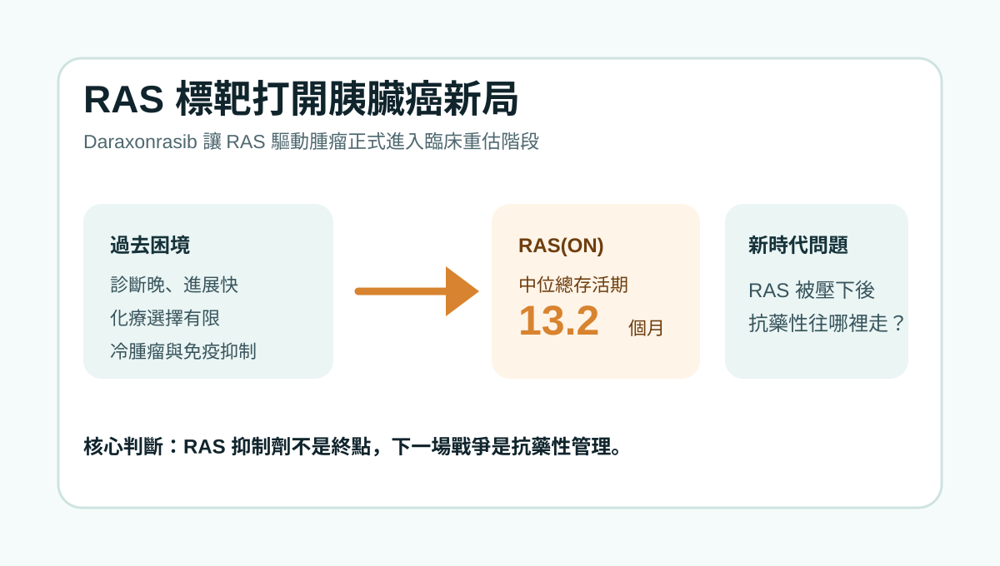
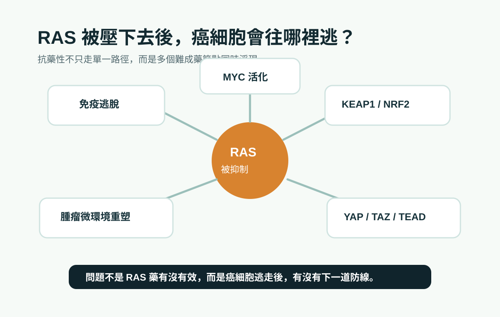
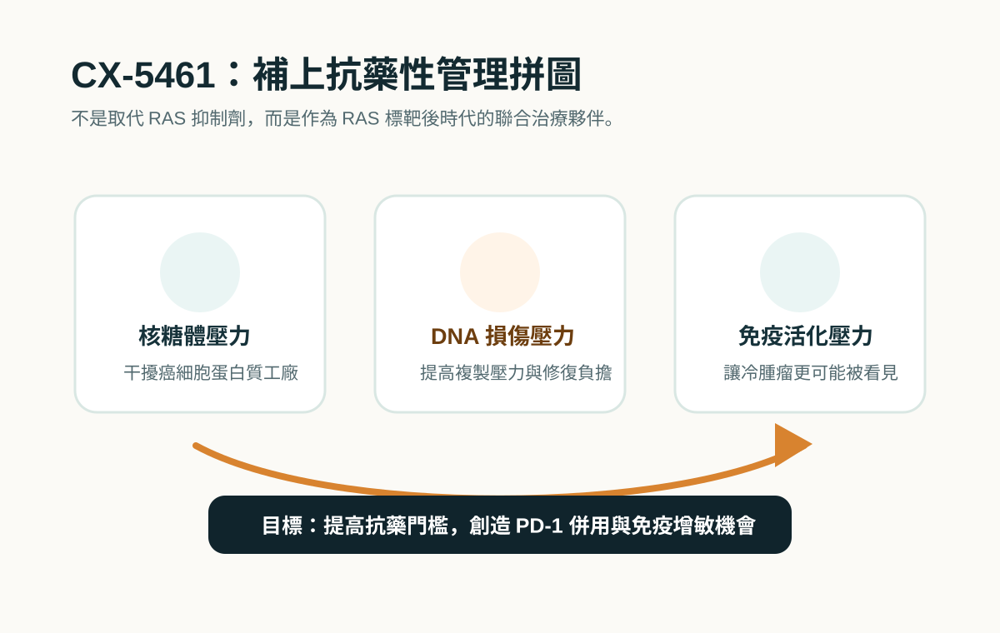

# RAS 標靶打開胰臟癌新局：生華科 CX-5461 卡位下一場「抗藥性管理」戰

胰臟癌治療，正在迎來一個久違的轉折。

長久以來，胰臟癌幾乎是實體瘤中最難攻克的高牆：診斷晚、進展快、化療選擇有限，腫瘤微環境又高度免疫抑制，讓許多新藥一再折戟。但隨著 RAS 標靶治療開始跑出關鍵數據，這個過去被視為「不可成藥」的核心驅動訊號，終於被真正撬開。

Revolution Medicines 的 Daraxonrasib 在 RASolute 302 三期試驗中，讓既往接受治療的轉移性胰臟導管腺癌患者，中位總存活期達 13.2 個月，對照化療組為 6.7 個月。對胰臟癌來說，這不是普通進展，而是一個重要里程碑。

因為胰臟癌中，超過九成與 RAS 訊號驅動有關。當 RAS(ON) 抑制劑在三期臨床拿出存活期資料，代表胰臟癌正式從化療主導，走向真正的 RAS 標靶治療時代。

但新的問題也隨之而來。

> RAS 抑制劑不是終點。真正的下一場戰爭，是抗藥性。

## 01｜RAS 被壓下去後，癌細胞會往哪裡逃？

不論是傳統偏 RAS-off 的抑制策略，或是近年最受矚目的 RAS-on 抑制劑，本質上都是在壓制癌細胞的 RAS 驅動訊號。但胰臟癌最難纏的地方，就是它不只會長，還很會逃。

當 RAS 這條主訊號被關掉後，癌細胞可能透過其他路徑重新找到生路：

- MYC 活化。
- KEAP1 / NRF2 抗氧化壓力路徑。
- YAP / TAZ / TEAD 轉錄調控路徑。
- 腫瘤微環境重塑。
- 免疫逃脫。

這些路徑有一個共同特色：重要，但難成藥。

MYC 長期被視為癌症裡最難直接標靶的核心驅動因子；YAP / TAZ / TEAD 牽涉腫瘤可塑性與轉錄重編程；KEAP1 / NRF2 則與癌細胞面對氧化壓力、代謝壓力時的存活能力有關。

所以，RAS 抑制劑成功之後，臨床上真正要問的，不只是「RAS 藥有沒有效」，而是：癌細胞被 RAS 抑制後，會往哪裡逃？我們有沒有辦法提前堵住這些逃生路線？

這正是生華科 CX-5461（Pidnarulex） 的定位開始變得有意思的地方。

## 02｜CX-5461：不是取代 RAS 抑制劑，而是補上抗藥性拼圖

CX-5461 不是 RAS 抑制劑。

它真正的價值，不是取代 Daraxonrasib 這類 RAS 標靶藥，而是有機會成為 RAS 標靶時代後的聯合治療夥伴。CX-5461 最早被認識，是因為它能抑制癌細胞高度依賴的核糖體 RNA 合成。癌細胞要快速增殖，就需要大量製造蛋白質；而核糖體就像細胞裡的蛋白質工廠。CX-5461 對這個工廠施加壓力，進一步干擾癌細胞生存。

但它的故事不只如此。研究與公司公開資料顯示，CX-5461 也可能誘發 DNA 損傷與複製壓力，並活化先天免疫訊號，使原本免疫反應低落的冷腫瘤，更有機會被免疫系統辨識。白話講，CX-5461 可能同時做三件事：

- 讓癌細胞承受核糖體生成壓力。
- 讓癌細胞面對 DNA 損傷與複製壓力。
- 讓腫瘤微環境更容易啟動免疫反應。

這也是它和 PD-1 抑制劑 Tislelizumab 併用的核心邏輯。

如果 RAS 抑制劑像是關掉胰臟癌的主引擎，那 CX-5461 的想像，就是讓殘存癌細胞同時面對多重壓力，並提高免疫系統清除癌細胞的機會。

## 03｜從冷腫瘤變熱，才是胰臟癌免疫治療的關鍵

胰臟癌長期被視為典型的「冷腫瘤」。

所謂冷腫瘤，就是免疫細胞不容易進入，腫瘤抗原呈現不足，免疫系統不容易辨識癌細胞。因此，PD-1 抑制劑在胰臟癌單用時，往往很難打出像黑色素瘤或肺癌那樣的效果。

所以胰臟癌免疫治療的關鍵，不是只有「有沒有 PD-1」，而是能不能讓免疫系統先看見癌細胞。

生華科目前推進的策略，是將 CX-5461 與 Tislelizumab 併用，評估多種晚期或轉移性實體瘤，包括胰臟癌、大腸直腸癌與黑色素瘤。這個設計的產業意義，在於它不是單純再加一個抗癌藥，而是嘗試把原本免疫反應低落的冷腫瘤，推向更容易被免疫攻擊的狀態。

換句話說，CX-5461 的角色，可以更精準地理解為：RAS 標靶時代後，潛在的免疫增敏與抗藥性管理工具。

## 04｜多路徑施壓，創造更高抗藥門檻

這次提出的重點，其實很關鍵。

RAS 抑制劑抗藥性不會只走單一路徑。MYC、KEAP1 / NRF2、YAP / TAZ / TEAD 這些節點，都可能成為癌細胞逃逸的方向。而這些方向最大的麻煩，就是難以直接成藥。CX-5461 的潛在價值，正在於它不是只押單一抗藥節點，而是透過多重壓力，讓癌細胞更難輕易繞路生存。它不是只打一個按鈕，而是同時對癌細胞施加：

- 核糖體壓力。
- DNA 損傷壓力。
- 免疫活化壓力。

如果未來臨床能證明這些機制能轉化為實際疾病控制，CX-5461 就有機會成為 RAS 抑制劑時代中，提高抗藥門檻的聯合治療候選方案。

這裡要講得精準一點：目前不能說 CX-5461 已經解決 RAS 抗藥性。但可以說，CX-5461 的多重機制，使它具備在 KRAS 陽性、經治或 RAS 抑制後反應不佳患者中，探索抗藥性管理與免疫增敏的臨床潛力。

這就是它最值得市場追蹤的地方。

## 05｜FDA 同意收案設計，意義在於「進入真實抗藥性場景」

目前生華科與 Tislelizumab 的 PD-1 併用計畫中，重要設計之一，是允許納入 KRAS 陽性且曾接受或參與過相關臨床試驗治療的患者族群。這項設計也已獲美國 FDA 同意執行。

這裡要特別注意。

> FDA 同意的，是臨床試驗設計與收案條件，不是代表療效已經被證明。

但這仍然有意義。因為它讓 CX-5461 不只是停留在理論上討論 RAS 抑制後抗藥性，而是有機會真正進入 KRAS 陽性、經治患者這種更貼近未來臨床需求的族群中驗證。接下來市場會看的，不是機制講得多漂亮，而是：

- 安全性是否可控。
- 和 PD-1 併用是否有協同訊號。
- 冷腫瘤是否真的變得更有免疫活性。
- KRAS 陽性患者是否出現疾病控制或長期存活訊號。
- 是否能找出生物標記來篩選最可能受益的患者。

這些資料，才會決定 CX-5461 能否真正從台灣新藥故事，走向國際難治實體瘤聯合治療資產。

## 06｜不只胰臟癌，HRD 與 PARP 抗藥也是另一條價值線

除了胰臟癌與 RAS 抗藥性，CX-5461 在 HRD，也就是同源重組缺陷腫瘤領域，也有另一條值得追蹤的價值線。

在 BRCA 突變、且曾接受 PARP 抑制劑治療後的晚期卵巢癌患者中，CX-5461 過去已有疾病控制訊號。這代表它可能不只適用於 RAS 驅動腫瘤，也可能在 DNA 修復缺陷、PARP 抗藥或高度依賴複製壓力的癌症中，找到差異化定位。

這點很重要。因為 CX-5461 的價值不該只被綁在單一胰臟癌故事上。更完整的定位應該是：一個能對癌細胞施加核糖體壓力、DNA 損傷壓力與免疫活化壓力的多機制抗癌候選藥。胰臟癌，是它切入 RAS 標靶時代後聯合治療的重要場景。HRD 腫瘤，則是它在 DNA 損傷與 PARP 抗藥領域的另一個潛在場景。

## 07｜生華科真正要看的三個節點

對投資人來說，生華科不是單純「胰臟癌題材」，也不是單純「RAS 題材」。真正要看的，是三個臨床節點。

- 第一，CX-5461 + Tislelizumab 試驗能否順利啟動並收案。這是生華科從單藥機制，走向免疫聯合治療的關鍵第一步。
- 第二，KRAS 陽性經治患者中，能否看到免疫增敏與疾病控制訊號。這會決定 CX-5461 能不能真正卡位 RAS 抑制劑後時代。
- 第三，能不能建立可被國際藥廠理解的生物標記策略。MYC、KRAS、DNA 損傷反應、免疫浸潤、PD-L1、STING 路徑活化，未來都可能成為 CX-5461 精準開發的重要語言。

如果這些資料逐步成立，CX-5461 的故事就不只是台灣新藥公司的單點突破，而是有機會成為國際難治實體瘤聯合治療中的差異化資產。

## 結語｜RAS 抑制劑打開門，CX-5461 想守住下一道抗藥性關卡

Daraxonrasib 的成功，代表胰臟癌治療正式進入 RAS 標靶時代。

但 RAS 標靶不會是終點。

當 RAS 訊號被壓下去後，癌細胞往 MYC、KEAP1 / NRF2、YAP / TAZ / TEAD 與免疫逃脫路徑轉移，幾乎會是下一場戰爭。

生華科 CX-5461 的價值，就在於它不是只押單一抗藥節點，而是透過核糖體壓力、DNA 損傷壓力與先天免疫活化，嘗試把癌細胞推向更難逃脫、也更容易被免疫系統辨識的狀態。

如果 RAS 抑制劑是胰臟癌精準治療的第一張牌，那 CX-5461 與 PD-1 抑制劑的組合，則可能是下一階段抗藥性管理與免疫增敏的重要候選策略。當然，這一切仍需要臨床數據驗證。真正要看的，不是 CX-5461 的機制有多漂亮，而是它能不能在 KRAS 陽性、經治或 RAS 抑制後反應不佳的患者中，拿出可重複的安全性、免疫活化與疾病控制訊號。

這才是生華科 CX-5461 接下來最值得市場追蹤的地方。

------------

參考資料：各公司官網與公開資料。

本文僅供產業研究與知識分享，不構成投資、醫療、募資或個股建議。
