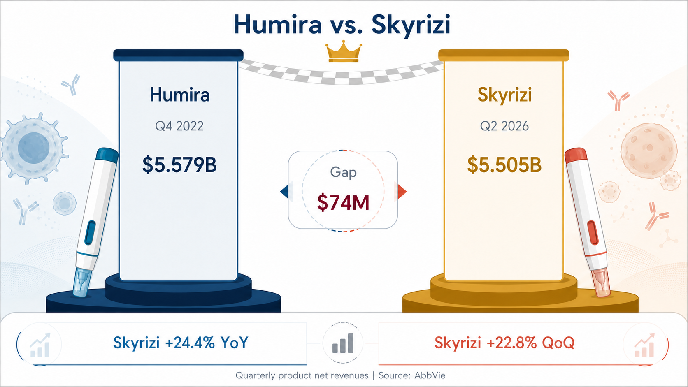
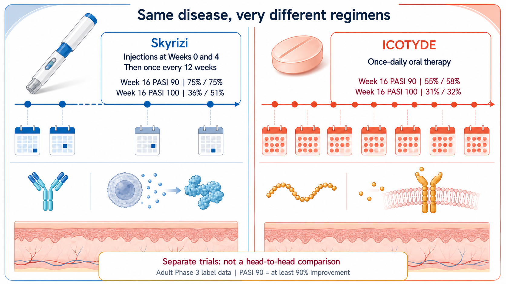
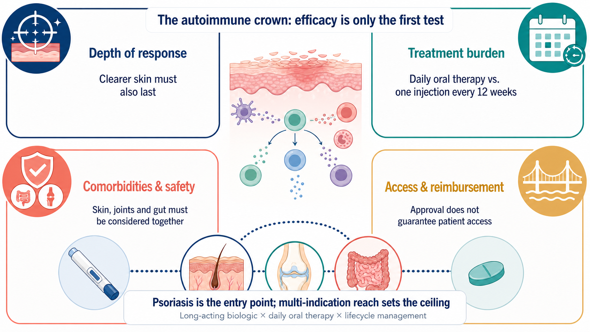

# Just $74 Million Short: Can Skyrizi Succeed Humira as the Autoimmune Drug King?

Humira spent years at the summit of global prescription-drug sales. Its patent cliff has only just arrived, yet AbbVie's Skyrizi is already closing in on the quarterly record Humira itself left behind.

Skyrizi generated $5.505 billion in the second quarter of 2026, up 24.4% year over year. Humira's quarterly peak was $5.579 billion in the fourth quarter of 2022.

The gap is only $74 million.

The jump is not a one-quarter anomaly. Skyrizi generated $4.483 billion in the first quarter and grew another 22.8% sequentially in the second. If that momentum holds, the Humira record that has stood for four years could soon be broken by another AbbVie product.

One boundary needs to be clear from the start. The $5.505 billion includes Skyrizi revenue across psoriasis, psoriatic arthritis, Crohn's disease, ulcerative colitis and its other approved uses. AbbVie does not disclose psoriasis revenue separately, so the entire figure cannot be attributed to plaque psoriasis.

That is precisely why the number matters. Skyrizi has grown from a psoriasis launch into AbbVie's next immunology platform. In the race to become the next autoimmune drug king, an efficacy table is only the first test.

## 01 | Humira is declining, and AbbVie has built another $5.5 billion product

Humira generated $21.237 billion in full-year 2022 revenue, including $5.579 billion in the fourth quarter. Sales then declined rapidly after U.S. exclusivity ended and biosimilar competition entered the market.

Every blockbuster eventually declines. The danger is when the successor has not matured in time.

AbbVie's answer is now visible in the numbers. In the second quarter of 2026, Skyrizi generated $5.505 billion and Rinvoq generated $2.525 billion. Together they produced $8.030 billion, or 47.3% of AbbVie's $16.990 billion in quarterly revenue.

The Humira cliff is no longer an existential threat to the company.

But a new issue is forming at the same time. Skyrizi alone accounted for about 32.4% of AbbVie's second-quarter revenue. The company has reduced its dependence on Humira, only to begin concentrating revenue in a new flagship product.

That is the dual nature of an autoimmune drug king. It can rescue a company's growth trajectory while also redefining the company's risk.

## 02 | Why can psoriasis support a megablockbuster?

Psoriasis extends far beyond plaques and scaling on the skin. It is a chronic immune-mediated disease that can recur over a lifetime and may coexist with joint, metabolic and cardiovascular disease.

A study based on the U.S. National Health and Nutrition Examination Survey estimated that psoriasis affects about 3.0% of adults aged 20 or older in the United States, equivalent to roughly 7.55 million people.

A large patient population, a long disease course and the need for sustained control create an enormous long-term treatment market. That does not mean every new drug automatically captures the opportunity.

Psoriasis already has mature TNF, IL-17 and IL-23 treatment pathways. As choices expand, a product cannot stop at being effective. It has to help more patients achieve deeper skin clearance, sustain that response and reduce the burden of long-term treatment.

That is where Skyrizi established its position.

## 03 | Skyrizi's core advantage: deep clearance with a lower treatment burden

Skyrizi is an IL-23-targeting biologic. Under the U.S. FDA label, patients with moderate-to-severe plaque psoriasis receive subcutaneous injections at Week 0 and Week 4, followed by one injection every 12 weeks.

After the two initiation doses, that usually means only four maintenance injections a year.

This is not a regimen that begins monthly and is later stretched to quarterly dosing once the disease is controlled. The 12-week maintenance interval is built into the approved label rather than improvised after improvement.

The efficacy bar is also high. In the two adult Phase 3 plaque-psoriasis trials reported in the FDA label, 75% of patients in each study achieved PASI 90 at Week 16, meaning at least a 90% improvement in skin lesions. PASI 100, or complete skin clearance, was achieved by 36% and 51% of patients, respectively.

With approvals extending to psoriatic arthritis, Crohn's disease and ulcerative colitis, Skyrizi is no longer positioned as just a psoriasis injection. One brand now spans inflammation in the skin, joints and gastrointestinal tract.

That distinction is central to the commercial story. Psoriasis opened the first door with physicians and patients. Multiple indications raised the ceiling.

## 04 | An oral drug has arrived. Does that mean the injectable loses?

In March 2026, the FDA approved Johnson & Johnson's ICOTYDE, or icotrokinra, a once-daily oral peptide that targets the IL-23 receptor.

It addresses an intuitive patient need. Many people dislike injections, and swallowing a pill can feel easier.

But oral administration is not an automatic victory.

In the two adult Phase 3 trials in the ICOTYDE label, 55% and 58% of patients achieved PASI 90 at Week 16, while 31% and 32% achieved PASI 100. In the two Skyrizi label trials cited above, PASI 90 was 75% in both studies, while PASI 100 was 36% and 51%.

Those figures can provide a sense of scale, but they cannot determine a winner. The products were not compared in the same head-to-head trial. Patient populations, trial designs and statistical methods differed.

Clinical decisions require several ledgers to be considered at once. Remembering a pill every day is one kind of treatment burden. One injection every 12 weeks can also be a form of convenience. Depth of response, safety, comorbidities, reimbursement, patient preference and physician experience ultimately shape the prescription.

Oral peptides therefore open a new part of the market, while long-acting biologics remain firmly in the race.

## 05 | The next competitive cycle is more complicated than injection versus pill

Psoriasis frequently coexists with other immune-mediated conditions. Whether a product can be used across specialties and indications can materially influence physician choice.

The FDA labels for some IL-17 inhibitors include warnings about new-onset or worsening inflammatory bowel disease and call for patients to be monitored. That does not mean every patient will experience the event, nor does it justify condemning an entire drug class. For patients with gastrointestinal comorbidities, the decision still depends on the individual product label and the patient's disease profile.

The IL-23 pathway has established approved indications in psoriasis and selected inflammatory bowel diseases, which supports Skyrizi's brand expansion. Skyrizi also carries label requirements related to infection risk and tuberculosis evaluation. No immunology drug can be judged only by its advantages while its risks are ignored.

AbbVie itself is not betting on a single formulation.

The company acquired Nimble Therapeutics in 2025 to obtain an oral IL-23 receptor peptide platform. In AbbVie's June 2026 pipeline presentation, the candidate ABBV-859 was listed as expected to enter Phase 1 in the third quarter of 2026.

In other words, the company now leading with a long-acting injectable is also preparing its own oral option.

That is the standard Big Pharma playbook: protect the current strength while acquiring the formulation that could change the rules.

## Conclusion | The next autoimmune drug king will be decided by the entire treatment experience

Skyrizi is only $74 million away from Humira's quarterly record.

Reducing the story to "psoriasis created another blockbuster" misses the larger signal. The more important question is how an immunology drug becomes a long-duration platform across diseases.

Skyrizi's success reflects several forces working together: deep skin clearance, maintenance dosing every 12 weeks, expansion across indications and AbbVie's commercialization capability. Chronic-disease markets do not reward a single attractive efficacy number forever. Efficacy, treatment burden, comorbidities, safety and access have to become a treatment experience that patients can remain on for the long term.

Oral peptides will bring new competition, while IL-17, IL-23 and other mechanisms continue to evolve. Whether Skyrizi ultimately succeeds Humira as the autoimmune drug king will depend on sustained growth, pricing and reimbursement, and the continued expansion of revenue across indications.

But in the second quarter of 2026, AbbVie had already accomplished the hardest part of the transition:

After Humira's decline, the company built a successor that has come within $74 million of its predecessor's quarterly record.

## References

1. [AbbVie second-quarter 2026 financial results](https://news.abbvie.com/2026-07-31-AbbVie-Reports-Second-Quarter-2026-Financial-Results)
2. [AbbVie first-quarter 2026 financial results](https://news.abbvie.com/2026-04-29-AbbVie-Reports-First-Quarter-2026-Financial-Results)
3. [AbbVie full-year and fourth-quarter 2022 financial results](https://investors.abbvie.com/news-releases/news-release-details/abbvie-reports-full-year-and-fourth-quarter-2022-financial)
4. [Skyrizi U.S. prescribing information](https://www.accessdata.fda.gov/drugsatfda_docs/label/2026/761105s044lbl.pdf)
5. [ICOTYDE U.S. prescribing information](https://www.accessdata.fda.gov/drugsatfda_docs/label/2026/220149Orig1s000lbl.pdf)
6. [Johnson & Johnson announcement of FDA approval for ICOTYDE](https://www.investor.jnj.com/investor-news/news-details/2026/FDA-approval-of-ICOTYDE-icotrokinra-ushers-in-new-era-for-first-line-systemic-treatment-of-plaque-psoriasis-with-a-targeted-oral-peptide/default.aspx)
7. [U.S. adult psoriasis prevalence study](https://pmc.ncbi.nlm.nih.gov/articles/PMC8246333/)
8. [Cosentyx U.S. prescribing information](https://www.accessdata.fda.gov/drugsatfda_docs/label/2026/125504s098lbl.pdf)
9. [AbbVie completes acquisition of Nimble Therapeutics](https://news.abbvie.com/2025-01-23-AbbVie-Completes-Acquisition-of-Nimble-Therapeutics)
10. [AbbVie June 2026 immunology pipeline presentation filed with the SEC](https://www.sec.gov/Archives/edgar/data/1551152/000110465926076067/tm2618365d1_ex99-2.htm)

Verification cutoff: August 11, 2026.

## Disclaimer

This article provides biotech-industry information and analysis based on public sources. It is not medical advice, a diagnosis, treatment guidance or investment advice. Results from different clinical trials should not be treated as direct comparative evidence. Treatment decisions should be made by qualified healthcare professionals based on each patient's condition and the applicable approved label.
