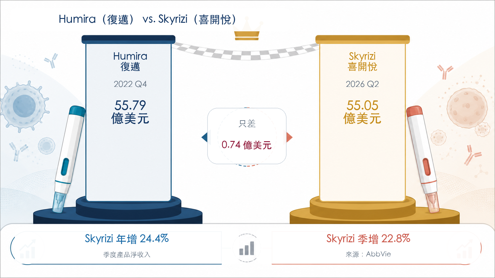
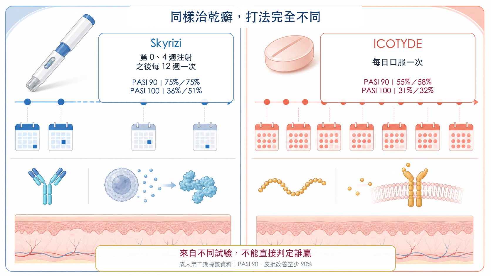
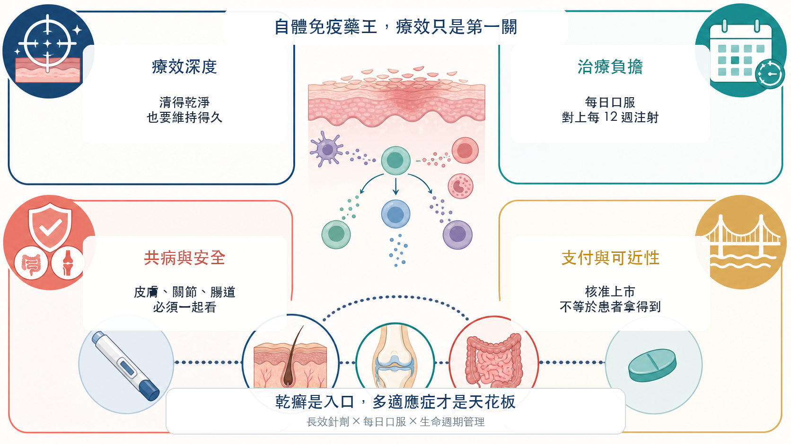

# 55 億美元只差一步：Skyrizi 要接棒 Humira 當自體免疫藥王？

Humira（復邁）曾連續多年站在全球處方藥銷售頂峰。它的專利懸崖剛落下，AbbVie 手中的 Skyrizi（喜開悅）已逼近 Humira 自己留下的單季紀錄。

2026 年第二季，Skyrizi 單季收入衝到 55.05 億美元，年增 24.4%。Humira 在 2022 年第四季寫下 55.79 億美元的單季高點。

兩者只差 7,400 萬美元。

單季跳升背後還有連續性。Skyrizi 第一季收入 44.83 億美元，第二季再成長 22.8%。若接下來維持目前動能，Humira 封存四年的單季紀錄，真的可能很快被自家後輩改寫。

但先把一條重要界線說清楚：這 55.05 億美元，是 Skyrizi 橫跨乾癬、乾癬性關節炎、克隆氏症與潰瘍性結腸炎等適應症的總收入；AbbVie 沒有拆出乾癬單項銷售，不能把整筆收入都算到銀屑病頭上。

這組數字的分量，在於 Skyrizi 已從乾癬新藥長成 AbbVie 的新免疫平台。自體免疫藥王的接力賽，療效表只是第一關。

## 01｜Humira 退場，AbbVie 又養出一個 55 億美元產品

Humira 在 2022 年全年收入達 212.37 億美元，第四季單季 55.79 億美元，之後隨美國專利獨占期結束、生物相似性藥品進場而快速下滑。

明星藥總會退場，危險往往出在接班人還沒長大。

艾伯維如今交出的答案很直接：2026 年第二季，Skyrizi 55.05 億美元、Rinvoq 25.25 億美元；兩者合計 80.30 億美元，占公司單季總收入 169.90 億美元的 47.3%。

Humira 的懸崖，已不再是攸關公司生死的危機。

不過，新問題也同時浮現。Skyrizi 一款藥就占 AbbVie 第二季收入約 32.4%。公司擺脫了對 Humira 的依賴，新的明星產品集中度也跟著成形。

自體免疫新藥王有兩面：它可以拯救一家公司的成長，也會重新決定整家公司的風險。

## 02｜乾癬為什麼能養出超級重磅藥？

乾癬的影響遠超過皮膚表面的紅斑與脫屑。它是一種慢性、免疫介導的疾病，常反覆發作，也可能合併關節、代謝與心血管問題。

一項以美國全國健康與營養調查為基礎的研究估計，美國 20 歲以上成人乾癬盛行率約 3.0%，相當於 755 萬人。

患者基數大、病程長、需要持續控制，自然形成巨大的長期治療市場。但這並不代表任何新藥都能吃到紅利。

乾癬治療已經有 TNF、IL-17、IL-23 等多條成熟路線。當選擇變多，產品不能只做到「有效」，還得讓更多患者清得更乾淨、維持得更久，同時降低長期治療的負擔。

Skyrizi 的起點正是這裡。

## 03｜它的王牌：清得乾淨，也把負擔壓低

Skyrizi 是針對 IL-23 的生物製劑。依美國 FDA 標籤，中重度斑塊型乾癬患者在第 0 週、第 4 週各接受一次皮下注射，之後每 12 週一次。

換句話說，完成起始劑量後，一年通常只需要四次維持注射。

這與「先每月一次，病情控制後再改每季一次」不同。每 12 週一次早已寫進標籤的維持療程，與病況改善後臨時拉長間隔無關。

療效也建立了很高的門檻。FDA 標籤中的兩項成人第三期試驗顯示，第 16 週達到 PASI 90、也就是皮損改善至少 90% 的比例，兩項試驗都是 75%；達到完全清除的 PASI 100，分別是 36% 與 51%。

加上乾癬性關節炎、克隆氏症與潰瘍性結腸炎，Skyrizi 已跨出「一支乾癬針」的定位，同一個品牌串起皮膚、關節與腸道發炎。

這點非常關鍵。乾癬替它打開醫師與患者的第一扇門，多適應症才把天花板往上推。

## 04｜口服新藥來了，針劑就一定輸嗎？

2026 年 3 月，美國 FDA 核准 Johnson & Johnson 的 ICOTYDE（icotrokinra），這是一款每天一次、鎖定 IL-23 受體的口服胜肽藥物。

它擊中了一個很直觀的需求：不少患者不喜歡打針，吞藥看起來更輕鬆。

但「口服」不等於自動勝出。

ICOTYDE 標籤中，兩項成人第三期試驗第 16 週的 PASI 90 分別為 55% 與 58%，PASI 100 為 31% 與 32%。Skyrizi 標籤中的兩項試驗，同期 PASI 90 都是 75%，PASI 100 為 36% 與 51%。

這些數字只能用來看大致量級，不能直接判定誰贏。兩者並非在同一場頭對頭試驗中比較，受試者組成、試驗設計與統計方法都不同。

臨床決策要同時算上多本帳。每天記得服藥，是一種負擔；每 12 週注射一次，也可能是一種便利。療效深度、安全性、共病、給付、患者偏好與醫師經驗，最後會一起決定處方。

所以，口服胜肽打開的是一塊新市場，長效生物製劑仍會留在賽場。

## 05｜下一輪競爭，會比「針劑對口服」更複雜

乾癬患者常伴隨其他免疫疾病，產品能否跨科別、跨適應症使用，會影響醫師選擇。

部分 IL-17 抑制劑的 FDA 標籤，列有新發或惡化發炎性腸道疾病的警示，要求治療時留意症狀；這不等於所有患者一定發生，也不能把整個藥物類別一概判死刑。對合併腸道疾病的患者而言，仍需依個別產品標籤與病況評估。

IL-23 路線則已在乾癬與部分發炎性腸道疾病建立核准適應症，讓 Skyrizi 的品牌延伸更有利。但它同樣有感染、結核病評估等標籤要求，沒有任何免疫藥能只談優點、不談風險。

更有意思的是，艾伯維自己也沒有押單邊。

它在 2025 年買下 Nimble Therapeutics，取得口服 IL-23 受體胜肽平台。AbbVie 2026 年 6 月的官方簡報把候選藥 ABBV-859 列為預計 2026 年第三季啟動第一期臨床。

也就是說，今天靠長效針劑領跑的艾伯維，也在準備自己的口服選項。

大藥廠的標準打法，就是守住現有強項，也提前買下可能改變規則的劑型。

## 結語｜下一個自體免疫藥王，比的是整套治療體驗

Skyrizi 距離 Humira 的單季紀錄，只差 7,400 萬美元。

把這個故事縮成「乾癬又養出一支大藥」，太可惜。更大的訊號是，一款免疫藥如何被做成跨病種的長期平台。

Skyrizi 的成功，是高皮膚清除率、每 12 週一次維持注射、多適應症擴張與 AbbVie 商業化能力疊在一起的結果。慢性病市場不會只為一個漂亮數字買單。療效、治療負擔、共病、安全與支付，必須整合成一套患者願意長期留在裡面的治療方案。

口服胜肽會帶來新競爭，IL-17、IL-23 與其他機制也會繼續迭代。Skyrizi 能不能接下 Humira 的自體免疫藥王位置，還要看成長能否延續、價格與給付是否守得住，以及多適應症收入能否繼續擴大。

但至少在 2026 年第二季，艾伯維已經把一件最難的事做成：

Humira 退場後，AbbVie 已經養出一個逼近其單季紀錄的接班人。

## 參考資料

1. [AbbVie 2026 年第二季財報](https://news.abbvie.com/2026-07-31-AbbVie-Reports-Second-Quarter-2026-Financial-Results)
2. [AbbVie 2026 年第一季財報](https://news.abbvie.com/2026-04-29-AbbVie-Reports-First-Quarter-2026-Financial-Results)
3. [AbbVie 2022 年第四季與全年財報](https://investors.abbvie.com/news-releases/news-release-details/abbvie-reports-full-year-and-fourth-quarter-2022-financial)
4. [Skyrizi 美國 FDA 核准標籤](https://www.accessdata.fda.gov/drugsatfda_docs/label/2026/761105s044lbl.pdf)
5. [ICOTYDE 美國 FDA 核准標籤](https://www.accessdata.fda.gov/drugsatfda_docs/label/2026/220149Orig1s000lbl.pdf)
6. [Johnson & Johnson ICOTYDE 核准公告](https://www.investor.jnj.com/investor-news/news-details/2026/FDA-approval-of-ICOTYDE-icotrokinra-ushers-in-new-era-for-first-line-systemic-treatment-of-plaque-psoriasis-with-a-targeted-oral-peptide/default.aspx)
7. [美國成人乾癬盛行率原始研究](https://pmc.ncbi.nlm.nih.gov/articles/PMC8246333/)
8. [Cosentyx 美國 FDA 核准標籤](https://www.accessdata.fda.gov/drugsatfda_docs/label/2026/125504s098lbl.pdf)
9. [AbbVie 完成收購 Nimble Therapeutics](https://news.abbvie.com/2025-01-23-AbbVie-Completes-Acquisition-of-Nimble-Therapeutics)
10. [AbbVie 2026 年 6 月免疫管線簡報（SEC 附件）](https://www.sec.gov/Archives/edgar/data/1551152/000110465926076067/tm2618365d1_ex99-2.htm)

查證截止日：2026 年 8 月 11 日。

## 免責聲明

本文為生技醫藥產業與公開資料整理，不構成醫療診斷、治療建議或投資建議。不同臨床試驗不可直接橫向判定療效優劣，實際用藥應由專業醫療團隊依患者病況與核准標籤評估。
