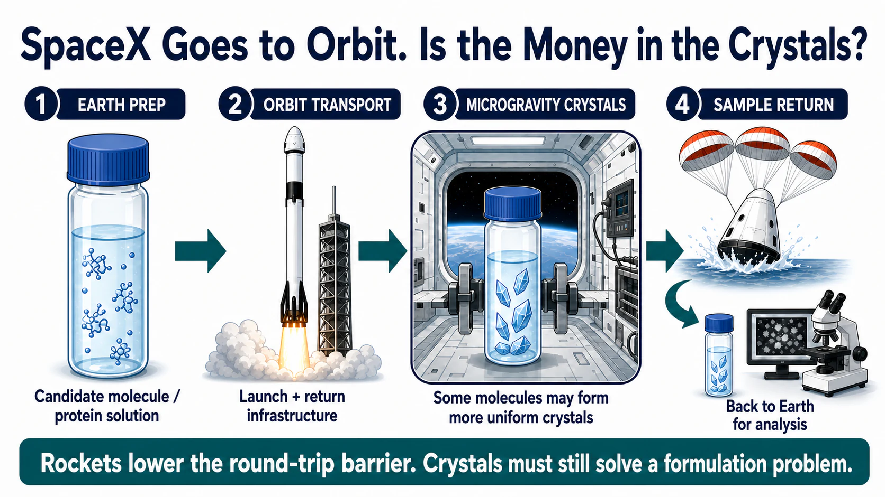
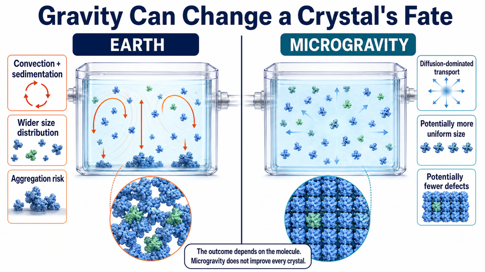
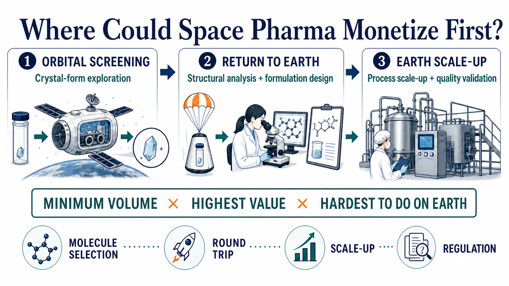
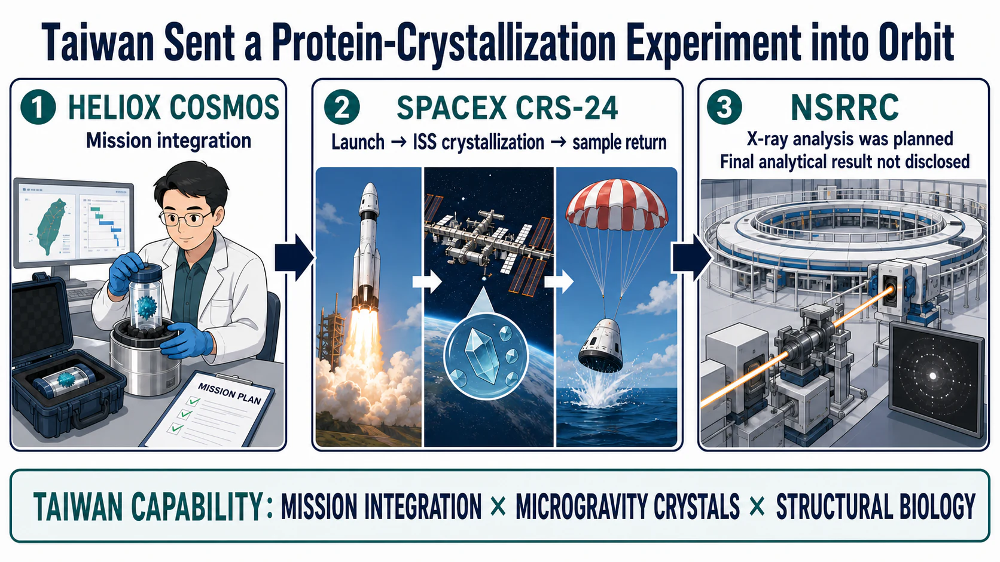

# SpaceX Goes to Orbit. Is the Money in the Crystals?

> Evidence cut-off: July 19, 2026. SpaceX supplies transportation to and from low Earth orbit; it does not develop medicines. The commercial question is whether a better crystal grown in microgravity can be converted into a repeatable, scalable, and regulator-ready process on Earth.

On June 17, 2026, a SpaceX Dragon spacecraft splashed down in the Pacific Ocean carrying biological, materials-science, and medical research samples. It was NASA's 34th SpaceX commercial resupply mission. Launching a payload, entering the International Space Station, completing an experiment, and returning the samples to Earth was beginning to look less like a one-off expedition and more like a scheduled route.

Three weeks later, Redwire's SpaceMD appointed two new advisers. Paul Reichert, a former Merck research leader, had worked on early crystallization research involving Keytruda. Niki Werkheiser, a former NASA executive, had managed more than $1.5 billion in technology investments.

Reichert understands crystals. Werkheiser understands how space technology moves beyond an experiment. The gap SpaceMD is trying to close is the one between “we can do it” and “a customer will pay to do it repeatedly.”

- SpaceX and Dragon provide a round trip: send an experiment up, then bring the result back down.
- Microgravity suppresses convection and sedimentation, allowing some proteins and small molecules to form more uniform crystals.
- Commercial success is still settled on Earth: how much better is the crystal, can the process be scaled, and is the improvement worth the cost of going to orbit?

Drugnews' view is that the first meaningful revenue in space-based pharmaceutical manufacturing is most likely to come from the smallest, highest-value, and hardest-to-reproduce step on Earth: solid-form screening, seed-crystal growth, and formulation-condition selection.

Rockets may drive down the cost per kilogram. A medicine still has to drive up the value per gram.

## 01 | SpaceX Is Turning Orbit into a Laboratory That Can Be Revisited

SpaceX's role in this value chain is clear: transportation to and from low Earth orbit.

NASA's commercial resupply program allows Dragon to deliver scientific hardware to the International Space Station and return samples that require analysis on Earth. For pharmaceutical research, coming back is as important as going up. If crystals, cells, or tissue samples cannot be recovered quickly, kept within their temperature requirements, and transferred to an analytical laboratory, an orbital result cannot readily enter the next development cycle.

Redwire's PIL-BOX grew out of this logistics system. It is a miniature crystallization platform that can be activated remotely on the International Space Station. A pharmaceutical customer loads a candidate molecule before launch, crystallization occurs after the device reaches the station, and the hardware returns to Earth aboard Dragon.

In a July 2026 corporate release, Redwire said that 54 PIL-BOX units had traveled to the International Space Station since the platform's first flight in November 2023 and that 45 compounds had been crystallized. The disclosed work included insulin and molecules associated with cancer, cardiovascular disease, obesity, and diabetes. These are company-reported figures, and they remain far removed from drug approval or commercial-scale production. What they do show is that one hardware platform can be used repeatedly. Space crystallization is moving from an exceptional mission that takes years to arrange toward a recurring experimental cycle. [[Redwire/SpaceMD](https://ir.rdw.com/news-events/press-releases/detail/235/former-merck-and-nasa-leaders-bring-strategic-expertise-to)]

That is the most practical pharmaceutical effect of the space activity associated with SpaceX. A rocket does not discover a drug. Reliable, recoverable transport can nevertheless turn the microgravity environment roughly 400 kilometers above Earth into a research tool that a company can book, test, fail with, and use again.

## 02 | Keytruda's Trip to Space Became a Lesson in Formulation Physics

Why might microgravity change a medicine? The answer lies in the invisible fluid motion around a growing crystal.

Liquids on Earth are affected by gravity, creating convection and sedimentation. As protein molecules move toward a crystal surface, the concentration field can be disturbed. A crystal may also settle to the bottom of a vessel before it has finished growing, collide with other crystals, aggregate, or develop a broad and defective size distribution.

In low Earth orbit, molecules move mainly through diffusion. With less bulk motion around them, crystals may assemble more steadily. The advantage is not universal. Some molecules form larger crystals, some show improvements only in defects or particle-size distribution, and some do not exhibit a difference large enough to matter for manufacturing.

Merck's pembrolizumab, the active ingredient in Keytruda, provides one of the clearest examples.

On February 19, 2017, researchers launched a pembrolizumab crystallization experiment aboard SpaceX CRS-10. The hardware operated in an incubator on the space station for 18 days and returned to Earth aboard Dragon on March 19. A 2019 paper in *npj Microgravity* reported that the ground controls produced two widely separated crystal-size populations, centered at approximately 13 and 102 micrometers. The microgravity group instead produced a single distribution with an average size of approximately 39 micrometers. At the same concentration, the viscosity of the space-grown crystal suspension was also approximately 2 cP lower, while binding activity after redissolution remained comparable with the reference material. [[npj Microgravity](https://www.nature.com/articles/s41526-019-0090-3)]

The researchers then brought two variables revealed by the space experiment back to Earth: sedimentation and temperature gradients. By combining slow rotation with temperature control, they produced a more uniform, injectable crystal suspension in a conventional laboratory.

The causal chain has to be described carefully. Crystals grown in orbit were not placed directly into a later commercial vial. In a January 2026 retrospective, NASA said the microgravity work provided early insight into particle size and structure relevant to a subcutaneous formulation. Keytruda Qlex, which the FDA approved in 2025, still went through formulation development, clinical comparison, and regulatory review. [[NASA](https://www.nasa.gov/missions/station/iss-research/space-station-research-informs-new-fda-approved-cancer-therapy/); [FDA](https://www.fda.gov/drugs/resources-information-approved-drugs/fda-approves-pembrolizumab-and-berahyaluronidase-alfa-pmph-subcutaneous-injection)]

Space does not complete a clinical-development program. At most, it may help certain molecules escape a physical constraint that is difficult to solve on Earth.

## 03 | One Orbit, Three Emerging Business Models

SpaceMD is selling access to seed crystals. It sends small quantities of a candidate molecule into orbit, grows seeds in microgravity, and then sells or licenses those seeds to a pharmaceutical company. New solid forms, formulations, and commercial manufacturing processes are developed back on Earth.

Varda Space Industries goes one step further. It builds uncrewed reentry capsules in which small molecules can be heated, cooled, and crystallized in orbit. As of July 2026, Varda's official mission page listed six reentry missions, W-1 through W-6.

W-1 processed ritonavir, an HIV medicine. In three vials containing approximately 150 milligrams each, researchers heated stable Form II and converted it to Form III, a more soluble polymorph that can also transform more readily into other crystal forms. A peer-reviewed paper published in 2026 reported that Form III could be recovered after orbital processing, a long flight, and atmospheric reentry. Chemical analysis did not identify unusual impurities attributable to the space environment. [[Varda mission platform](https://www.varda.com/platform); [npj Microgravity](https://www.nature.com/articles/s41526-026-00594-0)]

This result is best understood as a logistics and process qualification milestone. It shows that a high-value small molecule can be processed in orbit and returned in a condition that remains suitable for analysis.

The United Kingdom is investing in rules and infrastructure. In March 2026, the UK Space Agency and the Medicines and Healthcare products Regulatory Agency announced a support program for pharmaceutical manufacturing in space. It included regulatory guidance, case studies, a regulatory sandbox for atmospheric reentry, and supply-chain coordination. The government was also supporting BioOrbit's scale-up research in crystallizing biologic drugs in space, with the aim of enabling high-concentration formulations that might be more suitable for home administration.

By July 19, 2026, two additional policy milestones were visible. The MHRA said it expected to publish an end-to-end regulatory roadmap for in-orbit pharmaceutical manufacturing in autumn 2026. The UK Space Agency's 2025–2026 annual report, published on July 14, confirmed that feasibility-study contracts for BioOrbit, OrbiSky, and Space Forge had been awarded in February. These were regulatory preparations and feasibility studies. They did not mean that a medicine manufactured in space had received approval.

All three models still have to settle their accounts on Earth. Can the additional quality created in orbit support new intellectual property, a better route of administration, a more stable product, or a lower-cost terrestrial process? A pharmaceutical company's next purchase order will provide a more useful answer than a launch count.

## 04 | The Added Value from Orbit Must Pass Four Commercial Gates

Science-fiction imagery attracts attention. Pharmaceutical development still accepts only evidence.

### Gate One: Molecule selection

Microgravity is most likely to matter for a molecule with a defined solid-form problem, a high dose, poor solubility, high viscosity, or repeated failures in a terrestrial process. If a conventional process already crystallizes a molecule reliably, sending it into orbit adds an expensive travel bill without creating enough value.

### Gate Two: Transportation and timing

Samples must survive launch vibration, radiation, temperature changes, waiting time in orbit, and atmospheric reentry. Any delay can alter the crystallization conditions specified in the experimental design. The ritonavir work by Varda matters because it begins to turn “can the material come back intact?” into measurable process data.

### Gate Three: Scale-up on Earth

A small quantity of attractive crystals grown in space still has to enter a kilogram- or tonne-scale process. The most plausible model is for orbit to identify a solid form or grow a seed, while Earth handles commercial production. If every commercial batch has to make a round trip to orbit, only extremely high-value products in very small volumes can bear the cost.

### Gate Four: Pharmaceutical regulation

Regulators will ask about starting-material provenance, instrument calibration, process deviations, aseptic control, chain of custody, quality after reentry, and responsibility for the orbital step across the product life cycle. The UK's regulatory sandbox is intended to surface these questions before a company submits a formal application.

A high mission count only proves that the hardware is busy. More useful signals are whether the same pharmaceutical customer pays again, whether a recovered solid form can be licensed, and whether the terrestrial process can be scaled. If those three events occur, the next question is whether regulators will accept the orbital evidence in a marketing application.

## 05 | Taiwan Has Already Sent a Protein-Crystallization Experiment into Orbit

Taiwan has one concrete coordinate on this map.

In December 2021, Taiwan's National Synchrotron Radiation Research Center sent virus-like particles produced in *E. coli* to the International Space Station. Taiwan-based HelioX Cosmos and Japan's Space BD coordinated the mission, which flew aboard SpaceX CRS-24. The samples crystallized in microgravity and returned safely on January 24, 2022. [[Space BD](https://www.space-bd.com/dam/include-content/PUBLIC/en/news_archive/storage/news20220303-001/pdf/20220520en-4.pdf)]

Space BD's contemporaneous release was careful. It said that the returned material would undergo X-ray analysis to study the structure of the virus-like particles and possible mechanisms of infection. The available announcement did not disclose a final analytical result. This article therefore confirms only that the mission, orbital crystallization, and sample return were completed.

The mission still made two Taiwanese capabilities tangible. HelioX handled mission integration and international coordination. NSRRC operates protein-crystallography beamlines that can support subsequent X-ray diffraction and structural analysis. HelioX's website also lists microgravity life science and in-orbit services among its activities.

HelioX is not a listed company, so this development is better followed as an industrial capability than forced into a stock-market theme. If Taiwan wants to turn a single experiment into a business, three signals matter: repeated paid missions from pharmaceutical customers, a workflow that connects an orbital crystal to terrestrial drug design, and a repeatable service combining mission integration with crystal analysis.

Taiwan's strengths in structural biology, precision instrumentation, crystallography, and international project integration sit exactly where a space-returned sample needs help after landing.

## 06 | Around 2030, Orbital Laboratory Capacity Will Also Be Repriced

NASA currently plans to operate the International Space Station through 2030 while advancing commercial space-station programs intended to carry low Earth orbit research into the next phase. If the transition leaves a gap, microgravity experiments may face pressure on station volume, electrical power, astronaut time, and return schedules.

China is advancing a different model through a national research platform. In July 2025, the Shanghai Institute of Materia Medica sent a nucleic-acid lipid-nanocarrier experiment to China's space station. The stated objective was to study how microgravity affects the intracellular transport of nucleic-acid medicines. Subsequent official reporting said that dosing, microscopic imaging, and sample fixation had been completed in orbit and that the samples had been moved into low-temperature storage to await return. As of July 19, 2026, we had not found a complete formal paper or public result that supported a comparison of clinical efficacy.

In the future, a pharmaceutical customer will buy an entire service chain: reliable orbital capacity, standardized hardware, timely return, terrestrial analysis, and a regulatory pathway. Remove any one of those components, and a space mission becomes difficult to place inside an ordinary research-and-development budget.

This helps explain why SpaceMD recruited both a Merck crystallization scientist and a former NASA technology-investment executive. Microgravity science has existed for decades. What remains scarce is the ability to turn one successful experiment into a product that customers purchase repeatedly.

## Conclusion | The Next Formulation Answer May Take a Detour through Space

The most compelling feature of space-enabled pharmaceutical research is that it changes the environment around a familiar problem. A molecule repeatedly disturbed by gravity on Earth may reveal a different solid form, a different assembly pattern, or a different formulation path in orbit.

After an attractive crystal returns, it still has to pass three tests: repetition, scale-up, and regulation. Without all three, it remains an elegant experiment. The real endpoint is still a treatment that is more practical or more effective for a patient.

SpaceX is helping orbital round trips look more like a service with a schedule. Pharmaceutical developers now have to show how much billable scientific value each trip leaves behind.

The first things sent to orbit will not be tonnes of finished medicine. They will be a seed crystal, a small vial of candidate material, and a problem that has remained stuck on Earth.

## Primary Sources

1. [Redwire/SpaceMD](https://ir.rdw.com/news-events/press-releases/detail/235/former-merck-and-nasa-leaders-bring-strategic-expertise-to)
2. [NASA/SpaceX CRS-34](https://www.nasa.gov/missions/station/iss-research/nasas-spacex-crs-34-dragon-returns-packed-with-space-station-science/)
3. [NASA June 17, 2026 Dragon splashdown log](https://www.nasa.gov/blogs/spacestation/2026/06/17/spacex-dragon-splashes-down-in-pacific-completes-cargo-mission/)
4. [npj Microgravity: pembrolizumab crystallization in microgravity](https://www.nature.com/articles/s41526-019-0090-3)
5. [NASA: Space Station Research Informs New FDA-Approved Cancer Therapy](https://www.nasa.gov/missions/station/iss-research/space-station-research-informs-new-fda-approved-cancer-therapy/)
6. [FDA: Keytruda Qlex](https://www.fda.gov/drugs/resources-information-approved-drugs/fda-approves-pembrolizumab-and-berahyaluronidase-alfa-pmph-subcutaneous-injection)
7. [Varda Space Industries mission platform](https://www.varda.com/platform)
8. [npj Microgravity: Varda ritonavir Form III](https://www.nature.com/articles/s41526-026-00594-0)
9. [UK government: regulatory pathway for space-manufactured drugs](https://www.gov.uk/government/news/uk-sets-out-world-leading-pathway-for-space-manufactured-drugs)
10. [Space BD: NSRRC protein crystallization in space](https://www.space-bd.com/dam/include-content/PUBLIC/en/news_archive/storage/news20220303-001/pdf/20220520en-4.pdf)
11. [HelioX Cosmos](https://www.helioxcosmos.com/about/ABOUT-US/)
12. [Shanghai Institute of Materia Medica](https://simm.cas.cn/web/xwzx/kydt/202508/t20250801_7900455.html)
13. [Chinese Academy of Sciences/SIMM English release](https://english.simm.cas.cn/News/Headline/202508/t20250829_1051693.html)
14. [NASA: Commercial Space Stations](https://www.nasa.gov/humans-in-space/commercial-space/commercial-space-stations/)
15. [MHRA: The Next Frontier—unlocking in-orbit manufacturing of medicines](https://medregs.blog.gov.uk/2026/06/25/the-next-frontier-unlocking-in-orbit-manufacturing-of-medicines/)
16. [UK Space Agency Annual Report 2025–2026](https://www.gov.uk/government/publications/uk-space-agency-annual-report-and-accounts-2025-2026/uk-space-agency-annual-report-2025-2026)

## Disclaimer

This article is provided for biotechnology and pharmaceutical-industry information and research discussion only. It does not constitute medical advice, investment advice, a recommendation to buy or sell securities, or a guarantee of returns. Drug development, in-orbit processing, and commercialization remain highly uncertain. Readers should rely on official documents and regulatory records and make independent decisions consistent with their own risk tolerance.
