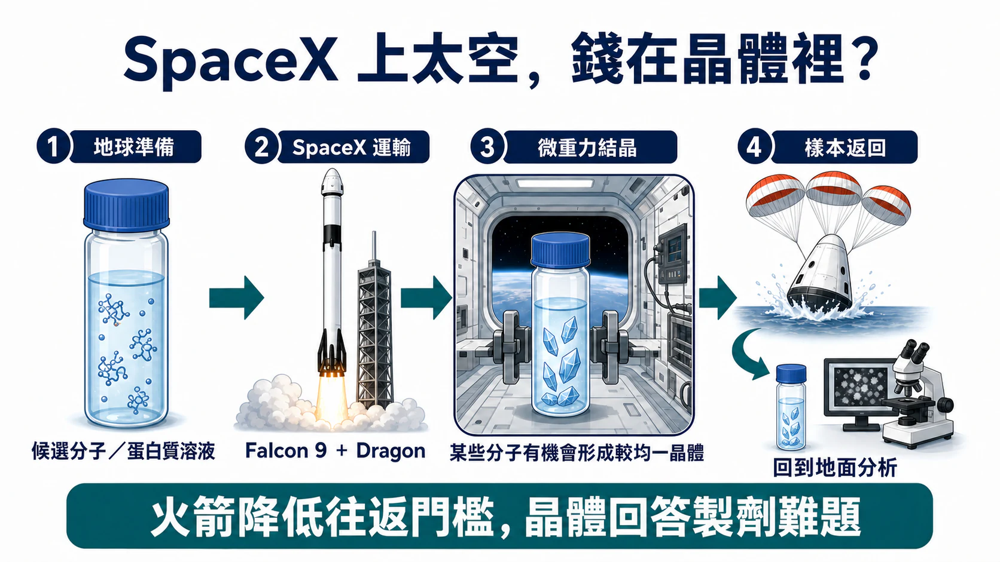
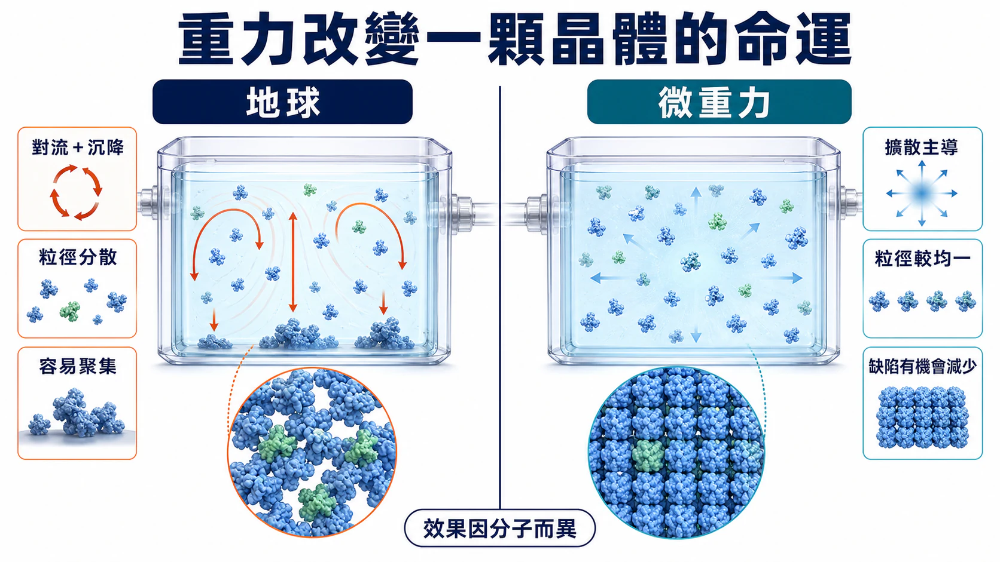
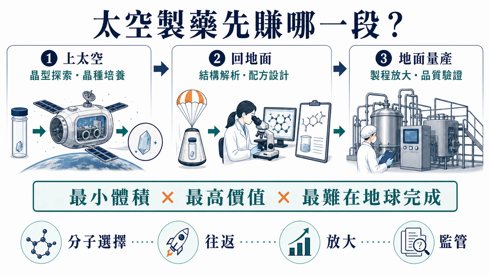
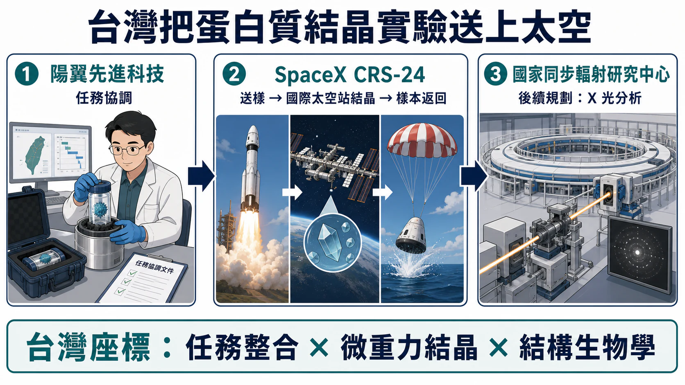

# SpaceX 上太空，錢在晶體裡？微重力製藥的第一桶金

> 查證截止：2026-07-19。SpaceX 提供的是往返低軌的交通，不是新藥研發；真正的商業考題，是微重力能否把更好的晶體轉化成可重複、可放大、可監管的地面製程。

2026 年 6 月 17 日，一艘 SpaceX Dragon 太空船濺落太平洋，帶回滿艙的生物、材料與醫學研究樣本。這是 NASA 第 34 次 SpaceX 商業補給任務。上太空、進入國際太空站、完成實驗、再把樣本送回地球，已經慢慢有了固定班次的樣子。

三週後，Redwire 旗下 SpaceMD 找來兩位新顧問：曾參與 Keytruda 早期結晶研究的 Merck 前研究主持人 Paul Reichert，以及曾管理逾 15 億美元技術投資的 NASA 前主管 Niki Werkheiser。

Reichert 懂晶體，Werkheiser 懂如何讓太空技術走出實驗。SpaceMD 要補的，正是從「做得出來」到「有人願意反覆買」之間那段路。

- SpaceX 與 Dragon 打通了「上去做實驗、下來看結果」的往返路線。

- 微重力讓對流與沉降安靜下來，某些蛋白質與小分子能長出更均一的晶體。

- 商業成敗仍要回到地面：晶體好多少、製程能否放大、改善值不值得支付太空成本。

藥時事團隊的判斷是，太空製藥的第一桶金，最可能落在體積最小、價值最高、最難在地球完成的那一步：晶型探索、晶種培養與製劑條件篩選。

火箭把每公斤成本往下壓，藥物還得把每一克價值往上推。

## 01｜SpaceX 把軌道變成可以反覆往返的實驗室

SpaceX 在這條產業鏈的位置很清楚：提供往返低地球軌道的交通。

NASA 的商業補給計畫讓 Dragon 可以把科學設備送進國際太空站，再把需要分析的樣本帶回地面。對製藥研究而言，「回得來」和「上得去」同樣重要。晶體、細胞與組織樣本若不能迅速回收、維持溫控並交給實驗室分析，太空中的結果就很難進入下一輪研發。

Redwire 的 PIL-BOX 正是在這套物流上長出來的產品。它是一組可在國際太空站遠端啟動的微型結晶設備，藥廠先把候選分子裝進去，設備到站後進行結晶，再跟著 Dragon 回到地球。

Redwire 2026 年 7 月的官方新聞稿稱，自 2023 年 11 月首飛以來，已有 54 套 PIL-BOX 前往國際太空站，完成 45 種化合物的結晶，合作範圍涵蓋胰島素，以及癌症、心血管疾病、肥胖與糖尿病相關分子。這些數字屬於公司披露，距離藥品核准與商業量產仍有很長一段路；它至少證明了一件事：太空結晶已能以同一套硬體反覆執行，從多年等一次的特殊任務走向固定迭代。［[Redwire／SpaceMD](https://ir.rdw.com/news-events/press-releases/detail/235/former-merck-and-nasa-leaders-bring-strategic-expertise-to)］

SpaceX 帶起的太空熱潮，對製藥業最實際的影響也在這裡。火箭本身不負責發現新藥，固定而可回收的運輸能力，卻把四百公里外的微重力變成一項可以預約、測試、失敗後再來一次的研發工具。

## 02｜Keytruda 的太空旅程，留下了一堂製劑物理課

微重力為什麼可能改變藥物？答案藏在一顆晶體成長時，看不見的水流裡。

地球上的液體受到重力影響，會產生對流與沉降。蛋白質分子朝晶體表面移動時，濃度分布容易被攪動；晶體也可能在尚未長好前沉到容器底部，彼此碰撞、聚集，最後留下大小不一或帶有缺陷的結構。

在低地球軌道，分子主要靠擴散移動。周圍安靜下來後，晶體有機會按照較穩定的節奏排列。這項優勢並不會平均落在所有分子上，有些實驗得到較大晶體，有些只改善缺陷或粒徑分布，也有分子看不出足以改變製程的差異。

Merck 的 pembrolizumab，也就是 Keytruda 的有效成分，提供了目前最容易理解的案例。

2017 年 2 月 19 日，研究團隊把 pembrolizumab 結晶實驗搭上 SpaceX CRS-10。設備在太空站的培養櫃中運作 18 天，3 月 19 日再隨 Dragon 返回地球。2019 年發表於《npj Microgravity》的結果顯示，地面對照組形成兩群大小差異很大的晶體，主要分布約在 13 與 102 微米；太空組則集中成平均約 39 微米的單一分布。相同濃度下，太空組晶體懸浮液的黏度也低了約 2 cP，溶解後的抗體結合活性仍與參考品相近。［[npj Microgravity](https://www.nature.com/articles/s41526-019-0090-3)］

研究團隊後來把太空實驗揭露的兩個關鍵變數帶回地面：沉降與溫度梯度。他們利用緩慢旋轉與溫控，在一般實驗室製作出更均一、可注射的晶體懸浮液。

這段因果關係要說得精準。太空長出的晶體沒有直接裝進後來的藥瓶。NASA 在 2026 年 1 月回顧時，用的是「提供早期洞見」：微重力研究幫助科學家理解適合皮下注射製劑的粒徑與結構。FDA 於 2025 年核准的 Keytruda Qlex，仍經過完整的製劑開發、臨床比較與監管審查。［[NASA 回顧](https://www.nasa.gov/missions/station/iss-research/space-station-research-informs-new-fda-approved-cancer-therapy/)；[FDA](https://www.fda.gov/drugs/resources-information-approved-drugs/fda-approves-pembrolizumab-and-berahyaluronidase-alfa-pmph-subcutaneous-injection)］

太空不會替藥物完成臨床，它只可能替某些分子解開地球上的物理限制。

## 03｜同一片軌道，長出了三種生意

SpaceMD 賣的是晶種。它把少量候選分子送上軌道，培養出晶種後出售或授權給藥廠；新的晶型、配方與量產製程，回到地面繼續完成。

Varda Space Industries 往前多走了一步。它建造可返回地球的無人太空艙，讓小分子在軌道內加熱、冷卻與結晶。Varda 官方任務頁截至 2026 年 7 月已列出 W-1 到 W-6 六次返回任務。

W-1 做的是 HIV 藥物 ritonavir。研究團隊在三個各約 150 毫克的小瓶中，把穩定的 Form II 加熱後轉成溶解度較高、也更容易轉回其他晶型的 Form III。2026 年發表的同儕審查論文顯示，Form III 經過在軌處理、長時間飛行與再入大氣後仍能回收，化學分析也沒有發現太空環境額外帶來的特殊雜質。［[Varda 任務頁](https://www.varda.com/platform)；[npj Microgravity](https://www.nature.com/articles/s41526-026-00594-0)］

這個結果更像一張物流與製程的驗收單：高價值小分子可以在軌道上處理，並以可分析的狀態回到地面。

英國押的是規則與基礎設施。2026 年 3 月，英國航天局與藥品監管機構 MHRA 公布太空製藥支持方案，內容包括監管指南、案例研究、再入大氣監管沙盒與供應鏈協作。英國同時資助 BioOrbit 進行生物藥太空結晶的規模化研究，希望把高濃度生物藥推向更方便的居家給藥。

截至 2026 年 7 月 19 日，這條線又多了兩個可以追蹤的制度節點。MHRA 表示，預計在 2026 年秋季發布端到端的在軌藥品製造監管路線圖；英國航天局 7 月 14 日公開的 2025–26 年報則確認，BioOrbit、OrbiSky 與 Space Forge 的三項在軌製造可行性研究合約已於 2 月授出。這仍是監管準備與可行性研究，不等於已有太空製造藥品取得核准。

三條路都得回到地球結帳。軌道上多出來的品質，究竟能否換成新的專利、較好的給藥方式、較穩定的產品，或更省成本的製程？藥廠會用下一張採購單回答。

## 04｜太空附加值，要過四道商業關卡

科幻感很容易帶來流量，藥物開發仍然只認證據。

### 第一關：分子選擇

晶型問題明確、劑量高、溶解度差、黏度高或地面製程反覆失敗的分子，才有機會把微重力優勢放大。普通分子若在地面就能順利結晶，送上太空只會多一張昂貴的旅費帳單。

### 第二關：往返與時程

樣本要經歷發射震動、輻射、溫度變化、在軌等待與再入大氣。任何一次延誤，都可能改變原本設計的結晶條件。Varda 對 ritonavir 的研究之所以重要，正因為它開始把「能不能完整帶回來」變成可量測的資料。

### 第三關：地面放大

少量晶體在太空表現漂亮，仍要回到公斤級、噸級製程。最理想的模式是太空找到晶型或晶種，地面接手量產。若每一批商業產品都要往返軌道，只有單位價值極高、體積極小的產品能承擔成本。

### 第四關：藥品監管

監管者會追問原料來源、設備校正、製程偏差、無菌控制、樣本交接、再入大氣後的品質，以及軌道步驟在整個藥品生命週期中的責任歸屬。英國搶先做監管沙盒，目標就是在企業送出正式申請前，把這些問題逐一攤開。

發射次數只能證明設備很忙。更值得追的是同一藥廠有沒有再次付費、回收晶型能否授權、地面製程能否放大。前三件事真的發生後，再看監管機構是否接受這段資料進入藥證。

## 05｜台灣把蛋白質結晶實驗送上了太空

台灣在這張地圖上已留下過一個很具體的座標。

2021 年 12 月，國家同步輻射研究中心（NSRRC）把由大腸桿菌生成的病毒樣顆粒送上國際太空站。任務由台灣的陽翼先進科技（HelioX Cosmos）與日本 Space BD 協調，搭乘 SpaceX CRS-24。樣本在微重力環境中結晶，並於 2022 年 1 月 24 日安全返回。［[Space BD](https://www.space-bd.com/dam/include-content/PUBLIC/en/news_archive/storage/news20220303-001/pdf/20220520en-4.pdf)］

Space BD 當時的官方資料寫得很保守：回收後將以 X 光分析，研究病毒樣顆粒的結構與可能的感染機制。現有公告沒有揭露這次分析的最終結果，因此本文只確認任務、在軌結晶與樣本回收已完成。

這趟任務仍讓台灣的兩項能力變得很具體。陽翼負責太空任務整合與國際協作；NSRRC 擁有蛋白質晶體學光束線，能承接後續 X 光繞射與結構分析。陽翼官網目前也把「微重力生命科學」與「在軌服務」列為業務之一。

陽翼是未上市公司，這條線現階段更適合用產業能力來觀察。台灣若要把單次實驗做成生意，可以追三件事：是否出現藥廠付費的重複任務、是否能把太空晶體接回地面藥物設計流程，以及任務整合與晶體解析能否形成可複製的服務。

台灣的優勢集中在結構生物學、精密儀器、晶體解析與國際專案整合，恰好位在太空樣本回到地球後最需要的那一段。

## 06｜2030 前後，軌道實驗空間也會被重新定價

NASA 目前計畫讓國際太空站運作至 2030 年，同時推進下一階段商業太空站計畫，希望新平台能接續低軌研究。交接若出現空檔，微重力實驗就可能面臨艙位、電力、太空人時間與返回班次的供給壓力。

中國的路線則以國家科研平台推進。2025 年 7 月，中國科學院上海藥物研究所把核酸脂質奈米載體研究送入中國太空站，研究目標是觀察微重力下核酸藥物在細胞內的轉運規律。官方後續披露已完成在軌給藥、顯微成像與樣品固定，樣品轉入低溫儲存等待返地分析；截至 2026 年 7 月 19 日，仍未查到完整正式論文或可支持臨床療效比較的公開結果。

藥廠往後買的會是一整套服務：穩定艙位、標準化設備、快速返回、地面分析與監管路徑。少掉其中一環，太空任務就很難被編進正常研發預算。

這也解釋了 SpaceMD 為何同時找來 Merck 的結晶科學家與 NASA 的技術投資主管。微重力科學已經做了數十年，現在缺的是把一次成功，變成可以反覆採購的產品。

## 結語｜下一個製劑答案，可能先繞一趟太空

太空製藥最迷人的地方，是它把一個熟悉的問題換了環境。地球上總被重力干擾的分子，到了軌道上，可能露出另一種晶型、另一種排列方式，甚至另一條製劑路徑。

漂亮晶體回到地面後，先過三關：重複、放大、監管。少一關，都只是好看的實驗結果。真正的終點，仍是讓病人獲得更方便或更有效的治療。

SpaceX 讓往返太空逐漸有了班次。製藥業接下來要證明的，是這趟旅程能留下多少可計價的科學成果。

最先上軌道的，會是一顆晶種、一小瓶候選分子，以及一個在地球上卡了很久的問題。

## 參考資料

1. [Redwire／SpaceMD](https://ir.rdw.com/news-events/press-releases/detail/235/former-merck-and-nasa-leaders-bring-strategic-expertise-to)
2. [NASA／SpaceX CRS-34](https://www.nasa.gov/missions/station/iss-research/nasas-spacex-crs-34-dragon-returns-packed-with-space-station-science/)
3. [NASA／2026-06-17 Dragon 濺落紀錄](https://www.nasa.gov/blogs/spacestation/2026/06/17/spacex-dragon-splashes-down-in-pacific-completes-cargo-mission/)
4. [npj Microgravity／Pembrolizumab microgravity crystallization experimentation](https://www.nature.com/articles/s41526-019-0090-3)
5. [NASA／Space Station Research Informs New FDA-Approved Cancer Therapy](https://www.nasa.gov/missions/station/iss-research/space-station-research-informs-new-fda-approved-cancer-therapy/)
6. [FDA／Keytruda Qlex](https://www.fda.gov/drugs/resources-information-approved-drugs/fda-approves-pembrolizumab-and-berahyaluronidase-alfa-pmph-subcutaneous-injection)
7. [Varda Space Industries／任務頁](https://www.varda.com/platform)
8. [npj Microgravity／Varda ritonavir Form III](https://www.nature.com/articles/s41526-026-00594-0)
9. [英國政府／太空製藥監管路線](https://www.gov.uk/government/news/uk-sets-out-world-leading-pathway-for-space-manufactured-drugs)
10. [Space BD／NSRRC 太空蛋白質結晶](https://www.space-bd.com/dam/include-content/PUBLIC/en/news_archive/storage/news20220303-001/pdf/20220520en-4.pdf)
11. [HelioX Cosmos](https://www.helioxcosmos.com/about/ABOUT-US/)
12. [中國科學院上海藥物研究所](https://simm.cas.cn/web/xwzx/kydt/202508/t20250801_7900455.html)
13. [Chinese Academy of Sciences／SIMM English release](https://english.simm.cas.cn/News/Headline/202508/t20250829_1051693.html)
14. [NASA／Commercial Space Stations](https://www.nasa.gov/humans-in-space/commercial-space/commercial-space-stations/)
15. [MHRA／The Next Frontier: unlocking in-orbit manufacturing of medicines](https://medregs.blog.gov.uk/2026/06/25/the-next-frontier-unlocking-in-orbit-manufacturing-of-medicines/)
16. [UK Space Agency／Annual Report 2025–2026](https://www.gov.uk/government/publications/uk-space-agency-annual-report-and-accounts-2025-2026/uk-space-agency-annual-report-2025-2026)

## 免責聲明

本文僅供生技醫藥產業資訊與研究交流，不構成醫療建議、投資建議、證券買賣建議或任何形式的報酬保證。藥物研發、在軌製程與商業化仍具有高度不確定性，讀者應依官方文件、監管資料與自身風險承受能力獨立判斷。
