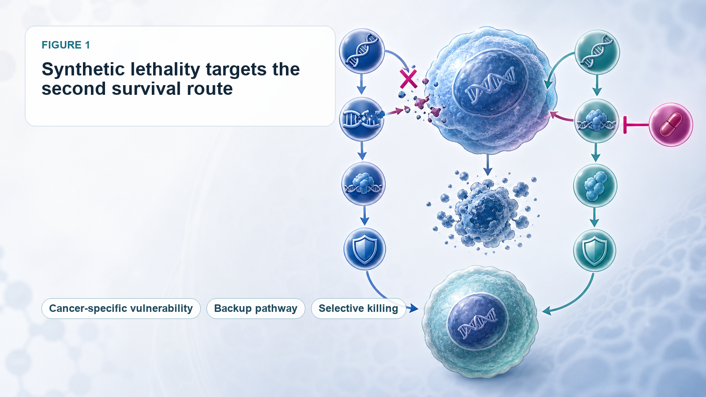
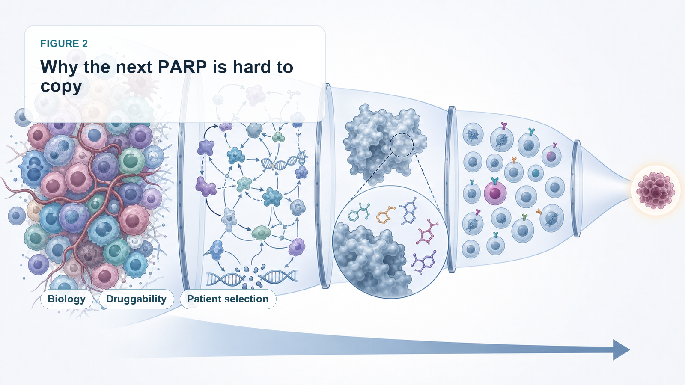
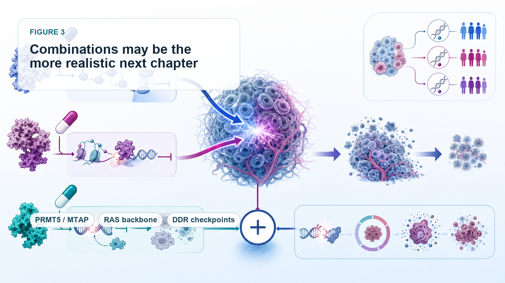
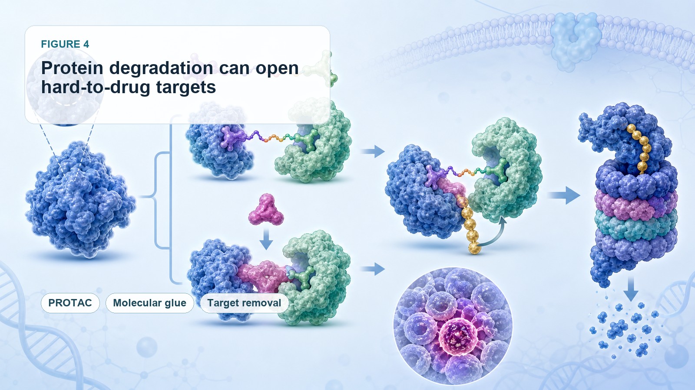

# Synthetic Lethality After PARP: Why the Next Oncology Blockbuster Has Been So Hard to Find

Synthetic lethality was once one of the cleanest and most elegant stories in precision oncology.

In 2005, two landmark papers in *Nature* pushed the BRCA/PARP relationship into the spotlight. In 2014, olaparib, marketed as Lynparza, became the first drug to bring the synthetic lethality concept into clinical practice and commercial success.

PARP inhibitors then expanded across ovarian cancer, breast cancer, prostate cancer, pancreatic cancer, and other tumor types. They became one of the best-known examples of precision medicine. Market research groups estimate that the global PARP inhibitor market could reach roughly USD 8.57 billion in 2026 and USD 15.87 billion by 2033.

That success created a huge expectation across the pharmaceutical industry: if BRCA/PARP could work, why could the industry not find the next PARP?

Over the past two decades, companies and academic groups have searched intensely for new synthetic-lethal pairs. ATR, ATM, CHK1, CHK2, WEE1, DNA-PK, USP1, POLQ, WRN, PRMT5, MAT2A, and many other targets have moved into the spotlight. Clinical-trial activity increased rapidly. Capital and BD, meaning business development and licensing activity, followed. Some reviews have counted more than 1,200 synthetic-lethality-related clinical trials.

But the reality has been cold:

After PARP, the industry still does not have a second fully new synthetic-lethal target that has produced a true blockbuster drug.

The field remains beautiful in theory, but slow in the clinic. The problem is not that synthetic lethality is wrong. The problem is that BRCA/PARP was almost too perfect, and perfect systems are hard to reproduce.

## 01 | Why Synthetic Lethality Is So Attractive: It Targets the Cancer Cell’s Second Survival Route

The basic concept is not difficult to understand.

Imagine a normal cell with two backup survival routes. If one route fails, the cell can still live. But if both routes are cut off at the same time, the cell dies. Cancer cells often already lose one route because of a genetic mutation. If a drug then blocks the compensating route, the cancer cell can be selectively killed. Normal cells suffer less damage because they still retain the first route.

BRCA/PARP is the classic example.

BRCA1 and BRCA2 defects weaken the cancer cell’s ability to repair DNA double-strand breaks. The cancer cell becomes more dependent on PARP-mediated single-strand break repair. When PARP is inhibited, DNA damage accumulates and the cancer cell dies.

The logic is unusually clean:

The genetic defect is clear.

Patient selection is clear.

The target is druggable.

The clinical need is large.

The mechanism can translate into efficacy.

That is why, after PARP succeeded, the whole industry wanted to find another equally elegant combination. Clinical development quickly showed that such perfect combinations are rare.

## 02 | Why PARP Is Hard to Copy: Most Synthetic-Lethal Relationships Are Not That Simple

The first challenge is that a target may not be druggable.

Many synthetic-lethal pairs come from CRISPR screens, genomic analysis, or cellular models. They may look biologically convincing. But when a team tries to turn them into a drug, it may discover that the protein has no good binding pocket, the structure is too complex, homologous proteins are too similar, or the biomarker is not practical enough for clinical selection.

ARID1A loss and the synthetic-lethal relationship with ARID1B or SMARCA2 are examples. The biology is attractive. But creating a safe and selective drug is not easy. SMARCA2 and SMARCA4 are highly similar. If selectivity is not good enough, normal-cell toxicity becomes a serious issue.

The second challenge is that many synthetic-lethal networks are too complex.

A large part of PARP’s success came from the strong dependency created by BRCA deficiency. But ATR, WEE1, CHK1, POLQ, and other DNA-damage-response targets often sit inside more complicated networks.

If ATR is blocked, the cancer cell may activate ATM/CHK2.

If WEE1 is blocked, the cancer cell may compensate through MYT1, PKMYT1, or other cell-cycle routes.

If POLQ is blocked, tumors may escape through other end-joining or repair mechanisms.

In other words, many synthetic-lethal targets look beautiful in cells and animal models. In humans, tumor heterogeneity, compensatory pathways, and resistance evolution can dilute the clinical effect.

This is why several major pharmaceutical partnerships have not progressed smoothly. Roche terminated its global collaboration with Repare Therapeutics on the ATR inhibitor camonsertib, returning rights to Repare. GSK also ended a five-year synthetic-lethality collaboration with IDEAYA in 2025, returning parts of the partnered programs.

These decisions do not mean synthetic lethality has no value. They remind the market that identifying a pair is not enough. The real challenge is turning that pair into a drug that can be approved, reimbursed, and used over time.

## 03 | The First Turning Point: Synthetic Lethality May Be More Valuable as Combination Therapy Than as a Standalone Drug

The industry has slowly moved away from the obsession with finding the next single-agent PARP.

The more practical direction is combination therapy.

One route is combination within DDR, or DNA damage repair: PARP plus ATR, PARP plus WEE1, and WEE1 plus PKMYT1 are all attempts to suppress DNA-damage repair and cell-cycle checkpoints from multiple nodes at once.

At AACR 2026, the Phase I MYTHIC study reported early data for the WEE1 inhibitor zedoresertib combined with the PKMYT1 inhibitor lunresertib. The combination targeted genetically defined populations such as CCNE1 amplification, FBXW7 mutation, or PPP2R1A mutation. In platinum-resistant or refractory ovarian cancer, the combination showed antitumor activity and received FDA Fast Track designation.

Another direction receiving strong market attention is PRMT5/RAS combination therapy.

Tango Therapeutics’ vopimetostat is an MTA-cooperative PRMT5 inhibitor for MTAP-deleted tumors. MTAP loss causes MTA accumulation, making cancer cells more sensitive to PRMT5 inhibition. In June 2026, Tango reported early data for vopimetostat combined with Revolution Medicines’ daraxonrasib in patients with MTAP-deleted, RAS-mutant metastatic pancreatic cancer:

Among 12 evaluable patients, objective response rate reached 92%.

Disease control rate reached 100%.

Six-month progression-free survival reached 90%.

The sample size is small and still needs Phase III validation. But the signal matters.

Synthetic lethality may not need to win as a single-agent therapy. It may become an efficacy amplifier for a strong targeted backbone.

Daraxonrasib suppresses the main RAS signaling axis. Vopimetostat attacks the PRMT5 vulnerability created by MTAP loss. The two are not merely additive. They pressure two tumor dependencies at the same time. That may be the more realistic next chapter for synthetic lethality.

## 04 | The Second Turning Point: PROTAC and Molecular Glue Technologies Are Opening Targets That Were Previously Hard to Drug

Another bottleneck in synthetic lethality is that many targets are not suitable for conventional small-molecule inhibition.

This is where protein degradation matters.

PROTACs, or proteolysis-targeting chimeras, and molecular glues do not simply block protein function. They recruit the cell’s degradation machinery to remove the target protein. This can create new opportunities for targets that lack a good pocket, are difficult to inhibit, or have close homologs that are hard to separate.

SMARCA2 is one example. SMARCA2 and SMARCA4 are highly similar, making conventional inhibitor selectivity difficult. A PROTAC design may allow better discrimination through degradation rather than simple enzymatic inhibition.

Tango is also working with molecular glue approaches. TNG961 is a selective molecular glue degrader targeting HBS1L in FOCAD-deleted tumors. HBS1L is highly homologous to GSPT1, a relationship that is difficult to handle with traditional small molecules. Molecular glues may bring this class of targets back into the druggable universe.

The future of synthetic lethality is therefore not only about finding new pairs. It is also about whether new drug modalities can make previously undruggable pairs clinically usable.

## 05 | The Third Turning Point: Biomarkers Must Become More Precise, or Clinical Benefit Will Be Diluted

PARP’s success depended heavily on relatively clear patient stratification through BRCA and HRD.

Future synthetic-lethality programs will need even more precise patient selection. In PRMT5/MTAP, it may not be enough to say a patient has MTAP loss. Developers may need to understand MTA level, SAM metabolism, RAS mutation background, tumor origin, co-mutations, line of therapy, liver metastasis, and prior treatments.

Likewise, WEE1/PKMYT1 combinations should not be applied broadly to all tumors. They need genetically defined populations such as CCNE1 amplification, FBXW7 mutation, and PPP2R1A mutation where the biology is more likely to translate.

This is one of the most important lessons after two decades:

Synthetic lethality without precise biomarkers can easily become vague targeting.

A beautiful mechanism is not enough. Developers must identify the patients whose tumors are truly dependent on that pathway. Otherwise, efficacy can be diluted in larger populations.

## 06 | How Taiwan Should Look at This Field: The Key Is Not Building the Next PARP, but Diagnostics and Patient Stratification

For Taiwan, synthetic lethality may be most relevant through precision diagnostics and patient stratification.

The first company to watch is Sofiva Genomics, ticker 6615.

Sofiva offers HRD testing to help physicians evaluate whether cancer patients may be suitable for PARP inhibitor therapy. The company states that its HRD test can detect BRCA1/2, multiple HRR genes, and genomic integrity indicators. This directly connects to the core lesson of synthetic lethality: not every patient should receive the drug. The first task is to find the group with true DNA-repair defects.

The second is Genomics, ticker 4160, under the GeneReach / Medigen-related ecosystem.

The company has long worked in NGS and comprehensive genetic testing. Precision medicine needs this infrastructure. If synthetic lethality moves beyond BRCA/PARP toward more complex biomarkers such as MTAP, HRD, CCNE1, FBXW7, PPP2R1A, and SMARCA4, diagnostic companies become more important.

The third is PharmaEngine, ticker 4162.

PharmaEngine’s PEP08 is a PRMT5:MTA inhibitor. It fits directly into one of the hottest global synthetic-lethality routes: MTAP loss, PRMT5, and MTA. MTAP loss causes MTA accumulation and makes cancer cells highly dependent on PRMT5 function. PEP08 uses this tumor-specific vulnerability to selectively inhibit MTAP-deleted cancer cells.

That places PharmaEngine on the same technical axis as Tango, IDEAYA, Gilead, BeiGene, and other global companies working in this area. PharmaEngine has obtained clinical-trial approval in Taiwan and Australia and has initiated a Phase I solid-tumor trial. Among Taiwanese companies, it is one of the closest examples to the next-generation synthetic-lethality theme.

## Conclusion | Synthetic Lethality Has Not Failed. It Is Moving From Single-Agent Myth to Precision Combinations

The biggest misunderstanding after twenty years of synthetic lethality is the assumption that every new target can copy PARP.

BRCA/PARP was a rare perfect combination:

The mechanism was clear.

Patient stratification was clear.

The target was druggable.

The clinical need was large.

Efficacy translated into commercial success.

The fact that the next PARP has not arrived does not mean synthetic lethality has no future. It means the path is more difficult than the early story suggested.

The next breakthrough may not be a single drug sweeping across multiple tumor types like PARP. It may be a set of narrower, more precise, biomarker-dependent treatment strategies:

PRMT5 plus RAS.

WEE1 plus PKMYT1.

PARP plus ATR or immunotherapy.

PROTACs and molecular glues opening previously hard-to-drug targets.

NGS and HRD testing identifying the patients who are most likely to benefit.

The value of synthetic lethality is not in copying PARP. It is in exploiting the cancer cell’s own vulnerabilities with greater precision.

The road has been slow, but it is not over. The next chapter may be starting through combinations, protein degradation, and better biomarkers.

## References

[0] Company websites and public disclosures.

[1] Coherent Market Insights PARP inhibitor market data.

[2] OncoDaily review on synthetic lethality in oncology.

[3] Repare Therapeutics public disclosure on camonsertib rights.

[4] Fierce Biotech report on GSK and IDEAYA.

[5] Debiopharm disclosure on lunresertib and zedoresertib.

---

This article is for industry research and educational purposes only. It does not constitute investment, medical, fundraising, or stock-specific advice.
