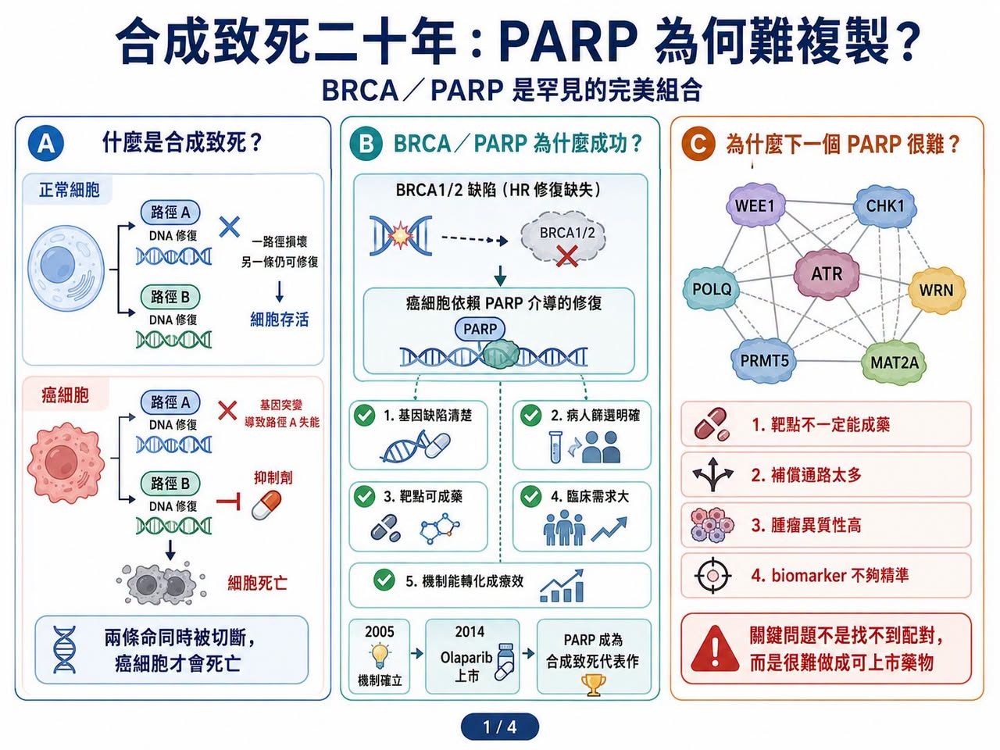
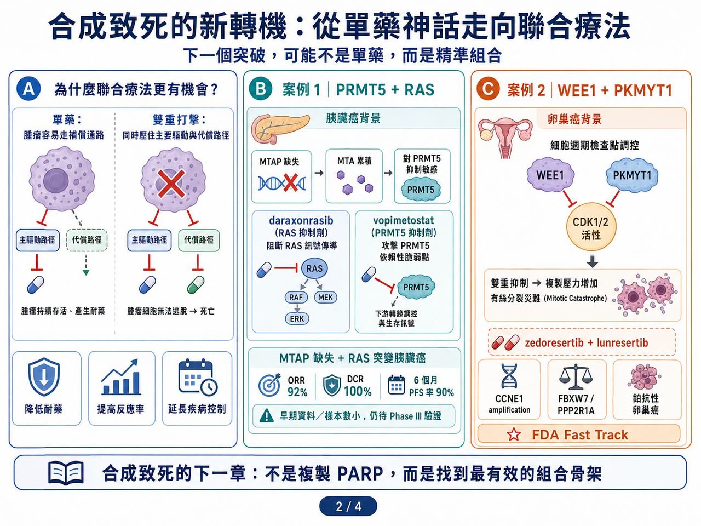
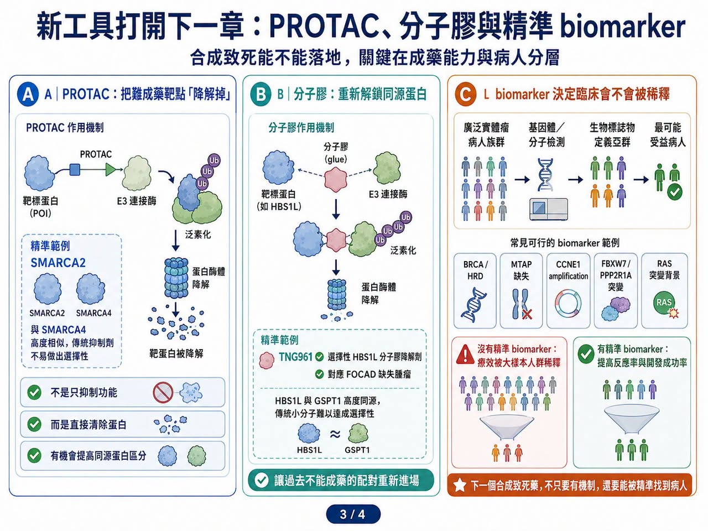
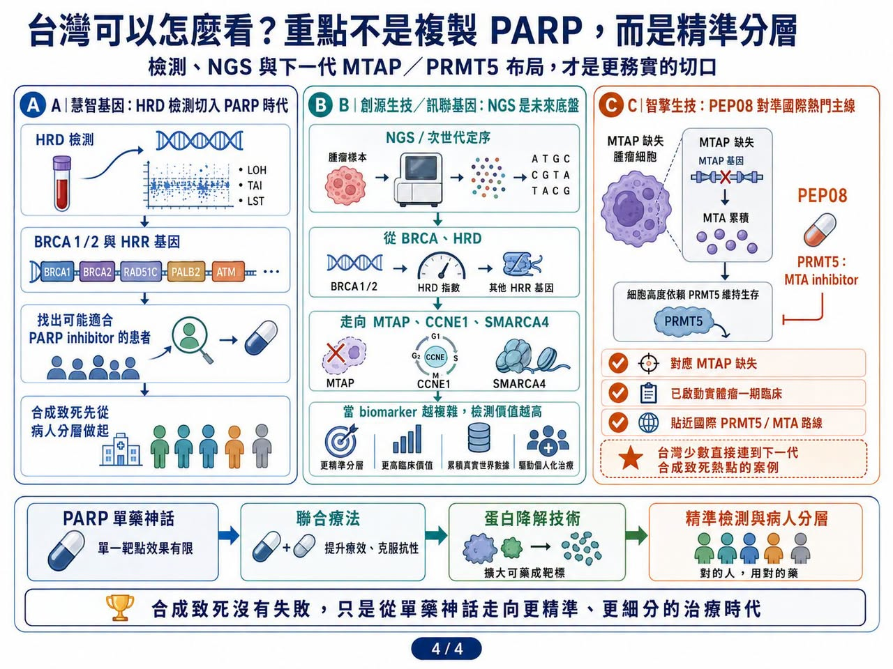

# 合成致死二十年：為什麼 PARP 之後，下一個神藥遲遲沒有出現？

合成致死，曾經是精準腫瘤治療裡最漂亮的故事之一。

2005 年，《Nature》兩篇經典研究把 BRCA／PARP 這組關係推上舞台。

2014 年，olaparib（Lynparza，奧拉帕利）獲准上市，成為第一個真正把合成致死機制推進臨床、並做成商業成功的藥物。

此後，PARP 抑制劑陸續拓展到卵巢癌、乳癌、攝護腺癌與胰臟癌等癌種，成為精準醫療的重要代表。市場研究機構估計，全球 PARP inhibitor，也就是 PARP 抑制劑市場，2026 年規模約 85.7 億美元，2033 年可達 158.7 億美元。

這個故事太成功，也讓全球藥廠產生一個巨大期待：既然 BRCA／PARP 可以，為什麼不能再找到下一個 PARP？

於是，過去二十年，產業開始瘋狂尋找新的合成致死配對。ATR、ATM、CHK1、CHK2、WEE1、DNA-PK、USP1、POLQ、WRN、PRMT5、MAT2A，一個又一個靶點被推到台前。臨床試驗數量快速增加，資本與 BD，也就是商務開發與授權交易，也跟著湧入。有研究整理指出，合成致死相關臨床試驗已超過 1200 項。

但現實很冷：

PARP 之後，還沒有第二個全新合成致死靶點真正跑出上市重磅藥。

這條賽道理論上很美，臨床上卻走得很慢。問題不在於合成致死錯了，而是 BRCA／PARP 的成功太完美，完美到很難複製。

## 01｜合成致死為什麼迷人？因為它只打癌細胞的「第二條命」

合成致死的概念其實不難理解。

假設一個正常細胞有兩條維持生命的備用路徑，壞掉一條還能活；但如果兩條同時被切斷，細胞就會死亡。癌細胞常常因為基因突變，已經先失去其中一條路徑。這時候，只要用藥物打掉另一條補償路徑，就能選擇性殺死癌細胞。而正常細胞因為還保有第一條路徑，受到的傷害較小。

BRCA／PARP 就是最經典例子。

BRCA1／BRCA2 缺陷讓癌細胞無法好好修復 DNA 雙股斷裂，只能更依賴 PARP 介導的單股斷裂修復。當 PARP 被抑制，DNA 損傷不斷累積，癌細胞就走向死亡。這個邏輯非常乾淨：

基因缺陷清楚。

病人篩選明確。

靶點可以成藥。

臨床需求巨大。

機制能轉化成療效。

也正因如此，PARP 成功後，整個產業都希望找到下一個同樣漂亮的組合。可是，臨床開發很快證明，這種完美組合非常罕見。

## 02｜為什麼 PARP 難複製？因為多數合成致死關係沒有那麼單純

合成致死第一個難點，是靶點不一定能成藥。

很多合成致死配對來自 CRISPR 篩選、基因體分析或細胞模型，看起來生物學上成立。但真正要做成藥時，才發現蛋白沒有好口袋、結構太複雜、同源蛋白太像，或缺乏可用 biomarker，也就是生物標記。例如 ARID1A 缺失與 ARID1B、SMARCA2 的合成致死關係，在基礎研究中很吸引人。但要做出安全、選擇性足夠好的藥並不容易。SMARCA2 和 SMARCA4 高度相似，若選擇性不足，正常細胞毒性就會成為問題。

第二個難點，是很多合成致死網路太複雜。

PARP 的成功，很大一部分來自 BRCA 缺陷讓癌細胞形成強依賴。但 ATR、WEE1、CHK1、POLQ 這些 DNA 損傷修復靶點，往往嵌在更複雜的網路裡。

你打 ATR，癌細胞可能啟動 ATM／CHK2。

你打 WEE1，癌細胞可能改走 MYT1、PKMYT1 或其他細胞週期補償。

你打 POLQ，腫瘤也可能透過其他末端接合或修復機制逃脫。

也就是說，很多合成致死靶點在細胞和動物模型中看起來漂亮，但進入人體後，癌細胞的異質性、補償通路與耐藥演化會把療效稀釋。這也是為什麼許多大藥廠合作案最後沒有順利推進。Roche 曾終止與 Repare Therapeutics 關於 ATR inhibitor camonsertib，也就是 ATR 抑制劑 camonsertib 的全球合作，讓該資產權利回到 Repare 手中。GSK 也在 2025 年終止與 IDEAYA 長達五年的合成致死合作，退回部分專案。

這些不是說合成致死沒有價值，而是提醒市場：

合成致死不是找到配對就成功。

真正難的是把配對做成可上市、可給付、可長期使用的藥。

## 03｜第一個轉機：合成致死不一定要做成單藥，聯合療法可能更有價值

產業現在已經慢慢放下「尋找下一個 PARP 單藥」的執念。

更務實的方向，是聯合療法。

例如 DDR，也就是 DNA 損傷修復路徑內的聯合：PARP 加 ATR、PARP 加 WEE1、WEE1 加 PKMYT1，都是試圖從多個節點同時壓住 DNA 損傷修復與細胞週期檢查點。

2026 年 AACR，也就是美國癌症研究協會年會上，WEE1 inhibitor zedoresertib，也就是 WEE1 抑制劑 zedoresertib，聯合 PKMYT1 inhibitor lunresertib，也就是 PKMYT1 抑制劑 lunresertib 的 Phase I MYTHIC 研究公布早期資料。這組合針對 CCNE1 amplification，也就是 CCNE1 基因擴增、FBXW7 或 PPP2R1A 突變等基因定義族群，在鉑抗性或難治性卵巢癌中觀察到抗腫瘤活性，也獲 FDA Fast Track designation，也就是快速通道資格。

另一個更受市場關注的方向，是 PRMT5／RAS 聯合。

Tango Therapeutics 的 vopimetostat 是 MTA-cooperative PRMT5 inhibitor，也就是 MTA 協同型 PRMT5 抑制劑，用於 MTAP 缺失腫瘤。MTAP 缺失會造成 MTA 累積，讓癌細胞對 PRMT5 抑制更敏感。2026 年 6 月，Tango 公布 vopimetostat 聯合 Revolution Medicines 的 daraxonrasib，用於 MTAP 缺失、RAS 突變轉移性胰臟癌患者的早期資料：

12 名可評估患者中，客觀緩解率達 92%。

疾病控制率達 100%。

6 個月無惡化存活率達 90%。

這組資料樣本很小，仍需 Phase III 驗證，但它帶來一個重要訊號：

合成致死也許不一定要靠單藥取勝，而是可以成為強效標靶藥的「增效搭檔」。

Daraxonrasib 壓住 RAS 主幹訊號，vopimetostat 攻擊 MTAP 缺失後的 PRMT5 脆弱點。

兩者不是單純疊加，而是從兩條腫瘤依賴路徑同時下手。這種思路，可能才是合成致死下一階段真正的突破口。

## 04｜第二個轉機：PROTAC 與分子膠，開始解鎖過去不能成藥的靶點

合成致死另一個卡點，是許多靶點本身不適合傳統小分子抑制。

這時候，蛋白降解技術就變得重要。

PROTAC，也就是蛋白降解靶向嵌合體，和 molecular glue，也就是分子膠，不是單純阻斷蛋白功能，而是讓目標蛋白被細胞內的降解系統清除。這讓很多過去沒有好口袋、難以抑制、同源蛋白難分的靶點，開始有新的開發可能。

SMARCA2 是例子之一。SMARCA2 與 SMARCA4 高度相似，傳統抑制劑很難做到足夠選擇性。

若用 PROTAC 設計，則有機會透過蛋白降解而非單純酶活抑制，實現更好的同源蛋白區分。Tango 也在做分子膠。其 TNG961 是針對 HBS1L 的選擇性分子膠降解劑，用於 FOCAD 缺失腫瘤。HBS1L 與 GSPT1 高度同源，傳統小分子難以精準處理，但分子膠有機會讓這類靶點重新進入成藥範圍。這代表合成致死的未來，不一定只在「找新配對」。還在於能不能用新藥物形式，讓過去無法開發的配對真正落地。

## 05｜第三個轉機：biomarker 必須更精準，否則臨床會被稀釋
PARP 成功，很大一部分來自 BRCA／HRD 這種相對清楚的患者分層。

未來合成致死若要成功，病人篩選會更重要。以 PRMT5／MTAP 為例，不能只說患者有 MTAP 缺失，還要看 MTA 水準、SAM 代謝狀態、RAS 突變背景、腫瘤來源、共突變、治療線別、肝轉移與既往療法。同樣，WEE1／PKMYT1 組合也不能泛用於所有腫瘤，而是要找 CCNE1 amplification、FBXW7、PPP2R1A 等更可能受益的基因定義人群。

這也是合成致死二十年後最重要的教訓：

沒有精準 biomarker 的合成致死，很容易變成模糊靶向。

只靠漂亮機制不夠，必須找到真正依賴這條路徑的患者，否則療效會在大樣本人群中被稀釋。

## 06｜台灣可以怎麼看？重點不是做下一個 PARP，而是檢測與精準分層
合成致死這個題目，很適合從精準檢測與病人分層角度切入。

第一個可以看的是慧智基因（6615）。

慧智推出 HRD 檢測，訴求是協助醫師評估癌症患者是否適合接受 PARP 抑制劑治療。

其官網也指出，HRD 檢測可偵測 BRCA1／2 及多個 HRR 基因與基因組完整性指標，用於找出可能適用 PARP inhibitor，也就是 PARP 抑制劑的患者。

這正好對應合成致死最關鍵的一件事：不是每個患者都適合用藥，必須先找到真正有 DNA 修復缺陷的族群。

第二個是創源生技（4160）／訊聯基因體系。

創源長期布局 NGS，也就是次世代定序，與全基因檢測服務。精準醫療落地需要這類基因檢測能力。當未來合成致死從 BRCA／PARP 走向 MTAP、HRD、CCNE1、FBXW7、PPP2R1A、SMARCA4 等更複雜 biomarker，檢測公司的角色會越來越重要。

第三個是智擎生技（4162）

智擎的 PEP08 是一款 PRMT5:MTA inhibitor，對應的正是目前國際合成致死賽道最熱門的 MTAP 缺失／PRMT5／MTA 路線。MTAP 缺失會造成 MTA 累積，使癌細胞對 PRMT5 功能產生高度依賴；PEP08 則利用這個腫瘤特異性弱點，選擇性抑制 MTAP 缺失癌細胞。這和 Tango、IDEAYA、Gilead、BeiGene 等國際藥廠布局的方向，是同一條技術主線。智擎目前已取得台灣與澳洲臨床試驗許可，並已啟動實體瘤一期臨床，算是台灣公司中最貼近下一代合成致死國際熱點的案例。

## 結語｜合成致死沒有失敗，只是從單藥神話走向精準組合
合成致死二十年，最大的誤會是以為每個新靶點都能複製 PARP。

事實證明，BRCA／PARP 是罕見的完美組合：

機制清楚。

患者分層明確。

靶點可成藥。

臨床需求大。

療效能轉化成商業成功。

下一個 PARP 遲遲沒有出現，不代表合成致死沒有未來。它只是告訴我們，這條路不會那麼簡單。未來的突破，可能不會是一個像 PARP 一樣橫掃多癌種的單藥神話，而是一批更細分、更精準、更依賴 biomarker 的治療方案：

PRMT5 搭 RAS。

WEE1 搭 PKMYT1。

PARP 搭 ATR 或免疫療法。

PROTAC 與分子膠打開難成藥靶點。

NGS 與 HRD 檢測找出真正受益患者。

合成致死的價值，不在於複製 PARP，而在於讓癌症治療更精準地抓住腫瘤細胞自己的弱點。

這條路走得慢，但還沒有走到盡頭。真正的下一章，可能正在聯合療法與蛋白降解技術裡重新開始。

參考資料：

[0]: 各公司官網＆公開資料

[1]: https://www.coherentmarketinsights.com/

[2]: https://oncodaily.com/

[3]: https://ir.reparerx.com/

[4]: https://www.fiercebiotech.com/

[5]: https://www.debiopharm.com/

---

本文僅供產業研究與知識分享，不構成投資、醫療、募資或個股建議。
